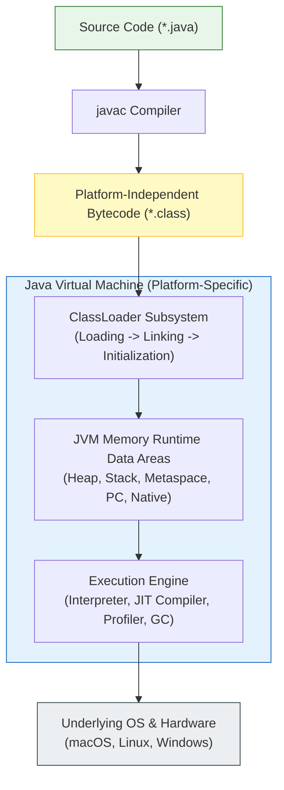
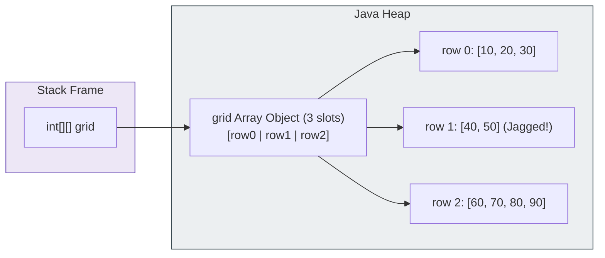
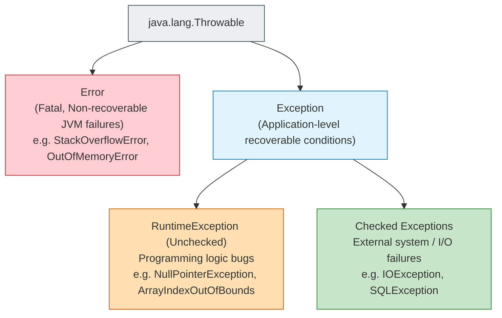

# ☕ Java Master Notes & In-Depth Architectural Guide

> **The Definitive, Intensive Reference for Core & Advanced Java.**  
> An end-to-end compendium spanning JVM internals, memory topography, language mechanics, data structures, concurrency, and real-world diagnostic patterns.

> ⚡ **Quick Access**: [🏠 Course Master Readme](Readme.Md) &nbsp;|&nbsp; [📂 Source Directory](src/README.md) &nbsp;|&nbsp; [🧶 Module 12: Strings](src/intermediate/strings/README.md)

---

## 📑 Master Table of Contents
1. [JVM Architecture & Execution Engine Internals](#1-jvm-architecture--execution-engine-internals)
2. [Memory Topography: Stack, Heap, Metaspace & PC Registers](#2-memory-topography-stack-heap-metaspace--pc-registers)
3. [Data Types, Variables & Automatic Type Promotion](#3-data-types-variables--automatic-type-promotion)
4. [Operators, Evaluation Semantics & Short-Circuiting](#4-operators-evaluation-semantics--short-circuiting)
5. [Terminal I/O & The Scanner Buffer Gotcha](#5-terminal-io--the-scanner-buffer-gotcha)
6. [Control Flow: Conditionals, Modern Switch & Looping Guarantees](#6-control-flow-conditionals-modern-switch--looping-guarantees)
7. [Arrays: Contiguous Heap Allocation & Dimensionality](#7-arrays-contiguous-heap-allocation--dimensionality)
8. [Methods, Stack Frames & Pass-by-Value Mechanics](#8-methods-stack-frames--pass-by-value-mechanics)
9. [Text Processing: Strings, Immutability & Buffer Engines](#9-text-processing-strings-immutability--buffer-engines)
10. [Object-Oriented Programming (OOP) Kickstart & Object Lifecycle](#10-object-oriented-programming-oop-kickstart--object-lifecycle)
11. [The Four Pillars of OOP (Deep Architectural Breakdown)](#11-the-four-pillars-of-oop-deep-architectural-breakdown)
12. [Exception Handling: Throwable Hierarchy & Robust System Design](#12-exception-handling-throwable-hierarchy--robust-system-design)
13. [Java Collections Framework (JCF) & Internal Algorithms](#13-java-collections-framework-jcf--internal-algorithms)
14. [Generics, Wildcards & Type Erasure](#14-generics-wildcards--type-erasure)
15. [Multithreading, Memory Visibility & Concurrency Mechanics](#15-multithreading-memory-visibility--concurrency-mechanics)
16. [Master Java Error, Exception & Bug Diagnostic Catalog](#16-master-java-error-exception--bug-diagnostic-catalog)
17. [Universal Production Engineering Best Practices](#17-universal-production-engineering-best-practices)

---

## 1. JVM Architecture & Execution Engine Internals

### What Is It?
Java achieves its core promise — **"Write Once, Run Anywhere" (WORA)** — through an abstraction layer called the **Java Virtual Machine (JVM)**. Developers write human-readable source code (`.java`), which the Java Compiler (`javac`) compiles into platform-independent intermediate bytecodes (`.class`). The JVM then executes these bytecodes natively on the target operating system.



### The Three Core JVM Subsystems:

#### 1. ClassLoader Subsystem
Responsible for locating, loading, verifying, and initializing `.class` binary files into memory:
- **Loading**: Done through hierarchical classloaders:
  1. *Bootstrap ClassLoader*: Loads core Java packages (`java.lang.*`, `java.util.*` from `java.base` module).
  2. *Platform / Extension ClassLoader*: Loads platform-specific extensions.
  3. *Application / System ClassLoader*: Loads classes found on the application classpath (`-cp`).
- **Linking**:
  1. *Verification*: Scrutinizes bytecode format, operand stack overflow risks, and type safety constraints.
  2. *Preparation*: Allocates memory for static fields and initializes them to their type-default values (`0`, `null`, `false`).
  3. *Resolution*: Replaces symbolic references in the constant pool with direct memory pointers.
- **Initialization**: Executes static initializers (`static { ... }`) and assigns explicit values to static variables.

#### 2. Execution Engine
Executes instructions loaded into memory:
- **Interpreter**: Reads bytecodes line-by-line and executes them immediately. Fast startup, but slower loop throughput.
- **JIT (Just-In-Time) Compiler**: Identifies "hot spots" (methods or loops executed thousands of times). Compiles these hot spots directly into machine code for near-native execution speed.
  - *C1 Client Compiler*: Fast compilation with simple optimizations.
  - *C2 Server Compiler*: Aggressive optimizations (loop unrolling, method inlining, escape analysis, lock elision).
- **Garbage Collector (GC)**: Automatically reclaims heap memory occupied by unreachable objects (e.g., G1GC, ZGC).

### Common Errors:
- `ClassNotFoundException`: Thrown when an application attempts to load a class at runtime via reflection (`Class.forName()`) but no `.class` file exists on the classpath.
- `NoClassDefFoundError`: Thrown when a class was present during compilation, but missing during runtime execution.
- `UnsupportedClassVersionError`: Occurs when trying to run bytecode compiled by a newer JDK version on an older JRE (e.g., running Java 21 bytecode on Java 17).

---

## 2. Memory Topography: Stack, Heap, Metaspace & PC Registers

Every running Java application organizes its memory into distinct logical segments:

| Memory Area | Allocation Scope | Thread Lifetime | What Lives Here | Key OutOfMemory Risk |
| :--- | :--- | :--- | :--- | :--- |
| **Stack Memory** | Per-thread | Created on thread start, destroyed on exit | Local primitive variables, object reference pointers, method call frames | `StackOverflowError` |
| **Java Heap** | Global (shared across all threads) | Entire JVM runtime life | All instantiated objects (`new`), arrays, instance fields, String Constant Pool | `OutOfMemoryError: Java heap space` |
| **Metaspace** (Native Memory) | Global (shared) | Entire JVM runtime life | Class metadata, method bytecodes, runtime constant pool | `OutOfMemoryError: Metaspace` |
| **PC Registers** | Per-thread | Created on thread start, destroyed on exit | Address of the current bytecode instruction being executed | None |
| **Native Method Stack** | Per-thread | Created on thread start | C/C++ native method execution frames (JNI) | `StackOverflowError` |

### Stack Frame Anatomy
When a method `foo()` is invoked:
1. A new **Stack Frame** is pushed onto the thread's stack.
2. The frame contains:
   - **Local Variable Array (LVA)**: Holds parameters and local variables.
   - **Operand Stack**: Workspace for performing calculations (e.g., pushing `10` and `20`, executing `iadd`, popping `30`).
   - **Frame Data**: Return address and exception table references.
3. When `foo()` finishes, its entire frame is popped instantly with zero garbage collection overhead.

---

## 3. Data Types, Variables & Automatic Type Promotion

Java is a **statically-typed, strongly-typed** language: every variable must be declared with a specific data type before compilation.

### The 8 Primitive Data Types

| Primitive Type | Size | Default Value | Min Value | Max Value | Typical Use Case |
| :---: | :---: | :---: | :---: | :---: | :--- |
| `byte` | 8 bits (1 byte) | `0` | $-128$ | $127$ | Raw binary streams, network protocols, image pixel bytes |
| `short` | 16 bits (2 bytes) | `0` | $-32,768$ | $32,767$ | Memory-constrained numerical tables |
| `int` | 32 bits (4 bytes) | `0` | $-2^{31}$ | $2^{31}-1$ ($\approx 2.14 \times 10^9$) | Standard counters, array indices, integer math |
| `long` | 64 bits (8 bytes) | `0L` | $-2^{63}$ | $2^{63}-1$ | Unix timestamps (epoch ms), database primary keys, big counters |
| `float` | 32 bits (4 bytes) | `0.0f` | $\approx 1.4 \times 10^{-45}$ | $\approx 3.4 \times 10^{38}$ | 3D graphics coordinates, gaming physics (single precision) |
| `double` | 64 bits (8 bytes) | `0.0d` | $\approx 4.9 \times 10^{-324}$ | $\approx 1.8 \times 10^{308}$ | Mathematical science, financial math (standard floating-point) |
| `char` | 16 bits (2 bytes) | `'\u0000'` | `0` | $65,535$ | Single Unicode character (`'A'`, `'9'`, `'$'`) |
| `boolean`| JVM dependent | `false` | `false` | `true` | Conditional flags, loop switches |

> [!CAUTION]
> **Floating-Point Precision Gotcha**:
> Never use `float` or `double` for currency or exact financial balances! Because IEEE-754 numbers use binary fractions, $0.1 + 0.2 = 0.30000000000000004$. Always use `java.math.BigDecimal` for monetary math.

### Type Conversion Rules:
1. **Widening (Automatic / Implicit)**: Safe, zero data loss. Occurs automatically when converting a smaller type to a larger type:
   $$\text{byte} \rightarrow \text{short} \rightarrow \text{int} \rightarrow \text{long} \rightarrow \text{float} \rightarrow \text{double}$$
2. **Narrowing (Explicit Cast Required)**: Unsafe, potential truncation or sign-flip:
   ```java
   int bigVal = 130;
   byte smallVal = (byte) bigVal; // Overflows! Result is -126 due to two's complement wrap-around
   ```
3. **Binary Numeric Promotion**: Whenever arithmetic occurs on types smaller than `int` (`byte`, `short`, `char`), Java automatically promotes both operands to `int` before calculating:
   ```java
   byte b1 = 10;
   byte b2 = 20;
   byte b3 = (byte) (b1 + b2); // b1 + b2 produces an int; requires explicit cast!
   ```

---

## 4. Operators, Evaluation Semantics & Short-Circuiting

### Operator Precedence Hierarchy (Highest to Lowest):
1. **Postfix**: `expr++`, `expr--`
2. **Unary**: `++expr`, `--expr`, `+`, `-`, `!`, `~`, `(type)`
3. **Multiplicative**: `*`, `/`, `%`
4. **Additive**: `+`, `-`
5. **Shift**: `<<`, `>>`, `>>>` (unsigned right shift)
6. **Relational**: `<`, `>`, `<=`, `>=`, `instanceof`
7. **Equality**: `==`, `!=`
8. **Bitwise AND**: `&`
9. **Bitwise XOR**: `^`
10. **Bitwise OR**: `|`
11. **Logical AND**: `&&` (Short-circuiting)
12. **Logical OR**: `||` (Short-circuiting)
13. **Ternary**: `? :`
14. **Assignment**: `=`, `+=`, `-=`, `*=`, `/=`, `%=`, etc.

### Short-Circuit Evaluation (`&&` and `||`)
- `&&` evaluates the right operand **only if** the left operand is `true`.
- `||` evaluates the right operand **only if** the left operand is `false`.

```java
// Prevents NullPointerException!
if (user != null && user.isActive()) {
    // user.isActive() is NEVER invoked if user is null!
}
```
If you used the bitwise operator `&` instead (`if (user != null & user.isActive())`), Java would eagerly evaluate both sides, immediately throwing a `NullPointerException`!

---

## 5. Terminal I/O & The Scanner Buffer Gotcha

When reading console input using `java.util.Scanner`, input is stored in an internal buffer:

```java
Scanner scanner = new Scanner(System.in);
System.out.print("Enter age: ");
int age = scanner.nextInt();

System.out.print("Enter full name: ");
String name = scanner.nextLine(); // 💥 SKIPPED! Reads empty string!
```

### Why Does This Happen?
1. The user types `25` followed by the **Enter** key (`\n`).
2. `scanner.nextInt()` extracts the integer `25`, but leaves the trailing newline character `\n` sitting in the input buffer.
3. When `scanner.nextLine()` is called immediately after, it encounters that remaining `\n` and assumes the line is complete, returning an empty string `""` without waiting for user input!

### The Production Fix:
Always clear the buffer with an extra `scanner.nextLine()` or parse exclusively with `Integer.parseInt(scanner.nextLine())`:
```java
int age = scanner.nextInt();
scanner.nextLine(); // Consumes the leftover newline!
String name = scanner.nextLine(); // Now correctly waits for user input
```

---

## 6. Control Flow: Conditionals, Modern Switch & Looping Guarantees

### Modern Switch Expressions (Java 14+)
Traditional switch statements suffered from dangerous accidental fall-through bugs caused by missing `break` statements. Modern Java introduced **Switch Expressions**:

```java
// Modern arrow syntax with return value (no break needed!)
String status = switch (day) {
    case MONDAY, TUESDAY, WEDNESDAY, THURSDAY, FRIDAY -> "Weekday";
    case SATURDAY, SUNDAY -> "Weekend";
    default -> {
        System.out.println("Validating unknown input...");
        yield "Unknown"; // 'yield' returns a value from multi-line blocks
    }
};
```

### Comparison of Looping Guarantees

| Loop Construct | Minimum Execution Count | Evaluation Point | Best Used When |
| :--- | :---: | :--- | :--- |
| `for (init; cond; step)` | **0** | Pre-tested (before each iteration) | Number of iterations is known in advance (traversing arrays, counting) |
| `while (cond)` | **0** | Pre-tested (before each iteration) | Iteration depends on an external condition (reading streams, waiting for flags) |
| `do { ... } while (cond);`| **1** | Post-tested (after each iteration) | Body must execute at least once (menu displays, input validation prompts) |
| `for (Type val : collection)` | **0** | Pre-tested | Read-only sequential traversal of arrays and `Iterable` collections |

---

## 7. Arrays: Contiguous Heap Allocation & Dimensionality

An **array** is a fixed-size, indexed container stored in contiguous heap memory holding elements of a uniform type.

### Memory Representation


### Jagged Arrays in Java
Unlike C/C++ where multi-dimensional arrays are single contiguous matrices, multi-dimensional arrays in Java are **arrays of array references**. This allows rows to have completely different column lengths (**Jagged Arrays**):
```java
int[][] jagged = new int[3][];
jagged[0] = new int[2]; // Row 0 has 2 columns
jagged[1] = new int[5]; // Row 1 has 5 columns
jagged[2] = new int[3]; // Row 2 has 3 columns
```

---

## 8. Methods, Stack Frames & Pass-by-Value Mechanics

### Is Java "Pass-by-Reference" or "Pass-by-Value"?
> [!IMPORTANT]
> **Java is STRICTLY 100% Pass-by-Value at all times.**

- For **primitives**, a copy of the primitive binary value is passed. Changes made inside the method do not affect the caller.
- For **objects**, a copy of the **reference pointer (memory address)** is passed by value.
  - You can mutate the fields of the object through that copied address (`user.setName("New")`).
  - But reassigning the parameter variable itself (`user = new User()`) does NOT alter the caller's reference!

```java
public static void reassign(Dog d) {
    d = new Dog("Fido"); // Only changes local copied address!
}

Dog myDog = new Dog("Rex");
reassign(myDog);
System.out.println(myDog.getName()); // Still "Rex"!
```

---

## 9. Text Processing: Strings, Immutability & Buffer Engines

*(For exhaustive architectural notes, see [JAVA_STRINGS_DEEP_DIVE_NOTES.md](JAVA_STRINGS_DEEP_DIVE_NOTES.md))*

### Core Rules at a Glance:
1. **`String`**: Immutable character sequence. Stored and cached in the **String Constant Pool (SCP)**. Safe for multithreading, map keys, and security tokens.
2. **`StringBuilder`**: Mutable, non-synchronized buffer. The fastest choice for local text assembly, loops, and SQL query creation.
3. **`StringBuffer`**: Mutable, thread-safe buffer with synchronized methods. Used when multiple concurrent threads write to a shared buffer.

```java
// Equality Check:
str1 == str2      // ❌ Compares memory addresses (false for different heap objects)
str1.equals(str2) // ✅ Compares actual text characters
```

---

## 10. Object-Oriented Programming (OOP) Kickstart & Object Lifecycle

A **Class** is a blueprint defining properties (state) and behaviors. An **Object** is an active instance of a class occupying heap memory.

### Variable Classification:
1. **Local Variables**: Declared inside a method or block. Stored on the Stack. No default values (must be explicitly initialized before reading).
2. **Instance Variables**: Declared inside a class but outside methods. Stored on the Heap inside the object. Automatically initialized to default values (`0`, `null`, `false`).
3. **Static (Class) Variables**: Declared with `static`. Stored in Metaspace/Heap associated with the Class object. Shared across all instances.

### Constructor Mechanics
- Constructors initialize newly instantiated objects.
- If no constructor is written, the compiler provides a default no-argument constructor.
- **Constructor Chaining**:
  - `this(...)`: Calls another constructor in the **same class** (must be the first line!).
  - `super(...)`: Calls a constructor in the **parent class** (must be the first line!).

---

## 11. The Four Pillars of OOP (Deep Architectural Breakdown)

```
+-----------------------------------------------------------------------------------------+
|                                  THE 4 PILLARS OF OOP                                   |
|                                                                                         |
|  +--------------------+  +--------------------+  +--------------------+  +------------+ |
|  |   Encapsulation    |  |    Inheritance     |  |    Polymorphism    |  | Abstraction| |
|  |                    |  |                    |  |                    |  |            | |
|  | * Data Hiding      |  | * Code Reuse       |  | * Overloading      |  | * Abstract | |
|  | * private fields   |  | * extends / super  |  | * Dynamic Dispatch |  |   Classes  | |
|  | * Validated setters|  | * IS-A Relationship|  | * @Override        |  | * Interface| |
|  +--------------------+  +--------------------+  +--------------------+  +------------+ |
+-----------------------------------------------------------------------------------------+
```

### 1. Encapsulation (Data Hiding & Protection)
Binds data together with methods that manipulate it, keeping fields private:
```java
public class BankAccount {
    private double balance; // Hidden from outside world

    public void deposit(double amount) {
        if (amount > 0) { // Controlled validation
            this.balance += amount;
        }
    }
}
```

### 2. Inheritance (Hierarchical Code Reuse)
Allows a child class to inherit fields and methods from a parent class via `extends`.
- Java supports **Single Inheritance of Classes** (a class can have only one direct superclass) to prevent the "Diamond Problem" of multiple inheritance ambiguity.

### 3. Polymorphism ("Many Forms")
- **Compile-Time (Static) Polymorphism**: **Method Overloading**. Multiple methods with the same name but different parameter count, types, or order.
- **Runtime (Dynamic) Polymorphism**: **Method Overriding**. A subclass provides a specific implementation of a method defined in its superclass. Resolved at runtime using the **Virtual Method Table (`vtable`)**:
```java
Animal a = new Dog(); // Upcasting
a.makeSound(); // JVM invokes Dog's overridden makeSound() at runtime!
```

### 4. Abstraction (Hiding Implementation Complexity)
Exposes essential features while hiding internal operational complexity.
- **Abstract Class**: Partial blueprint. Can contain concrete methods, abstract methods, instance fields, and constructors.
- **Interface**: Pure contract. A class can implement multiple interfaces (`implements A, B, C`). In modern Java (Java 8+), interfaces can also contain:
  - `default` methods (backward-compatible concrete methods).
  - `static` utility methods.
  - `private` helper methods (Java 9+).

---

## 12. Exception Handling: Throwable Hierarchy & Robust System Design



### Checked vs. Unchecked Exceptions:
1. **Checked Exceptions**: Subclasses of `Exception` (excluding `RuntimeException`). The compiler **forces** you to handle them using `try-catch` or declare them using `throws`. They represent external failures outside the code's control (missing file, dropped database socket).
2. **Unchecked Exceptions (`RuntimeException`)**: Represent programmer logic bugs (passing null, invalid array index, dividing by zero). The compiler does not enforce `try-catch`.

### Try-With-Resources (Automatic Resource Cleanup)
Any class implementing `java.lang.AutoCloseable` can be declared in a `try-with-resources` statement. The JVM guarantees `.close()` will be called even if an exception occurs:
```java
try (BufferedReader br = new BufferedReader(new FileReader("data.txt"))) {
    return br.readLine();
} // br is automatically closed here! No finally block needed!
```

---

## 13. Java Collections Framework (JCF) & Internal Algorithms

The JCF provides ready-to-use, high-performance data structures:

```
                          Iterable
                             |
                         Collection
           +-----------------+-----------------+
           |                 |                 |
         List               Set              Queue / Deque
       (Ordered,        (Unique only,         (FIFO / LIFO)
      duplicates ok)     no duplicates)            |
           |                 |               ArrayDeque,
     ArrayList,          HashSet,            LinkedList,
     LinkedList        LinkedHashSet,        PriorityQueue
                          TreeSet
```
*(Note: `Map` is not a subtype of `Collection`, but forms an integral pillar of the JCF).*

### Data Structure Comparison Matrix:

| Class | Underlying Structure | Access Speed | Insert / Delete Speed | Preserves Order? | Allows Duplicates? |
| :--- | :--- | :---: | :---: | :---: | :---: |
| **`ArrayList`** | Resizable dynamic array | $O(1)$ random access | $O(N)$ (shifts elements) | ✅ Yes (Insertion) | ✅ Yes |
| **`LinkedList`** | Doubly-linked list nodes | $O(N)$ sequential | $O(1)$ if pointer known | ✅ Yes (Insertion) | ✅ Yes |
| **`HashSet`** | Hash table (`HashMap` keys) | $O(1)$ amortized | $O(1)$ amortized | ❌ No (Unordered) | ❌ No (Unique only) |
| **`TreeSet`** | Red-Black self-balancing tree | $O(\log N)$ | $O(\log N)$ | ✅ Natural sorted order | ❌ No |
| **`HashMap`** | Hash buckets + Linked List / Red-Black Tree | $O(1)$ amortized | $O(1)$ amortized | ❌ No (Unordered) | Keys: No, Values: Yes |
| **`TreeMap`** | Red-Black balanced search tree | $O(\log N)$ | $O(\log N)$ | ✅ Keys sorted naturally | Keys: No, Values: Yes |

### The `equals()` and `hashCode()` Contract
If two objects are considered equal by `.equals()`, they **MUST produce the same `hashCode()`**. Violating this contract breaks `HashSet` and `HashMap`:
```java
// If you override equals(), you MUST override hashCode()!
@Override
public boolean equals(Object o) { ... }

@Override
public int hashCode() {
    return Objects.hash(id, name);
}
```

---

## 14. Generics, Wildcards & Type Erasure

Generics provide **compile-time type safety**, eliminating runtime `ClassCastException` and manual casting:

### Bounded Wildcards & The PECS Principle
When working with generic collections, remember **PECS: Producer Extends, Consumer Super**:
1. **Producer Extends (`<? extends T>`)**: If your method only **reads** data from a collection, use `extends`:
   ```java
   public static double sumOfList(List<? extends Number> list) {
       double sum = 0.0;
       for (Number n : list) sum += n.doubleValue(); // Reading is safe!
       // list.add(10); // ❌ Compile error! Cannot write!
       return sum;
   }
   ```
2. **Consumer Super (`<? super T>`)**: If your method only **writes** items into a collection, use `super`:
   ```java
   public static void addIntegers(List<? super Integer> list) {
       list.add(10); // Writing is safe!
   }
   ```

### Type Erasure
Java Generics are enforced at **compile-time only**. To maintain backward compatibility with older Java versions, the compiler erases all generic type parameters and inserts necessary casts into bytecode. At runtime, `List<String>` and `List<Integer>` are both represented simply as raw `List`.

---

## 15. Multithreading, Memory Visibility & Concurrency Mechanics

A **Thread** is the smallest unit of execution within a process. Multiple threads share the same Heap memory, but each maintains its own private Stack.

### Concurrency Hazards:
1. **Race Condition**: Multiple threads read and modify shared data simultaneously, leading to unpredictable results.
2. **Deadlock**: Thread A holds Lock 1 and waits for Lock 2, while Thread B holds Lock 2 and waits for Lock 1. Both freeze forever.
3. **Visibility Problem**: Modern CPUs cache variables in L1/L2 registers. Changes made by Thread 1 may not be immediately visible to Thread 2.

### Tools for Thread Safety:
- **`synchronized`**: Acquires an intrinsic object monitor lock. Ensures mutual exclusion and memory flushing.
- **`volatile`**: Guarantees that reads and writes bypass CPU registers and go directly to main memory, preventing instruction reordering.
- **`java.util.concurrent.atomic`**: Lock-free atomic variables (`AtomicInteger`, `AtomicBoolean`) powered by hardware Compare-And-Swap (CAS).
- **`ExecutorService`**: High-performance thread pools that reuse worker threads rather than repeatedly spawning expensive OS threads.

---

## 16. Master Java Error, Exception & Bug Diagnostic Catalog

| Exact Exception / Error | Category | Root Cause Scenario | Production Fix / Defensive Strategy |
| :--- | :--- | :--- | :--- |
| `NullPointerException` (NPE) | Runtime | Calling a method or field on an uninitialized reference. | Use `Objects.requireNonNull()`, `Optional<T>`, or Yoda comparisons (`"VAL".equals(x)`). |
| `ArrayIndexOutOfBoundsException` | Runtime | Accessing index $< 0$ or $\ge \text{arr.length}$. | Strict boundary checking (`i < arr.length`), enhanced `for-each` loop. |
| `StringIndexOutOfBoundsException` | Runtime | Calling `charAt()` or `substring()` out of valid range. | Validate `index >= 0 && index < str.length()`. |
| `ClassCastException` | Runtime | Forcing an incompatible downcast (`(Dog) cat`). | Use `instanceof` check before downcasting: `if (a instanceof Dog d)`. |
| `ConcurrentModificationException` | Runtime | Modifying a Collection while traversing with `for-each`. | Use `Iterator.remove()` or modern `list.removeIf(...)`. |
| `StackOverflowError` | Fatal Error | Infinite recursion or missing recursive base termination. | Verify base case conditions and recursion depth limits. |
| `OutOfMemoryError: Java heap space` | Fatal Error | Memory leak, giant unclosed collections, or oversized buffers. | Pre-size buffers, avoid loop concatenations, inspect with heap dump (`-XX:+HeapDumpOnOutOfMemoryError`). |
| `InputMismatchException` | Runtime | `Scanner.nextInt()` reads non-numeric token. | Validate with `scanner.hasNextInt()` prior to extraction. |
| `ArithmeticException: / by zero` | Runtime | Integer division by `0`. | Check denominator before division: `if (b != 0)`. |
| `IllegalThreadStateException` | Runtime | Calling `.start()` twice on the same `Thread` instance. | Threads can only be started once; use `ExecutorService` for reusable tasks. |

---

## 17. Universal Production Engineering Best Practices

1. **Favor Immutability**: Make classes immutable by default (`final class`, `final` fields, no setters). Immutability eliminates concurrency bugs.
2. **Never Return Raw Mutable References**: If a class holds a `Date` or `List`, return a defensive copy or `Collections.unmodifiableList(...)`.
3. **Clean Up Resources with Try-With-Resources**: Never manually close file streams, database connections, or network sockets in `finally` blocks when `try-with-resources` can automate it.
4. **Use Meaningful Exception Handling**: Never catch `Exception` or `Throwable` blindly and swallow it with an empty catch block (`catch (Exception e) {}`). Always log or rethrow.
5. **Program to Interfaces, Not Implementations**:
   ```java
   List<String> items = new ArrayList<>(); // ✅ Clean (Interface-driven)
   ArrayList<String> items = new ArrayList<>(); // ❌ Inflexible
   ```

---

## 🧭 Course Roadmap Navigation

| 🏠 Course Master | 📂 Source Code Hub | 🧶 Module 12: Strings | 🛡️ Module 13: Exceptions |
| :---: | :---: | :---: | :---: |
| [Readme.Md](Readme.Md) | [src/README.md](src/README.md) | [Strings README](src/intermediate/strings/README.md) | [Exceptions README](src/intermediate/exception_handling/README.md) |
