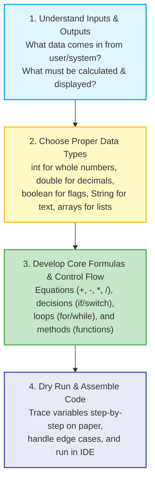
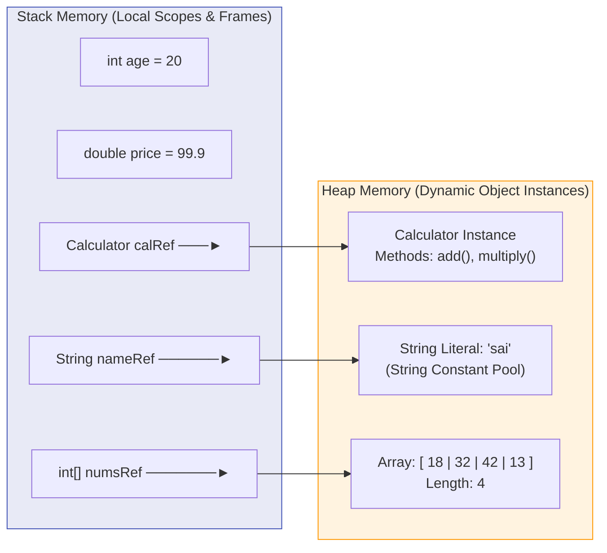

# ☕ Java Mastery & Core Fundamentals — Complete Logic & Revision Guide

[](https://www.oracle.com/java/)
[](https://github.com/)
[](https://github.com/)
[-orange?style=for-the-badge)](https://github.com/)
[](LICENSE)

> **Learn Java logic, build from scratch, and revise anytime with ease.** A structured, hands-on repository containing focused Java examples, line-by-line breakdowns, keyword definitions, mental models, memory diagrams, dry-run tables, and practical mini-projects designed for long-term retention and rapid exam / interview preparation.

---

## 📑 Table of Contents

- [🎯 How I Code: The Universal Java Problem-Solving Framework](#-how-i-code-the-universal-java-problem-solving-framework)
- [📖 Master Java Keywords & Terminology Glossary](#-master-java-keywords--terminology-glossary)
- [🗺️ Visual Learning Roadmap (12 Modules)](#️-visual-learning-roadmap-12-modules)
- [⚡ Quick Start & Execution Commands](#-quick-start--execution-commands)
- [📂 Complete Master Module Index & Code Map](#-complete-master-module-index--code-map)
- [🧠 Core Mental Models & Memory Diagrams](#-core-mental-models--memory-diagrams)
  - [1. Program Anatomy & JVM Execution Flow](#1-program-anatomy--jvm-execution-flow)
  - [2. Primitives vs. References (Stack vs Heap)](#2-primitives-vs-references-stack-vs-heap)
  - [3. Type Conversions & Automatic Promotion Matrix](#3-type-conversions--automatic-promotion-matrix)
  - [4. Operator Precedence & Evaluation Rules](#4-operator-precedence--evaluation-rules)
  - [5. Prefix vs. Postfix Increment (`++i` vs `i++`)](#5-prefix-vs-postfix-increment-i-vs-i)
  - [6. Control Flow & Decision Trees](#6-control-flow--decision-trees)
  - [7. Looping Constructs & Execution Guarantees](#7-looping-constructs--execution-guarantees)
  - [8. Terminal I/O & The Scanner Buffer Gotcha](#8-terminal-io--the-scanner-buffer-gotcha)
  - [9. Math & Random Standard Utilities](#9-math--random-standard-utilities)
  - [10. OOP Kickstart: Classes, Objects & Methods](#10-oop-kickstart-classes-objects--methods)
  - [11. Array Data Structures & Heap Storage](#11-array-data-structures--heap-storage)
  - [12. Method Invocation & Call Stack Frames](#12-method-invocation--call-stack-frames)
- [🛠️ Practical Mini-Projects Showcase](#️-practical-mini-projects-showcase)
- [⚠️ Top Common Pitfalls & Traps (Interview FAQ)](#️-top-common-pitfalls--traps-interview-faq)
- [⏱️ 10-Minute Rapid Revision Checklist](#️-10-minute-rapid-revision-checklist)

---

## 🎯 How I Code: The Universal Java Problem-Solving Framework

Whenever you need to solve a problem or write a Java program from scratch, follow this **4-step mental blueprint**:



### The 3 Core Questions Before Writing Code:
1. **"What is the use?"** — Why does this program exist? (e.g. calculate a shopping bill, filter student grades, store an array of scores).
2. **"How do I code it?"** — What building blocks are needed? (e.g. `Scanner` for input $\rightarrow$ `double` variables $\rightarrow$ `if-else` for discount $\rightarrow$ `printf` for receipt).
3. **"How do I use it?"** — How do I compile and run it from the terminal? (`javac -d out ...` $\rightarrow$ `java -cp out ...`).

---

## 📖 Master Java Keywords & Terminology Glossary

Java has 50+ reserved keywords. Here are the core keywords and terms used throughout this course with clear definitions, purpose, and syntax examples:

| Keyword / Term | Category | What it Means (Definition) | What is the Use? | How to Code Example |
| :--- | :--- | :--- | :--- | :--- |
| `package` | Declaration | Defines the namespace/folder container for the Java file. | Prevents naming collisions and organizes code into modules. | `package basics;` |
| `import` | Declaration | Brings external classes/packages into the current file. | Allows using libraries like `Scanner`, `Random`, `ArrayList`. | `import java.util.Scanner;` |
| `class` | Blueprint | Declares a user-defined blueprint for creating objects. | Encapsulates variables (state) and methods (behavior). | `class Calculator { ... }` |
| `public` | Access Modifier | Makes a class, method, or variable accessible from any package. | Exposes public API methods and entry points to the JVM. | `public static void main(...)` |
| `static` | Modifier | Associates a member with the class itself, not individual objects. | Can be called without creating an object instance with `new`. | `Math.sqrt(25);` |
| `void` | Return Type | Specifies that a method does not return any value back to caller. | Used for actions like printing, logging, or setting state. | `public void printReceipt() { }` |
| `main` | Identifier | Special method name recognized by JVM as the ignition entry point. | Program execution always starts at line 1 of `main()`. | `public static void main(String[] args)` |
| `new` | Memory Operator | Allocates new memory on the **Heap** for an object or array. | Instantiates classes and initializes arrays. | `Scanner sc = new Scanner(System.in);` |
| `this` | Reference | Reference keyword pointing to the current object instance. | Disambiguates instance variables from parameter names. | `this.name = name;` |
| `return` | Control Flow | Exits the current method and optionally passes a value back. | Sends computation results back to the caller. | `return n1 + n2;` |
| `if` / `else` | Decision | Evaluates boolean expression and branches code execution. | Conditional branching based on state or inputs. | `if (age >= 18) { ... } else { ... }` |
| `switch` / `case` | Decision | Multi-way selection based on matching a variable value. | Clean alternative to multiple `if-else` checks on constants. | `switch(day) { case 1 -> "Mon"; }` |
| `break` | Loop/Switch Control | Forcefully terminates the innermost loop or switch block. | Prevents fall-through in switch and stops loops early. | `if (found) break;` |
| `continue` | Loop Control | Skips the rest of current loop iteration; jumps to next cycle. | Skips unwanted values without breaking the loop. | `if (i % 2 == 0) continue;` |
| `default` | Switch Clause | Fallback branch inside switch if no other case matched. | Catches invalid options or unexpected values. | `default -> "Invalid";` |
| `for` | Iteration | Counting loop with initialization, condition, and update in header. | Iterating fixed number of times, traversing arrays. | `for (int i = 0; i < 10; i++)` |
| `while` | Iteration | Entry-controlled loop running while boolean condition is true. | Running tasks where number of iterations is unknown. | `while (scanner.hasNext())` |
| `do` | Iteration | Post-condition loop running body first before testing condition. | Guarantees minimum 1 execution (interactive menus). | `do { ... } while (choice != 0);` |
| `int` | Primitive Type | 32-bit signed integer ($\approx -2\text{ billion to }+2\text{ billion}$). | Whole numbers: counters, quantities, ages, IDs. | `int count = 5;` |
| `double` | Primitive Type | 64-bit IEEE-754 floating point decimal number. | Decimal numbers: currency, measurements, scientific math. | `double price = 99.99;` |
| `boolean` | Primitive Type | 1-bit logical value: strictly `true` or `false`. | Flags, conditions, status checks, validation. | `boolean isStudent = true;` |
| `char` | Primitive Type | 16-bit Unicode character (e.g. `'A'`, `'₹'`). | Single characters, symbols, currency markers. | `char currency = '₹';` |
| `String` | Reference Class | Sequence of characters enclosed in double quotes `"..."`. | Text handling: names, messages, formatted receipts. | `String name = "Java";` |
| `final` | Modifier | Declares a constant variable that cannot be reassigned. | Immutable configuration: `final double PI = 3.14159;` | `final int MAX = 100;` |

---

## 🗺️ Visual Learning Roadmap (12 Modules)

Follow this progressive learning sequence to master core Java fundamentals from scratch:

```mermaid
flowchart TD
    A["01. Basics & Anatomy\n(class, main method, JVM, BODMAS)"] --> B["02. Variables & Data Types\n(primitives, sizes, Stack vs Heap)"]
    B --> C["03. Type Conversions\n(widening vs narrowing, byte overflow)"]
    C --> D["04. Operators & Precedence\n(arithmetic, increment ++i/i++, logical && ||)"]
    D --> E["05. Terminal Input / Output\n(Scanner, tokens, buffer flush)"]
    E --> F["06. Decision Branching\n(if-else, switch, ternary)"]
    F --> G["07. Loops & Iteration\n(for, while, do-while, break, continue)"]
    G --> H["08. Built-in Utilities\n(Math API, java.util.Random)"]
    H --> I["09. OOP Kickstart\n(Classes, Objects, Stack vs Heap)"]
    I --> J["10. Arrays & Collections\n(1D, 2D matrix, 3D cubes, jagged arrays, for-each)"]
    J --> K["11. Methods & Overloading\n(void, return, parameters, signatures)"]
    K --> L["12. Integrated Practice Projects\n(Shopping cart, geometry, tables)"]

    style A fill:#4CAF50,stroke:#388E3C,stroke-width:2px,color:#fff
    style B fill:#2196F3,stroke:#1976D2,stroke-width:2px,color:#fff
    style C fill:#2196F3,stroke:#1976D2,stroke-width:2px,color:#fff
    style D fill:#FF9800,stroke:#F57C00,stroke-width:2px,color:#fff
    style E fill:#9C27B0,stroke:#7B1FA2,stroke-width:2px,color:#fff
    style F fill:#E91E63,stroke:#C2185B,stroke-width:2px,color:#fff
    style G fill:#00BCD4,stroke:#0097A7,stroke-width:2px,color:#fff
    style H fill:#607D8B,stroke:#455A64,stroke-width:2px,color:#fff
    style I fill:#3F51B5,stroke:#303F9F,stroke-width:2px,color:#fff
    style J fill:#009688,stroke:#00796B,stroke-width:2px,color:#fff
    style K fill:#795548,stroke:#5D4037,stroke-width:2px,color:#fff
    style L fill:#FF5722,stroke:#E64A19,stroke-width:2px,color:#fff
```



---

## ⚡ Quick Start & Execution Commands

### 1. Compile All Files at Once:
```bash
# Compile entire source tree into out/ directory
javac -d out $(find src -name "*.java")
```

### 2. Run Any Program Directly:
```bash
# Module 01: Basics
java -cp out beginner.getting_started.startingstructure
java -cp out beginner.operators.OrderDemo
java -cp out beginner.input_output.scanner

# Module 02: Variables
java -cp out beginner.variables.variables

# Module 03: Type Conversions
java -cp out beginner.type_conversion.Typepromotions
java -cp out beginner.type_conversion.Floatconversion
java -cp out beginner.type_conversion.byteconversion

# Module 04: Operators
java -cp out beginner.operators.arithmeticoperator
java -cp out beginner.operators.increment
java -cp out beginner.operators.augmentedassigment
java -cp out beginner.operators.Relationaloperator
java -cp out beginner.operators.logicaloperator

# Module 05: Input / Output
java -cp out beginner.input_output.ScannerInput

# Module 06: Conditionals
java -cp out beginner.conditional_statements.ifstatement
java -cp out beginner.conditional_statements.ifelse_statement
java -cp out beginner.conditional_statements.if_else_if
java -cp out beginner.conditional_statements.Ternary_operator
java -cp out beginner.conditional_statements.switch_operator

# Module 07: Loops
java -cp out beginner.loops.For_loop
java -cp out beginner.loops.while_loop
java -cp out beginner.loops.Do_while_loop

# Module 08: Math & Random
java -cp out beginner.math_and_random.math
java -cp out beginner.math_and_random.randomnumbers

# Advanced Tier: OOP & Memory
java -cp out advanced.oop_basics.Classes
java -cp out advanced.oop_basics.Stack_Heap_data

# Intermediate Tier: Practice Projects
java -cp out intermediate.practice_projects.shoppingcart
java -cp out intermediate.practice_projects.calculaterectangle
java -cp out intermediate.practice_projects.for_loop

# Intermediate Tier: Arrays
java -cp out intermediate.arrays.demo_array
java -cp out intermediate.arrays.array_of_elments
java -cp out intermediate.arrays.multi_dimensional_array
java -cp out intermediate.arrays.three_dimensional_array
java -cp out intermediate.arrays.jagged_array
java -cp out intermediate.arrays.Student_array_demo

# Intermediate Tier: Methods
java -cp out intermediate.methods.Demo_class
java -cp out intermediate.methods.MethodOverloading
```

---

## 📂 Complete Master Module Index & Code Map

Click on any **Module Guide** for full explanations, analogies, diagrams, and gotchas, or click on any **Source File** to inspect the code:

### 🟢 Beginner Tier (`src/beginner/`)

| Module # | Topic Name | Module Guide Link | Source File | Core Concepts & Purpose | Quick Run Command |
| :---: | :--- | :--- | :--- | :--- | :--- |
| **01** | **Basics** | [📖 Module 01 Guide](file:///Users/honeyreddy/Documents/Java%20course/src/beginner/getting_started/README.md) | [`startingstructure.java`](file:///Users/honeyreddy/Documents/Java%20course/src/beginner/getting_started/startingstructure.java) | `class`, `public static void main`, `System.out.println` entry point | `java -cp out beginner.getting_started.startingstructure` |
| **01** | **Basics** | [📖 Module 01 Guide](file:///Users/honeyreddy/Documents/Java%20course/src/beginner/getting_started/README.md) | [`OrderDemo.java`](file:///Users/honeyreddy/Documents/Java%20course/src/beginner/operators/OrderDemo.java) | Operator precedence, BODMAS/PEMDAS, integer division | `java -cp out beginner.operators.OrderDemo` |
| **01** | **Basics** | [📖 Module 01 Guide](file:///Users/honeyreddy/Documents/Java%20course/src/beginner/getting_started/README.md) | [`scanner.java`](file:///Users/honeyreddy/Documents/Java%20course/src/beginner/input_output/scanner.java) | `Scanner` setup, terminal reading, buffer management | `java -cp out beginner.input_output.scanner` |
| **02** | **Variables** | [📖 Module 02 Guide](file:///Users/honeyreddy/Documents/Java%20course/src/beginner/variables/README.md) | [`variables.java`](file:///Users/honeyreddy/Documents/Java%20course/src/beginner/variables/variables.java) | `int`, `double`, `Boolean`, `String`, concatenation `+` | `java -cp out beginner.variables.variables` |
| **03** | **Conversions** | [📖 Module 03 Guide](file:///Users/honeyreddy/Documents/Java%20course/src/beginner/type_conversion/README.md) | [`Typepromotions.java`](file:///Users/honeyreddy/Documents/Java%20course/src/beginner/type_conversion/Typepromotions.java) | Byte multiplication promotion to `int` in expressions | `java -cp out beginner.type_conversion.Typepromotions` |
| **03** | **Conversions** | [📖 Module 03 Guide](file:///Users/honeyreddy/Documents/Java%20course/src/beginner/type_conversion/README.md) | [`Floatconversion.java`](file:///Users/honeyreddy/Documents/Java%20course/src/beginner/type_conversion/Floatconversion.java) | Narrowing `(int)` cast & decimal truncation | `java -cp out beginner.type_conversion.Floatconversion` |
| **03** | **Conversions** | [📖 Module 03 Guide](file:///Users/honeyreddy/Documents/Java%20course/src/beginner/type_conversion/README.md) | [`byteconversion.java`](file:///Users/honeyreddy/Documents/Java%20course/src/beginner/type_conversion/byteconversion.java) | Explicit casting & 8-bit two's complement overflow wrap | `java -cp out beginner.type_conversion.byteconversion` |
| **04** | **Operators** | [📖 Module 04 Guide](file:///Users/honeyreddy/Documents/Java%20course/src/beginner/operators/README.md) | [`arithmeticoperator.java`](file:///Users/honeyreddy/Documents/Java%20course/src/beginner/operators/arithmeticoperator.java) | Arithmetic (`+`, `-`, `*`, `/`, `%`), quotient vs remainder | `java -cp out beginner.operators.arithmeticoperator` |
| **04** | **Operators** | [📖 Module 04 Guide](file:///Users/honeyreddy/Documents/Java%20course/src/beginner/operators/README.md) | [`increment.java`](file:///Users/honeyreddy/Documents/Java%20course/src/beginner/operators/increment.java) | Postfix (`i++`) vs Prefix (`++i`) assignment timing | `java -cp out beginner.operators.increment` |
| **04** | **Operators** | [📖 Module 04 Guide](file:///Users/honeyreddy/Documents/Java%20course/src/beginner/operators/README.md) | [`augmentedassigment.java`](file:///Users/honeyreddy/Documents/Java%20course/src/beginner/operators/augmentedassigment.java) | Compound updates (`+=`, `-=`, `*=`, `/=`, `%=`) & implicit cast | `java -cp out beginner.operators.augmentedassigment` |
| **04** | **Operators** | [📖 Module 04 Guide](file:///Users/honeyreddy/Documents/Java%20course/src/beginner/operators/README.md) | [`Relationaloperator.java`](file:///Users/honeyreddy/Documents/Java%20course/src/beginner/operators/Relationaloperator.java) | Comparison boolean results (`<`, `>`, `==`, `!=`, `<=`, `>=`) | `java -cp out beginner.operators.Relationaloperator` |
| **04** | **Operators** | [📖 Module 04 Guide](file:///Users/honeyreddy/Documents/Java%20course/src/beginner/operators/README.md) | [`logicaloperator.java`](file:///Users/honeyreddy/Documents/Java%20course/src/beginner/operators/logicaloperator.java) | Logical AND (`&&`), OR (`\|\|`), NOT (`!`), short-circuiting | `java -cp out beginner.operators.logicaloperator` |
| **05** | **Input/Output**| [📖 Module 05 Guide](file:///Users/honeyreddy/Documents/Java%20course/src/beginner/input_output/README.md) | [`ScannerInput.java`](file:///Users/honeyreddy/Documents/Java%20course/src/beginner/input_output/ScannerInput.java) | Multi-type interactive input flow & memory cleanup | `java -cp out beginner.input_output.ScannerInput` |
| **06** | **Conditionals**| [📖 Module 06 Guide](file:///Users/honeyreddy/Documents/Java%20course/src/beginner/conditional_statements/README.md) | [`ifstatement.java`](file:///Users/honeyreddy/Documents/Java%20course/src/beginner/conditional_statements/ifstatement.java) | Interactive input validation, `isEmpty()`, age branching | `java -cp out beginner.conditional_statements.ifstatement` |
| **06** | **Conditionals**| [📖 Module 06 Guide](file:///Users/honeyreddy/Documents/Java%20course/src/beginner/conditional_statements/README.md) | [`ifelse_statement.java`](file:///Users/honeyreddy/Documents/Java%20course/src/beginner/conditional_statements/ifelse_statement.java) | Two-way decision branching (`if - else`) | `java -cp out beginner.conditional_statements.ifelse_statement` |
| **06** | **Conditionals**| [📖 Module 06 Guide](file:///Users/honeyreddy/Documents/Java%20course/src/beginner/conditional_statements/README.md) | [`if_else_if.java`](file:///Users/honeyreddy/Documents/Java%20course/src/beginner/conditional_statements/if_else_if.java) | Multi-condition ladder vs independent `if` statements | `java -cp out beginner.conditional_statements.if_else_if` |
| **06** | **Conditionals**| [📖 Module 06 Guide](file:///Users/honeyreddy/Documents/Java%20course/src/beginner/conditional_statements/README.md) | [`Ternary_operator.java`](file:///Users/honeyreddy/Documents/Java%20course/src/beginner/conditional_statements/Ternary_operator.java) | Inline conditional expression `(cond) ? val1 : val2` | `java -cp out beginner.conditional_statements.Ternary_operator` |
| **06** | **Conditionals**| [📖 Module 06 Guide](file:///Users/honeyreddy/Documents/Java%20course/src/beginner/conditional_statements/README.md) | [`switch_operator.java`](file:///Users/honeyreddy/Documents/Java%20course/src/beginner/conditional_statements/switch_operator.java) | Classic `switch` with `break` vs modern Java 14+ arrow switch | `java -cp out beginner.conditional_statements.switch_operator` |
| **07** | **Loops** | [📖 Module 07 Guide](file:///Users/honeyreddy/Documents/Java%20course/src/beginner/loops/README.md) | [`For_loop.java`](file:///Users/honeyreddy/Documents/Java%20course/src/beginner/loops/For_loop.java) | Counting `for` loop & nested schedule loop traversal | `java -cp out beginner.loops.For_loop` |
| **07** | **Loops** | [📖 Module 07 Guide](file:///Users/honeyreddy/Documents/Java%20course/src/beginner/loops/README.md) | [`while_loop.java`](file:///Users/honeyreddy/Documents/Java%20course/src/beginner/loops/while_loop.java) | Pre-condition iteration & loop counter management | `java -cp out beginner.loops.while_loop` |
| **08** | **Loops** | [📖 Module 07 Guide](file:///Users/honeyreddy/Documents/Java%20course/src/beginner/loops/README.md) | [`Do_while_loop.java`](file:///Users/honeyreddy/Documents/Java%20course/src/beginner/loops/Do_while_loop.java) | Post-condition loop guaranteed to execute at least once | `java -cp out beginner.loops.Do_while_loop` |
| **09** | **Math & Random**| [📖 Module 08 Guide](file:///Users/honeyreddy/Documents/Java%20course/src/beginner/math_and_random/README.md) | [`math.java`](file:///Users/honeyreddy/Documents/Java%20course/src/beginner/math_and_random/math.java) | `Math.PI`, `Math.E`, `sqrt`, `pow`, `abs`, `round`, `ceil` | `java -cp out beginner.math_and_random.math` |
| **09** | **Math & Random**| [📖 Module 08 Guide](file:///Users/honeyreddy/Documents/Java%20course/src/beginner/math_and_random/README.md) | [`randomnumbers.java`](file:///Users/honeyreddy/Documents/Java%20course/src/beginner/math_and_random/randomnumbers.java) | `Random.nextInt(origin, bound)`, dice rolls, booleans | `java -cp out beginner.math_and_random.randomnumbers` |

### 🟡 Intermediate Tier (`src/intermediate/`)

| Module # | Topic Name | Module Guide Link | Source File | Core Concepts & Purpose | Quick Run Command |
| :---: | :--- | :--- | :--- | :--- | :--- |
| **10** | **Practice Projects** | [📖 Module 10 Guide](file:///Users/honeyreddy/Documents/Java%20course/src/intermediate/practice_projects/README.md) | [`shoppingcart.java`](file:///Users/honeyreddy/Documents/Java%20course/src/intermediate/practice_projects/shoppingcart.java) | Interactive retail billing simulation with currency formatting | `java -cp out intermediate.practice_projects.shoppingcart` |
| **10** | **Practice Projects** | [📖 Module 10 Guide](file:///Users/honeyreddy/Documents/Java%20course/src/intermediate/practice_projects/README.md) | [`calculaterectangle.java`](file:///Users/honeyreddy/Documents/Java%20course/src/intermediate/practice_projects/calculaterectangle.java) | Rectangle geometry computation ($Area = w \times h$) | `java -cp out intermediate.practice_projects.calculaterectangle` |
| **10** | **Practice Projects** | [📖 Module 10 Guide](file:///Users/honeyreddy/Documents/Java%20course/src/intermediate/practice_projects/README.md) | [`for_loop.java`](file:///Users/honeyreddy/Documents/Java%20course/src/intermediate/practice_projects/for_loop.java) | Dynamic multiplication table generator (Table of 17) | `java -cp out intermediate.practice_projects.for_loop` |
| **11** | **Arrays** | [📖 Module 11 Guide](file:///Users/honeyreddy/Documents/Java%20course/src/intermediate/arrays/README.md) | [`demo_array.java`](file:///Users/honeyreddy/Documents/Java%20course/src/intermediate/arrays/demo_array.java) | Inline array initialization, index-based access | `java -cp out intermediate.arrays.demo_array` |
| **11** | **Arrays** | [📖 Module 11 Guide](file:///Users/honeyreddy/Documents/Java%20course/src/intermediate/arrays/README.md) | [`array_of_elments.java`](file:///Users/honeyreddy/Documents/Java%20course/src/intermediate/arrays/array_of_elments.java) | `new int[4]` allocation, manual element assignment, `for` loop | `java -cp out intermediate.arrays.array_of_elments` |
| **11** | **Arrays** | [📖 Module 11 Guide](file:///Users/honeyreddy/Documents/Java%20course/src/intermediate/arrays/README.md) | [`multi_dimensional_array.java`](file:///Users/honeyreddy/Documents/Java%20course/src/intermediate/arrays/multi_dimensional_array.java) | 2D `int[3][4]` grid, `Math.random()` fill, enhanced for-each | `java -cp out intermediate.arrays.multi_dimensional_array` |
| **11** | **Arrays** | [📖 Module 11 Guide](file:///Users/honeyreddy/Documents/Java%20course/src/intermediate/arrays/README.md) | [`three_dimensional_array.java`](file:///Users/honeyreddy/Documents/Java%20course/src/intermediate/arrays/three_dimensional_array.java) | 3D `int[3][4][5]` layered array, 3-level nested loops | `java -cp out intermediate.arrays.three_dimensional_array` |
| **11** | **Arrays** | [📖 Module 11 Guide](file:///Users/honeyreddy/Documents/Java%20course/src/intermediate/arrays/README.md) | [`jagged_array.java`](file:///Users/honeyreddy/Documents/Java%20course/src/intermediate/arrays/jagged_array.java) | Jagged `int[3][]` with irregular rows (3, 6, 4), `.length` bounds | `java -cp out intermediate.arrays.jagged_array` |
| **11** | **Arrays** | [📖 Module 11 Guide](file:///Users/honeyreddy/Documents/Java%20course/src/intermediate/arrays/README.md) | [`Student_array_demo.java`](file:///Users/honeyreddy/Documents/Java%20course/src/intermediate/arrays/Student_array_demo.java) | Object reference arrays (`Student[]`), instance attributes | `java -cp out intermediate.arrays.Student_array_demo` |
| **12** | **Methods** | [📖 Module 12 Guide](file:///Users/honeyreddy/Documents/Java%20course/src/intermediate/methods/README.md) | [`Demo_class.java`](file:///Users/honeyreddy/Documents/Java%20course/src/intermediate/methods/Demo_class.java) | `void` vs return methods, conditional returns, method calls | `java -cp out intermediate.methods.Demo_class` |
| **12** | **Methods** | [📖 Module 12 Guide](file:///Users/honeyreddy/Documents/Java%20course/src/intermediate/methods/README.md) | [`MethodOverloading.java`](file:///Users/honeyreddy/Documents/Java%20course/src/intermediate/methods/MethodOverloading.java) | Compile-time polymorphism with overloaded parameter lists | `java -cp out intermediate.methods.MethodOverloading` |
| **--** | **Strings** | [📖 Strings Roadmap](file:///Users/honeyreddy/Documents/Java%20course/src/intermediate/strings/README.md) | *(Roadmap)* | String Pool, immutability, `StringBuilder` vs `StringBuffer` | *(Roadmap)* |
| **--** | **Exceptions** | [📖 Exceptions Roadmap](file:///Users/honeyreddy/Documents/Java%20course/src/intermediate/exception_handling/README.md) | *(Roadmap)* | `try-catch-finally`, checked vs unchecked exceptions | *(Roadmap)* |

### 🔴 Advanced Tier (`src/advanced/`)

| Module # | Topic Name | Module Guide Link | Source File | Core Concepts & Purpose | Quick Run Command |
| :---: | :--- | :--- | :--- | :--- | :--- |
| **13** | **OOP Basics** | [📖 OOP Guide](file:///Users/honeyreddy/Documents/Java%20course/src/advanced/oop_basics/README.md) | [`Classes.java`](file:///Users/honeyreddy/Documents/Java%20course/src/advanced/oop_basics/Classes.java) | Blueprint `class`, object instantiation `new`, method calls | `java -cp out advanced.oop_basics.Classes` |
| **13** | **OOP Basics** | [📖 OOP Guide](file:///Users/honeyreddy/Documents/Java%20course/src/advanced/oop_basics/README.md) | [`Stack_Heap_data.java`](file:///Users/honeyreddy/Documents/Java%20course/src/advanced/oop_basics/Stack_Heap_data.java) | Multiple object instances, independent state, Stack vs Heap | `java -cp out advanced.oop_basics.Stack_Heap_data` |
| **--** | **OOP Pillars** | [📖 Pillars Roadmap](file:///Users/honeyreddy/Documents/Java%20course/src/advanced/oop_pillars/README.md) | *(Roadmap)* | Encapsulation, inheritance, polymorphism, abstraction | *(Roadmap)* |
| **--** | **Collections** | [📖 Collections Roadmap](file:///Users/honeyreddy/Documents/Java%20course/src/advanced/collections/README.md) | *(Roadmap)* | `List`, `Set`, `Map`, `Queue`, iterators, Streams | *(Roadmap)* |
| **--** | **Generics** | [📖 Generics Roadmap](file:///Users/honeyreddy/Documents/Java%20course/src/advanced/generics/README.md) | *(Roadmap)* | Generics, wildcards, type safety, type erasure | *(Roadmap)* |
| **--** | **File I/O** | [📖 File I/O Roadmap](file:///Users/honeyreddy/Documents/Java%20course/src/advanced/file_io/README.md) | *(Roadmap)* | Byte/character streams, NIO.2 `Files`, serialization | *(Roadmap)* |
| **--** | **Multithreading**| [📖 Concurrency Roadmap](file:///Users/honeyreddy/Documents/Java%20course/src/advanced/multithreading/README.md) | *(Roadmap)* | `Thread`, `Runnable`, synchronization, `ExecutorService` | *(Roadmap)* |
| **--** | **Capstone** | [📖 Projects Roadmap](file:///Users/honeyreddy/Documents/Java%20course/src/advanced/advanced_projects/README.md) | *(Roadmap)* | Integrated real-world CLI projects | *(Roadmap)* |

---

## 🧠 Core Mental Models & Memory Diagrams

### 1. Program Anatomy & JVM Execution Flow
```mermaid
flowchart LR
    SRC["App.java\n(Source Code)"] -->|javac| BYTE["App.class\n(Bytecode)"]
    BYTE -->|JVM ClassLoader| MEM["JVM Runtime Memory"]
    MEM -->|Execution Engine (JIT)| CPU["Native CPU Machine Code"]

    style SRC fill:#E8F5E9,stroke:#4CAF50
    style BYTE fill:#E3F2FD,stroke:#2196F3
    style MEM fill:#FFF8E1,stroke:#FFC107
    style CPU fill:#FFEBEE,stroke:#F44336
```

### 2. Primitives vs. References (Stack vs Heap)


### 3. Type Conversions & Automatic Promotion Matrix
- **Widening (Implicit)**: `byte` $\rightarrow$ `short` $\rightarrow$ `int` $\rightarrow$ `long` $\rightarrow$ `float` $\rightarrow$ `double`
- **Narrowing (Explicit)**: `double` $\rightarrow$ `float` $\rightarrow$ `long` $\rightarrow$ `int` $\rightarrow$ `short` $\rightarrow$ `byte` (Truncates or wraps!)
- **Arithmetic Promotion**: Any `byte`, `short`, or `char` in an expression automatically becomes `int`.

### 4. Operator Precedence & Evaluation Rules
1. `()` Parentheses (Highest)
2. `++`, `--` Postfix / Prefix
3. `*`, `/`, `%` Multiplicative (Left-to-Right)
4. `+`, `-` Additive (Left-to-Right)
5. `<`, `>`, `<=`, `>=` Relational
6. `==`, `!=` Equality
7. `&&` Logical AND
8. `||` Logical OR
9. `? :` Ternary
10. `=`, `+=`, `-=` Assignment (Lowest)

### 5. Prefix vs. Postfix Increment (`++i` vs `i++`)
- **Postfix (`x++`)**: **Use** current value first, **then** increment.
- **Prefix (`++x`)**: **Increment** first, **then** use new value.

### 6. Control Flow & Decision Trees
- Use `if` for single optional checks / guard clauses.
- Use `if - else` for binary either/or choices.
- Use `if - else if - else` for continuous ranges (e.g. marks $\ge 90$).
- Use `switch` for matching discrete constants (`1, 2, 'A', "ADMIN"`).
- Use `? :` for inline single-variable conditional assignments.

### 7. Looping Constructs & Execution Guarantees
- `for`: Known number of iterations, array traversal. Minimum 0 runs.
- `while`: Condition-driven tasks. Minimum 0 runs.
- `do-while`: Menu loops, retry prompts. **Guaranteed minimum 1 run**.

### 8. Terminal I/O & The Scanner Buffer Gotcha
Always flush the buffer after reading numbers if you plan to read text next:
```java
int age = scanner.nextInt();
scanner.nextLine(); // 🧹 Flush leftover '\n'
String name = scanner.nextLine(); // Read text safely
```

### 9. Math & Random Standard Utilities
- `Math` is `static`: Call directly as `Math.sqrt(64)`, `Math.pow(2, 5)`.
- `Random` requires an object instance: `Random r = new Random(); r.nextInt(1, 7);`.

### 10. OOP Kickstart: Classes, Objects & Methods
- **Class**: Blueprint containing attributes and methods.
- **Object**: Living instance allocated on the Heap via `new`.
- **Method**: Named block of logic that can receive parameters and return values.

### 11. Array Data Structures & Heap Storage
- **1D Array**: `int[] nums = new int[4];` $\rightarrow$ contiguous Heap block of 4 integers.
- **2D Array (Matrix)**: `int[][] grid = new int[3][4];` $\rightarrow$ array of array references.
- **3D Array (Cube)**: `int[][][] cube = new int[3][4][5];` $\rightarrow$ array of 2D matrices.
- **Jagged Array**: `int[][] jagged = new int[3][];` $\rightarrow$ rows with different lengths (`jagged[0] = new int[3];`).

### 12. Method Invocation & Call Stack Frames
Each method call pushes a new **stack frame** onto the Call Stack. When the method returns, its frame is popped off, restoring execution back to the caller.

---

## 🛠️ Practical Mini-Projects Showcase

The repository contains three complete, real-world mini-applications combining all concepts:

### 1. 🛒 Interactive Shopping Cart ([`shoppingcart.java`](file:///Users/honeyreddy/Documents/Java%20course/src/intermediate/practice_projects/shoppingcart.java))
- Reads item name, unit price, and quantity.
- Calculates bill using $\text{Total} = \text{Price} \times \text{Quantity}$.
- Prints formatted receipt using Unicode currency symbol `₹`.

### 2. 📐 Geometry Rectangle Engine ([`calculaterectangle.java`](file:///Users/honeyreddy/Documents/Java%20course/src/intermediate/practice_projects/calculaterectangle.java))
- Prompts for dimensions ($w$, $h$).
- Calculates Area ($w \times h$) and Perimeter ($2 \times (w + h)$).
- Formats floating-point output with `printf`.

### 3. 🔢 Dynamic Multiplication Table ([`for_loop.java`](file:///Users/honeyreddy/Documents/Java%20course/src/intermediate/practice_projects/for_loop.java))
- Uses a counting loop to generate the mathematical table of 17 from 1 to 10 with aligned column formatting.

---

## ⚠️ Top Common Pitfalls & Traps (Interview FAQ)

> [!WARNING]
> ### 1. String Equality: `==` vs `.equals()`
> - `==` compares **memory addresses / reference identity**.
> - `.equals()` compares **actual character content**.
> ```java
> String s1 = new String("Java");
> String s2 = new String("Java");
> System.out.println(s1 == s2);      // false (different heap objects!)
> System.out.println(s1.equals(s2));  // true  (same characters!)
> ```

> [!NOTE]
> ### 2. Integer Division Truncation
> Dividing two integers truncates the decimal portion:
> ```java
> double result = 5 / 2;    // Result is 2.0 (NOT 2.5!)
> double correct = 5.0 / 2; // Result is 2.5 (because 5.0 is double)
> ```

> [!IMPORTANT]
> ### 3. Scanner Newline Skip Bug
> Calling `nextInt()` or `nextDouble()` leaves a `\n` in the input buffer:
> ```java
> int age = scanner.nextInt();
> scanner.nextLine(); // MUST flush leftover newline before reading text!
> String name = scanner.nextLine();
> ```

> [!CAUTION]
> ### 4. Array Index Out of Bounds
> Valid indices are strictly `0` to `length - 1`:
> ```java
> int[] arr = { 10, 20, 30 };
> System.out.println(arr[3]); // 💥 ArrayIndexOutOfBoundsException!
> ```

---

## ⏱️ 10-Minute Rapid Revision Checklist

Before your test or technical interview, quickly review these core anchors across the modules:

- [ ] **Main Method Signature**: [`src/beginner/getting_started/startingstructure.java`](file:///Users/honeyreddy/Documents/Java%20course/src/beginner/getting_started/startingstructure.java)
- [ ] **Primitive Types & Sizes**: [`src/beginner/variables/variables.java`](file:///Users/honeyreddy/Documents/Java%20course/src/beginner/variables/variables.java)
- [ ] **Type Promotion Rules**: [`src/beginner/type_conversion/Typepromotions.java`](file:///Users/honeyreddy/Documents/Java%20course/src/beginner/type_conversion/Typepromotions.java)
- [ ] **Increment Prefix vs Postfix**: [`src/beginner/operators/increment.java`](file:///Users/honeyreddy/Documents/Java%20course/src/beginner/operators/increment.java)
- [ ] **Order of Evaluation**: [`src/beginner/operators/OrderDemo.java`](file:///Users/honeyreddy/Documents/Java%20course/src/beginner/operators/OrderDemo.java)
- [ ] **Switch Fall-Through & Arrow Syntax**: [`src/beginner/conditional_statements/switch_operator.java`](file:///Users/honeyreddy/Documents/Java%20course/src/beginner/conditional_statements/switch_operator.java)
- [ ] **Do-While Minimum Execution**: [`src/beginner/loops/Do_while_loop.java`](file:///Users/honeyreddy/Documents/Java%20course/src/beginner/loops/Do_while_loop.java)
- [ ] **OOP Blueprint & Object Instantiation**: [`src/advanced/oop_basics/Classes.java`](file:///Users/honeyreddy/Documents/Java%20course/src/advanced/oop_basics/Classes.java)
- [ ] **Array Memory & 2D Grids**: [`src/intermediate/arrays/multi_dimensional_array.java`](file:///Users/honeyreddy/Documents/Java%20course/src/intermediate/arrays/multi_dimensional_array.java)
- [ ] **Method Overloading Signatures**: [`src/intermediate/methods/MethodOverloading.java`](file:///Users/honeyreddy/Documents/Java%20course/src/intermediate/methods/MethodOverloading.java)

---

## 🤝 Contributing & License

### How to Contribute
1. Fork the repository.
2. Create a feature branch (`git checkout -b feature/new-example`).
3. Commit your changes (`git commit -m "Add new example with line-by-line guide"`).
4. Push to the branch (`git push origin feature/new-example`).
5. Open a Pull Request.

### License
This project is open source and available under the [MIT License](LICENSE).
