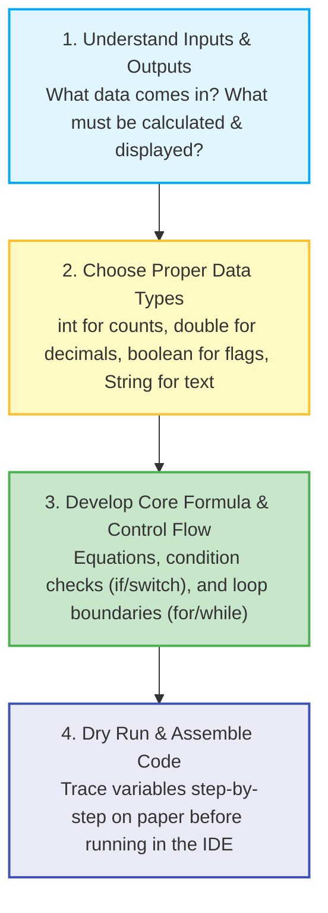
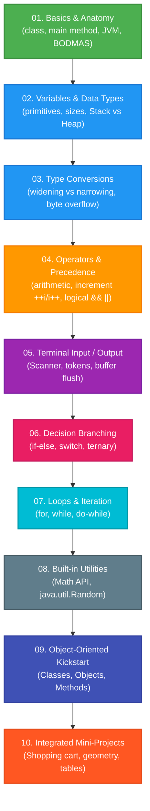
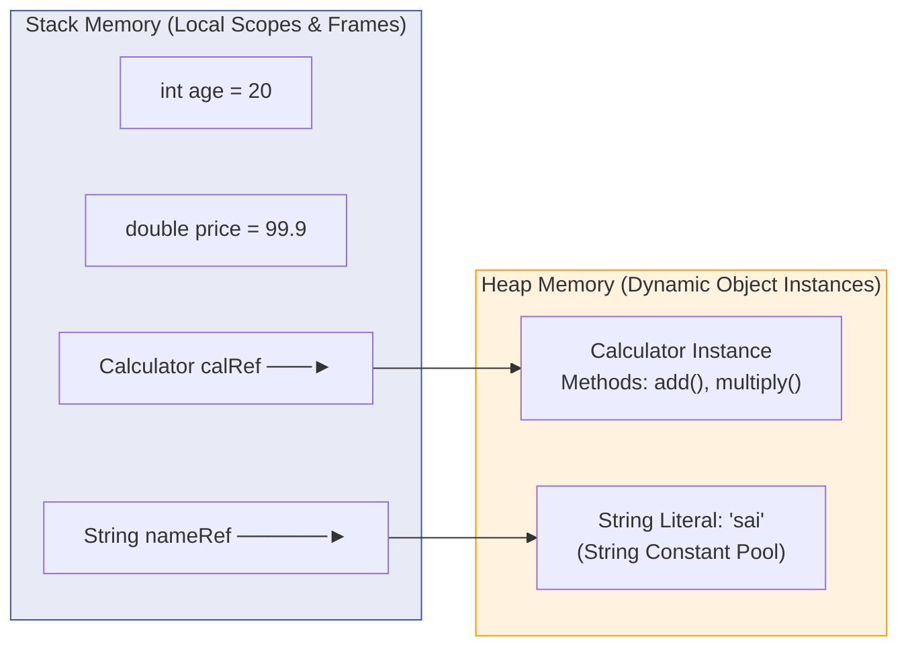

# ☕ Java Mastery & Core Fundamentals — Complete Logic & Revision Guide

[](https://www.oracle.com/java/)
[](https://github.com/)
[](https://github.com/)
[-orange?style=for-the-badge)](https://github.com/)
[](LICENSE)

> **Learn Java logic, build from scratch, and revise anytime with ease.** A structured, hands-on repository containing focused Java examples, in-depth line-by-line breakdowns, mental models, memory diagrams, dry-run tables, and practical mini-projects designed for long-term retention and rapid exam / interview preparation.

---

## 📑 Table of Contents

- [🎯 How to Use This Repository for Easy Learning](#-how-to-use-this-repository-for-easy-learning)
- [🧩 The 4-Step Logic-Building Framework](#-the-4-step-logic-building-framework)
- [🗺️ Visual Learning Roadmap](#️-visual-learning-roadmap)
- [⚡ Quick Start & Execution Commands](#-quick-start--execution-commands)
- [📂 Complete Module Index & Code Map](#-complete-module-index--code-map)
- [🧠 Core Mental Models & Memory Diagrams](#-core-mental-models--memory-diagrams)
  - [1. Program Anatomy & JVM Execution Flow](#1-program-anatomy--jvm-execution-flow)
  - [2. Primitives vs. References (Stack vs Heap)](#2-primitives-vs-references-stack-vs-heap)
  - [3. Type Conversions & Automatic Promotion Matrix](#3-type-conversions--automatic-promotion-matrix)
  - [4. Operator Precedence & Evaluation Rules](#4-operator-precedence--evaluation-rules)
  - [5. Prefix vs. Postfix Increment (`++i` vs `i++`)](#5-prefix-vs-postfix-increment-i-vs-i)
  - [6. Control Flow & Decision Trees](#6-control-flow--decision-trees)
  - [7. Looping Constructs & Execution Guarantees](#7-looping-constructs--execution-guarantees)
  - [8. Terminal I/O & The Scanner Buffer Gotcha](#8-terminal-io--the-scanner-buffer-gotcha)
  - [9. Math & Random Standard Utilities](#9-math--random-standard-utilities)
  - [10. OOP Kickstart: Classes, Objects & Methods](#10-oop-kickstart-classes-objects--methods)
- [🛠️ Practical Mini-Projects](#️-practical-mini-projects)
- [⚠️ Top Common Pitfalls & Traps (Interview FAQ)](#️-top-common-pitfalls--traps-interview-faq)
- [⏱️ 10-Minute Rapid Revision Checklist](#️-10-minute-rapid-revision-checklist)

---

## 🎯 How to Use This Repository for Easy Learning

If you are coming back to this repository after a few days or weeks, here is the fastest way to refresh your memory:

1. **Pick the topic** from the [Roadmap](#️-visual-learning-roadmap) or [Module Index](#-complete-module-index--code-map).
2. **Open the Module Guide (`README.md`)** inside that module folder for diagrams, analogies, and gotchas.
3. **Open the `.java` source code**: Every Java file contains:
   - **Goal & Problem Statement**: What we are building.
   - **Mental Model**: How to think about the problem.
   - **Line-by-Line Breakdown**: Exactly what each line does in the JVM and memory.
   - **Dry Run Trace Table**: Traces variable values step-by-step.
4. **Run the program** using the single-line command provided in the table.

---

## 🧩 The 4-Step Logic-Building Framework

When solving any programming problem or building a project, follow this 4-step thinking blueprint:



---

## 🗺️ Visual Learning Roadmap

Follow this progressive learning sequence to master core Java fundamentals:



---

## ⚡ Quick Start & Execution Commands

### 1. Compile All Files at Once:
```bash
# Compile entire source tree into out/ directory
javac -d out $(find src -name "*.java")
```

### 2. Run Any Program Directly:
```bash
# Run Module 01: Basics
java -cp out basics.startingstructure
java -cp out basics.OrderDemo
java -cp out basics.scanner

# Run Module 02: Variables
java -cp out variables.variables

# Run Module 03: Type Conversions
java -cp out type_conversions.Typepromotions
java -cp out type_conversions.Floatconversion
java -cp out type_conversions.byteconversion

# Run Module 04: Operators
java -cp out operators.arithmeticoperator
java -cp out operators.increment
java -cp out operators.augmentedassigment
java -cp out operators.Relationaloperator
java -cp out operators.logicaloperator

# Run Module 05: Input / Output
java -cp out input_output.ScannerInput

# Run Module 06: Conditionals
java -cp out conditional_statements.ifstatement
java -cp out conditional_statements.ifelse_statement
java -cp out conditional_statements.if_else_if
java -cp out conditional_statements.Ternary_operator
java -cp out conditional_statements.switch_operator

# Run Module 07: Loops
java -cp out Loops.For_loop
java -cp out Loops.while_loop
java -cp out Loops.Do_while_loop

# Run Module 08: Math & Random
java -cp out math_and_random.math
java -cp out math_and_random.randomnumbers

# Run Module 09: OOP
java -cp out oop.Classes
java -cp out classes

# Run Module 10: Practice Projects
java -cp out practice_programs.shoppingcart
java -cp out practice_programs.calculaterectangle
java -cp out practice_programs.for_loop
```

---

## 📂 Complete Module Index & Code Map

| Module / Topic | Guide Link | Source File | Core Concepts & Logic | Quick Run Command |
| :--- | :--- | :--- | :--- | :--- |
| **01. Basics** | [📖 Module Guide](file:///Users/honeyreddy/Documents/Java%20course/src/basics/README.md) | [`startingstructure.java`](file:///Users/honeyreddy/Documents/Java%20course/src/basics/startingstructure.java) | `class`, `public static void main`, `System.out.println` | `java -cp out basics.startingstructure` |
| **01. Basics** | [📖 Module Guide](file:///Users/honeyreddy/Documents/Java%20course/src/basics/README.md) | [`OrderDemo.java`](file:///Users/honeyreddy/Documents/Java%20course/src/basics/OrderDemo.java) | Operator precedence, BODMAS/PEMDAS, integer division | `java -cp out basics.OrderDemo` |
| **01. Basics** | [📖 Module Guide](file:///Users/honeyreddy/Documents/Java%20course/src/basics/README.md) | [`scanner.java`](file:///Users/honeyreddy/Documents/Java%20course/src/basics/scanner.java) | `Scanner` setup, terminal reading, buffer management | `java -cp out basics.scanner` |
| **02. Variables** | [📖 Module Guide](file:///Users/honeyreddy/Documents/Java%20course/src/variables/README.md) | [`variables.java`](file:///Users/honeyreddy/Documents/Java%20course/src/variables/variables.java) | `int`, `double`, `Boolean`, `String`, concatenation `+` | `java -cp out variables.variables` |
| **03. Conversions** | [📖 Module Guide](file:///Users/honeyreddy/Documents/Java%20course/src/type_conversions/README.md) | [`Typepromotions.java`](file:///Users/honeyreddy/Documents/Java%20course/src/type_conversions/Typepromotions.java) | Byte multiplication promotion to `int` in expressions | `java -cp out type_conversions.Typepromotions` |
| **03. Conversions** | [📖 Module Guide](file:///Users/honeyreddy/Documents/Java%20course/src/type_conversions/README.md) | [`Floatconversion.java`](file:///Users/honeyreddy/Documents/Java%20course/src/type_conversions/Floatconversion.java) | Narrowing `(int)` cast & decimal truncation | `java -cp out type_conversions.Floatconversion` |
| **03. Conversions** | [📖 Module Guide](file:///Users/honeyreddy/Documents/Java%20course/src/type_conversions/README.md) | [`byteconversion.java`](file:///Users/honeyreddy/Documents/Java%20course/src/type_conversions/byteconversion.java) | Explicit casting & 8-bit two's complement overflow wrap | `java -cp out type_conversions.byteconversion` |
| **04. Operators** | [📖 Module Guide](file:///Users/honeyreddy/Documents/Java%20course/src/Operators/README.md) | [`arithmeticoperator.java`](file:///Users/honeyreddy/Documents/Java%20course/src/Operators/arithmeticoperator.java) | Arithmetic (`+`, `-`, `*`, `/`, `%`), quotient vs remainder | `java -cp out operators.arithmeticoperator` |
| **04. Operators** | [📖 Module Guide](file:///Users/honeyreddy/Documents/Java%20course/src/Operators/README.md) | [`increment.java`](file:///Users/honeyreddy/Documents/Java%20course/src/Operators/increment.java) | Postfix (`i++`) vs Prefix (`++i`) assignment timing | `java -cp out operators.increment` |
| **04. Operators** | [📖 Module Guide](file:///Users/honeyreddy/Documents/Java%20course/src/Operators/README.md) | [`augmentedassigment.java`](file:///Users/honeyreddy/Documents/Java%20course/src/Operators/augmentedassigment.java) | Compound updates (`+=`, `-=`, `*=`, `/=`, `%=`) & implicit cast | `java -cp out operators.augmentedassigment` |
| **04. Operators** | [📖 Module Guide](file:///Users/honeyreddy/Documents/Java%20course/src/Operators/README.md) | [`Relationaloperator.java`](file:///Users/honeyreddy/Documents/Java%20course/src/Operators/Relationaloperator.java) | Comparison boolean results (`<`, `>`, `==`, `!=`, `<=`, `>=`) | `java -cp out operators.Relationaloperator` |
| **04. Operators** | [📖 Module Guide](file:///Users/honeyreddy/Documents/Java%20course/src/Operators/README.md) | [`logicaloperator.java`](file:///Users/honeyreddy/Documents/Java%20course/src/Operators/logicaloperator.java) | Logical AND (`&&`), OR (`\|\|`), NOT (`!`), short-circuiting | `java -cp out operators.logicaloperator` |
| **05. Input / Output** | [📖 Module Guide](file:///Users/honeyreddy/Documents/Java%20course/src/input_output/README.md) | [`ScannerInput.java`](file:///Users/honeyreddy/Documents/Java%20course/src/input_output/ScannerInput.java) | Multi-type interactive input flow & memory cleanup | `java -cp out input_output.ScannerInput` |
| **06. Conditionals** | [📖 Module Guide](file:///Users/honeyreddy/Documents/Java%20course/src/conditional_statements/README.md) | [`ifstatement.java`](file:///Users/honeyreddy/Documents/Java%20course/src/conditional_statements/ifstatement.java) | Interactive input validation, `isEmpty()`, age branching | `java -cp out conditional_statements.ifstatement` |
| **06. Conditionals** | [📖 Module Guide](file:///Users/honeyreddy/Documents/Java%20course/src/conditional_statements/README.md) | [`ifelse_statement.java`](file:///Users/honeyreddy/Documents/Java%20course/src/conditional_statements/ifelse_statement.java) | Two-way decision branching (`if - else`) | `java -cp out conditional_statements.ifelse_statement` |
| **06. Conditionals** | [📖 Module Guide](file:///Users/honeyreddy/Documents/Java%20course/src/conditional_statements/README.md) | [`if_else_if.java`](file:///Users/honeyreddy/Documents/Java%20course/src/conditional_statements/if_else_if.java) | Multi-condition ladder vs independent `if` statements | `java -cp out conditional_statements.if_else_if` |
| **06. Conditionals** | [📖 Module Guide](file:///Users/honeyreddy/Documents/Java%20course/src/conditional_statements/README.md) | [`Ternary_operator.java`](file:///Users/honeyreddy/Documents/Java%20course/src/conditional_statements/Ternary_operator.java) | Inline conditional expression `(cond) ? val1 : val2` | `java -cp out conditional_statements.Ternary_operator` |
| **06. Conditionals** | [📖 Module Guide](file:///Users/honeyreddy/Documents/Java%20course/src/conditional_statements/README.md) | [`switch_operator.java`](file:///Users/honeyreddy/Documents/Java%20course/src/conditional_statements/switch_operator.java) | Classic `switch` with `break` vs modern Java 14+ arrow switch | `java -cp out conditional_statements.switch_operator` |
| **07. Loops** | [📖 Module Guide](file:///Users/honeyreddy/Documents/Java%20course/src/Loops/README.md) | [`For_loop.java`](file:///Users/honeyreddy/Documents/Java%20course/src/Loops/For_loop.java) | Counting `for` loop & nested schedule loop traversal | `java -cp out Loops.For_loop` |
| **07. Loops** | [📖 Module Guide](file:///Users/honeyreddy/Documents/Java%20course/src/Loops/README.md) | [`while_loop.java`](file:///Users/honeyreddy/Documents/Java%20course/src/Loops/while_loop.java) | Pre-condition iteration & loop counter management | `java -cp out Loops.while_loop` |
| **07. Loops** | [📖 Module Guide](file:///Users/honeyreddy/Documents/Java%20course/src/Loops/README.md) | [`Do_while_loop.java`](file:///Users/honeyreddy/Documents/Java%20course/src/Loops/Do_while_loop.java) | Post-condition loop guaranteed to execute at least once | `java -cp out Loops.Do_while_loop` |
| **08. Math & Random**| [📖 Module Guide](file:///Users/honeyreddy/Documents/Java%20course/src/math_and_random/README.md) | [`math.java`](file:///Users/honeyreddy/Documents/Java%20course/src/math_and_random/math.java) | `Math.PI`, `Math.E`, `sqrt`, `pow`, `abs`, `round`, `ceil` | `java -cp out math_and_random.math` |
| **08. Math & Random**| [📖 Module Guide](file:///Users/honeyreddy/Documents/Java%20course/src/math_and_random/README.md) | [`randomnumbers.java`](file:///Users/honeyreddy/Documents/Java%20course/src/math_and_random/randomnumbers.java) | `Random.nextInt(origin, bound)`, dice rolls, booleans | `java -cp out math_and_random.randomnumbers` |
| **09. OOP** | [📖 Module Guide](file:///Users/honeyreddy/Documents/Java%20course/src/oop/README.md) | [`Classes.java`](file:///Users/honeyreddy/Documents/Java%20course/src/oop/Classes.java) | Blueprint `class`, object instantiation `new`, method calls | `java -cp out oop.Classes` |
| **09. OOP** | [📖 Module Guide](file:///Users/honeyreddy/Documents/Java%20course/src/oop/README.md) | [`classes.java`](file:///Users/honeyreddy/Documents/Java%20course/src/classes.java) | Single-file OOP class and driver runner | `java -cp out classes` |
| **10. Practice** | [📖 Module Guide](file:///Users/honeyreddy/Documents/Java%20course/src/practice_programs/README.md) | [`shoppingcart.java`](file:///Users/honeyreddy/Documents/Java%20course/src/practice_programs/shoppingcart.java) | Interactive retail billing simulation with currency formatting | `java -cp out practice_programs.shoppingcart` |
| **10. Practice** | [📖 Module Guide](file:///Users/honeyreddy/Documents/Java%20course/src/practice_programs/README.md) | [`calculaterectangle.java`](file:///Users/honeyreddy/Documents/Java%20course/src/practice_programs/calculaterectangle.java) | Rectangle geometry computation ($Area = w \times h$) | `java -cp out practice_programs.calculaterectangle` |
| **10. Practice** | [📖 Module Guide](file:///Users/honeyreddy/Documents/Java%20course/src/practice_programs/README.md) | [`for_loop.java`](file:///Users/honeyreddy/Documents/Java%20course/src/practice_programs/for_loop.java) | Dynamic multiplication table generator (Table of 17) | `java -cp out practice_programs.for_loop` |

---

## 🧠 Core Mental Models & Memory Diagrams

### 1. Program Anatomy & JVM Execution Flow
```mermaid
flowchart LR
    SRC["App.java\n(Source Code)"] -->|javac| BYTE["App.class\n(Bytecode)"]
    BYTE -->|JVM ClassLoader| MEM["JVM Runtime Memory"]
    MEM -->|Execution Engine (JIT)| CPU["Native CPU Machine Code"]

    style SRC fill:#E8F5E9,stroke:#4CAF50
    style BYTE fill:#E3F2FD,stroke:#2196F3
    style MEM fill:#FFF8E1,stroke:#FFC107
    style CPU fill:#FFEBEE,stroke:#F44336
```

### 2. Primitives vs. References (Stack vs Heap)


### 3. Type Conversions & Automatic Promotion Matrix
- **Widening (Implicit)**: `byte` -> `short` -> `int` -> `long` -> `float` -> `double`
- **Narrowing (Explicit)**: `double` -> `float` -> `long` -> `int` -> `short` -> `byte` (Truncates or wraps!)
- **Arithmetic Promotion**: Any `byte`, `short`, or `char` in an expression automatically becomes `int`.

### 4. Operator Precedence & Evaluation Rules
1. `()` Parentheses (Highest)
2. `++`, `--` Postfix / Prefix
3. `*`, `/`, `%` Multiplicative (Left-to-Right)
4. `+`, `-` Additive (Left-to-Right)
5. `<`, `>`, `<=`, `>=` Relational
6. `==`, `!=` Equality
7. `&&` Logical AND
8. `||` Logical OR
9. `? :` Ternary
10. `=`, `+=`, `-=` Assignment (Lowest)

---

## 🛠️ Practical Mini-Projects

The repository contains three complete, real-world mini-applications combining all concepts:

### 1. 🛒 Interactive Shopping Cart ([`shoppingcart.java`](file:///Users/honeyreddy/Documents/Java%20course/src/practice_programs/shoppingcart.java))
- Reads item name, unit price, and quantity.
- Calculates bill using $\text{Total} = \text{Price} \times \text{Quantity}$.
- Prints formatted receipt using Unicode currency symbol `₹`.

### 2. 📐 Geometry Rectangle Engine ([`calculaterectangle.java`](file:///Users/honeyreddy/Documents/Java%20course/src/practice_programs/calculaterectangle.java))
- Prompts for dimensions ($w$, $h$).
- Calculates Area ($w \times h$) and Perimeter ($2 \times (w + h)$).
- Formats floating-point output with `printf`.

### 3. 🔢 Dynamic Multiplication Table ([`for_loop.java`](file:///Users/honeyreddy/Documents/Java%20course/src/practice_programs/for_loop.java))
- Uses a counting loop to generate the mathematical table of 17 from 1 to 10 with aligned column formatting.

---

## ⚠️ Top Common Pitfalls & Traps (Interview FAQ)

> [!WARNING]
> ### 1. String Equality: `==` vs `.equals()`
> - `==` compares **memory addresses / reference identity**.
> - `.equals()` compares **actual character content**.
> ```java
> String s1 = new String("Java");
> String s2 = new String("Java");
> System.out.println(s1 == s2);      // false (different heap objects)
> System.out.println(s1.equals(s2));  // true  (same characters)
> ```

> [!NOTE]
> ### 2. Integer Division Truncation
> Dividing two integers truncates the decimal portion:
> ```java
> double result = 5 / 2;    // Result is 2.0 (NOT 2.5!)
> double correct = 5.0 / 2; // Result is 2.5 (because 5.0 is double)
> ```

> [!IMPORTANT]
> ### 3. Scanner Newline Skip Bug
> Calling `nextInt()` or `nextDouble()` leaves a `\n` in the input buffer:
> ```java
> int age = scanner.nextInt();
> scanner.nextLine(); // MUST flush leftover newline before reading text!
> String name = scanner.nextLine();
> ```

---

## ⏱️ 10-Minute Rapid Revision Checklist

Before your test or technical interview, quickly review these 8 core anchors:

- [ ] **Main Method Signature**: [`src/basics/startingstructure.java`](file:///Users/honeyreddy/Documents/Java%20course/src/basics/startingstructure.java)
- [ ] **Primitive Types & Sizes**: [`src/variables/variables.java`](file:///Users/honeyreddy/Documents/Java%20course/src/variables/variables.java)
- [ ] **Type Promotion Rules**: [`src/type_conversions/Typepromotions.java`](file:///Users/honeyreddy/Documents/Java%20course/src/type_conversions/Typepromotions.java)
- [ ] **Increment Prefix vs Postfix**: [`src/Operators/increment.java`](file:///Users/honeyreddy/Documents/Java%20course/src/Operators/increment.java)
- [ ] **Order of Evaluation**: [`src/basics/OrderDemo.java`](file:///Users/honeyreddy/Documents/Java%20course/src/basics/OrderDemo.java)
- [ ] **Switch Fall-Through & Arrow Syntax**: [`src/conditional_statements/switch_operator.java`](file:///Users/honeyreddy/Documents/Java%20course/src/conditional_statements/switch_operator.java)
- [ ] **Do-While Minimum Execution**: [`src/Loops/Do_while_loop.java`](file:///Users/honeyreddy/Documents/Java%20course/src/Loops/Do_while_loop.java)
- [ ] **OOP Blueprint & Object Instantiation**: [`src/oop/Classes.java`](file:///Users/honeyreddy/Documents/Java%20course/src/oop/Classes.java)

---

## 🤝 Contributing & License

### How to Contribute
1. Fork the repository.
2. Create a feature branch (`git checkout -b feature/new-example`).
3. Commit your changes (`git commit -m "Add new example with line-by-line guide"`).
4. Push to the branch (`git push origin feature/new-example`).
5. Open a Pull Request.

### License
This project is open source and available under the [MIT License](LICENSE).
