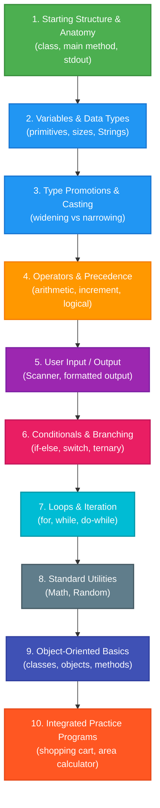
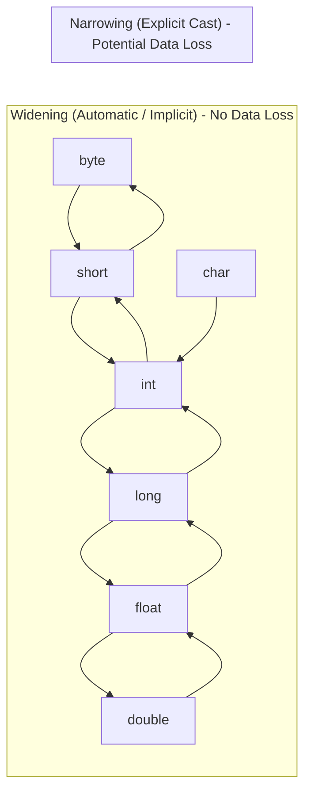

# ☕ Java Mastery & Core Fundamentals — Complete Revision Guide

[](https://www.oracle.com/java/)
[](https://github.com/)
[](https://github.com/)
[-orange?style=for-the-badge)](https://github.com/)
[](LICENSE)

> A structured, hands-on repository containing focused Java examples, core concept explanations, mental models, common pitfalls, and practical mini-projects designed for rapid revision, exam prep, and technical interview readiness.

---

## 📑 Table of Contents

- [🎯 Overview & Objectives](#-overview--objectives)
- [🗺️ Visual Learning Roadmap](#️-visual-learning-roadmap)
- [⚡ Quick Start & Execution Guide](#-quick-start--execution-guide)
  - [Prerequisites](#prerequisites)
  - [Compiling & Running via CLI](#compiling--running-via-cli)
  - [Running via IDE](#running-via-ide)
- [📂 Repository Structure & Code Map](#-repository-structure--code-map)
- [🧠 Core Java Concepts & Mental Models](#-core-java-concepts--mental-models)
  - [1. Program Anatomy & `main` Method](#1-program-anatomy--main-method)
  - [2. Data Types & Memory Sizes](#2-data-types--memory-sizes)
  - [3. Type Conversions & Promotion Rules](#3-type-conversions--promotion-rules)
  - [4. Operators & Precedence (PEMDAS / BODMAS)](#4-operators--precedence-pemdas--bodmas)
  - [5. Prefix vs. Postfix Increment (`++i` vs `i++`)](#5-prefix-vs-postfix-increment-i-vs-i)
  - [6. Control Flow & Decision Making](#6-control-flow--decision-making)
  - [7. Looping Constructs & Execution Flow](#7-looping-constructs--execution-flow)
  - [8. User Input & The Scanner Gotcha](#8-user-input--the-scanner-gotcha)
  - [9. Math & Random Utilities](#9-math--random-utilities)
  - [10. OOP Kickstart: Classes & Methods](#10-oop-kickstart-classes--methods)
- [🛠️ Practice Mini-Projects](#️-practice-mini-projects)
- [⚠️ Common Pitfalls & Traps (Interview FAQ)](#️-common-pitfalls--traps-interview-faq)
- [⏱️ 10-Minute Rapid Revision Checklist](#️-10-minute-rapid-revision-checklist)
- [🚀 Future Roadmap](#-future-roadmap)
- [🤝 Contributing & License](#-contributing--license)

---

## 🎯 Overview & Objectives

Learning Java requires building a rock-solid mental model of:
1. How source code compiles into **bytecode** (`.class`) and runs on the **JVM** (Java Virtual Machine).
2. How memory is allocated for **primitives** vs **reference objects**.
3. How type promotions, operator precedence, and conditional branches execute deterministically.

This repository breaks down Java syntax and semantics into **atomic, single-concept files** with clear real-world examples and interactive practice programs.

---

## 🗺️ Visual Learning Roadmap

Follow this recommended progression to master foundational Java:



---

## ⚡ Quick Start & Execution Guide

### Prerequisites

Ensure you have a Java Development Kit (JDK 17 or newer recommended) installed:

```bash
# Check compiler and runtime version
javac -version
java -version
```

---

### Compiling & Running via CLI

From the project root directory, use `javac` with the `-d` (destination directory) flag to properly preserve package hierarchies in the `out/` folder:

#### 1. Compile All Files at Once:
```bash
# Compile entire source tree to out/
javac -d out $(find src -name "*.java")
```

#### 2. Run Any Specific Example:

```bash
# Run Basics: Starting Structure (Default package)
java -cp out startingstructure

# Run Variables
java -cp out variables.variables

# Run Operators (Increment / Decrement)
java -cp out operators.increment

# Run Conditionals (Switch Statement)
java -cp out conditional_statements.switch_operator

# Run Loops (Do-While Loop)
java -cp out Loops.Do_while_loop

# Run Type Promotion
java -cp out type_conversions.Typepromotions

# Run Object-Oriented Classes
java -cp out classes

# Run Practice Program: Shopping Cart (Interactive)
java -cp out practice_programs.shoppingcart
```

---

### Running via IDE

- **IntelliJ IDEA** (Recommended):
  1. Open the project folder (`File` → `Open...` → select `Java course`).
  2. Mark `src` as the **Sources Root** (Right-click `src` → `Mark Directory as` → `Sources Root`).
  3. Click the green **▶ Run** button beside the `main` method of any file.

- **VS Code**:
  1. Install the **Extension Pack for Java** by Microsoft.
  2. Open any `.java` file and click **Run | Debug** above `public static void main`.

---

## 📂 Repository Structure & Code Map

Here is the complete mapping of every file in the repository, organized by topic:

| Module / Topic | File Path | Key Concepts Covered | Quick Run Command |
| :--- | :--- | :--- | :--- |
| **Basics** | [`src/basics/startingstructure.java`](file:///Users/honeyreddy/Documents/Java%20course/src/basics/startingstructure.java) | Class declaration, `main()` signature, `System.out.println` | `java -cp out startingstructure` |
| **Basics** | [`src/basics/OrderDemo.java`](file:///Users/honeyreddy/Documents/Java%20course/src/basics/OrderDemo.java) | Operator precedence, BODMAS/PEMDAS execution order | `java -cp out OrderDemo` |
| **Basics** | [`src/basics/scanner.java`](file:///Users/honeyreddy/Documents/Java%20course/src/basics/scanner.java) | Basic `Scanner` initialization and reading input | `java -cp out scanner` |
| **Variables** | [`src/variables/variables.java`](file:///Users/honeyreddy/Documents/Java%20course/src/variables/variables.java) | `int`, `double`, `Boolean`, `String`, concatenation | `java -cp out variables.variables` |
| **Type Conversions** | [`src/type_conversions/Typepromotions.java`](file:///Users/honeyreddy/Documents/Java%20course/src/type_conversions/Typepromotions.java) | Byte multiplication promotion to `int` in expressions | `java -cp out type_conversions.Typepromotions` |
| **Type Conversions** | [`src/type_conversions/byteconversion.java`](file:///Users/honeyreddy/Documents/Java%20course/src/type_conversions/byteconversion.java) | Explicit narrowing casting and integer overflow | `java -cp out type_conversions.byteconversion` |
| **Type Conversions** | [`src/type_conversions/Floatconversion.java`](file:///Users/honeyreddy/Documents/Java%20course/src/type_conversions/Floatconversion.java) | Floating point representations and type conversion | `java -cp out type_conversions.Floatconversion` |
| **Operators** | [`src/Operators/arithmeticoperator.java`](file:///Users/honeyreddy/Documents/Java%20course/src/Operators/arithmeticoperator.java) | Basic math operators (`+`, `-`, `*`, `/`, `%`) | `java -cp out operators.arithmeticoperator` |
| **Operators** | [`src/Operators/increment.java`](file:///Users/honeyreddy/Documents/Java%20course/src/Operators/increment.java) | Increment `++` and decrement `--` behavior | `java -cp out operators.increment` |
| **Operators** | [`src/Operators/augmentedassigment.java`](file:///Users/honeyreddy/Documents/Java%20course/src/Operators/augmentedassigment.java) | Compound assignments (`+=`, `-=`, `*=`, `/=`) | `java -cp out operators.augmentedassigment` |
| **Operators** | [`src/Operators/Relationaloperator.java`](file:///Users/honeyreddy/Documents/Java%20course/src/Operators/Relationaloperator.java) | Comparison operators (`==`, `!=`, `<`, `>`, `<=`, `>=`) | `java -cp out operators.Relationaloperator` |
| **Operators** | [`src/Operators/logicaloperator.java`](file:///Users/honeyreddy/Documents/Java%20course/src/Operators/logicaloperator.java) | Logical AND (`&&`), OR (`\|\|`), NOT (`!`) | `java -cp out operators.logicaloperator` |
| **Conditionals** | [`src/conditional_statements/ifstatement.java`](file:///Users/honeyreddy/Documents/Java%20course/src/conditional_statements/ifstatement.java) | Simple `if` branch evaluation | `java -cp out conditional_statements.ifstatement` |
| **Conditionals** | [`src/conditional_statements/ifelse_statement.java`](file:///Users/honeyreddy/Documents/Java%20course/src/conditional_statements/ifelse_statement.java) | Two-way decision branching (`if-else`) | `java -cp out conditional_statements.ifelse_statement` |
| **Conditionals** | [`src/conditional_statements/if_else_if.java`](file:///Users/honeyreddy/Documents/Java%20course/src/conditional_statements/if_else_if.java) | Multi-way ladder (`if-else-if-else`) | `java -cp out conditional_statements.if_else_if` |
| **Conditionals** | [`src/conditional_statements/Ternary_operator.java`](file:///Users/honeyreddy/Documents/Java%20course/src/conditional_statements/Ternary_operator.java) | Inline conditional expression `condition ? val1 : val2` | `java -cp out conditional_statements.Ternary_operator` |
| **Conditionals** | [`src/conditional_statements/switch_operator.java`](file:///Users/honeyreddy/Documents/Java%20course/src/conditional_statements/switch_operator.java) | `switch` statement with cases, `break`, and `default` | `java -cp out conditional_statements.switch_operator` |
| **Loops** | [`src/Loops/For_loop.java`](file:///Users/honeyreddy/Documents/Java%20course/src/Loops/For_loop.java) | Standard counting loop `for(init; cond; update)` | `java -cp out Loops.For_loop` |
| **Loops** | [`src/Loops/while_loop.java`](file:///Users/honeyreddy/Documents/Java%20course/src/Loops/while_loop.java) | Pre-condition iteration loop | `java -cp out Loops.while_loop` |
| **Loops** | [`src/Loops/Do_while_loop.java`](file:///Users/honeyreddy/Documents/Java%20course/src/Loops/Do_while_loop.java) | Post-condition loop (guaranteed at least 1 run) | `java -cp out Loops.Do_while_loop` |
| **Input / Output** | [`src/input_output/ScannerInput.java`](file:///Users/honeyreddy/Documents/Java%20course/src/input_output/ScannerInput.java) | Multi-type terminal input (`nextLine`, `nextInt`, `nextDouble`) | `java -cp out input_output.ScannerInput` |
| **Math & Random** | [`src/math_and_random/math.java`](file:///Users/honeyreddy/Documents/Java%20course/src/math_and_random/math.java) | Constants `Math.PI`, `Math.E`, and mathematical functions | `java -cp out math_and_random.math` |
| **Math & Random** | [`src/math_and_random/randomnumbers.java`](file:///Users/honeyreddy/Documents/Java%20course/src/math_and_random/randomnumbers.java) | `java.util.Random`, bounded integers `nextInt(min, max)` | `java -cp out randomnumbers` |
| **OOP & Classes** | [`src/classes.java`](file:///Users/honeyreddy/Documents/Java%20course/src/classes.java) | Class blueprints, instantiation (`new`), method calling | `java -cp out classes` |
| **Practice** | [`src/practice_programs/shoppingcart.java`](file:///Users/honeyreddy/Documents/Java%20course/src/practice_programs/shoppingcart.java) | Interactive cart calculation with currency formatting | `java -cp out practice_programs.shoppingcart` |
| **Practice** | [`src/practice_programs/calculaterectangle.java`](file:///Users/honeyreddy/Documents/Java%20course/src/practice_programs/calculaterectangle.java) | Rectangle area geometry computation with user input | `java -cp out practice_programs.calculaterectangle` |
| **Practice** | [`src/practice_programs/for_loop.java`](file:///Users/honeyreddy/Documents/Java%20course/src/practice_programs/for_loop.java) | Loop-based algorithms and accumulation | `java -cp out practice_programs.for_loop` |

---

## 🧠 Core Java Concepts & Mental Models

### 1. Program Anatomy & `main` Method

Every standalone executable Java program starts with a class and the entry-point method:

```java
public class StartingStructure {
    public static void main(String[] args) {
        System.out.println("Hello, World!");
    }
}
```

#### Breakdown of the `main` signature:
- **`public`**: Access modifier making the method callable by the JVM from anywhere.
- **`static`**: Allows the JVM to invoke the method without instantiating an object of the class.
- **`void`**: Return type indicating the method does not return any value.
- **`main`**: The exact method identifier searched for by the JVM runtime launcher.
- **`String[] args`**: Array of command-line arguments passed to the application at launch.

---

### 2. Data Types & Memory Sizes

Java is a **statically-typed** and **strongly-typed** language.

| Type | Category | Size | Default Value | Example Value Range |
| :--- | :--- | :--- | :--- | :--- |
| `byte` | Primitive (Integer) | 8 bits (1 byte) | `0` | `-128` to `127` |
| `short` | Primitive (Integer) | 16 bits (2 bytes) | `0` | `-32,768` to `32,767` |
| `int` | Primitive (Integer) | 32 bits (4 bytes) | `0` | `-2^31` to `2^31 - 1` |
| `long` | Primitive (Integer) | 64 bits (8 bytes) | `0L` | `-2^63` to `2^63 - 1` (suffix `L`) |
| `float` | Primitive (Floating) | 32 bits (4 bytes) | `0.0f` | ~`1.4e-45` to `3.4e+38` (suffix `f`) |
| `double` | Primitive (Floating) | 64 bits (8 bytes) | `0.0d` | ~`4.9e-324` to `1.7e+308` |
| `char` | Primitive (Unicode) | 16 bits (2 bytes) | `'\u0000'` | `'A'`, `'₹'`, `'\u0041'` |
| `boolean` | Primitive (Logical) | 1 bit (JVM dependent) | `false` | `true` or `false` |
| `String` | **Reference Type** | Object reference + heap | `null` | `"Hello"`, `"Java"` |

---

### 3. Type Conversions & Promotion Rules

Java supports two types of conversions:



#### The Arithmetic Promotion Rule:
When evaluating arithmetic expressions containing types smaller than `int` (`byte`, `short`, `char`), Java **automatically promotes them to `int`**:

```java
byte a = 10;
byte b = 30;

// ❌ Compilation Error: Type mismatch: cannot convert from int to byte
// byte c = a * b; 

// ✅ Correct (store in int):
int result = a * b; 

// ✅ Correct (explicit cast back to byte):
byte c = (byte)(a * b);
```

---

### 4. Operators & Precedence (PEMDAS / BODMAS)

In arithmetic expressions, Java evaluates operations according to strict precedence rules:
1. **P**arentheses `()`
2. **E**xponents / Postfix & Prefix (`++`, `--`)
3. **M**ultiplication `*`, **D**ivision `/`, **M**odulo `%` (Left-to-Right)
4. **A**ddition `+`, **S**ubtraction `-` (Left-to-Right)

```java
// Expression evaluation trace:
double result = 10 + 3 * 2 / (8 - 3);
// 1. (8 - 3) = 5
// 2. 3 * 2 = 6
// 3. 6 / 5 = 1  (Integer division!)
// 4. 10 + 1 = 11.0
System.out.println(result); // Outputs: 11.0
```

> [!NOTE]
> Integer division truncates the decimal portion! `6 / 5` produces `1`, not `1.2`. To preserve decimals, ensure at least one operand is a `double`: `6.0 / 5` produces `1.2`.

---

### 5. Prefix vs. Postfix Increment (`++i` vs `i++`)

Understanding increment behavior is a favorite interview topic:

```java
int a = 5;
int b = 5;

int post = a++; // 1. Assigns current value of 'a' (5) to 'post'
                // 2. Increments 'a' to 6
                // Result: post = 5, a = 6

int pre = ++b;  // 1. Increments 'b' to 6
                // 2. Assigns new value of 'b' (6) to 'pre'
                // Result: pre = 6, b = 6
```

---

### 6. Control Flow & Decision Making

Java provides three primary decision constructs:

#### A. `if` / `else if` / `else` Ladder
```java
int score = 85;
if (score >= 90) {
    System.out.println("Grade: A");
} else if (score >= 80) {
    System.out.println("Grade: B");
} else {
    System.out.println("Grade: C");
}
```

#### B. Ternary Operator (`? :`)
A compact shorthand for simple two-way assignments:
```java
int age = 18;
String status = (age >= 18) ? "Adult" : "Minor";
```

#### C. `switch` Statement
Ideal for discrete value matching (`int`, `char`, `String`, `enum`):
```java
int dayNumber = 3;
switch (dayNumber) {
    case 1 -> System.out.println("Monday");
    case 2 -> System.out.println("Tuesday");
    case 3 -> System.out.println("Wednesday");
    default -> System.out.println("Invalid day");
}
```

---

### 7. Looping Constructs & Execution Flow

| Loop Type | Check Timing | Minimum Runs | Best Used When |
| :--- | :--- | :--- | :--- |
| `for` loop | Pre-check | 0 | Number of iterations is known in advance |
| `while` loop | Pre-check | 0 | Iterating until a boolean condition turns false |
| `do-while` loop | **Post-check** | **1** | Body must execute at least once (e.g. menus) |

```java
// do-while executes even if condition is initially false:
int i = 6;
do {
    System.out.println(i); // Prints 6
    i++;
} while (i <= 5);
```

---

### 8. User Input & The Scanner Gotcha

When reading user input using `java.util.Scanner`, mixing number readers with `nextLine()` can lead to unexpected skips:

```java
Scanner scanner = new Scanner(System.in);

System.out.print("Enter your age: ");
int age = scanner.nextInt(); 
// ⚠️ Trap: nextInt() consumes the integer but leaves the '\n' (Enter) in buffer!

// If you immediately call nextLine(), it will consume the leftover newline!
// scanner.nextLine(); // 💡 Solution: Consume leftover newline buffer

System.out.print("Enter your full name: ");
String name = scanner.nextLine();

scanner.close();
```

---

### 9. Math & Random Utilities

The standard library offers built-in tools for calculations and pseudo-random numbers:

```java
// Math Constants & Methods
double pi = Math.PI;
double root = Math.sqrt(64.0);     // 8.0
double power = Math.pow(2, 5);     // 32.0
int max = Math.max(15, 42);        // 42

// Generating Bounded Random Integers (Java 17+)
Random random = new Random();
int diceRoll = random.nextInt(1, 7); // Generates 1 to 6 inclusive
```

---

### 10. OOP Kickstart: Classes & Methods

Java is an object-oriented language where **classes** act as blueprints and **objects** are runtime instances:

```java
// Blueprint Class
class Calculator {
    // Method with parameters and a return value
    public double add(double n1, double n2) {
        return n1 + n2;
    }
}

// Driver Class
public class Classes {
    public static void main(String[] args) {
        // Instantiate an object using 'new'
        Calculator cal = new Calculator();
        
        // Invoke method on object
        double sum = cal.add(10.5, 20.25);
        System.out.println("Result: " + sum); // 30.75
    }
}
```

---

## 🛠️ Practice Mini-Projects

This repository includes real-world mini-applications combining multiple concepts:

### 1. Interactive Shopping Cart (`shoppingcart.java`)
- **Concepts**: `Scanner`, `float`, `char` (currency symbol `₹`), arithmetic calculation, string formatting.
- **Workflow**: Prompts for item name, price per unit, and quantity; calculates and outputs the final bill.

### 2. Geometry Area Calculator (`calculaterectangle.java`)
- **Concepts**: `Scanner`, `double` precision, formula application ($Area = width \times height$).
- **Workflow**: Reads dimensions from standard input and displays computed area with units.

---

## ⚠️ Common Pitfalls & Traps (Interview FAQ)

> [!WARNING]
> ### 1. String Equality: `==` vs `.equals()`
> - `==` tests **reference identity** (whether both point to the exact same memory address).
> - `.equals()` tests **value equality** (whether characters inside the strings match).
> ```java
> String s1 = new String("Java");
> String s2 = new String("Java");
> System.out.println(s1 == s2);      // false (different objects in heap)
> System.out.println(s1.equals(s2));  // true  (same character content)
> ```

> [!NOTE]
> ### 2. Integer Overflow
> Primitives wrap around on overflow:
> ```java
> byte b = 127;
> b++; 
> System.out.println(b); // -128 (wrapped around!)
> ```

> [!TIP]
> ### 3. Floating Point Inexactness
> Avoid using `float` or `double` for high-precision financial computations. Use `java.math.BigDecimal` instead.

---

## ⏱️ 10-Minute Rapid Revision Checklist

Before your test or interview, quickly review these 6 core anchors:

- [ ] **Class Structure**: [`src/basics/startingstructure.java`](file:///Users/honeyreddy/Documents/Java%20course/src/basics/startingstructure.java)
- [ ] **Variable Declarations**: [`src/variables/variables.java`](file:///Users/honeyreddy/Documents/Java%20course/src/variables/variables.java)
- [ ] **Increment & Precedence**: [`src/Operators/increment.java`](file:///Users/honeyreddy/Documents/Java%20course/src/Operators/increment.java) & [`src/basics/OrderDemo.java`](file:///Users/honeyreddy/Documents/Java%20course/src/basics/OrderDemo.java)
- [ ] **Type Promotion Rules**: [`src/type_conversions/Typepromotions.java`](file:///Users/honeyreddy/Documents/Java%20course/src/type_conversions/Typepromotions.java)
- [ ] **Branching Logic**: [`src/conditional_statements/switch_operator.java`](file:///Users/honeyreddy/Documents/Java%20course/src/conditional_statements/switch_operator.java)
- [ ] **Loop Guarantees**: [`src/Loops/Do_while_loop.java`](file:///Users/honeyreddy/Documents/Java%20course/src/Loops/Do_while_loop.java)

---

## 🚀 Future Roadmap

- [ ] **OOP Deep Dive**: Inheritance, Polymorphism, Abstract Classes & Interfaces.
- [ ] **Arrays & Collections**: `ArrayList`, `HashMap`, `HashSet`, and Iterators.
- [ ] **Exception Handling**: `try-catch-finally`, custom exceptions, `throws`.
- [ ] **String Manipulation**: `StringBuilder`, `StringBuffer`, regex pattern matching.
- [ ] **Java 8+ Modern Features**: Lambdas, Streams API, `Optional`, Records.

---

## 🤝 Contributing & License

### How to Contribute
1. Fork the repository.
2. Create a feature branch (`git checkout -b feature/new-example`).
3. Commit your changes with clear messages (`git commit -m "Add Exception handling example"`).
4. Push to the branch (`git push origin feature/new-example`).
5. Open a Pull Request.

### License
This project is open source and available under the [MIT License](LICENSE).
