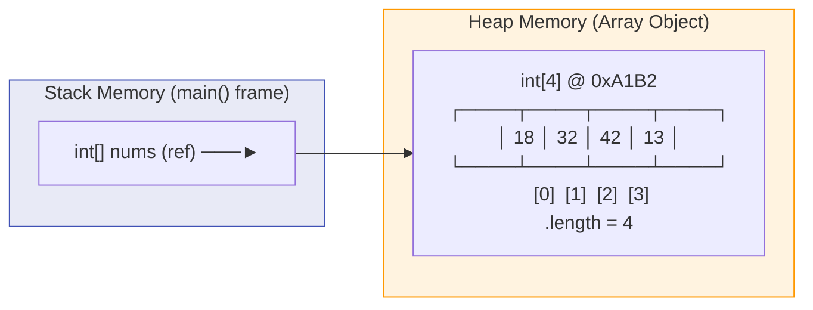
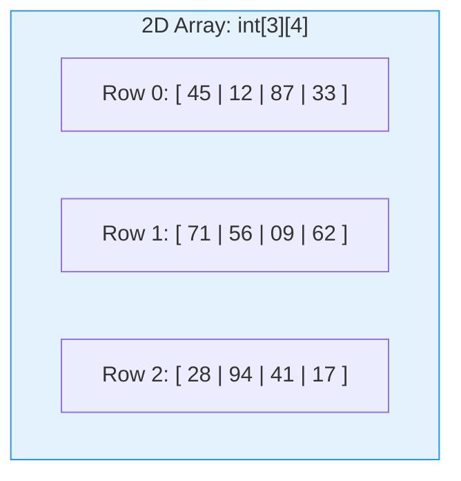
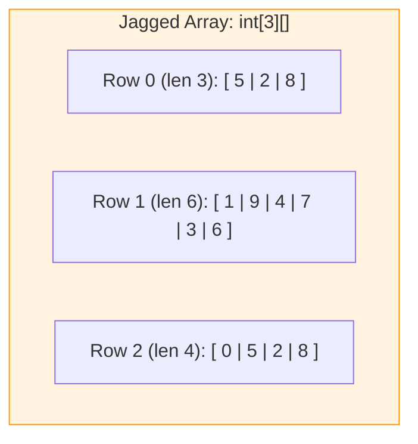
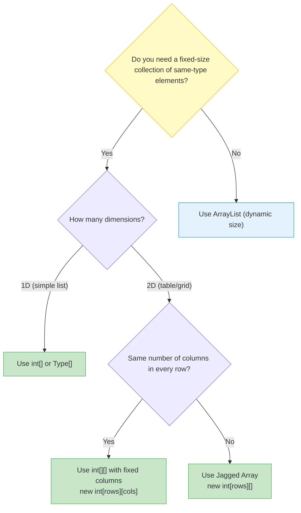

# 📊 Module 11: Arrays & Data Collections

> **Mastering Fixed-Size Data Structures in Java.** Learn how to store, access, and traverse collections of elements using single-dimensional, multi-dimensional, and jagged arrays.

---

## 📑 Table of Contents
1. [What You'll Learn](#1-what-youll-learn)
2. [Core Concept: What is an Array?](#2-core-concept-what-is-an-array)
3. [Real-World Analogy](#3-real-world-analogy)
4. [Array Declaration & Initialization](#4-array-declaration--initialization)
5. [Memory Layout: Arrays on the Heap](#5-memory-layout-arrays-on-the-heap)
6. [Traversing Arrays: Standard vs Enhanced For Loop](#6-traversing-arrays-standard-vs-enhanced-for-loop)
7. [Multi-Dimensional Arrays (2D Grids)](#7-multi-dimensional-arrays-2d-grids)
8. [Jagged Arrays (Irregular Rows)](#8-jagged-arrays-irregular-rows)
9. [Array Selection Decision Tree](#9-array-selection-decision-tree)
10. [Line-by-Line File Guides](#10-line-by-line-file-guides)
11. [Common Pitfalls & Traps](#11-common-pitfalls--traps)

---

## 1. What You'll Learn

After completing this module, you will be able to:

- [ ] Declare and initialize arrays using both literal syntax and `new` keyword
- [ ] Access and modify elements using zero-based indexing
- [ ] Traverse arrays with standard `for` loops and enhanced `for-each` loops
- [ ] Create and populate 2D (multi-dimensional) arrays for grid/matrix data
- [ ] Build jagged arrays where each row has a different number of columns
- [ ] Avoid `ArrayIndexOutOfBoundsException` and other common array errors

---

## 2. Core Concept: What is an Array?

An **array** is a fixed-size, ordered container that stores multiple values of the **same data type** under a single variable name. Each value is stored at a numbered position called an **index**, starting from `0`.

```java
// Syntax: <DataType>[] <name> = { element0, element1, element2, ... };
int[] scores = { 85, 92, 78, 95, 88 };
//   Index:       0    1    2    3    4

System.out.println(scores[0]); // 85 (first element)
System.out.println(scores[4]); // 88 (last element)
System.out.println(scores.length); // 5 (total number of elements)
```

### Key Properties:
| Property | Detail |
| :--- | :--- |
| **Fixed Size** | Once created, the length cannot change. Use `ArrayList` for dynamic sizing. |
| **Zero-Indexed** | First element is at index `0`, last at index `length - 1`. |
| **Homogeneous** | All elements must be the same type (`int[]`, `String[]`, etc.). |
| **Reference Type** | The array variable on the Stack stores a pointer to the actual data on the Heap. |

---

## 3. Real-World Analogy

Think of an array like a **row of numbered lockers in a school**:

```
🔢 Locker Numbers (Index):  [0]     [1]     [2]     [3]     [4]
📦 Contents (Values):        85      92      78      95      88
```

- The **locker row** is the array itself.
- Each **locker number** is the index.
- The **contents inside** each locker is the stored value.
- You can **directly open any locker** by its number (random access — instant, no searching required).
- The **total number of lockers** is fixed when the row is built (`scores.length`).

---

## 4. Array Declaration & Initialization

Java supports two ways to create arrays:

### Method 1: Inline Literal Initialization (when you know values at compile time)
```java
int[] nums = { 1, 2, 3, 4, 5, 7 };
// Array is created with 6 elements, sized and filled immediately
```

### Method 2: `new` Keyword with Manual Assignment (when values come later)
```java
int[] nums = new int[4];  // Creates array of 4 zeros: [0, 0, 0, 0]
nums[0] = 18;             // [18, 0, 0, 0]
nums[1] = 32;             // [18, 32, 0, 0]
nums[2] = 42;             // [18, 32, 42, 0]
nums[3] = 13;             // [18, 32, 42, 13]
```

> [!NOTE]
> When you create an array with `new int[4]`, Java automatically initializes every slot to the type's **default value**: `0` for `int`, `0.0` for `double`, `false` for `boolean`, and `null` for objects.

---

## 5. Memory Layout: Arrays on the Heap

Arrays are **reference types** in Java. The variable on the Stack holds a pointer to the actual array object allocated on the Heap.



### What happens with two references?
```java
int[] a = { 10, 20, 30 };
int[] b = a;     // b now points to the SAME array object!
b[0] = 999;
System.out.println(a[0]); // 999! (both variables share the same Heap object)
```

---

## 6. Traversing Arrays: Standard vs Enhanced For Loop

### Standard `for` Loop (gives you the index):
```java
int[] nums = { 18, 32, 42, 13 };
for (int i = 0; i < nums.length; i++) {
    System.out.println("Index " + i + ": " + nums[i]);
}
```
**Output:**
```
Index 0: 18
Index 1: 32
Index 2: 42
Index 3: 13
```

### Enhanced `for-each` Loop (simpler syntax, no index):
```java
for (int value : nums) {
    System.out.println(value);
}
```
**Output:**
```
18
32
42
13
```

### When to Use Which?

| Feature | Standard `for` | Enhanced `for-each` |
| :--- | :--- | :--- |
| **Access to index** | ✅ Yes (`i` is available) | ❌ No |
| **Modify elements** | ✅ Yes (`nums[i] = newVal`) | ❌ No (read-only copy) |
| **Simpler syntax** | ❌ More verbose | ✅ Cleaner |
| **Best for** | Index-dependent operations, modifications | Simple read-only traversal |

---

## 7. Multi-Dimensional Arrays (2D Grids)

A 2D array is an **array of arrays** — think of it as a table with rows and columns.

```java
int[][] matrix = new int[3][4]; // 3 rows, 4 columns

// Fill with random values using nested loops
for (int i = 0; i < 3; i++) {
    for (int j = 0; j < 4; j++) {
        matrix[i][j] = (int)(Math.random() * 100);
    }
}
```



### Traversing with Enhanced For-Each:
```java
for (int[] row : matrix) {       // Each 'row' is a 1D array
    for (int value : row) {       // Each 'value' is an int
        System.out.print(value + " ");
    }
    System.out.println();
}
```

---

## 8. Jagged Arrays (Irregular Rows)

A jagged array is a 2D array where **each row can have a different number of columns**:

```java
int[][] nums = new int[3][];     // 3 rows, columns NOT yet defined
nums[0] = new int[3];            // Row 0 has 3 columns
nums[1] = new int[6];            // Row 1 has 6 columns
nums[2] = new int[4];            // Row 2 has 4 columns
```



### Safe Traversal with `.length`:
```java
for (int i = 0; i < nums.length; i++) {          // nums.length = 3 (rows)
    for (int j = 0; j < nums[i].length; j++) {   // nums[i].length varies per row!
        System.out.print(nums[i][j] + " ");
    }
    System.out.println();
}
```

> [!IMPORTANT]
> Always use `nums[i].length` (not a hardcoded column count) when iterating jagged arrays. Each row has its own independent length.

---

## 9. Array Selection Decision Tree



---

## 10. Line-by-Line File Guides

| File | Concepts Covered | Expected Output | Command to Run |
| :--- | :--- | :--- | :--- |
| [`demo_array.java`](file:///Users/honeyreddy/Documents/Java%20course/src/Arrays/demo_array.java) | Inline array initialization, index-based access (`nums[3]`) | `4` | `java -cp out Arrays.demo_array` |
| [`array_of_elments.java`](file:///Users/honeyreddy/Documents/Java%20course/src/Arrays/array_of_elments.java) | `new int[4]` allocation, manual element assignment, `for` loop traversal | `18`<br>`32`<br>`42`<br>`13` | `java -cp out Arrays.array_of_elments` |
| [`multi_dimensional_array.java`](file:///Users/honeyreddy/Documents/Java%20course/src/Arrays/multi_dimensional_array.java) | 2D `int[3][4]` grid, `Math.random()` fill, enhanced for-each & standard nested loops | 3×4 grid of random numbers (0–99) | `java -cp out Arrays.multi_dimensional_array` |
| [`jagged_array.java`](file:///Users/honeyreddy/Documents/Java%20course/src/Arrays/jagged_array.java) | Jagged `int[3][]` with varying row sizes (3, 6, 4), `.length` for safe bounds | 3 rows of random digits with different lengths | `java -cp out Arrays.jagged_array` |

### Dry-Run Trace: `demo_array.java`

```java
int nums[] = {1, 2, 3, 4, 5, 7};
System.out.println(nums[3]);
```

| Step | Action | Array State | Output |
| :--- | :--- | :--- | :--- |
| 1 | Create array with 6 elements | `[1, 2, 3, 4, 5, 7]` | — |
| 2 | Access index `3` | Element at `[3]` = `4` | `4` |

### Dry-Run Trace: `array_of_elments.java`

| Iteration `i` | Condition `i < 4` | `nums[i]` | Output |
| :--- | :--- | :--- | :--- |
| 0 | `true` | `18` | `18` |
| 1 | `true` | `32` | `32` |
| 2 | `true` | `42` | `42` |
| 3 | `true` | `13` | `13` |
| 4 | `false` | — | (Loop exits) |

---

## 11. Common Pitfalls & Traps

> [!CAUTION]
> ### 1. `ArrayIndexOutOfBoundsException`
> Accessing an index ≥ `array.length` or < `0` throws a runtime exception:
> ```java
> int[] nums = { 10, 20, 30 };
> System.out.println(nums[3]); // 💥 Exception! Valid indices are 0, 1, 2
> System.out.println(nums[-1]); // 💥 Exception! No negative indices in Java
> ```

> [!WARNING]
> ### 2. Array Length is `.length` (a field), NOT `.length()` (a method)
> ```java
> int[] nums = { 1, 2, 3 };
> nums.length    // ✅ Correct (no parentheses — it's a field)
> nums.length()  // ❌ Compile error! Arrays don't have a length() method
>
> String s = "hello";
> s.length()     // ✅ Correct for Strings (it IS a method)
> ```

> [!WARNING]
> ### 3. Modifying Through a For-Each Variable Doesn't Affect the Array
> ```java
> int[] nums = { 1, 2, 3 };
> for (int val : nums) {
>     val = val * 10; // Only modifies the LOCAL copy, not the array!
> }
> // nums is still { 1, 2, 3 } — unchanged!
> ```
