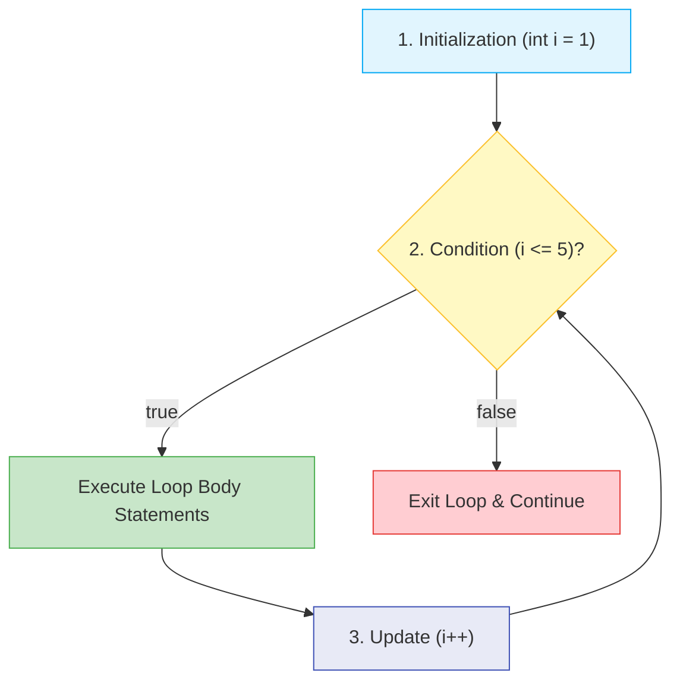
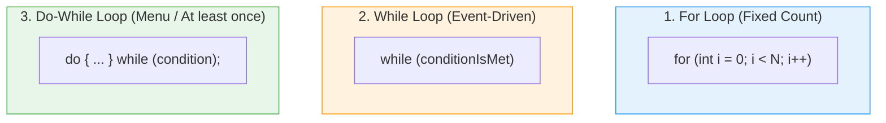
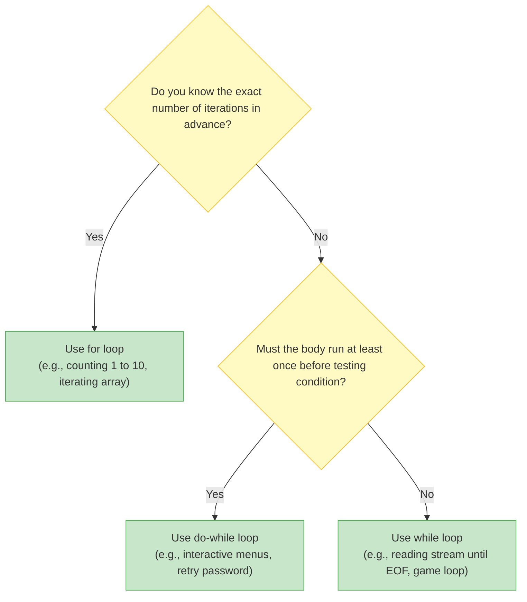

# 🔁 Module 07: Loops & Iteration

> **Mastering Iteration, Repetition & Loop Traversal in Java.** Learn how to automate repetitive tasks deterministically and efficiently using `for`, `while`, and `do-while` loops, plus loop control with `break` and `continue`.

---

## 📑 Table of Contents
1. [What You'll Learn](#1-what-youll-learn)
2. [Keywords & Definitions Glossary](#2-keywords--definitions-glossary)
3. [How I Code & What is the Use (Mental Model)](#3-how-i-code--what-is-the-use-mental-model)
4. [Core Concept: The Three Loop Types](#4-core-concept-the-three-loop-types)
5. [Visual Loop Decision Flowchart](#5-visual-loop-decision-flowchart)
6. [Loop Comparison & Guarantees](#6-loop-comparison--guarantees)
7. [Nested Loops & Matrix / Grid Traversal](#7-nested-loops--matrix--grid-traversal)
8. [Loop Control: `break` vs `continue`](#8-loop-control-break-vs-continue)
9. [Line-by-Line File Guides](#9-line-by-line-file-guides)
10. [Dry-Run & Tracing Exercises](#10-dry-run--tracing-exercises)
11. [Common Pitfalls & Infinite Loops](#11-common-pitfalls--infinite-loops)

---

## 1. What You'll Learn

After completing this module, you will be able to:

- [ ] Write counting loops with `for (init; condition; update)`
- [ ] Write condition-driven loops with `while (condition)`
- [ ] Write post-condition loops guaranteed to run at least once with `do { ... } while (cond);`
- [ ] Nest loops for multi-dimensional grid and timetable traversal
- [ ] Interrupt or skip iterations using `break` and `continue`
- [ ] Detect and eliminate infinite loops and off-by-one errors

---

## 2. Keywords & Definitions Glossary

| Keyword | Category | Definition & Meaning | Code Syntax Example |
| :--- | :--- | :--- | :--- |
| `for` | Keyword | Entry-controlled loop with built-in counter initialization, condition, and step increment. | `for (int i = 0; i < 5; i++)` |
| `while` | Keyword | Entry-controlled loop running repeatedly as long as condition remains `true`. | `while (count < 10)` |
| `do` | Keyword | Precedes the loop body in a `do-while` construct; executes body first before condition check. | `do { ... } while (x > 0);` |
| `break` | Keyword | Forcefully jumps completely out of the innermost enclosing loop or switch. | `if (i == 5) break;` |
| `continue` | Keyword | Skips the remainder of the current iteration and jumps directly to the next cycle. | `if (i % 2 == 0) continue;` |

---

## 3. How I Code & What is the Use (Mental Model)

### What is the Use?
Without loops, doing something 1,000 times would require 1,000 lines of code. Loops allow you to execute a block of code $N$ times or until a specific event happens (like user typing "exit").

### The 3 Core Components of Every Loop:
Every loop requires three things to work properly:
1. **Initialization**: Where do we start? (`int i = 0;`)
2. **Condition**: When do we keep going? (`i < 10;`)
3. **Update / Increment**: How do we make progress toward the end? (`i++`)



---

## 4. Core Concept: The Three Loop Types



---

## 5. Visual Loop Decision Flowchart



---

## 6. Loop Comparison & Guarantees

| Feature | `for` Loop | `while` Loop | `do-while` Loop |
| :--- | :--- | :--- | :--- |
| **Check Timing** | Entry-controlled (Before body) | Entry-controlled (Before body) | **Exit-controlled (After body)** |
| **Minimum Iterations**| `0` | `0` | **`1` (Guaranteed!)** |
| **Variable Scope** | Local to loop if declared in header | Declared outside | Declared outside |
| **Trailing Semicolon**| No | No | **Yes: `while(...);`** |
| **Best Used When** | Known iterations, iterating arrays | Unknown count, event waiting | Interactive menus, input validation prompts |

---

## 7. Nested Loops & Matrix / Grid Traversal

When a loop is placed inside another loop:
- The **outer loop** advances once per full run of the inner loop.
- Total iterations = `OuterIterations × InnerIterations`.

```java
for (int day = 1; day <= 5; day++) {
    System.out.println("Day " + day);
    for (int hour = 9; hour <= 17; hour++) {
        System.out.println("  " + hour + ":00 - Active");
    }
}
```

---

## 8. Loop Control: `break` vs `continue`

| Statement | What it Does | Analogy |
| :--- | :--- | :--- |
| `break;` | **Terminates the entire loop immediately** and moves to the next statement outside the loop. | Emergency stop button on a treadmill. |
| `continue;` | **Skips the rest of the current iteration** and jumps directly to the next cycle. | Skipping a song in a playlist. |

```java
for (int i = 1; i <= 5; i++) {
    if (i == 3) continue; // Skips 3!
    if (i == 5) break;    // Stops before printing 5!
    System.out.print(i + " ");
}
// Output: 1 2 4
```

---

## 9. Line-by-Line File Guides

| File | Concepts Covered | Expected Console Output | Command to Run |
| :--- | :--- | :--- | :--- |
| [`For_loop.java`](file:///Users/honeyreddy/Documents/Java%20course/src/Loops/For_loop.java) | Standard `for(init; cond; update)` & nested task loops | Prints counting iterations and nested schedules | `java -cp out Loops.For_loop` |
| [`while_loop.java`](file:///Users/honeyreddy/Documents/Java%20course/src/Loops/while_loop.java) | Pre-condition loop, inner token generation, manual `i++` | Prints loop counts and nested inner statements | `java -cp out Loops.while_loop` |
| [`Do_while_loop.java`](file:///Users/honeyreddy/Documents/Java%20course/src/Loops/Do_while_loop.java) | Post-condition loop with guaranteed minimum 1 execution | Executes at least once even if condition starts false | `java -cp out Loops.Do_while_loop` |

---

## 10. Dry-Run & Tracing Exercises

### Trace `For_loop.java` (Counting 1 to 4)

| Step | `i` Value | Condition `i <= 4` | Action | Update (`i++`) | Next `i` |
| :--- | :--- | :--- | :--- | :--- | :--- |
| 1 | `1` | `true` | Print "Day 1" | `1 + 1` | `2` |
| 2 | `2` | `true` | Print "Day 2" | `2 + 1` | `3` |
| 3 | `3` | `true` | Print "Day 3" | `3 + 1` | `4` |
| 4 | `4` | `true` | Print "Day 4" | `4 + 1` | `5` |
| 5 | `5` | `false` | **Exit loop** | — | — |

---

## 11. Common Pitfalls & Infinite Loops

> [!CAUTION]
> ### 1. Forgetting the Counter Increment in While Loops
> ```java
> int i = 1;
> while (i <= 5) {
>     System.out.println(i);
>     // Missing i++; -> i is ALWAYS 1, loop runs FOREVER!
> }
> ```

> [!WARNING]
> ### 2. The Accidental Semicolon Trap
> ```java
> for (int i = 0; i < 5; i++); // ⚠️ Semicolon terminates loop body!
> {
>     System.out.println("Hello"); // Runs ONLY ONCE after loop finishes!
> }
> ```

> [!TIP]
> ### 3. Off-by-One Errors
> - `i < 5` runs for `i = 0, 1, 2, 3, 4` (exactly **5 times**)
> - `i <= 5` starting at 0 runs for `i = 0, 1, 2, 3, 4, 5` (exactly **6 times**)
