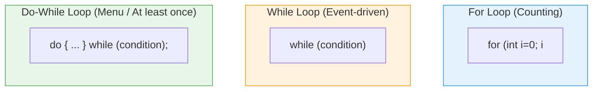
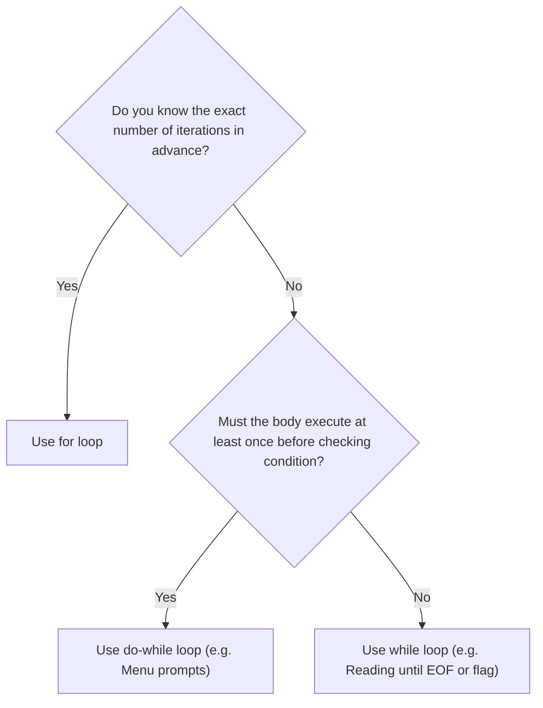

# 🔁 Module 07: Loops & Iteration

> **Mastering Iteration, Loop Traversal & Nested Loops in Java.** Learn how to repeat tasks deterministically and efficiently.

---

## 📑 Table of Contents
1. [Core Concept: The Three Loop Types](#1-core-concept-the-three-loop-types)
2. [Visual Loop Decision Flowchart](#2-visual-loop-decision-flowchart)
3. [Loop Comparison & Guarantees](#3-loop-comparison--guarantees)
4. [Nested Loops & Matrix / Grid Traversal](#4-nested-loops--matrix--grid-traversal)
5. [Line-by-Line File Guides](#5-line-by-line-file-guides)
6. [Common Pitfalls & Infinite Loops](#6-common-pitfalls--infinite-loops)

---

## 1. Core Concept: The Three Loop Types

Java provides three primary loop constructs:



---

## 2. Visual Loop Decision Flowchart



---

## 3. Loop Comparison & Guarantees

| Feature | `for` Loop | `while` Loop | `do-while` Loop |
| :--- | :--- | :--- | :--- |
| **Check Timing** | Entry-controlled (Before body) | Entry-controlled (Before body) | **Exit-controlled (After body)** |
| **Minimum Iterations**| `0` | `0` | **`1`** |
| **Variable Scope** | Local to loop if declared in `for` | Must be declared outside | Must be declared outside |
| **Trailing Semicolon**| No | No | **Yes: `while(...);`** |
| **Best Used When** | Iterating over ranges, arrays, counts | Waiting on conditions, game loops | Interactive menus, retry prompts |

---

## 4. Nested Loops & Matrix / Grid Traversal

When a loop is placed inside another loop:
- The **outer loop** advances once per full run of the inner loop.
- Total iterations = `OuterIterations × InnerIterations`.

```java
for (int row = 1; row <= 3; row++) {
    for (int col = 1; col <= 4; col++) {
        System.out.print("* ");
    }
    System.out.println();
}
// Outputs a 3x4 grid of stars!
```

---

## 5. Line-by-Line File Guides

| File | Concepts Covered | Command to Run |
| :--- | :--- | :--- |
| [`For_loop.java`](file:///Users/honeyreddy/Documents/Java%20course/src/Loops/For_loop.java) | Standard `for(init; cond; update)` & nested task loops | `java -cp out Loops.For_loop` |
| [`while_loop.java`](file:///Users/honeyreddy/Documents/Java%20course/src/Loops/while_loop.java) | Pre-condition loop, inner token generation, manual `i++` | `java -cp out Loops.while_loop` |
| [`Do_while_loop.java`](file:///Users/honeyreddy/Documents/Java%20course/src/Loops/Do_while_loop.java) | Post-condition loop with guaranteed minimum 1 execution | `java -cp out Loops.Do_while_loop` |

---

## 6. Common Pitfalls & Infinite Loops

> [!CAUTION]
> 1. **Missing Counter Update**: Forgetting `i++` inside a `while` loop causes an **infinite loop** that freezes your CPU.
> 2. **Off-by-One Errors**: Be clear whether you need `< N` (0 to N-1, exactly N times) or `<= N` (1 to N, exactly N times).
> 3. **Accidental Semicolon**: `for (int i = 0; i < 5; i++); { ... }` -> The `;` makes the loop body empty!
