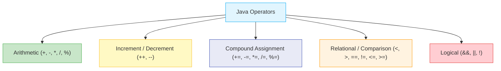
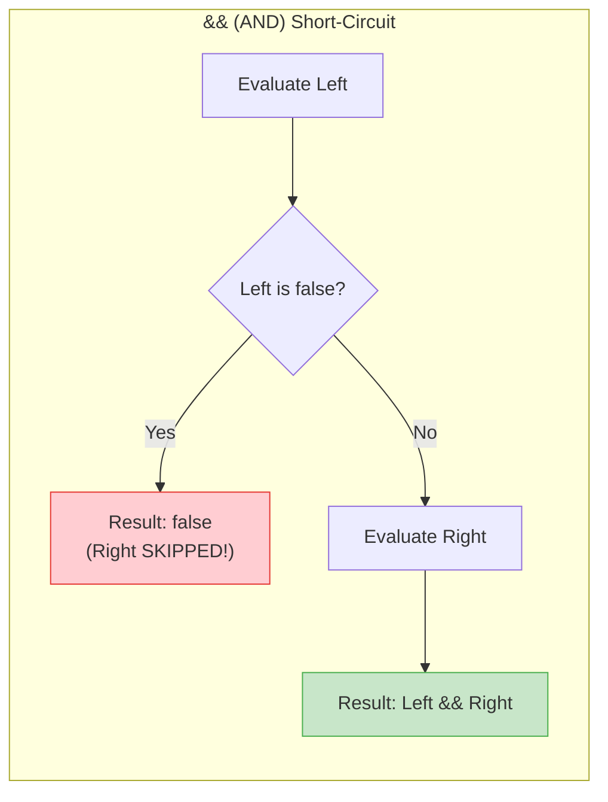

# ⚡ Module 04: Java Operators & Expressions

> **Mastering Operators, Precedence & Logical Reasoning in Java.** Learn how Java processes arithmetic, comparisons, compound operations, and boolean logic — the building blocks of every decision and calculation.

---

## 📑 Table of Contents
1. [What You'll Learn](#1-what-youll-learn)
2. [Core Concept: Operator Categories](#2-core-concept-operator-categories)
3. [Arithmetic Operators Deep Dive](#3-arithmetic-operators-deep-dive)
4. [Prefix vs Postfix Increment Deep Dive](#4-prefix-vs-postfix-increment-deep-dive)
5. [Compound Assignment Operators](#5-compound-assignment-operators)
6. [Relational (Comparison) Operators](#6-relational-comparison-operators)
7. [Truth Tables for Logical Operators](#7-truth-tables-for-logical-operators)
8. [Short-Circuit Evaluation](#8-short-circuit-evaluation)
9. [Operator Precedence Master Table](#9-operator-precedence-master-table)
10. [When to Use Which Operator](#10-when-to-use-which-operator)
11. [Line-by-Line File Guides](#11-line-by-line-file-guides)
12. [Common Pitfalls & Traps](#12-common-pitfalls--traps)

---

## 1. What You'll Learn

After completing this module, you will be able to:

- [ ] Perform arithmetic operations and understand modulus (`%`)
- [ ] Correctly predict the difference between `i++` (postfix) and `++i` (prefix)
- [ ] Use compound assignment operators (`+=`, `-=`, `*=`, `/=`, `%=`)
- [ ] Evaluate relational comparisons and understand their boolean results
- [ ] Combine conditions with logical AND (`&&`), OR (`||`), and NOT (`!`)
- [ ] Leverage short-circuit evaluation for safe and efficient code

---

## 2. Core Concept: Operator Categories

Operators tell the CPU what operation to perform on one, two, or three operands.



---

## 3. Arithmetic Operators Deep Dive

| Operator | Name | Example | Result | Explanation |
| :---: | :--- | :--- | :--- | :--- |
| `+` | Addition | `10 + 3` | `13` | Sum of two values |
| `-` | Subtraction | `10 - 3` | `7` | Difference |
| `*` | Multiplication | `10 * 3` | `30` | Product |
| `/` | Division | `10 / 3` | `3` ⚠️ | **Integer division** truncates decimal |
| `%` | Modulus | `10 % 3` | `1` | **Remainder** after division |

### Understanding Quotient vs Remainder:
```
     3          ← Quotient (10 / 3)
    ───
3 ) 10
    9
    ──
     1          ← Remainder (10 % 3)
```

```java
int quotient = 10 / 3;   // 3 (how many times 3 fits into 10)
int remainder = 10 % 3;  // 1 (what's left over)
```

### Common Uses of Modulus (`%`):
```java
// Check if a number is even or odd:
if (num % 2 == 0)  → Even
if (num % 2 != 0)  → Odd

// Extract last digit:
int lastDigit = 1234 % 10;  // 4

// Wrap around (clock arithmetic):
int hour = 25 % 24;  // 1 (25th hour = 1 AM)
```

---

## 4. Prefix vs Postfix Increment Deep Dive

| Expression | Name | Order of Operations | Example (`int x = 5;`) |
| :--- | :--- | :--- | :--- |
| `x++` | Postfix Increment | 1. **Use** current value<br>2. **Then** increment | `int y = x++;` → `y = 5`, `x = 6` |
| `++x` | Prefix Increment | 1. **Increment first**<br>2. **Then** use new value | `int y = ++x;` → `y = 6`, `x = 6` |

### Step-by-Step Dry Run:

```java
int x = 5;
int a = x++;    // Postfix
int b = ++x;    // Prefix
```

| Step | Expression | x Before | Value Used | x After | Variable |
| :--- | :--- | :--- | :--- | :--- | :--- |
| 1 | `x = 5` | — | — | `5` | — |
| 2 | `a = x++` | `5` | `5` (use first) | `6` (then increment) | `a = 5` |
| 3 | `b = ++x` | `6` | `7` (increment first) | `7` | `b = 7` |

> [!TIP]
> **Memory trick**: Think of the `++` position as "when does the increment happen?"
> - `x++` → increment is **after** the variable (postfix = post = after)
> - `++x` → increment is **before** the variable (prefix = pre = before)

---

## 5. Compound Assignment Operators

Compound operators combine an arithmetic operation with assignment in a single step:

| Shorthand | Expansion | Example | Before | After |
| :--- | :--- | :--- | :--- | :--- |
| `x += 5` | `x = (type)(x + 5)` | `int x = 10; x += 5;` | `10` | `15` |
| `x -= 3` | `x = (type)(x - 3)` | `int x = 10; x -= 3;` | `10` | `7` |
| `x *= 2` | `x = (type)(x * 2)` | `int x = 10; x *= 2;` | `10` | `20` |
| `x /= 4` | `x = (type)(x / 4)` | `int x = 10; x /= 4;` | `10` | `2` |
| `x %= 3` | `x = (type)(x % 3)` | `int x = 10; x %= 3;` | `10` | `1` |

> [!IMPORTANT]
> **Hidden implicit cast!** Compound operators include an automatic cast to the target type:
> ```java
> byte b = 10;
> b = b + 5;     // ❌ Compile error! (b + 5) is int, can't assign to byte
> b += 5;        // ✅ Works! Equivalent to b = (byte)(b + 5);
> ```

---

## 6. Relational (Comparison) Operators

Relational operators compare two values and return a `boolean` (`true` or `false`):

| Operator | Meaning | Example | Result |
| :---: | :--- | :--- | :---: |
| `<` | Less than | `5 < 10` | `true` |
| `>` | Greater than | `5 > 10` | `false` |
| `<=` | Less than or equal | `5 <= 5` | `true` |
| `>=` | Greater than or equal | `5 >= 10` | `false` |
| `==` | Equal to | `5 == 5` | `true` |
| `!=` | Not equal to | `5 != 10` | `true` |

```java
int a = 20, b = 15;
System.out.println(a > b);   // true
System.out.println(a == b);  // false
System.out.println(a != b);  // true
```

---

## 7. Truth Tables for Logical Operators

| A | B | `A && B` (AND) | `A \|\| B` (OR) | `!A` (NOT) |
| :---: | :---: | :---: | :---: | :---: |
| `true` | `true` | **`true`** | **`true`** | `false` |
| `true` | `false` | `false` | **`true`** | `false` |
| `false` | `true` | `false` | **`true`** | `true` |
| `false` | `false` | `false` | `false` | `true` |

### Plain English:
- **`&&` (AND)**: Both must be true → "Are you 18+ **AND** have a ticket?"
- **`||` (OR)**: At least one must be true → "Are you a student **OR** a senior citizen?"
- **`!` (NOT)**: Flips the value → "You are **NOT** blocked"

---

## 8. Short-Circuit Evaluation

Java evaluates `&&` and `||` lazily to maximize CPU efficiency:

```java
// ✅ SAFE: If left side of && is false, right side is SKIPPED:
if (count != 0 && (total / count > 10)) { ... }
// If count IS 0, the division is NEVER executed → no ArithmeticException!

// ✅ FAST: If left side of || is true, right side is SKIPPED:
if (isAdmin || checkSlowDatabasePermission(user)) { ... }
// If isAdmin is true, the slow database query is NEVER called!
```



---

## 9. Operator Precedence Master Table

| Precedence | Category | Operators | Associativity |
| :--- | :--- | :--- | :--- |
| **1 (Highest)** | Postfix | `expr++`, `expr--` | Left to Right |
| **2** | Prefix / Unary | `++expr`, `--expr`, `+`, `-`, `!`, `~` | Right to Left |
| **3** | Multiplicative | `*`, `/`, `%` | Left to Right |
| **4** | Additive | `+`, `-` | Left to Right |
| **5** | Relational | `<`, `>`, `<=`, `>=` | Left to Right |
| **6** | Equality | `==`, `!=` | Left to Right |
| **7** | Logical AND | `&&` | Left to Right |
| **8** | Logical OR | `\|\|` | Left to Right |
| **9** | Ternary | `? :` | Right to Left |
| **10 (Lowest)**| Assignment | `=`, `+=`, `-=`, `*=`, `/=`, `%=` | Right to Left |

> [!TIP]
> **When in doubt, use parentheses!** They make your intent explicit and prevent precedence bugs:
> ```java
> // Ambiguous:
> boolean result = x > 5 && y < 10 || z == 3;
> // Clear:
> boolean result = (x > 5 && y < 10) || (z == 3);
> ```

---

## 10. When to Use Which Operator

| I want to... | Use | Example |
| :--- | :--- | :--- |
| Add / subtract / multiply / divide | `+`, `-`, `*`, `/` | `total = price * qty` |
| Get the remainder | `%` | `isEven = num % 2 == 0` |
| Increment a counter | `i++` or `++i` | `for (int i = 0; i < n; i++)` |
| Update a variable with its old value | `+=`, `-=`, `*=`, `/=` | `score += 10` |
| Compare two values | `<`, `>`, `==`, `!=`, `<=`, `>=` | `if (age >= 18)` |
| Combine multiple conditions | `&&`, `\|\|`, `!` | `if (isStudent && age < 25)` |
| Choose between two values inline | `? :` | `max = (a > b) ? a : b` |

---

## 11. Line-by-Line File Guides

| File | Concepts Covered | Expected Console Output | Command to Run |
| :--- | :--- | :--- | :--- |
| [`arithmeticoperator.java`](file:///Users/honeyreddy/Documents/Java%20course/src/Operators/arithmeticoperator.java) | `+`, `-`, `*`, `/`, `%` with integer and decimal values | Quotient and remainder results | `java -cp out operators.arithmeticoperator` |
| [`increment.java`](file:///Users/honeyreddy/Documents/Java%20course/src/Operators/increment.java) | `++` and `--` prefix vs postfix evaluation | Shows different values for `x++` vs `++x` | `java -cp out operators.increment` |
| [`augmentedassigment.java`](file:///Users/honeyreddy/Documents/Java%20course/src/Operators/augmentedassigment.java) | Compound updates (`+=`, `*=`) & implicit casting | Progressive updates to a variable | `java -cp out operators.augmentedassigment` |
| [`Relationaloperator.java`](file:///Users/honeyreddy/Documents/Java%20course/src/Operators/Relationaloperator.java) | Comparison boolean results (`<`, `>`, `==`, `!=`) | `true` / `false` for each comparison | `java -cp out operators.Relationaloperator` |
| [`logicaloperator.java`](file:///Users/honeyreddy/Documents/Java%20course/src/Operators/logicaloperator.java) | Boolean combinations (`&&`, `\|\|`, `!`) & short-circuit | Truth table results for combined conditions | `java -cp out operators.logicaloperator` |

### Dry-Run Trace: `increment.java`

```java
int x = 5;
int a = x++;   // Postfix
int b = ++x;   // Prefix
System.out.println("a = " + a);  // ?
System.out.println("b = " + b);  // ?
System.out.println("x = " + x);  // ?
```

| Step | Expression | x (before) | Value Used | x (after) | Assigned To |
| :--- | :--- | :--- | :--- | :--- | :--- |
| 1 | `x = 5` | — | — | `5` | — |
| 2 | `a = x++` | `5` | `5` | `6` | `a = 5` |
| 3 | `b = ++x` | `6` | `7` | `7` | `b = 7` |

**Output:** `a = 5`, `b = 7`, `x = 7`

### Dry-Run Trace: `augmentedassigment.java`

```java
int x = 10;
x += 5;   // x = 10 + 5 = 15
x -= 3;   // x = 15 - 3 = 12
x *= 2;   // x = 12 * 2 = 24
x /= 4;   // x = 24 / 4 = 6
x %= 5;   // x = 6 % 5 = 1
```

| Step | Operation | Expansion | x Before | x After |
| :--- | :--- | :--- | :--- | :--- |
| 1 | `x += 5` | `x = x + 5` | `10` | `15` |
| 2 | `x -= 3` | `x = x - 3` | `15` | `12` |
| 3 | `x *= 2` | `x = x * 2` | `12` | `24` |
| 4 | `x /= 4` | `x = x / 4` | `24` | `6` |
| 5 | `x %= 5` | `x = x % 5` | `6` | `1` |

---

## 12. Common Pitfalls & Traps

> [!WARNING]
> ### 1. Accidental Assignment in Conditions
> In Java, `if (a = 5)` will NOT compile (unlike C/C++), because Java requires a `boolean` in conditions:
> ```java
> if (a = 5) { ... }    // ❌ Compile error! Assignment, not comparison
> if (a == 5) { ... }   // ✅ Correct: comparison
> ```

> [!CAUTION]
> ### 2. Division by Zero
> ```java
> int result = 10 / 0;       // 💥 ArithmeticException: / by zero
> double result = 10.0 / 0.0; // Infinity (no exception with floating-point!)
> double result = 0.0 / 0.0;  // NaN (Not a Number)
> ```

> [!WARNING]
> ### 3. Integer Division Truncation
> ```java
> double avg = 5 / 2;     // 2.0 (NOT 2.5!) — both operands are int
> double avg = 5.0 / 2;   // 2.5 ✅ (one operand is double)
> double avg = (double) 5 / 2; // 2.5 ✅ (cast one to double first)
> ```

> [!NOTE]
> ### 4. `=` vs `==` Reminder
> - `=` is the **assignment** operator (stores a value)
> - `==` is the **equality** operator (compares two values)
> ```java
> int x = 5;       // Assigns 5 to x
> if (x == 5) ...  // Checks if x equals 5
> ```
