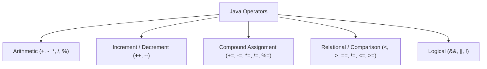

# ⚡ Module 04: Java Operators & Expressions

> **Mastering Operators, Precedence & Logical Reasoning in Java.** Learn how Java processes arithmetic, comparisons, compound operations, and boolean logic.

---

## 📑 Table of Contents
1. [Core Concept: Operator Categories](#1-core-concept-operator-categories)
2. [Prefix vs Postfix Increment Deep Dive](#2-prefix-vs-postfix-increment-deep-dive)
3. [Truth Tables for Logical Operators](#3-truth-tables-for-logical-operators)
4. [Short-Circuit Evaluation](#4-short-circuit-evaluation)
5. [Operator Precedence Master Table](#5-operator-precedence-master-table)
6. [Line-by-Line File Guides](#6-line-by-line-file-guides)
7. [Common Pitfalls & Traps](#7-common-pitfalls--traps)

---

## 1. Core Concept: Operator Categories

Operators tell the CPU what operation to perform on one, two, or three operands.



---

## 2. Prefix vs Postfix Increment Deep Dive

| Expression | Name | Order of Operations | Example (`int x = 5;`) |
| :--- | :--- | :--- | :--- |
| `x++` | Postfix Increment | 1. Fetch current value of `x`<br>2. Increment `x` by 1 | `int y = x++;` -> `y` becomes 5, `x` becomes 6 |
| `++x` | Prefix Increment | 1. Increment `x` by 1<br>2. Fetch new value of `x` | `int y = ++x;` -> `y` becomes 6, `x` becomes 6 |

---

## 3. Truth Tables for Logical Operators

| A | B | `A && B` (AND) | `A \|\| B` (OR) | `!A` (NOT) |
| :---: | :---: | :---: | :---: | :---: |
| `true` | `true` | **`true`** | **`true`** | `false` |
| `true` | `false` | `false` | **`true`** | `false` |
| `false` | `true` | `false` | **`true`** | `true` |
| `false` | `false` | `false` | `false` | `true` |

---

## 4. Short-Circuit Evaluation

Java evaluates `&&` and `||` lazily to maximize CPU efficiency:

```java
// If left side of && is false, right side is SKIPPED:
if (count != 0 && (total / count > 10)) { ... } // Safe against division by zero!

// If left side of || is true, right side is SKIPPED:
if (isAdmin || checkSlowDatabasePermission(user)) { ... } // Fast!
```

---

## 5. Operator Precedence Master Table

| Precedence | Category | Operators | Associativity |
| :--- | :--- | :--- | :--- |
| **1 (Highest)** | Postfix | `expr++`, `expr--` | Left to Right |
| **2** | Prefix / Unary | `++expr`, `--expr`, `+`, `-`, `!`, `~` | Right to Left |
| **3** | Multiplicative | `*`, `/`, `%` | Left to Right |
| **4** | Additive | `+`, `-` | Left to Right |
| **5** | Relational | `<`, `>`, `<=`, `>=` | Left to Right |
| **6** | Equality | `==`, `!=` | Left to Right |
| **7** | Logical AND | `&&` | Left to Right |
| **8** | Logical OR | `\|\|` | Left to Right |
| **9** | Ternary | `? :` | Right to Left |
| **10 (Lowest)**| Assignment | `=`, `+=`, `-=`, `*=`, `/=`, `%=` | Right to Left |

---

## 6. Line-by-Line File Guides

| File | Concepts Covered | Command to Run |
| :--- | :--- | :--- |
| [`arithmeticoperator.java`](file:///Users/honeyreddy/Documents/Java%20course/src/Operators/arithmeticoperator.java) | Math operations (`+`, `-`, `*`, `/`, `%`) | `java -cp out operators.arithmeticoperator` |
| [`increment.java`](file:///Users/honeyreddy/Documents/Java%20course/src/Operators/increment.java) | `++` and `--` prefix vs postfix evaluation | `java -cp out operators.increment` |
| [`augmentedassigment.java`](file:///Users/honeyreddy/Documents/Java%20course/src/Operators/augmentedassigment.java) | Compound updates (`+=`, `*=`) & implicit casting | `java -cp out operators.augmentedassigment` |
| [`Relationaloperator.java`](file:///Users/honeyreddy/Documents/Java%20course/src/Operators/Relationaloperator.java) | Comparison boolean results (`<`, `>`, `==`, `!=`) | `java -cp out operators.Relationaloperator` |
| [`logicaloperator.java`](file:///Users/honeyreddy/Documents/Java%20course/src/Operators/logicaloperator.java) | Boolean combinations (`&&`, `\|\|`, `!`) & short-circuit | `java -cp out operators.logicaloperator` |

---

## 7. Common Pitfalls & Traps

> [!WARNING]
> - **Accidental Assignment in If Statements**: `if (a = 5)` will NOT compile in Java (unlike C/C++), because Java requires a boolean in conditions.
> - **Division by Zero with Integers**: `10 / 0` throws `ArithmeticException: / by zero`. With floating-point (`10.0 / 0.0`), it produces `Infinity`.
