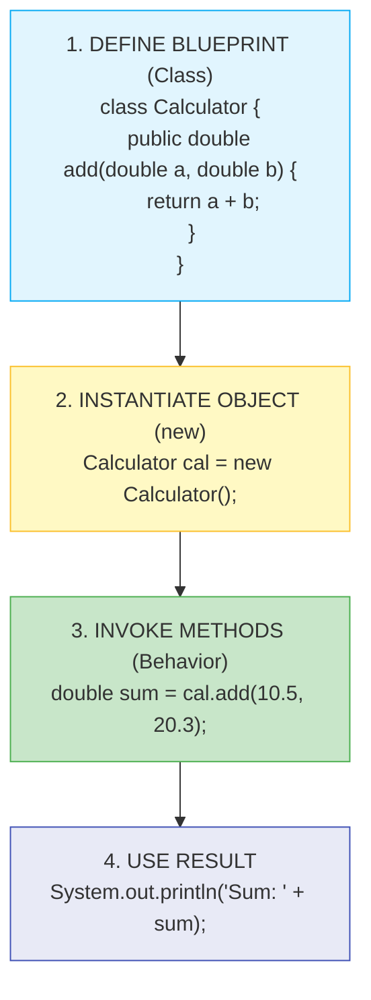
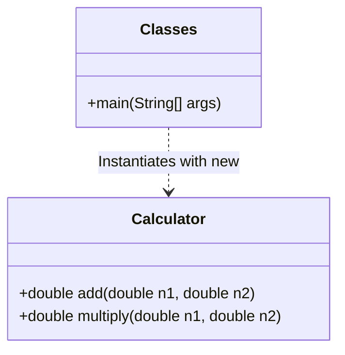
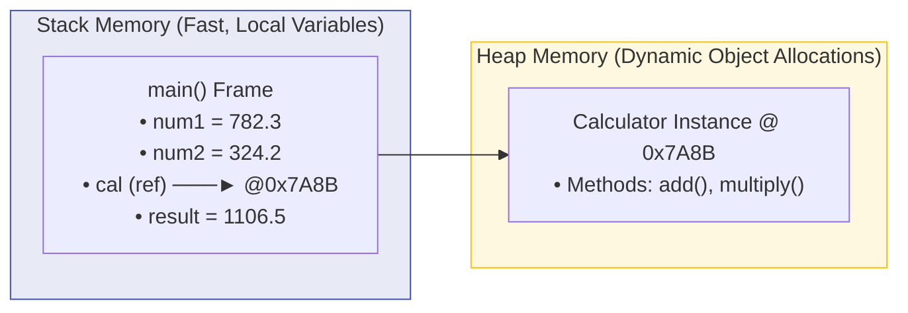
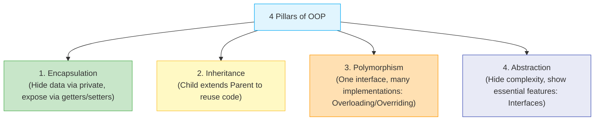
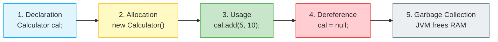

# 🏛️ Module 14: Object-Oriented Programming (OOP) Kickstart

> **Mastering Classes, Objects, Methods & Memory Models in Java.** Learn how Java models real-world entities into modular, reusable blueprints using classes, objects, and memory allocation across the Stack and Heap.

> ⚡ **Fast Access**: [🏠 Course Master Readme](../../../Readme.Md) &nbsp;|&nbsp; [📂 Source Directory](../../README.md) &nbsp;|&nbsp; [⬅️ Previous: Exception Handling](../../intermediate/exception_handling/README.md) &nbsp;|&nbsp; [➡️ Next: OOP Pillars](../oop_pillars/README.md) &nbsp;|&nbsp; [📁 Folder Files](./)

---

## 📑 Table of Contents
1. [What You'll Learn](#1-what-youll-learn)
2. [Keywords & Definitions Glossary](#2-keywords--definitions-glossary)
3. [How I Code & What is the Use (Mental Model)](#3-how-i-code--what-is-the-use-mental-model)
4. [Core Concept: The Blueprint Analogy](#4-core-concept-the-blueprint-analogy)
5. [Stack Memory vs Heap Memory](#5-stack-memory-vs-heap-memory)
6. [Anatomy of a Class & Method](#6-anatomy-of-a-class--method)
7. [The 4 Pillars of OOP Overview](#7-the-4-pillars-of-oop-overview)
8. [Object Lifecycle (Creation to Garbage Collection)](#8-object-lifecycle-creation-to-garbage-collection)
9. [Line-by-Line File Guides](#9-line-by-line-file-guides)
10. [Dry-Run & Tracing Exercises](#10-dry-run--tracing-exercises)
11. [Common Pitfalls & Traps](#11-common-pitfalls--traps)

---

## 1. What You'll Learn

After completing this module, you will be able to:

- [ ] Define custom classes with instance variables and member methods
- [ ] Instantiate objects dynamically in Heap memory using `new`
- [ ] Understand reference variables on the Stack pointing to Heap objects
- [ ] Invoke methods on objects and pass parameters / capture return values
- [ ] Understand the 4 foundational pillars of Object-Oriented Programming (Encapsulation, Inheritance, Polymorphism, Abstraction)

---

## 2. Keywords & Definitions Glossary

| Keyword | Category | Definition & Meaning | Code Syntax Example |
| :--- | :--- | :--- | :--- |
| `class` | Keyword | Declares a user-defined blueprint / template for creating objects. | `class Calculator { ... }` |
| `new` | Keyword | Instantiates an object by allocating memory in the Heap and invoking the constructor. | `Calculator c = new Calculator();` |
| `public` | Modifier | Access modifier; makes a class, method, or field accessible from anywhere. | `public double add(...)` |
| `return` | Keyword | Exits a method and sends a computed value back to the calling statement. | `return n1 + n2;` |
| `this` | Keyword | Reference variable referring to the current object instance. | `this.name = name;` |
| `void` | Keyword | Declares that a method does not return any value to its caller. | `public void display() { }` |

---

## 3. How I Code & What is the Use (Mental Model)

### What is the Use?
In procedural programming, code is a long list of instructions. In **Object-Oriented Programming (OOP)**, you structure code around **real-world objects** (e.g. `User`, `Car`, `BankAccount`, `Calculator`). Each object has:
- **State (Attributes / Variables)**: What does it know? (`name`, `balance`, `speed`)
- **Behavior (Methods / Functions)**: What can it do? (`deposit()`, `accelerate()`, `calculateTotal()`)

### How to Build a Class from Scratch:


---

## 4. Core Concept: The Blueprint Analogy



- **Class**: The architectural blueprint of a house (defines rooms, dimensions).
- **Object**: The actual physical house built from that blueprint on a plot of land (Heap memory).
- **Reference Variable**: The street address on an envelope (Stack pointer) that tells you where the house is located.

---

## 5. Stack Memory vs Heap Memory



| Feature | Stack Memory | Heap Memory |
| :--- | :--- | :--- |
| **Holds** | Primitive variables & Reference pointers | Actual Object instances & Array data |
| **Lifetime** | Tied to method execution scope | Managed by Garbage Collector |
| **Speed** | Extremely fast (LIFO execution) | Slower, dynamic allocation |

---

## 6. Anatomy of a Class & Method

```java
// AccessModifier  ReturnType  MethodName  (Parameters)
   public          double      add         (double n1, double n2) {
       double r = n1 + n2;
       return r; // Sends value back to caller
   }
```

---

## 7. The 4 Pillars of OOP Overview



---

## 8. Object Lifecycle



---

## 9. Line-by-Line File Guides

| File | Concepts Covered | Expected Console Output | Command to Run |
| :--- | :--- | :--- | :--- |
| [`Classes.java`](./Classes.java) | Class definition, object creation `new`, method execution with returns | `Result of addition via Calculator object: 1106.5`<br>`Result of multiplication via Calculator object: 42.0` | `java -cp out advanced.oop_basics.Classes` |
| [`Stack_Heap_data.java`](./Stack_Heap_data.java) | Multiple object instances, independent state, method invocation | `Addition of two numbers is: 30`<br>`num value are:12` | `java -cp out advanced.oop_basics.Stack_Heap_data` |

---

## 10. Dry-Run & Tracing Exercises

### Trace `Classes.java`

| Step | Line of Code | Stack State | Heap State | Console Output |
| :--- | :--- | :--- | :--- | :--- |
| 1 | `double num1 = 782.3;` | `num1 = 782.3` | — | — |
| 2 | `double num2 = 324.2;` | `num2 = 324.2` | — | — |
| 3 | `Calculator cal = new Calculator();` | `cal → @0x7A8B` | New `Calculator` instance allocated | — |
| 4 | `cal.add(num1, num2)` | Jump to `add()` frame | Calculates `782.3 + 324.2` | — |
| 5 | `result = 1106.5` | `result = 1106.5` | — | — |
| 6 | `System.out.println(...)` | — | — | `Result of addition...: 1106.5` |

---

## 11. Common Pitfalls & Traps

> [!CAUTION]
> ### 1. NullPointerException
> Attempting to call a method on a reference variable that points to `null`:
> ```java
> Calculator cal = null;
> cal.add(10, 20); // 💥 NullPointerException! No object exists on the Heap!
> ```

> [!WARNING]
> ### 2. Confusing Class vs Object
> - `Calculator` is the **class** (type/blueprint).
> - `cal` is the **object reference** (instance).
> You cannot call instance methods directly on the class name: `Calculator.add()` ❌ (unless the method is marked `static`).

---

## 📝 Full Code Walkthrough

### 📄 `src/advanced/oop_basics/Classes.java`

**Purpose:** Teaches how to define a class with methods, create an object using `new`, and call methods on that object.

**▶️ Run:** `java -cp out advanced.oop_basics.Classes`

```java
package advanced.oop_basics;

class Calculator {

    public double add(double n1, double n2) {
        double r = n1 + n2;
        return r;
    }

    public double multiply(double n1, double n2) {
        return n1 * n2;
    }
}

public class Classes {

    public static void main(String[] args) {
        double num1 = 782.3;
        double num2 = 324.2;

        Calculator cal = new Calculator();

        double result = cal.add(num1, num2);
        System.out.println("Result of addition via Calculator object: " + result);

        double product = cal.multiply(10.5, 4.0);
        System.out.println("Result of multiplication via Calculator object: " + product);
    }
}
```

**Line-by-line explanation:**

| Line | Code | What it does |
| :--- | :--- | :--- |
| 3 | `class Calculator {` | Defines a **class** — a blueprint that describes what a Calculator can do. It's like an architectural plan: it defines the structure but doesn't build anything yet. No `public` keyword here because only ONE class per file can be `public` (and it must match the filename). |
| 5 | `public double add(double n1, double n2) {` | A method inside the Calculator class. **`double`** (before the method name) is the **return type** — it tells you this method sends back a `double` value. **`double n1, double n2`** are **parameters** — placeholder variables that receive values when the method is called. |
| 6 | `double r = n1 + n2;` | Adds the two parameters and stores the result in a local variable `r`. |
| 7 | `return r;` | **`return`** sends the value of `r` back to whoever called this method, and exits the method. |
| 10-12 | `public double multiply(...)` | Another method that multiplies two numbers. `return n1 * n2;` returns the result directly without a temporary variable. |
| 21 | `Calculator cal = new Calculator();` | This is the key OOP line: **`new Calculator()`** creates a new Calculator **object** (instance) in Heap memory. **`cal`** is a **reference variable** stored on the Stack — it holds the memory address of the object on the Heap. Think of `cal` as a remote control that points to the actual Calculator. |
| 23 | `double result = cal.add(num1, num2);` | The **dot operator `.`** calls the `add` method on the `cal` object. The values `782.3` and `324.2` are passed as arguments. The method runs, calculates `1106.5`, and returns it. The returned value is stored in `result`. |
| 26 | `cal.multiply(10.5, 4.0)` | Calls the `multiply` method on the same object. Returns `42.0`. |

> 🔑 **Concept:** A **class** is a blueprint; an **object** is a living instance created from that blueprint using `new`. Objects live in **Heap** memory, while reference variables (like `cal`) live on the **Stack** and point to the Heap. Methods define the behaviors an object can perform.

---

### 📄 `src/advanced/oop_basics/Stack_Heap_data.java`

**Purpose:** Teaches that multiple objects created from the same class are **independent** — each has its own copy of data in Heap memory.

**▶️ Run:** `java -cp out advanced.oop_basics.Stack_Heap_data`

```java
package advanced.oop_basics;

class computer{
    int num1 = 8;
    int num2 = 4;
public int add1(int num1,int num2){
    return num1+num2;
}
    public int add(int n1, int n2){
        return n1+n2;
    }
}
public class Stack_Heap_data {
    public static void main(String[]args){
       computer obj = new computer();
       computer obj1 = new computer();
       obj.add(10, 20);
       obj1.add1(8,4);
       System.out.println("Addition of two numbers is: " + obj.add(10, 20));
       System.out.println("num value are:"+ obj.add1(8,4));
    }
}
```

**Line-by-line explanation:**

| Line | Code | What it does |
| :--- | :--- | :--- |
| 3 | `class computer {` | Defines a class with two **instance variables** (`num1 = 8`, `num2 = 4`) and two methods. |
| 4-5 | `int num1 = 8; int num2 = 4;` | **Instance variables** — every `computer` object gets its OWN copy of these variables. Changing them in one object doesn't affect another. |
| 6 | `public int add1(int num1, int num2){` | Note: the parameter names `num1` and `num2` **shadow** (hide) the instance variables with the same names. Inside this method, `num1` refers to the parameter, not the instance variable. |
| 9 | `public int add(int n1, int n2){` | Uses different parameter names (`n1`, `n2`) to avoid shadowing. |
| 15 | `computer obj = new computer();` | Creates the FIRST computer object on the Heap. `obj` points to it. |
| 16 | `computer obj1 = new computer();` | Creates a SECOND, completely separate computer object. `obj1` points to this new one. Both objects have their own `num1` and `num2`. |
| 17 | `obj.add(10, 20);` | Calls `add` on `obj`, passing 10 and 20. Returns 30, but the result isn't stored anywhere (it's discarded). |
| 19 | `System.out.println(... + obj.add(10, 20));` | Calls `add` again and this time uses the returned value (30) in the print statement. |
| 20 | `obj.add1(8, 4)` | Calls `add1` with 8 and 4 as arguments. Returns `12`. |

> 🔑 **Concept:** Each `new` creates a separate, independent object on the Heap. Two objects from the same class have their own copies of instance variables — they don't share data. References on the Stack (`obj`, `obj1`) point to different objects on the Heap.

---

---

## 🧭 Fast Navigation

| 🏠 Course Master | 📂 Source Hub | ⬅️ Previous Module | ➡️ Next Module | 📁 Browse Folder |
| :---: | :---: | :---: | :---: | :---: |
| [Main Readme](../../../Readme.Md) | [src/ Overview](../../README.md) | [⬅️ Exception Handling](../../intermediate/exception_handling/README.md) | [OOP Pillars ➡️](../oop_pillars/README.md) | [📁 `oop_basics/`](./) |

