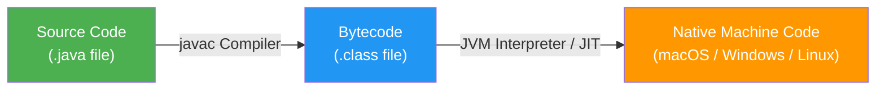
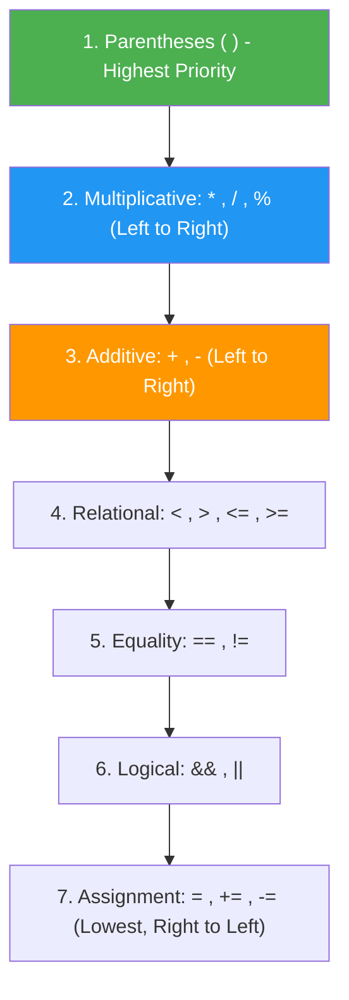

# ☕ Module 01: Java Basics & Execution Flow

> **Welcome to Java Fundamentals!** This guide is designed to give you a deep, crystal-clear understanding of how Java programs are structured, compiled, and executed.

---

## 📑 Table of Contents
1. [What You'll Learn](#1-what-youll-learn)
2. [Core Concept: How Java Works (JVM, JRE, JDK)](#2-core-concept-how-java-works)
3. [Real-World Analogy](#3-real-world-analogy)
4. [Mental Model: Program Anatomy](#4-mental-model-program-anatomy)
5. [Operator Precedence & BODMAS / PEMDAS](#5-operator-precedence--bodmas--pemdas)
6. [User Input with Scanner & The Newline Buffer Trap](#6-user-input-with-scanner--the-newline-buffer-trap)
7. [Line-by-Line File Guides](#7-line-by-line-file-guides)
8. [Dry-Run & Tracing Exercises](#8-dry-run--tracing-exercises)
9. [Common Pitfalls & Traps](#9-common-pitfalls--traps)

---

## 1. What You'll Learn

After completing this module, you will be able to:

- [ ] Explain the difference between JDK, JRE, and JVM
- [ ] Write a minimal Java program with the correct `main` method signature
- [ ] Understand how Java source code is compiled to bytecode and executed
- [ ] Evaluate arithmetic expressions following operator precedence rules
- [ ] Use `Scanner` to read user input from the terminal
- [ ] Avoid the Scanner newline buffer trap

---

## 2. Core Concept: How Java Works

Java follows the philosophy of **"Write Once, Run Anywhere" (WORA)**:



| Component | Full Name | What It Does | Analogy |
| :--- | :--- | :--- | :--- |
| **JDK** | Java Development Kit | Complete toolkit for developers (compiler `javac`, debugger, tools + JRE) | The complete workshop with all tools |
| **JRE** | Java Runtime Environment | Environment needed to run compiled Java programs (libraries + JVM) | The stage where the show is performed |
| **JVM** | Java Virtual Machine | Virtual engine that translates bytecode (`.class`) into platform-specific CPU instructions | The translator at the United Nations |

---

## 3. Real-World Analogy

Think of the Java compilation and execution process like **translating and performing a play**:

```
📝 Playwright writes the script  →  Your .java source code
       ↓
🔄 Script is translated to a      →  javac compiles to .class bytecode
   universal stage notation            (platform-independent)
       ↓
🎭 A local theater company         →  JVM on your OS reads bytecode
   performs it in their language        and converts to native CPU instructions
       ↓
👀 The audience sees the show      →  Your program runs and produces output!
```

The beauty is that the **same translated script** (bytecode) can be performed by **any theater company** (any JVM on any OS) — that's "Write Once, Run Anywhere"!

---

## 4. Mental Model: Program Anatomy

Every executable Java program follows this blueprint:

```java
package basics; // 1. Namespace container

public class StartingStructure { // 2. Class definition (blueprint)

    // 3. Entry-point method searched by JVM launcher
    public static void main(String[] args) {
        // 4. Executable statements executed sequentially
        System.out.println("Hello, Java!");
    }
}
```

### Why each keyword matters:
| Keyword | What it tells the JVM | What happens if you omit/change it |
| :--- | :--- | :--- |
| `public` | Accessible from anywhere outside the class. | JVM cannot access `main` from outside, throws `Main method not public` error. |
| `static` | Belongs to the class itself, no object needs to be instantiated. | JVM would not know how to construct your class object to start the app. |
| `void` | The method does not return any data back when finished. | Compiler error: return type required. |
| `main` | Exact identifier looked up by the JVM runtime launcher. | JVM won't recognize it as the starting point. |
| `String[] args` | Array holding CLI arguments (e.g. `java App arg1 arg2`). | JVM won't match standard main method signature. |

### `System.out.println()` Breakdown:
```
System   →  Built-in Java class containing system utilities
  .out   →  The standard output stream (PrintStream connected to terminal)
  .println() →  Prints the argument followed by a newline character '\n'
```

> [!TIP]
> **`print()` vs `println()` vs `printf()`**:
> - `print("Hello")` — prints without newline (cursor stays on same line)
> - `println("Hello")` — prints with newline (cursor moves to next line)
> - `printf("Hello %s", name)` — prints with format specifiers (like C's printf)

---

## 5. Operator Precedence & BODMAS / PEMDAS

In Java, expressions are evaluated based on precedence and associativity:



### ⚠️ Integer Division Gotcha:
```java
double x = 10 / 4;   // Result is 2.0 (NOT 2.5!) because integer 10 / 4 truncates to 2 first.
double y = 10.0 / 4; // Result is 2.5 because 10.0 is a double.
```

### Step-by-Step Evaluation Example:
Expression: `10 + 3 * 2 / (8 - 3)`

| Step | What Happens | Sub-Expression | Result |
| :--- | :--- | :--- | :--- |
| 1 | **Parentheses first** | `(8 - 3)` | `5` |
| 2 | **Multiplication** (left to right) | `3 * 2` | `6` |
| 3 | **Integer Division** (left to right) | `6 / 5` | `1` (NOT 1.2!) |
| 4 | **Addition** | `10 + 1` | `11` |
| 5 | **Widening to double** | Assign to `double result` | `11.0` |

---

## 6. User Input with Scanner & The Newline Buffer Trap

`java.util.Scanner` is a standard tokenizer for reading input from `System.in`.

### How Scanner Connects to the Keyboard:


### 🚨 The Buffer Trap:
```
Keyboard Input: "25\n" (User types 25 and presses ENTER)
scanner.nextInt() reads "25" and STOPS at '\n'.
Left in Buffer: "\n"
Next call to scanner.nextLine() reads up to '\n' -> consumes empty line immediately!
```

### 💡 The Solution:
Always add a `scanner.nextLine()` to flush the buffer if you switch from reading numbers to reading text:
```java
int age = scanner.nextInt();
scanner.nextLine(); // ⚡ Flushes the leftover '\n'
String name = scanner.nextLine(); // Now correctly waits for user input!
```

### Visual Buffer State Diagram:

| Step | User Types | Buffer State After | Method Called | Variable Gets |
| :--- | :--- | :--- | :--- | :--- |
| 1 | `"John Doe↵"` | `""` (consumed) | `nextLine()` | `name = "John Doe"` |
| 2 | `"25↵"` | `"\n"` ⚠️ leftover! | `nextInt()` | `age = 25` |
| 3 | — | `""` | `nextLine()` 🧹 flush | (discards empty `"\n"`) |
| 4 | `"5.9↵"` | `""` (consumed) | `nextDouble()` | `height = 5.9` |

---

## 7. Line-by-Line File Guides

| File | Primary Goal | Expected Console Output | Command to Run |
| :--- | :--- | :--- | :--- |
| [`startingstructure.java`](file:///Users/honeyreddy/Documents/Java%20course/src/basics/startingstructure.java) | Learn `main()` method signature & `System.out.println` | `jaffa is good boy`<br>`really as a very great person!` | `java -cp out basics.startingstructure` |
| [`OrderDemo.java`](file:///Users/honeyreddy/Documents/Java%20course/src/basics/OrderDemo.java) | Evaluate complex arithmetic with precedence & integer division | `The result is: 11.0` | `java -cp out basics.OrderDemo` |
| [`scanner.java`](file:///Users/honeyreddy/Documents/Java%20course/src/basics/scanner.java) | Read multiple data types with Scanner & manage input streams | `Enter your name: ` *(waits)*<br>`Enter your age: ` *(waits)*<br>`Your height (in feet): ` *(waits)*<br>`The person name is John, age is 25 years, and height is 5.9 feet.` | `java -cp out basics.scanner` |

---

## 8. Dry-Run & Tracing Exercises

### Exercise 1: Trace `OrderDemo.java`
Expression: `double result = 10 + 3 * 2 / (8 - 3);`

| Step | Operation | Resulting Sub-expression |
| :--- | :--- | :--- |
| 1 | Inside Parentheses `(8 - 3)` | `5` |
| 2 | Multiplication `3 * 2` | `6` |
| 3 | Integer Division `6 / 5` | `1` (decimal `.2` truncated) |
| 4 | Addition `10 + 1` | `11` |
| 5 | Type assignment to `double` | `11.0` |

### Exercise 2: Trace `scanner.java`
Assume user enters: Name = `"Sai"`, Age = `21`, Height = `5.8`

| Step | Code Line | User Input | Variable State | Console Output |
| :--- | :--- | :--- | :--- | :--- |
| 1 | `Scanner scanner = new Scanner(System.in)` | — | Scanner created | — |
| 2 | `System.out.print("Enter your name: ")` | — | — | `Enter your name: ` |
| 3 | `String name = scanner.nextLine()` | `Sai↵` | `name = "Sai"` | — |
| 4 | `System.out.print("Enter your age: ")` | — | — | `Enter your age: ` |
| 5 | `int age = scanner.nextInt()` | `21↵` | `age = 21`, buffer has `\n` | — |
| 6 | `System.out.print("Your height: ")` | — | — | `Your height (in feet): ` |
| 7 | `double height = scanner.nextDouble()` | `5.8↵` | `height = 5.8` | — |
| 8 | `System.out.println(...)` | — | — | `The person name is Sai, age is 21 years, and height is 5.8 feet.` |
| 9 | `scanner.close()` | — | Scanner closed | — |

### Exercise 3: Try It Yourself! 🧠
What will this print? Trace it step by step before running:
```java
double mystery = (4 + 6) * 3 - 8 / 2;
System.out.println(mystery);
```

<details>
<summary>Click to reveal answer</summary>

| Step | Operation | Result |
| :--- | :--- | :--- |
| 1 | `(4 + 6)` → `10` | Parentheses |
| 2 | `10 * 3` → `30` | Multiplication |
| 3 | `8 / 2` → `4` | Integer Division |
| 4 | `30 - 4` → `26` | Subtraction |
| 5 | Widened to `double` | `26.0` |

**Output:** `26.0`
</details>

---

## 9. Common Pitfalls & Traps

> [!WARNING]
> ### 1. Missing Semicolon
> Every statement in Java MUST terminate with a semicolon `;`.
> ```java
> System.out.println("Hello")   // ❌ Compile error!
> System.out.println("Hello");  // ✅ Correct
> ```

> [!WARNING]
> ### 2. Case Sensitivity
> Java is case-sensitive everywhere:
> ```java
> System.out.println("Hi");  // ✅ Correct
> system.out.println("Hi");  // ❌ 'system' not found
> String name = "Java";      // ✅ Correct
> string name = "Java";      // ❌ 'string' is not a type (must be 'String')
> ```

> [!CAUTION]
> ### 3. Closing Streams
> Always close `Scanner` instances (`scanner.close()`) when done to prevent resource leaks. Unclosed streams can cause memory issues in long-running applications.

> [!NOTE]
> ### 4. File Name Must Match Class Name
> In Java, the **public class name** must exactly match the **file name** (including case):
> - File: `OrderDemo.java` → Class: `public class OrderDemo` ✅
> - File: `orderdemo.java` → Class: `public class OrderDemo` ❌
