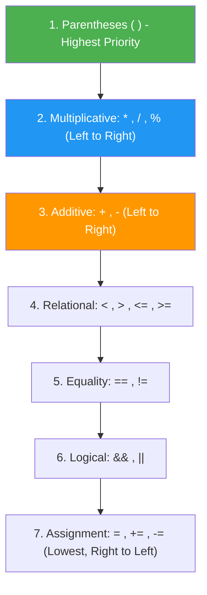

# ☕ Module 01: Java Basics & Execution Flow

> **Welcome to Java Fundamentals!** This guide is designed to give you a deep, crystal-clear understanding of how Java programs are structured, compiled, and executed.

---

## 📑 Table of Contents
1. [Core Concept: How Java Works (JVM, JRE, JDK)](#1-core-concept-how-java-works)
2. [Mental Model: Program Anatomy](#2-mental-model-program-anatomy)
3. [Operator Precedence & BODMAS / PEMDAS](#3-operator-precedence--bodmas--pemdas)
4. [User Input with Scanner & The Newline Buffer Trap](#4-user-input-with-scanner--the-newline-buffer-trap)
5. [Line-by-Line File Guides](#5-line-by-line-file-guides)
6. [Dry-Run & Tracing Exercises](#6-dry-run--tracing-exercises)
7. [Common Pitfalls & Traps](#7-common-pitfalls--traps)

---

## 1. Core Concept: How Java Works

Java follows the philosophy of **"Write Once, Run Anywhere" (WORA)**:

```mermaid
flowchart LR
    A["Source Code\n(.java file)"] -->|javac Compiler| B["Bytecode\n(.class file)"]
    B -->|JVM Interpreter / JIT| C["Native Machine Code\n(macOS / Windows / Linux)"]

    style A fill:#4CAF50,color:#fff
    B fill:#2196F3,color:#fff
    C fill:#FF9800,color:#fff
```

- **JDK (Java Development Kit)**: The complete toolkit for developers (compiler `javac`, debugger, tools + JRE).
- **JRE (Java Runtime Environment)**: The environment needed to run compiled Java programs (libraries + JVM).
- **JVM (Java Virtual Machine)**: The virtual engine that translates bytecode (`.class`) into platform-specific machine CPU instructions.

---

## 2. Mental Model: Program Anatomy

Every executable Java program follows this blueprint:

```java
package basics; // 1. Namespace container

public class StartingStructure { // 2. Class definition (blueprint)

    // 3. Entry-point method searched by JVM launcher
    public static void main(String[] args) {
        // 4. Executable statements executed sequentially
        System.out.println("Hello, Java!");
    }
}
```

### Why each keyword matters:
| Keyword | What it tells the JVM | What happens if you omit/change it |
| :--- | :--- | :--- |
| `public` | Accessible from anywhere outside the class. | JVM cannot access `main` from outside, throws `Main method not public` error. |
| `static` | Belongs to the class itself, no object needs to be instantiated. | JVM would not know how to construct your class object to start the app. |
| `void` | The method does not return any data back when finished. | Compiler error: return type required. |
| `main` | Exact identifier looked up by the JVM runtime launcher. | JVM won't recognize it as the starting point. |
| `String[] args` | Array holding CLI arguments (e.g. `java App arg1 arg2`). | JVM won't match standard main method signature. |

---

## 3. Operator Precedence & BODMAS / PEMDAS

In Java, expressions are evaluated based on precedence and associativity:



### ⚠️ Integer Division Gotcha:
```java
double x = 10 / 4;   // Result is 2.0 (NOT 2.5!) because integer 10 / 4 truncates to 2 first.
double y = 10.0 / 4; // Result is 2.5 because 10.0 is a double.
```

---

## 4. User Input with Scanner & The Newline Buffer Trap

`java.util.Scanner` is a standard tokenizer for reading input from `System.in`.

### 🚨 The Buffer Trap:
```
Keyboard Input: "25\n" (User types 25 and presses ENTER)
scanner.nextInt() reads "25" and STOPS at '\n'.
Left in Buffer: "\n"
Next call to scanner.nextLine() reads up to '\n' -> consumes empty line immediately!
```

### 💡 The Solution:
Always add a `scanner.nextLine()` to flush the buffer if you switch from reading numbers to reading text:
```java
int age = scanner.nextInt();
scanner.nextLine(); // Flushes the leftover '\n'
String name = scanner.nextLine(); // Now correctly waits for user input!
```

---

## 5. Line-by-Line File Guides

| File | Primary Goal | Command to Run |
| :--- | :--- | :--- |
| [`startingstructure.java`](file:///Users/honeyreddy/Documents/Java%20course/src/basics/startingstructure.java) | Learn `main()` method signature & `System.out.println` | `java -cp out basics.startingstructure` |
| [`OrderDemo.java`](file:///Users/honeyreddy/Documents/Java%20course/src/basics/OrderDemo.java) | Evaluate complex arithmetic with precedence & integer division | `java -cp out basics.OrderDemo` |
| [`scanner.java`](file:///Users/honeyreddy/Documents/Java%20course/src/basics/scanner.java) | Read multiple data types with Scanner & manage input streams | `java -cp out basics.scanner` |

---

## 6. Dry-Run & Tracing Exercises

### Exercise 1: Trace `OrderDemo.java`
Expression: `double result = 10 + 3 * 2 / (8 - 3);`

| Step | Operation | Resulting Sub-expression |
| :--- | :--- | :--- |
| 1 | Inside Parentheses `(8 - 3)` | `5` |
| 2 | Multiplication `3 * 2` | `6` |
| 3 | Integer Division `6 / 5` | `1` (decimal `.2` truncated) |
| 4 | Addition `10 + 1` | `11` |
| 5 | Type assignment to `double` | `11.0` |

---

## 7. Common Pitfalls & Traps

> [!WARNING]
> 1. **Missing Semicolon**: Every statement in Java MUST terminate with a semicolon `;`.
> 2. **Case Sensitivity**: `Main` is not `main`. `System` must be capitalized, `string` is invalid (`String` is required).
> 3. **Closing Streams**: Always close `Scanner` instances (`scanner.close()`) when done to avoid resource leaks.
