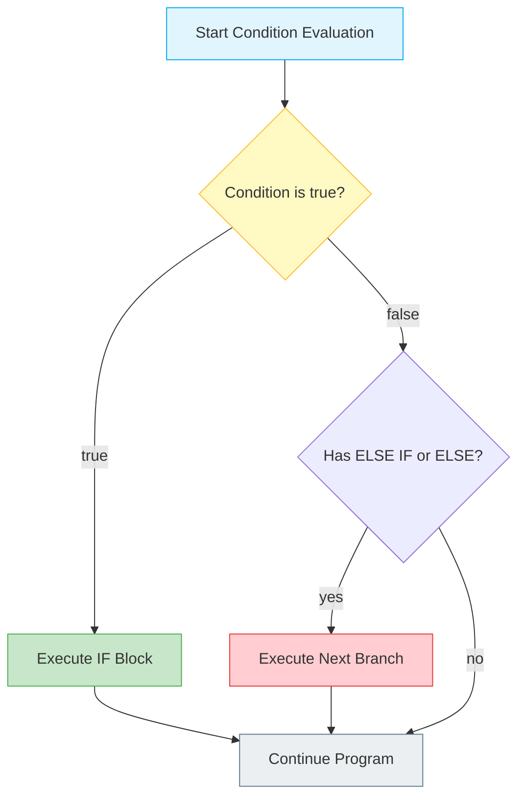
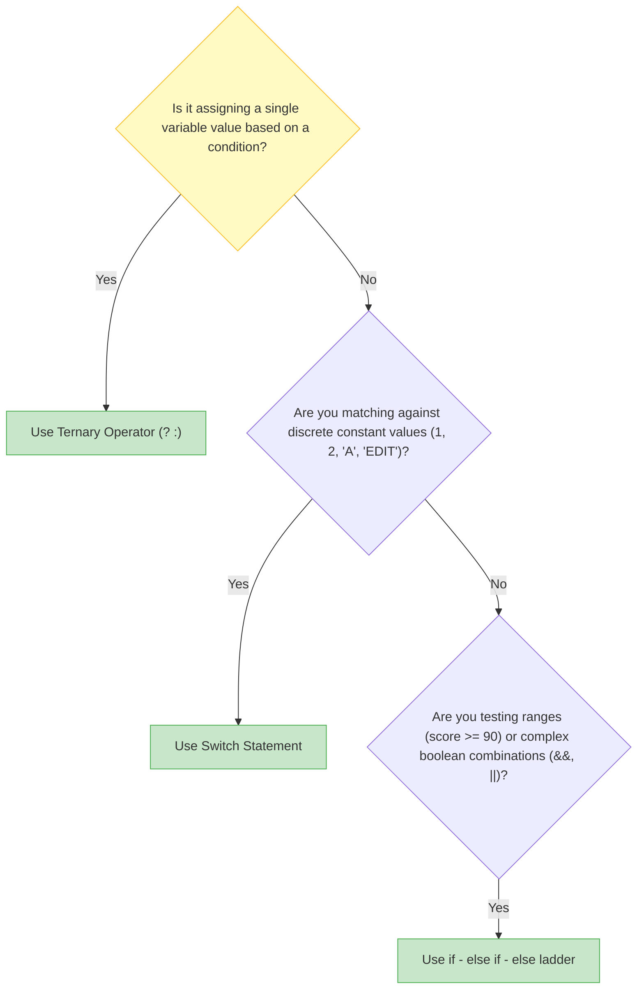
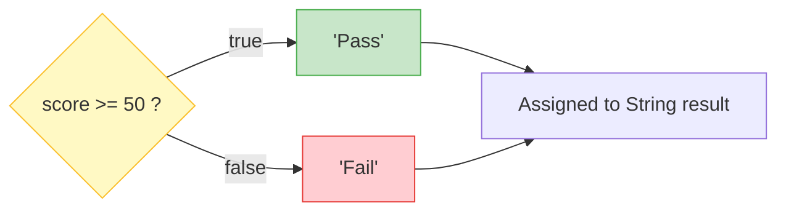

# 🔀 Module 07: Decision Making & Flow Control

> **Mastering Branching, Conditional Logic & Decision Trees in Java.** Learn how to make your code think, evaluate conditions, and branch into different paths using `if`, `if-else`, `if-else-if`, `switch`, and the ternary operator `? :`.

> ⚡ **Fast Access**: [🏠 Course Master Readme](../../../Readme.Md) &nbsp;|&nbsp; [📂 Source Directory](../../README.md) &nbsp;|&nbsp; [⬅️ Previous: Math & Random](../math_and_random/README.md) &nbsp;|&nbsp; [➡️ Next: Loops](../loops/README.md) &nbsp;|&nbsp; [📁 Folder Files](./)

---

## 📑 Table of Contents
1. [What You'll Learn](#1-what-youll-learn)
2. [Keywords & Definitions Glossary](#2-keywords--definitions-glossary)
3. [How I Code & What is the Use (Mental Model)](#3-how-i-code--what-is-the-use-mental-model)
4. [Decision Tree Architecture](#4-decision-tree-architecture)
5. [Comparing Branching Constructs](#5-comparing-branching-constructs)
6. [When to Use What? (Decision Matrix)](#6-when-to-use-what-decision-matrix)
7. [The Switch Statement: Traditional vs Modern Java 14+](#7-the-switch-statement-traditional-vs-modern-java-14)
8. [Ternary Operator Deep Dive](#8-ternary-operator-deep-dive)
9. [Line-by-Line File Guides](#9-line-by-line-file-guides)
10. [Dry-Run & Tracing Exercises](#10-dry-run--tracing-exercises)
11. [Common Pitfalls & Traps](#11-common-pitfalls--traps)

---

## 1. What You'll Learn

After completing this module, you will be able to:

- [ ] Control code execution flow using `if`, `if-else`, and `else-if` ladders
- [ ] Write compact conditional assignments using the ternary operator `? :`
- [ ] Match discrete constants with `switch` statements, understanding `case`, `break`, and `default`
- [ ] Utilize modern Java 14+ arrow switch syntax (`case X -> ...`) without fall-through
- [ ] Avoid the String comparison trap (`==` vs `.equals()`)
- [ ] Build robust user validation guard clauses

---

## 2. Keywords & Definitions Glossary

| Keyword | Category | Definition & Meaning | Code Syntax Example |
| :--- | :--- | :--- | :--- |
| `if` | Keyword | Tests a boolean expression; executes enclosed `{}` block if `true`. | `if (age >= 18) { ... }` |
| `else` | Keyword | Fallback block executed if the preceding `if` condition evaluated to `false`. | `else { ... }` |
| `else if` | Construct | Secondary condition evaluated ONLY if previous `if` or `else if` was `false`. | `else if (age >= 13) { ... }` |
| `switch` | Keyword | Multi-way branch selecting an execution path based on a variable value. | `switch (day) { ... }` |
| `case` | Keyword | Defines a target match value inside a `switch` block. | `case 1:` or `case 1 ->` |
| `break` | Keyword | Immediately terminates a `switch` statement or loop block. | `break;` |
| `default` | Keyword | Fallback case inside `switch` when no other `case` matches. | `default: ... break;` |
| `? :` | Operator | Ternary operator; inline shortcut for `if-else` returning a value. | `(x > 0) ? "Pos" : "Neg"` |

---

## 3. How I Code & What is the Use (Mental Model)

### What is the Use?
Programs need to make decisions:
- "If the user entered the correct password, log them in; otherwise show an error."
- "If score is >= 90, grade is A; if >= 80, grade is B; else grade is F."
- "If the day is 1, print Monday; if 2, print Tuesday..."

### How I Think & Code Branching Logic:
1. **Identify the Condition**: What question are we asking? Is it a boolean (`true`/`false`), a range (`score >= 90`), or a specific constant (`day == 3`)?
2. **Select the Right Construct**:
   - Simple check? → `if`
   - Either/or? → `if-else`
   - Multi-tier range? → `if-else if-else`
   - Assigning a value based on flag? → `ternary (? :)`
   - Fixed discrete options (menus, days)? → `switch`
3. **Order Conditions Carefully**: In ladders, place more specific / higher conditions first!

---

## 4. Decision Tree Architecture



---

## 5. Comparing Branching Constructs

| Construct | Syntax | Number of Branches | Best Used For |
| :--- | :--- | :--- | :--- |
| **Simple `if`** | `if (condition) { ... }` | 1 (Optional action) | Guard clauses, input validation |
| **`if - else`** | `if (cond) { ... } else { ... }` | 2 (Binary choice) | Either/or scenarios (even/odd, pass/fail) |
| **`if - else if`**| `if () ... else if () ... else` | N (Ladder) | Range-based checking (e.g. Grades: 90+, 80+, 70+) |
| **Ternary `? :`**| `(cond) ? val1 : val2` | 2 (Inline expression)| Value assignments based on boolean condition |
| **`switch`** | `switch (val) { case ... }` | N (Discrete match) | Fixed constants (Days of week, Menus, Commands) |

---

## 6. When to Use What? (Decision Matrix)



---

## 7. The Switch Statement: Traditional vs Modern Java 14+

### Traditional Switch (Requires `break`):
```java
switch (day) {
    case 1:
        System.out.println("Monday");
        break; // ⚠️ Missing break causes fall-through into case 2!
    case 2:
        System.out.println("Tuesday");
        break;
    default:
        System.out.println("Invalid day");
        break;
}
```

### Modern Arrow Switch (Java 14+ Standard):
```java
switch (day) {
    case 1 -> System.out.println("Monday"); // ✅ No break needed!
    case 2 -> System.out.println("Tuesday");
    default -> System.out.println("Invalid day");
}
```

---

## 8. Ternary Operator Deep Dive

The **ternary operator** (`? :`) is the only operator in Java that takes 3 operands:

```java
// Syntax: variable = (condition) ? value_if_true : value_if_false;
int score = 75;
String result = (score >= 50) ? "Pass" : "Fail";
System.out.println(result); // "Pass"
```



---

## 9. Line-by-Line File Guides

| File | Concepts Covered | Expected Console Output | Command to Run |
| :--- | :--- | :--- | :--- |
| [`ifstatement.java`](./ifstatement.java) | Interactive input checks, `isEmpty()`, age ranges, booleans | Evaluates user input: prints name greeting, age group, student status | `java -cp out beginner.conditional_statements.ifstatement` |
| [`ifelse_statement.java`](./ifelse_statement.java) | Binary comparison between two numbers | Compares two variables, prints which is greater | `java -cp out beginner.conditional_statements.ifelse_statement` |
| [`if_else_if.java`](./if_else_if.java) | Chained ladders vs separate independent ifs | Prints category based on tiered conditions | `java -cp out beginner.conditional_statements.if_else_if` |
| [`Ternary_operator.java`](./Ternary_operator.java) | Inline conditional expression & even/odd parity | Evaluates parity or scores with `? :` inline | `java -cp out beginner.conditional_statements.Ternary_operator` |
| [`switch_operator.java`](./switch_operator.java) | Discrete value matching, break behavior & arrow switch | `--- 1. Traditional Switch Statement ---`<br>`Wednesday`<br>`--- 2. Modern Enhanced Arrow Switch ---`<br>`Wednesday` | `java -cp out beginner.conditional_statements.switch_operator` |

---

## 10. Dry-Run & Tracing Exercises

### Trace `ifstatement.java` (Input: name="Honey", age=22, isStudent=true)

| Group | Condition Evaluated | Result | Branch Executed | Console Output |
| :--- | :--- | :--- | :--- | :--- |
| 1 | `name.isEmpty()` | `false` | `else` | `Hello Honey!` |
| 2 | `age >= 60` (22 >= 60) | `false` | Next check | — |
| 2 | `age >= 18` (22 >= 18) | `true` | `else if (age >= 18)` | `your adult` |
| 3 | `isStudent` | `true` | `if (isStudent)` | `Your are a student!` |

### Trace `switch_operator.java` (n = 3)

| Mode | Match Check | Action | Break / Fall-through? | Result |
| :--- | :--- | :--- | :--- | :--- |
| Traditional | `case 1:` (`3 == 1` -> false) | Skipped | — | — |
| Traditional | `case 2:` (`3 == 2` -> false) | Skipped | — | — |
| Traditional | `case 3:` (`3 == 3` -> true) | `println("Wednesday")` | `break;` → Exits switch | `"Wednesday"` |
| Modern Arrow | `case 3 ->` | `println("Wednesday")` | Auto-exits (no fall-through) | `"Wednesday"` |

---

## 11. Common Pitfalls & Traps

> [!CAUTION]
> ### 1. Comparing Strings with `==` instead of `.equals()`
> ```java
> String s1 = scanner.nextLine();
> if (s1 == "admin") { ... }       // ❌ WRONG! Compares memory addresses
> if (s1.equals("admin")) { ... }  // ✅ CORRECT! Compares string content
> ```

> [!WARNING]
> ### 2. Missing `break;` in Switch (Fall-Through Bug)
> Without `break;`, Java executes the next case regardless of condition:
> ```java
> switch(1) {
>     case 1: System.out.print("A"); // no break!
>     case 2: System.out.print("B"); // also runs!
> }
> // Output: "AB" (unexpected!)
> ```

> [!TIP]
> ### 3. Independent `if`s vs `else if` Ladder
> - **Separate `if` statements**: Every single condition is evaluated independently.
> - **`else if` ladder**: As soon as ONE condition matches, the rest are skipped!

---

## 📝 Full Code Walkthrough

### 📄 `src/beginner/conditional_statements/ifstatement.java`

**Purpose:** Teaches `if`, `else if`, and `else` with real input — validates a name, classifies age into categories, and checks student status.

**▶️ Run:** `java -cp out beginner.conditional_statements.ifstatement`

```java
package beginner.conditional_statements;
import java.util.Scanner;

public class ifstatement {

    public static void main(String[] args) {
        Scanner scanner = new Scanner(System.in);

        System.out.print("Enter your name: ");
        String name = scanner.nextLine();

        System.out.print("Enter your age: ");
        int age = scanner.nextInt();

        System.out.print("Are you a student (true/false): ");
        boolean isStudent = scanner.nextBoolean();

        if (name.isEmpty()) {
            System.out.println("You didn't enter your name!");
        } else {
            System.out.println("Hello " + name + "!");
        }

        if (age >= 60) {
            System.out.println("your a senior citizen");
        } else if (age >= 18) {
            System.out.println("your adult");
        } else {
            System.out.println("your not an adult 👦🏻");
        }

        if (isStudent) {
            System.out.println("Your are a student!");
        } else {
            System.out.println("Your not a student!");
        }

        scanner.close();
    }
}
```

**Line-by-line explanation:**

| Line | Code | What it does |
| :--- | :--- | :--- |
| 2 | `import java.util.Scanner;` | Imports the Scanner class for reading keyboard input. |
| 10 | `String name = scanner.nextLine();` | Reads the user's name as a full line of text. |
| 13 | `int age = scanner.nextInt();` | Reads the user's age as an integer. |
| 16 | `boolean isStudent = scanner.nextBoolean();` | **`nextBoolean()`** reads either `true` or `false` from the keyboard. **`boolean`** (lowercase) is the primitive type that holds only `true` or `false`. |
| 18 | `if (name.isEmpty()) {` | **`isEmpty()`** is a String method that returns `true` if the string has zero characters. This checks if the user pressed Enter without typing anything. |
| 20 | `} else {` | The `else` block runs when the `if` condition is `false` — meaning the name is NOT empty. |
| 24 | `if (age >= 60) {` | **`>=`** means "greater than or equal to." Checks if age is 60 or older. |
| 26 | `} else if (age >= 18) {` | **`else if`** adds another condition to check — BUT only if the previous `if` was false. This creates a **ladder**: Java checks conditions from top to bottom, and the FIRST true condition wins. Since we already know `age < 60` (the first check failed), this checks if age is 18-59. |
| 28 | `} else {` | If BOTH conditions above were false, the person is under 18. |
| 32 | `if (isStudent) {` | You can use a `boolean` variable directly in an `if` — no need to write `if (isStudent == true)`. If `isStudent` holds `true`, this block runs. |

> 🔑 **Concept:** `if-else if-else` creates a decision ladder. Conditions are checked top to bottom — the FIRST true condition runs, and all remaining branches are skipped. You can use `boolean` variables directly in `if` conditions without `== true`.

---

### 📄 `src/beginner/conditional_statements/ifelse_statement.java`

**Purpose:** Teaches the simplest two-way decision — if one thing is true, do A; otherwise, do B.

**▶️ Run:** `java -cp out beginner.conditional_statements.ifelse_statement`

```java
package beginner.conditional_statements;

public class ifelse_statement {

    public static void main(String[] args) {
        int x = 12;
        int y = 30;

        if (x > y) {
            System.out.println("x is greater than y");
        } else {
            System.out.println("x is less than y");
        }
    }
}
```

**Line-by-line explanation:**

| Line | Code | What it does |
| :--- | :--- | :--- |
| 6-7 | `int x = 12; int y = 30;` | Creates two integer variables. |
| 9 | `if (x > y) {` | Checks if `x` (12) is greater than `y` (30). `12 > 30` is `false`, so Java skips this block. |
| 11 | `} else {` | Since the `if` was false, Java runs the `else` block. |
| 12 | `System.out.println("x is less than y");` | Prints this message. |

> 🔑 **Concept:** `if-else` creates a **binary fork** — exactly ONE of the two blocks will always run. If the condition is true, the `if` block runs; if false, the `else` block runs.

---

### 📄 `src/beginner/conditional_statements/if_else_if.java`

**Purpose:** Teaches the difference between a chained `if-else if` (only one branch runs) and independent `if` statements (each is checked separately).

**▶️ Run:** `java -cp out beginner.conditional_statements.if_else_if`

```java
package beginner.conditional_statements;

public class if_else_if {

    public static void main(String[] args) {
        int h = 49;
        int b = 234;
        double c = 134.0;

        if (h > b) {
            System.out.println("honey");
            System.out.println("come in");
        } else if (b > c) {
            System.out.println("gundu");
            System.out.println("come in");
        }

        if (c < h) {
            System.out.println("complete");
        }

        System.out.println("complete");
    }
}
```

**Line-by-line explanation:**

| Line | Code | What it does |
| :--- | :--- | :--- |
| 6-8 | Variable declarations | `h = 49` (int), `b = 234` (int), `c = 134.0` (double). |
| 10 | `if (h > b)` | Checks `49 > 234` → `false`. Skips this block. |
| 13 | `else if (b > c)` | Only checked because the first `if` was false. Checks `234 > 134.0` → `true`! Java automatically converts `b` (int 234) to double for comparison with `c`. Prints "gundu" and "come in". |
| 18 | `if (c < h)` | This is a **separate, independent** `if` — NOT connected to the chain above. Checks `134.0 < 49` → `false`. Skips. |
| 22 | `System.out.println("complete");` | This line is NOT inside any `if` — it always runs no matter what. |

> 🔑 **Concept:** Chained `if-else if` blocks are **mutually exclusive** — only the first true branch executes. Independent `if` statements (without `else`) are evaluated separately — multiple can run.

---

### 📄 `src/beginner/conditional_statements/Ternary_operator.java`

**Purpose:** Teaches the ternary operator `? :` — a shortcut for simple if-else decisions in one line.

**▶️ Run:** `java -cp out beginner.conditional_statements.Ternary_operator`

```java
package beginner.conditional_statements;

public class Ternary_operator {

    public static void main(String[] args) {
        int h = 3;

        String parity = (h % 2 == 0) ? "even" : "odd";
        System.out.println("The number " + h + " is: " + parity);

        int marks = 75;
        String examResult = (marks >= 40) ? "Passed" : "Failed";
        System.out.println("Exam status: " + examResult);
    }
}
```

**Line-by-line explanation:**

| Line | Code | What it does |
| :--- | :--- | :--- |
| 6 | `int h = 3;` | A number to test for even/odd. |
| 8 | `String parity = (h % 2 == 0) ? "even" : "odd";` | This is the **ternary operator** — the syntax is: `(condition) ? valueIfTrue : valueIfFalse`. Breaking it down: `h % 2` gives the remainder when dividing by 2 (`3 % 2 = 1`). `1 == 0` is `false`. Since false, the value after the `:` is chosen → `"odd"`. |
| 11-12 | `String examResult = (marks >= 40) ? "Passed" : "Failed";` | `75 >= 40` is `true`, so `"Passed"` is selected. |

> 🔑 **Concept:** The ternary operator `(condition) ? valueIfTrue : valueIfFalse` is a compact one-line replacement for a simple if-else that assigns a value. The `?` means "then" and the `:` means "otherwise."

---

### 📄 `src/beginner/conditional_statements/switch_operator.java`

**Purpose:** Teaches the `switch` statement — a cleaner way to handle multiple specific value checks instead of many `if-else if` chains.

**▶️ Run:** `java -cp out beginner.conditional_statements.switch_operator`

```java
package beginner.conditional_statements;

public class switch_operator {

    public static void main(String[] args) {
        int n = 3;

        System.out.println("--- 1. Traditional Switch Statement ---");
        switch (n) {
            case 1:
                System.out.println("Monday");
                break;
            case 2:
                System.out.println("Tuesday");
                break;
            case 3:
                System.out.println("Wednesday");
                break;
            case 4:
                System.out.println("Thursday");
                break;
            case 5:
                System.out.println("Friday");
                break;
            case 6:
                System.out.println("Saturday");
                break;
            case 7:
                System.out.println("Sunday");
                break;
            default:
                System.out.println("Invalid day");
                break;
        }

        System.out.println("\n--- 2. Modern Enhanced Arrow Switch ---");
        switch (n) {
            case 1 -> System.out.println("Monday");
            case 2 -> System.out.println("Tuesday");
            case 3 -> System.out.println("Wednesday");
            case 4 -> System.out.println("Thursday");
            case 5 -> System.out.println("Friday");
            case 6 -> System.out.println("Saturday");
            case 7 -> System.out.println("Sunday");
            default -> System.out.println("Invalid day");
        }
    }
}
```

**Line-by-line explanation:**

| Line | Code | What it does |
| :--- | :--- | :--- |
| 6 | `int n = 3;` | The value to match against. |
| 8 | `switch (n) {` | **`switch`** is a keyword that takes a variable and jumps directly to the matching `case`. It's cleaner than writing `if (n == 1) ... else if (n == 2) ...` over and over. |
| 10 | `case 1:` | **`case`** defines a specific value to match. If `n` equals `1`, execution starts here. |
| 12 | `break;` | **`break`** is crucial! It tells Java to EXIT the switch block immediately. Without `break`, Java would "fall through" and keep running the NEXT case's code too, even though it doesn't match! |
| 31 | `default:` | **`default`** is like `else` — it runs when NO case matches. Here, it catches any number that isn't 1-7. |
| 37 | `case 1 -> System.out.println("Monday");` | This is the **modern arrow switch** (Java 14+). The **`->`** arrow syntax automatically prevents fall-through — no `break` needed! Much cleaner. |

> 🔑 **Concept:** `switch` matches a variable against specific values (cases). Traditional switch needs `break;` to prevent fall-through. Modern arrow switch (`->`) is cleaner and doesn't need `break`. Use `default` to handle unexpected values.

**⚠️ Common beginner mistakes:**
- Forgetting `break;` in traditional switch — this causes **fall-through** where multiple cases run when you only wanted one.

---

---

## 🧭 Fast Navigation

| 🏠 Course Master | 📂 Source Hub | ⬅️ Previous Module | ➡️ Next Module | 📁 Browse Folder |
| :---: | :---: | :---: | :---: | :---: |
| [Main Readme](../../../Readme.Md) | [src/ Overview](../../README.md) | [⬅️ Math & Random](../math_and_random/README.md) | [Loops ➡️](../loops/README.md) | [📁 `conditional_statements/`](./) |

