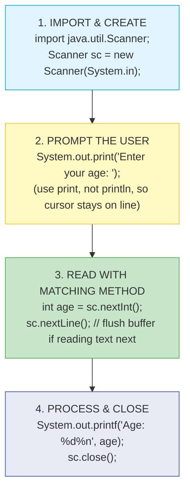

# ⌨️ Module 02: Java Terminal Input & Output

> **Mastering Standard Console I/O in Java.** Learn how to build interactive command-line interfaces using `java.util.Scanner`, manage keyboard input streams, format text cleanly, and prevent buffer bugs.

> ⚡ **Fast Access**: [🏠 Course Master Readme](../../../Readme.Md) &nbsp;|&nbsp; [📂 Source Directory](../../README.md) &nbsp;|&nbsp; [⬅️ Previous: Getting Started](../getting_started/README.md) &nbsp;|&nbsp; [➡️ Next: Variables](../variables/README.md) &nbsp;|&nbsp; [📁 Folder Files](./)

---

## 📑 Table of Contents
1. [What You'll Learn](#1-what-youll-learn)
2. [Keywords & Definitions Glossary](#2-keywords--definitions-glossary)
3. [How I Code & What is the Use (Mental Model)](#3-how-i-code--what-is-the-use-mental-model)
4. [Core Concept: Streams in Java (`System.in` & `System.out`)](#4-core-concept-streams-in-java)
5. [The Complete Scanner API Cheatsheet](#5-the-complete-scanner-api-cheatsheet)
6. [The Newline Buffer Skips Trap & Solution](#6-the-newline-buffer-skips-trap--solution)
7. [Formatting Output (`print` vs `println` vs `printf`)](#7-formatting-output)
8. [Line-by-Line File Guides](#8-line-by-line-file-guides)
9. [Dry-Run & Tracing Exercises](#9-dry-run--tracing-exercises)
10. [Common Pitfalls & Traps](#10-common-pitfalls--traps)

---

## 1. What You'll Learn

After completing this module, you will be able to:

- [ ] Import and instantiate `java.util.Scanner` to capture keyboard input
- [ ] Read various primitive data types (`int`, `double`, `boolean`) and `String` from terminal
- [ ] Differentiate between token-based reading (`next()`, `nextInt()`) and line-based reading (`nextLine()`)
- [ ] Diagnose, explain, and fix the infamous Scanner newline buffer skip bug
- [ ] Use `System.out.printf()` with format specifiers to generate clean, tabular reports
- [ ] Safely close I/O streams using `.close()` to prevent operating system resource leaks

---

## 2. Keywords & Definitions Glossary

| Keyword / Symbol | Category | What it Means | How to Use / Code Example |
| :--- | :--- | :--- | :--- |
| `import` | Keyword | Brings external classes from packages into your Java file. | `import java.util.Scanner;` |
| `package` | Keyword | Defines the namespace/folder containing this file. | `package input_output;` |
| `new` | Keyword | Allocates dynamic memory on the Heap for a new object. | `Scanner sc = new Scanner(System.in);` |
| `System.in` | Built-in Field | Standard `InputStream` representing the keyboard input. | `new Scanner(System.in)` |
| `System.out` | Built-in Field | Standard `PrintStream` representing the terminal console screen. | `System.out.println("Hi");` |
| `nextLine()` | Method | Reads characters from buffer up to the next Enter/newline (`\n`). | `String line = sc.nextLine();` |
| `nextInt()` | Method | Scans and parses the next token as a 32-bit `int`. | `int age = sc.nextInt();` |
| `nextDouble()` | Method | Scans and parses the next token as a 64-bit `double`. | `double wt = sc.nextDouble();` |
| `close()` | Method | Closes the underlying stream and frees system resources. | `sc.close();` |

---

## 3. How I Code & What is the Use (Mental Model)

### What is the Use?
Real applications are rarely static. They require user input — usernames, ages, menu selections, search terms, quantities. Console I/O allows your Java program to become **interactive**.

### The 4-Step Input Pattern:


---

## 4. Core Concept: Streams in Java

Java handles input and output through **streams** (continuous sequences of data bytes):


---

## 5. The Complete Scanner API Cheatsheet

| Method | What it Reads | Stops At | Example Input | Returned Value |
| :--- | :--- | :--- | :--- | :--- |
| `nextLine()` | Full line of text | Newline (`\n`) | `John Doe 123` | `"John Doe 123"` (`String`) |
| `next()` | Single word | Whitespace / Space | `John Doe` | `"John"` (`String`) |
| `nextInt()` | Integer | Whitespace / Newline | `42` | `42` (`int`) |
| `nextLong()` | Large integer | Whitespace / Newline | `9876543210` | `9876543210L` (`long`) |
| `nextFloat()` | Single float | Whitespace / Newline | `3.14` | `3.14f` (`float`) |
| `nextDouble()`| Double decimal | Whitespace / Newline | `99.99` | `99.99` (`double`) |
| `nextBoolean()`| Boolean flag | Whitespace / Newline | `true` | `true` (`boolean`) |

---

## 6. The Newline Buffer Skips Trap & Solution

### Why it happens:
When reading numbers (`nextInt()`, `nextDouble()`), Scanner parses only the numeric digits. The newline character `\n` generated when the user pressed `[Enter]` is left behind in the buffer.

```
Buffer: [ '2' ] [ '5' ] [ '\n' ]
           ▲
        nextInt() reads '2' and '5'
Buffer after nextInt(): [ '\n' ]  <-- LEFTOVER!
Next nextLine() reads up to '\n' immediately -> returns "" (empty string)!
```

### 💡 The Solution:
```java
int age = scanner.nextInt();
scanner.nextLine(); // 🧹 FLUSH: Consumes the leftover '\n'
String name = scanner.nextLine(); // ✅ Now waits properly for the name!
```

---

## 7. Formatting Output (`print` vs `println` vs `printf`)

| Method | Behavior | Example | Output |
| :--- | :--- | :--- | :--- |
| `print()` | Prints text, keeps cursor on same line | `System.out.print("Enter: ");` | `Enter: _` |
| `println()`| Prints text, moves cursor to next line | `System.out.println("Done");` | `Done\n` |
| `printf()` | Formats text with format specifiers | `System.out.printf("Pi: %.2f", Math.PI);` | `Pi: 3.14` |

### Common `printf` Format Specifiers:
| Specifier | Data Type | Example | Formatted Output |
| :--- | :--- | :--- | :--- |
| `%s` | String | `printf("%s", "Java")` | `Java` |
| `%d` | Integer (decimal) | `printf("%d", 42)` | `42` |
| `%f` | Floating-point | `printf("%.2f", 3.14159)` | `3.14` |
| `%c` | Character | `printf("%c", '₹')` | `₹` |
| `%b` | Boolean | `printf("%b", true)` | `true` |
| `%n` | Platform newline | `printf("Hello%nWorld")` | `Hello\nWorld` |
| `%-10s` | Left-padded width 10 | `printf("%-10s", "Book")` | `Book      ` |

---

## 8. Line-by-Line File Guides

| File | Concepts Covered | Expected Console Output | Command to Run |
| :--- | :--- | :--- | :--- |
| [`ScannerInput.java`](./ScannerInput.java) | Interactive multi-type terminal reading pattern (`String`, `int`, `double`) | `Enter your name: Honey`<br>`Enter your age: 22`<br>`Your height (in feet): 5.9`<br>`The person name is Honey, his age is 22 years, and his height is 5.9 feet.` | `java -cp out beginner.input_output.ScannerInput` |
| [`scanner.java`](./scanner.java) | Reading variables, basic arithmetic & formatted output | Interactive user prompt and summary card | `java -cp out beginner.input_output.scanner` |

---

## 9. Dry-Run & Tracing Exercises

### Trace `ScannerInput.java` (User: Name="Honey", Age=22, Height=5.9)

| Step | Line of Code | User Action | Buffer State | Variable Value | Console Display |
| :--- | :--- | :--- | :--- | :--- | :--- |
| 1 | `Scanner scanner = new Scanner(System.in)` | — | Empty | `scanner` created | — |
| 2 | `System.out.print("Enter your name: ")` | — | — | — | `Enter your name: ` |
| 3 | `String name = scanner.nextLine()` | Types `"Honey↵"` | `""` | `name = "Honey"` | — |
| 4 | `System.out.print("Enter your age: ")` | — | — | — | `Enter your age: ` |
| 5 | `int age = scanner.nextInt()` | Types `"22↵"` | `"\n"` | `age = 22` | — |
| 6 | `System.out.print("Your height (in feet): ")` | — | — | — | `Your height (in feet): ` |
| 7 | `double height = scanner.nextDouble()` | Types `"5.9↵"` | `""` | `height = 5.9` | — |
| 8 | `System.out.println(...)` | — | — | — | `The person name is Honey, his age is 22 years, and his height is 5.9 feet.` |
| 9 | `scanner.close()` | — | Closed | Stream released | — |

---

## 10. Common Pitfalls & Traps

> [!WARNING]
> ### 1. InputMismatchException
> If the user types text when `nextInt()` is called (e.g. typing `"twenty"` instead of `20`), Java throws an `InputMismatchException` and crashes immediately.

> [!CAUTION]
> ### 2. Closing `System.in` Permanently
> Calling `scanner.close()` also closes `System.in`. If you create a second `Scanner(System.in)` later in the program, it will fail with `NoSuchElementException`! Close your scanner once at the very end of your program.

> [!NOTE]
> ### 3. Prompting Before Reading
> Always print a prompt before calling a `scanner.next*()` method. Without a prompt, the terminal will sit blank and blinking, making users think the program has frozen.

---

## 📝 Full Code Walkthrough

### 📄 `src/beginner/input_output/scanner.java`

**Purpose:** Teaches how to use the `Scanner` class to read a person's name, age, and height from the keyboard.

**▶️ Run:** `java -cp out beginner.input_output.scanner`

```java
package beginner.input_output;
import java.util.Scanner;

public class scanner {

    public static void main(String[] args) {
        Scanner scanner = new Scanner(System.in);

        System.out.print("Enter your name: ");
        String name = scanner.nextLine();

        System.out.print("Enter your age: ");
        int age = scanner.nextInt();

        System.out.print("Your height (in feet): ");
        double height = scanner.nextDouble();

        System.out.println("The person name is " + name + ", age is " + age + " years, and height is " + height + " feet.");

        scanner.close();
    }
}
```

**Line-by-line explanation:**

| Line | Code | What it does |
| :--- | :--- | :--- |
| 2 | `import java.util.Scanner;` | **`import`** is a keyword that brings in classes from other packages so you can use them. **`java.util.Scanner`** is a built-in class that lets you read input from the keyboard. Without this import, Java wouldn't know what `Scanner` is. |
| 7 | `Scanner scanner = new Scanner(System.in);` | **`new`** is a keyword that creates a new object in memory (on the Heap). **`Scanner(System.in)`** creates a Scanner that is connected to **`System.in`** — the standard input stream (your keyboard). The variable `scanner` (lowercase) is a reference that points to this new Scanner object. |
| 9 | `System.out.print("Enter your name: ");` | **`print`** (without `ln`) prints text WITHOUT moving to a new line — the cursor stays on the same line, so the user's input appears right after the colon. |
| 10 | `String name = scanner.nextLine();` | **`nextLine()`** reads an entire line of text that the user types (everything until they press Enter). The text is stored in the `name` variable. |
| 13 | `int age = scanner.nextInt();` | **`nextInt()`** reads the next integer number the user types. If the user types letters instead of a number, the program will crash with an error. |
| 16 | `double height = scanner.nextDouble();` | **`nextDouble()`** reads the next decimal number. |
| 18 | `System.out.println(...)` | Prints a formatted summary combining all the variables with text using `+` concatenation. |
| 20 | `scanner.close();` | **`close()`** releases the input stream resource. It's good practice to close a Scanner when you're done with it to free up system resources. |

> 🔑 **Concept:** The `Scanner` class reads user input from the keyboard. Use `nextLine()` for text, `nextInt()` for whole numbers, and `nextDouble()` for decimals. Always `import java.util.Scanner` at the top and `close()` the scanner when done.

**⚠️ Common beginner mistakes:**
- **The newline bug:** After calling `nextInt()` or `nextDouble()`, a hidden newline character `\n` is left in the buffer. If you call `nextLine()` right after, it reads that empty newline instead of waiting for input. Fix: add an extra `scanner.nextLine();` to flush the buffer after reading a number.

---

### 📄 `src/beginner/input_output/ScannerInput.java`

**Purpose:** Another example of reading multiple types of input — reinforces the Scanner pattern.

**▶️ Run:** `java -cp out beginner.input_output.ScannerInput`

```java
package beginner.input_output;
import java.util.Scanner;

public class ScannerInput {

    public static void main(String[] args) {
        Scanner scanner = new Scanner(System.in);

        System.out.print("Enter your name: ");
        String name = scanner.nextLine();

        System.out.print("Enter your age: ");
        int age = scanner.nextInt();

        System.out.print("Your height (in feet): ");
        double height = scanner.nextDouble();

        System.out.println("The person name is " + name + ", his age is " + age + " years, and his height is " + height + " feet.");

        scanner.close();
    }
}
```

**Line-by-line explanation:**

This file follows the same pattern as `scanner.java` above. The key steps are:

1. **Import** Scanner → **Create** a Scanner object → **Prompt** the user → **Read** the input → **Display** the result → **Close** the scanner.

The important Scanner methods used here:
- `scanner.nextLine()` → reads a full line of text (String)
- `scanner.nextInt()` → reads a whole number (int)
- `scanner.nextDouble()` → reads a decimal number (double)

> 🔑 **Concept:** The 4-step input pattern: (1) Create Scanner, (2) Print a prompt, (3) Read input with the matching method, (4) Close the Scanner. Always read the String FIRST before numbers to avoid the newline buffer issue.

---

---

## 🧭 Fast Navigation

| 🏠 Course Master | 📂 Source Hub | ⬅️ Previous Module | ➡️ Next Module | 📁 Browse Folder |
| :---: | :---: | :---: | :---: | :---: |
| [Main Readme](../../../Readme.Md) | [src/ Overview](../../README.md) | [⬅️ Getting Started](../getting_started/README.md) | [Variables ➡️](../variables/README.md) | [📁 `input_output/`](./) |

