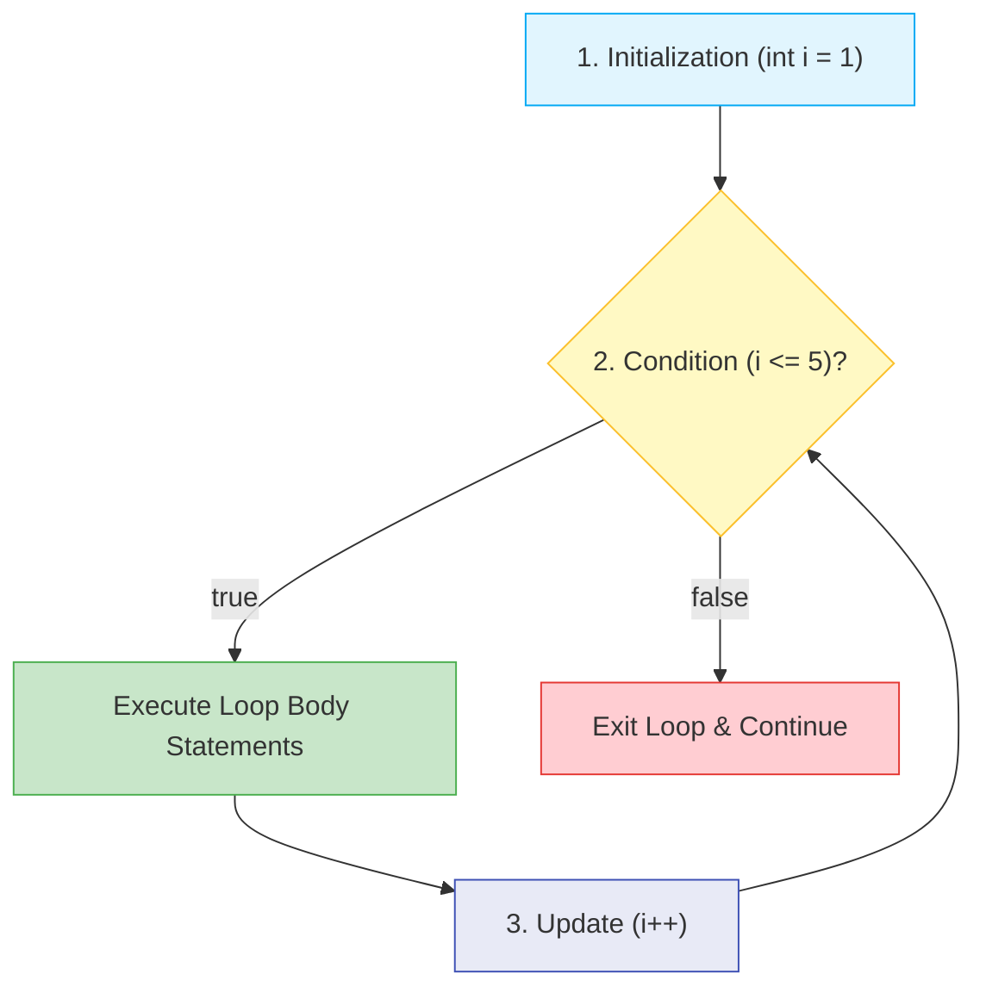
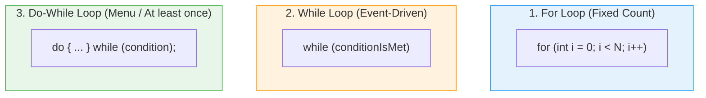
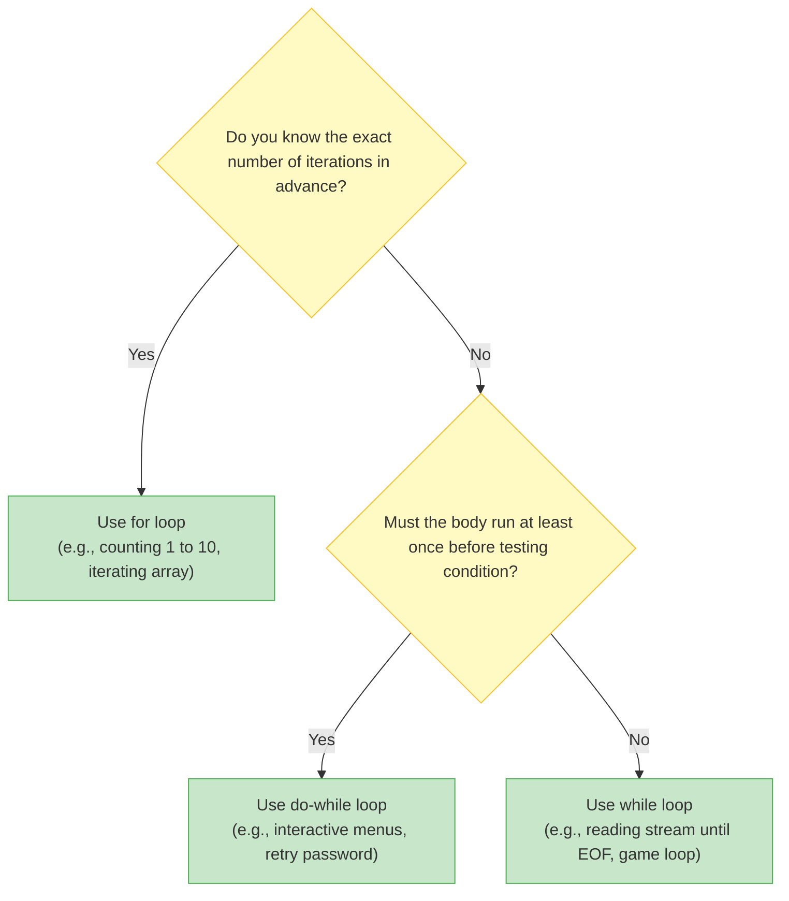

# 🔁 Module 08: Loops & Iteration

> **Mastering Iteration, Repetition & Loop Traversal in Java.** Learn how to automate repetitive tasks deterministically and efficiently using `for`, `while`, and `do-while` loops, plus loop control with `break` and `continue`.

> ⚡ **Fast Access**: [🏠 Course Master Readme](../../../Readme.Md) &nbsp;|&nbsp; [📂 Source Directory](../../README.md) &nbsp;|&nbsp; [⬅️ Previous: Conditionals](../conditional_statements/README.md) &nbsp;|&nbsp; [➡️ Next: Practice Projects](../../intermediate/practice_projects/README.md) &nbsp;|&nbsp; [📁 Folder Files](./)

---

## 📑 Table of Contents
1. [What You'll Learn](#1-what-youll-learn)
2. [Keywords & Definitions Glossary](#2-keywords--definitions-glossary)
3. [How I Code & What is the Use (Mental Model)](#3-how-i-code--what-is-the-use-mental-model)
4. [Core Concept: The Three Loop Types](#4-core-concept-the-three-loop-types)
5. [Visual Loop Decision Flowchart](#5-visual-loop-decision-flowchart)
6. [Loop Comparison & Guarantees](#6-loop-comparison--guarantees)
7. [Nested Loops & Matrix / Grid Traversal](#7-nested-loops--matrix--grid-traversal)
8. [Loop Control: `break` vs `continue`](#8-loop-control-break-vs-continue)
9. [Line-by-Line File Guides](#9-line-by-line-file-guides)
10. [Dry-Run & Tracing Exercises](#10-dry-run--tracing-exercises)
11. [Common Pitfalls & Infinite Loops](#11-common-pitfalls--infinite-loops)

---

## 1. What You'll Learn

After completing this module, you will be able to:

- [ ] Write counting loops with `for (init; condition; update)`
- [ ] Write condition-driven loops with `while (condition)`
- [ ] Write post-condition loops guaranteed to run at least once with `do { ... } while (cond);`
- [ ] Nest loops for multi-dimensional grid and timetable traversal
- [ ] Interrupt or skip iterations using `break` and `continue`
- [ ] Detect and eliminate infinite loops and off-by-one errors

---

## 2. Keywords & Definitions Glossary

| Keyword | Category | Definition & Meaning | Code Syntax Example |
| :--- | :--- | :--- | :--- |
| `for` | Keyword | Entry-controlled loop with built-in counter initialization, condition, and step increment. | `for (int i = 0; i < 5; i++)` |
| `while` | Keyword | Entry-controlled loop running repeatedly as long as condition remains `true`. | `while (count < 10)` |
| `do` | Keyword | Precedes the loop body in a `do-while` construct; executes body first before condition check. | `do { ... } while (x > 0);` |
| `break` | Keyword | Forcefully jumps completely out of the innermost enclosing loop or switch. | `if (i == 5) break;` |
| `continue` | Keyword | Skips the remainder of the current iteration and jumps directly to the next cycle. | `if (i % 2 == 0) continue;` |

---

## 3. How I Code & What is the Use (Mental Model)

### What is the Use?
Without loops, doing something 1,000 times would require 1,000 lines of code. Loops allow you to execute a block of code $N$ times or until a specific event happens (like user typing "exit").

### The 3 Core Components of Every Loop:
Every loop requires three things to work properly:
1. **Initialization**: Where do we start? (`int i = 0;`)
2. **Condition**: When do we keep going? (`i < 10;`)
3. **Update / Increment**: How do we make progress toward the end? (`i++`)



---

## 4. Core Concept: The Three Loop Types



---

## 5. Visual Loop Decision Flowchart



---

## 6. Loop Comparison & Guarantees

| Feature | `for` Loop | `while` Loop | `do-while` Loop |
| :--- | :--- | :--- | :--- |
| **Check Timing** | Entry-controlled (Before body) | Entry-controlled (Before body) | **Exit-controlled (After body)** |
| **Minimum Iterations**| `0` | `0` | **`1` (Guaranteed!)** |
| **Variable Scope** | Local to loop if declared in header | Declared outside | Declared outside |
| **Trailing Semicolon**| No | No | **Yes: `while(...);`** |
| **Best Used When** | Known iterations, iterating arrays | Unknown count, event waiting | Interactive menus, input validation prompts |

---

## 7. Nested Loops & Matrix / Grid Traversal

When a loop is placed inside another loop:
- The **outer loop** advances once per full run of the inner loop.
- Total iterations = `OuterIterations × InnerIterations`.

```java
for (int day = 1; day <= 5; day++) {
    System.out.println("Day " + day);
    for (int hour = 9; hour <= 17; hour++) {
        System.out.println("  " + hour + ":00 - Active");
    }
}
```

---

## 8. Loop Control: `break` vs `continue`

| Statement | What it Does | Analogy |
| :--- | :--- | :--- |
| `break;` | **Terminates the entire loop immediately** and moves to the next statement outside the loop. | Emergency stop button on a treadmill. |
| `continue;` | **Skips the rest of the current iteration** and jumps directly to the next cycle. | Skipping a song in a playlist. |

```java
for (int i = 1; i <= 5; i++) {
    if (i == 3) continue; // Skips 3!
    if (i == 5) break;    // Stops before printing 5!
    System.out.print(i + " ");
}
// Output: 1 2 4
```

---

## 9. Line-by-Line File Guides

| File | Concepts Covered | Expected Console Output | Command to Run |
| :--- | :--- | :--- | :--- |
| [`For_loop.java`](./For_loop.java) | Standard `for(init; cond; update)` & nested task loops | Prints counting iterations and nested schedules | `java -cp out beginner.loops.For_loop` |
| [`while_loop.java`](./while_loop.java) | Pre-condition loop, inner token generation, manual `i++` | Prints loop counts and nested inner statements | `java -cp out beginner.loops.while_loop` |
| [`Do_while_loop.java`](./Do_while_loop.java) | Post-condition loop with guaranteed minimum 1 execution | Executes at least once even if condition starts false | `java -cp out beginner.loops.Do_while_loop` |

---

## 10. Dry-Run & Tracing Exercises

### Trace `For_loop.java` (Counting 1 to 4)

| Step | `i` Value | Condition `i <= 4` | Action | Update (`i++`) | Next `i` |
| :--- | :--- | :--- | :--- | :--- | :--- |
| 1 | `1` | `true` | Print "Day 1" | `1 + 1` | `2` |
| 2 | `2` | `true` | Print "Day 2" | `2 + 1` | `3` |
| 3 | `3` | `true` | Print "Day 3" | `3 + 1` | `4` |
| 4 | `4` | `true` | Print "Day 4" | `4 + 1` | `5` |
| 5 | `5` | `false` | **Exit loop** | — | — |

---

## 11. Common Pitfalls & Infinite Loops

> [!CAUTION]
> ### 1. Forgetting the Counter Increment in While Loops
> ```java
> int i = 1;
> while (i <= 5) {
>     System.out.println(i);
>     // Missing i++; -> i is ALWAYS 1, loop runs FOREVER!
> }
> ```

> [!WARNING]
> ### 2. The Accidental Semicolon Trap
> ```java
> for (int i = 0; i < 5; i++); // ⚠️ Semicolon terminates loop body!
> {
>     System.out.println("Hello"); // Runs ONLY ONCE after loop finishes!
> }
> ```

> [!TIP]
> ### 3. Off-by-One Errors
> - `i < 5` runs for `i = 0, 1, 2, 3, 4` (exactly **5 times**)
> - `i <= 5` starting at 0 runs for `i = 0, 1, 2, 3, 4, 5` (exactly **6 times**)

---

## 📝 Full Code Walkthrough

### 📄 `src/beginner/loops/For_loop.java`

**Purpose:** Teaches the `for` loop — repeating code a set number of times — and nested loops (a loop inside a loop).

**▶️ Run:** `java -cp out beginner.loops.For_loop`

```java
package beginner.loops;

public class For_loop {

    public static void main(String[] args) {
        for (int i = 1; i <= 5; i++) {
            System.out.println("Day " + i);

            for (int j = 1; j <= 1; j++) {
                System.out.println("  Task " + j + ": Review Java Notes");
            }
        }
    }
}
```

**Line-by-line explanation:**

| Line | Code | What it does |
| :--- | :--- | :--- |
| 6 | `for (int i = 1; i <= 5; i++) {` | The **`for`** loop has three parts separated by semicolons: **(1) Initialization** `int i = 1` — creates a counter variable `i` starting at 1, runs once. **(2) Condition** `i <= 5` — checked BEFORE each iteration; if `false`, the loop stops. **(3) Update** `i++` — runs AFTER each iteration, increases `i` by 1. So this loop runs 5 times with i = 1, 2, 3, 4, 5. |
| 7 | `System.out.println("Day " + i);` | Prints the current day number. On the first pass, prints "Day 1". |
| 9 | `for (int j = 1; j <= 1; j++) {` | A **nested loop** (loop inside a loop). This inner loop runs completely for EACH iteration of the outer loop. Here it only runs once (`j` goes from 1 to 1). Think of it like a clock: the outer loop is the hour hand, the inner loop is the minute hand — the minute hand completes a full cycle for every tick of the hour hand. |
| 10 | `System.out.println("  Task " + j + ...);` | Prints the task for each day. The two spaces `"  "` at the start create indentation to visually show it's inside the day. |

> 🔑 **Concept:** A `for` loop repeats code a known number of times. It has three parts: initialization, condition, and update. Nested loops run the inner loop completely for each iteration of the outer loop.

**⚠️ Common beginner mistakes:**
- Off-by-one errors: using `<` when you mean `<=`, or starting at 0 when you mean 1.
- Forgetting that `i++` runs AFTER the body, not before.

---

### 📄 `src/beginner/loops/while_loop.java`

**Purpose:** Teaches the `while` loop — repeating code as long as a condition remains true.

**▶️ Run:** `java -cp out beginner.loops.while_loop`

```java
package beginner.loops;

public class while_loop {

    public static void main(String[] args) {
        int i = 1;

        while (i <= 5) {
            System.out.println("Honey " + i);

            int j = 1;
            while (j <= 1) {
                System.out.println("  Reddy " + j);
                j++;
            }

            i++;
        }
    }
}
```

**Line-by-line explanation:**

| Line | Code | What it does |
| :--- | :--- | :--- |
| 6 | `int i = 1;` | Initialize the counter OUTSIDE the loop (unlike `for` where it's in the header). |
| 8 | `while (i <= 5) {` | **`while`** checks the condition BEFORE each iteration. If `i <= 5` is `true`, the loop body runs. If it's `false` from the start, the body runs **zero times**. |
| 9 | `System.out.println("Honey " + i);` | Prints the current value of `i`. |
| 11-14 | Inner while loop | Another while loop nested inside. `j` starts at 1, prints "Reddy 1", then `j++` makes `j = 2`, and `2 <= 1` is false so it stops. |
| 17 | `i++;` | **CRITICAL:** You must manually increment the counter! If you forget this line, `i` stays at 1 forever and the loop runs infinitely — your program will freeze. |

> 🔑 **Concept:** A `while` loop checks its condition FIRST. If the condition is false from the beginning, the loop body never runs (zero iterations). You must manually update the counter variable inside the loop body — forgetting this creates an infinite loop!

**⚠️ Common beginner mistakes:**
- Forgetting `i++` inside the loop body — this creates an infinite loop that never ends.

---

### 📄 `src/beginner/loops/Do_while_loop.java`

**Purpose:** Teaches the `do-while` loop — runs the code at least once, then checks the condition.

**▶️ Run:** `java -cp out beginner.loops.Do_while_loop`

```java
package beginner.loops;

public class Do_while_loop {

    public static void main(String[] args) {
        int i = 6;

        do {
            System.out.println("Current value of i: " + i);
            i++;
        } while (i <= 5);

        System.out.println("Loop terminated. Final i = " + i);
    }
}
```

**Line-by-line explanation:**

| Line | Code | What it does |
| :--- | :--- | :--- |
| 6 | `int i = 6;` | Start at 6 — notice this is ALREADY greater than 5! |
| 8 | `do {` | **`do`** starts a do-while loop. The body inside `{ }` runs FIRST, before any condition is checked. |
| 9 | `System.out.println("Current value of i: " + i);` | Prints `6`. This line executes even though `i` is already past the limit! That's the whole point of do-while. |
| 10 | `i++;` | Increments `i` from 6 to 7. |
| 11 | `} while (i <= 5);` | NOW the condition is checked: `7 <= 5` is `false`, so the loop stops. **Important:** notice the semicolon `;` after the closing parenthesis — this is required for do-while (but not for regular while). |
| 13 | `System.out.println("Loop terminated. Final i = " + i);` | Prints that `i` is now 7. The loop body ran exactly **once**. |

> 🔑 **Concept:** A `do-while` loop runs the body FIRST, then checks the condition. This guarantees **at least one execution**, even if the condition is false from the start. Perfect for menus or "try at least once" scenarios.

**⚠️ Common beginner mistakes:**
- Forgetting the semicolon `;` after `while(condition);` — `do-while` requires it, unlike regular `while`.

---

---

## 🧭 Fast Navigation

| 🏠 Course Master | 📂 Source Hub | ⬅️ Previous Module | ➡️ Next Module | 📁 Browse Folder |
| :---: | :---: | :---: | :---: | :---: |
| [Main Readme](../../../Readme.Md) | [src/ Overview](../../README.md) | [⬅️ Conditionals](../conditional_statements/README.md) | [Practice Projects ➡️](../../intermediate/practice_projects/README.md) | [📁 `loops/`](./) |

