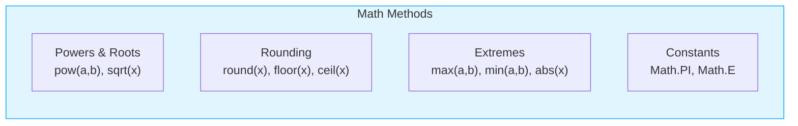
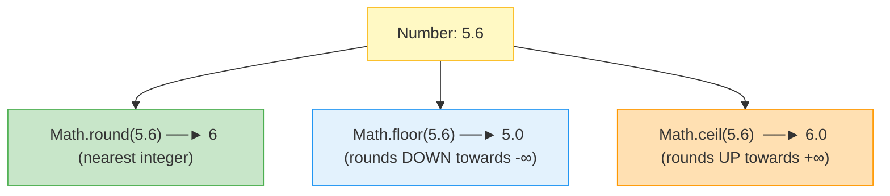

# 🎲 Module 06: Math & Random Number Utilities

> **Mastering the Math API & Randomization in Java.** Learn how to perform complex mathematical formulas, powers, roots, trigonometry, rounding, and pseudo-random number generation using Java's built-in utilities.

> ⚡ **Fast Access**: [🏠 Course Master Readme](../../../Readme.Md) &nbsp;|&nbsp; [📂 Source Directory](../../README.md) &nbsp;|&nbsp; [⬅️ Previous: Operators](../operators/README.md) &nbsp;|&nbsp; [➡️ Next: Conditionals](../conditional_statements/README.md) &nbsp;|&nbsp; [📁 Folder Files](./)

---

## 📑 Table of Contents
1. [What You'll Learn](#1-what-youll-learn)
2. [Keywords & Definitions Glossary](#2-keywords--definitions-glossary)
3. [How I Code & What is the Use (Mental Model)](#3-how-i-code--what-is-the-use-mental-model)
4. [The Complete `Math` Class Reference](#4-the-complete-math-class-reference)
5. [Rounding Methods Comparison (`round` vs `floor` vs `ceil`)](#5-rounding-methods-comparison)
6. [Pseudo-Random Generation with `java.util.Random`](#6-pseudo-random-generation-with-javautilrandom)
7. [Real-World Formulas & Examples](#7-real-world-formulas--examples)
8. [Line-by-Line File Guides](#8-line-by-line-file-guides)
9. [Dry-Run & Tracing Exercises](#9-dry-run--tracing-exercises)
10. [Common Pitfalls & Traps](#10-common-pitfalls--traps)

---

## 1. What You'll Learn

After completing this module, you will be able to:

- [ ] Use `Math.PI` and `Math.E` mathematical constants
- [ ] Calculate square roots (`Math.sqrt`) and exponents (`Math.pow`)
- [ ] Differentiate between `Math.round()`, `Math.floor()`, and `Math.ceil()`
- [ ] Generate bounded random integers, doubles, and booleans using `java.util.Random`
- [ ] Translate complex mathematical equations into clean Java expressions

---

## 2. Keywords & Definitions Glossary

| Keyword / Class | Category | Definition & Meaning | Code Syntax Example |
| :--- | :--- | :--- | :--- |
| `Math` | Standard Class | Built-in utility class in `java.lang` containing static math methods. No `new` needed. | `Math.sqrt(25)` |
| `Random` | Standard Class | Pseudo-random number generator in `java.util` package. Requires instantiation with `new`. | `Random r = new Random();` |
| `static` | Modifier | In `Math`, all methods are static, meaning they belong to the class and are called directly. | `Math.pow(2, 3)` |
| `nextInt()` | Method | Returns a uniformly distributed pseudo-random `int` value. | `rand.nextInt(1, 7)` |
| `nextDouble()` | Method | Returns a random `double` between `0.0` (inclusive) and `1.0` (exclusive). | `rand.nextDouble()` |

---

## 3. How I Code & What is the Use (Mental Model)

### What is the Use?
1. **Financial & Engineering Calculations**: Calculating areas, distances, compound interest, roots.
2. **Game Development & Simulations**: Rolling dice, shuffling cards, spawning enemies at random positions.
3. **Security & Tokens**: Generating temporary codes, OTPs, or testing datasets.

### How I Call Math vs Random:
- `Math` is **static**: You call methods directly on the class (`Math.sqrt()`). You NEVER do `new Math()`.
- `Random` is an **instantiable class**: You MUST create an object (`Random rand = new Random()`) before generating numbers.

---

## 4. The Complete `Math` Class Reference



| Method | Parameters | Return Type | What it Does | Example |
| :--- | :--- | :--- | :--- | :--- |
| `Math.PI` | Constant | `double` | Circle constant $\pi \approx 3.14159265$ | `Math.PI` |
| `Math.E` | Constant | `double` | Natural log base $e \approx 2.71828$ | `Math.E` |
| `Math.pow(a, b)` | `double a, double b` | `double` | Calculates $a^b$ ($a$ to the power of $b$) | `Math.pow(2, 5)` → `32.0` |
| `Math.sqrt(x)` | `double x` | `double` | Calculates $\sqrt{x}$ | `Math.sqrt(64)` → `8.0` |
| `Math.abs(x)` | `int / double` | same type | Absolute value $|x|$ | `Math.abs(-45)` → `45` |
| `Math.max(a, b)`| `a, b` | same type | Returns larger of $a$ and $b$ | `Math.max(25, 80)` → `80` |
| `Math.min(a, b)`| `a, b` | same type | Returns smaller of $a$ and $b$ | `Math.min(25, 80)` → `25` |
| `Math.round(x)`| `double / float` | `long / int` | Rounds to nearest whole integer | `Math.round(5.6)` → `6` |
| `Math.floor(x)`| `double` | `double` | Rounds DOWN to whole integer | `Math.floor(5.9)` → `5.0` |
| `Math.ceil(x)` | `double` | `double` | Rounds UP to whole integer | `Math.ceil(5.1)` → `6.0` |

---

## 5. Rounding Methods Comparison



| Input Value | `Math.round()` | `Math.floor()` | `Math.ceil()` |
| :---: | :---: | :---: | :---: |
| `5.1` | `5` | `5.0` | `6.0` |
| `5.5` | `6` | `5.0` | `6.0` |
| `5.9` | `6` | `5.0` | `6.0` |
| `-2.3` | `-2` | `-3.0` | `-2.0` |

---

## 6. Pseudo-Random Generation with `java.util.Random`

```java
import java.util.Random;

Random rand = new Random();

// 1. Random integer in range [min, max] inclusive (Java 17+):
int diceRoll = rand.nextInt(1, 7); // Generates 1, 2, 3, 4, 5, or 6

// 2. Random decimal between 0.0 and 1.0:
double probability = rand.nextDouble();

// 3. Random coin flip:
boolean coinHeads = rand.nextBoolean();
```

---

## 7. Real-World Formulas & Examples

### 1. Distance Formula: $d = \sqrt{(x_2 - x_1)^2 + (y_2 - y_1)^2}$
```java
double distance = Math.sqrt(Math.pow(x2 - x1, 2) + Math.pow(y2 - y1, 2));
```

### 2. Hypotenuse of a Right Triangle: $c = \sqrt{a^2 + b^2}$
```java
double a = 3.0, b = 4.0;
double c = Math.sqrt(Math.pow(a, 2) + Math.pow(b, 2)); // c = 5.0
```

### 3. Circle Area: $Area = \pi r^2$
```java
double radius = 5.0;
double area = Math.PI * Math.pow(radius, 2);
```

---

## 8. Line-by-Line File Guides

| File | Concepts Covered | Expected Console Output | Command to Run |
| :--- | :--- | :--- | :--- |
| [`math.java`](./math.java) | `Math.PI`, `Math.E`, `sqrt`, `pow`, `abs`, `round`, `floor`, `ceil` | Prints values for all standard math functions and constants | `java -cp out beginner.math_and_random.math` |
| [`randomnumbers.java`](./randomnumbers.java) | `Random.nextInt(origin, bound)`, dice rolls, booleans | Generates random numbers, simulated dice rolls, and flags | `java -cp out beginner.math_and_random.randomnumbers` |

---

## 9. Dry-Run & Tracing Exercises

### Trace `math.java` Computations:

| Expression | Inner Operation | Mathematical Meaning | Result |
| :--- | :--- | :--- | :--- |
| `Math.pow(2, 5)` | $2^5$ | $2 \times 2 \times 2 \times 2 \times 2$ | `32.0` |
| `Math.sqrt(64.0)` | $\sqrt{64}$ | Square root of 64 | `8.0` |
| `Math.abs(-45)` | $|-45|$ | Magnitude without sign | `45` |
| `Math.max(25, 80)`| $\max(25, 80)$ | Greater of two numbers | `80` |
| `Math.round(5.6)` | Round to whole | Nearest integer | `6` |
| `Math.floor(5.9)` | Round down | Floor integer | `5.0` |
| `Math.ceil(5.1)` | Round up | Ceiling integer | `6.0` |

---

## 10. Common Pitfalls & Traps

> [!CAUTION]
> ### 1. Don't use `^` for Exponents in Java!
> In Java, `^` is the **Bitwise XOR operator**, NOT exponentiation!
> ```java
> int result = 2 ^ 3;         // Result is 1 (XOR: 0010 ^ 0011 = 0001), NOT 8!
> double result = Math.pow(2, 3); // Result is 8.0 ✅
> ```

> [!WARNING]
> ### 2. `Math.pow()` always returns `double`
> Even if you pass integers:
> ```java
> int result = Math.pow(2, 3);       // ❌ Compile error: double cannot fit into int
> int result = (int) Math.pow(2, 3); // ✅ Explicit cast to int
> ```

---

## 📝 Full Code Walkthrough

### 📄 `src/beginner/math_and_random/math.java`

**Purpose:** Teaches the `Math` class — Java's built-in toolkit for mathematical operations like square roots, powers, rounding, and constants like PI.

**▶️ Run:** `java -cp out beginner.math_and_random.math`

```java
package beginner.math_and_random;

public class math {

    public static void main(String[] args) {
        System.out.println("--- 1. Math Constants ---");
        System.out.println("Math.PI : " + Math.PI);
        System.out.println("Math.E  : " + Math.E);

        System.out.println("\n--- 2. Powers and Roots ---");
        double power = Math.pow(2, 5);
        System.out.println("Math.pow(2, 5)   : " + power);

        double root = Math.sqrt(64.0);
        System.out.println("Math.sqrt(64.0)  : " + root);

        System.out.println("\n--- 3. Absolute Values & Extremes ---");
        int negativeNumber = -45;
        System.out.println("Math.abs(-45)    : " + Math.abs(negativeNumber));

        System.out.println("Math.max(25, 80) : " + Math.max(25, 80));
        System.out.println("Math.min(25, 80) : " + Math.min(25, 80));

        System.out.println("\n--- 4. Rounding Utilities ---");
        System.out.println("Math.round(5.6)  : " + Math.round(5.6));
        System.out.println("Math.floor(5.9)  : " + Math.floor(5.9));
        System.out.println("Math.ceil(5.1)   : " + Math.ceil(5.1));
    }
}
```

**Line-by-line explanation:**

| Line | Code | What it does |
| :--- | :--- | :--- |
| 7 | `Math.PI` | **`Math`** is a built-in class in `java.lang` (automatically imported — no `import` needed). **`PI`** is a constant (approximately 3.14159). Since `Math` methods are **`static`**, you call them directly on the class name — no need to create an object. |
| 8 | `Math.E` | Euler's number (approximately 2.71828), used in natural logarithms. |
| 11 | `Math.pow(2, 5)` | **`pow`** raises a number to a power: 2⁵ = 32.0. Takes two `double` arguments and returns a `double`. |
| 14 | `Math.sqrt(64.0)` | **`sqrt`** calculates the square root: √64 = 8.0. |
| 19 | `Math.abs(-45)` | **`abs`** returns the absolute value (removes the negative sign): |-45| = 45. |
| 21 | `Math.max(25, 80)` | **`max`** returns the larger of two numbers: 80. |
| 22 | `Math.min(25, 80)` | **`min`** returns the smaller of two numbers: 25. |
| 25 | `Math.round(5.6)` | **`round`** rounds to the nearest whole number: 6. |
| 26 | `Math.floor(5.9)` | **`floor`** rounds DOWN to the nearest whole number: 5.0 (always goes lower). |
| 27 | `Math.ceil(5.1)` | **`ceil`** (ceiling) rounds UP to the nearest whole number: 6.0 (always goes higher). |

> 🔑 **Concept:** The `Math` class provides ready-to-use math functions. All methods are `static`, so you call them as `Math.methodName()` — no object creation needed. Key methods: `pow`, `sqrt`, `abs`, `max`, `min`, `round`, `floor`, `ceil`.

---

### 📄 `src/beginner/math_and_random/randomnumbers.java`

**Purpose:** Teaches how to generate random numbers using the `Random` class — useful for games, simulations, and dice rolls.

**▶️ Run:** `java -cp out beginner.math_and_random.randomnumbers`

```java
package beginner.math_and_random;
import java.util.Random;

public class randomnumbers {

    public static void main(String[] args) {
        Random random = new Random();

        int number = random.nextInt(10, 200);
        System.out.println("Random integer between 10 and 199: " + number);

        int diceRoll = random.nextInt(1, 7);
        System.out.println("Simulated 6-sided dice roll: " + diceRoll);

        boolean coinFlip = random.nextBoolean();
        System.out.println("Coin flip (true = Heads, false = Tails): " + (coinFlip ? "Heads" : "Tails"));

        double randomPercent = random.nextDouble();
        System.out.printf("Random probability fraction: %.4f%n", randomPercent);
    }
}
```

**Line-by-line explanation:**

| Line | Code | What it does |
| :--- | :--- | :--- |
| 2 | `import java.util.Random;` | Imports the `Random` class. Unlike `Math`, `Random` is NOT automatically available — you must import it. |
| 7 | `Random random = new Random();` | Unlike `Math` (which is all static), `Random` requires creating an **object** using **`new`**. This object is your random number generator. |
| 9 | `random.nextInt(10, 200)` | **`nextInt(origin, bound)`** generates a random integer where `origin` is **inclusive** (10 CAN appear) and `bound` is **exclusive** (200 CANNOT appear). So this gives a number from 10 to 199. |
| 12 | `random.nextInt(1, 7)` | Simulates a dice roll: generates 1, 2, 3, 4, 5, or 6 (7 is excluded). |
| 15 | `random.nextBoolean()` | **`nextBoolean()`** returns either `true` or `false` randomly — like flipping a coin. |
| 16 | `(coinFlip ? "Heads" : "Tails")` | Uses the ternary operator to convert the boolean to a readable string. |
| 18 | `random.nextDouble()` | **`nextDouble()`** returns a random decimal between 0.0 (inclusive) and 1.0 (exclusive). |
| 19 | `System.out.printf("...%.4f%n", randomPercent);` | **`printf`** is formatted printing. **`%.4f`** means "print a decimal number with 4 digits after the decimal point." **`%n`** is a platform-independent newline. |

> 🔑 **Concept:** `Random` generates pseudo-random values. Use `nextInt(min, max)` for integers (max is exclusive!), `nextBoolean()` for true/false, and `nextDouble()` for decimals. Unlike `Math`, you need to create a `Random` object with `new`.

---

---

## 🧭 Fast Navigation

| 🏠 Course Master | 📂 Source Hub | ⬅️ Previous Module | ➡️ Next Module | 📁 Browse Folder |
| :---: | :---: | :---: | :---: | :---: |
| [Main Readme](../../../Readme.Md) | [src/ Overview](../../README.md) | [⬅️ Operators](../operators/README.md) | [Conditionals ➡️](../conditional_statements/README.md) | [📁 `math_and_random/`](./) |

