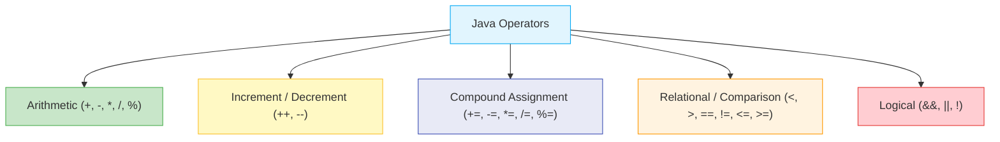
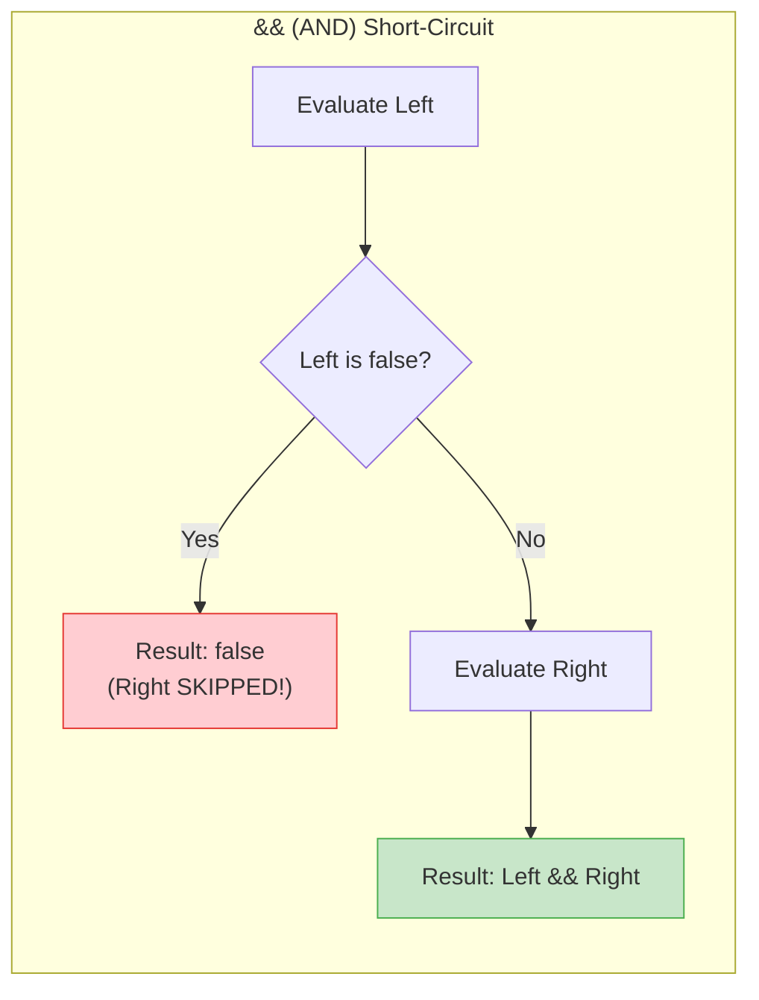

# ⚡ Module 05: Java Operators & Expressions

> **Mastering Operators, Precedence & Logical Reasoning in Java.** Learn how Java processes arithmetic, comparisons, compound operations, and boolean logic — the building blocks of every decision and calculation.

> ⚡ **Fast Access**: [🏠 Course Master Readme](../../../Readme.Md) &nbsp;|&nbsp; [📂 Source Directory](../../README.md) &nbsp;|&nbsp; [⬅️ Previous: Type Conversion](../type_conversion/README.md) &nbsp;|&nbsp; [➡️ Next: Math & Random](../math_and_random/README.md) &nbsp;|&nbsp; [📁 Folder Files](./)

---

## 📑 Table of Contents
1. [What You'll Learn](#1-what-youll-learn)
2. [Core Concept: Operator Categories](#2-core-concept-operator-categories)
3. [Arithmetic Operators Deep Dive](#3-arithmetic-operators-deep-dive)
4. [Prefix vs Postfix Increment Deep Dive](#4-prefix-vs-postfix-increment-deep-dive)
5. [Compound Assignment Operators](#5-compound-assignment-operators)
6. [Relational (Comparison) Operators](#6-relational-comparison-operators)
7. [Truth Tables for Logical Operators](#7-truth-tables-for-logical-operators)
8. [Short-Circuit Evaluation](#8-short-circuit-evaluation)
9. [Operator Precedence Master Table](#9-operator-precedence-master-table)
10. [When to Use Which Operator](#10-when-to-use-which-operator)
11. [Line-by-Line File Guides](#11-line-by-line-file-guides)
12. [Common Pitfalls & Traps](#12-common-pitfalls--traps)

---

## 1. What You'll Learn

After completing this module, you will be able to:

- [ ] Perform arithmetic operations and understand modulus (`%`)
- [ ] Correctly predict the difference between `i++` (postfix) and `++i` (prefix)
- [ ] Use compound assignment operators (`+=`, `-=`, `*=`, `/=`, `%=`)
- [ ] Evaluate relational comparisons and understand their boolean results
- [ ] Combine conditions with logical AND (`&&`), OR (`||`), and NOT (`!`)
- [ ] Leverage short-circuit evaluation for safe and efficient code

---

## 2. Core Concept: Operator Categories

Operators tell the CPU what operation to perform on one, two, or three operands.



---

## 3. Arithmetic Operators Deep Dive

| Operator | Name | Example | Result | Explanation |
| :---: | :--- | :--- | :--- | :--- |
| `+` | Addition | `10 + 3` | `13` | Sum of two values |
| `-` | Subtraction | `10 - 3` | `7` | Difference |
| `*` | Multiplication | `10 * 3` | `30` | Product |
| `/` | Division | `10 / 3` | `3` ⚠️ | **Integer division** truncates decimal |
| `%` | Modulus | `10 % 3` | `1` | **Remainder** after division |

### Understanding Quotient vs Remainder:
```
     3          ← Quotient (10 / 3)
    ───
3 ) 10
    9
    ──
     1          ← Remainder (10 % 3)
```

```java
int quotient = 10 / 3;   // 3 (how many times 3 fits into 10)
int remainder = 10 % 3;  // 1 (what's left over)
```

### Common Uses of Modulus (`%`):
```java
// Check if a number is even or odd:
if (num % 2 == 0)  → Even
if (num % 2 != 0)  → Odd

// Extract last digit:
int lastDigit = 1234 % 10;  // 4

// Wrap around (clock arithmetic):
int hour = 25 % 24;  // 1 (25th hour = 1 AM)
```

---

## 4. Prefix vs Postfix Increment Deep Dive

| Expression | Name | Order of Operations | Example (`int x = 5;`) |
| :--- | :--- | :--- | :--- |
| `x++` | Postfix Increment | 1. **Use** current value<br>2. **Then** increment | `int y = x++;` → `y = 5`, `x = 6` |
| `++x` | Prefix Increment | 1. **Increment first**<br>2. **Then** use new value | `int y = ++x;` → `y = 6`, `x = 6` |

### Step-by-Step Dry Run:

```java
int x = 5;
int a = x++;    // Postfix
int b = ++x;    // Prefix
```

| Step | Expression | x Before | Value Used | x After | Variable |
| :--- | :--- | :--- | :--- | :--- | :--- |
| 1 | `x = 5` | — | — | `5` | — |
| 2 | `a = x++` | `5` | `5` (use first) | `6` (then increment) | `a = 5` |
| 3 | `b = ++x` | `6` | `7` (increment first) | `7` | `b = 7` |

> [!TIP]
> **Memory trick**: Think of the `++` position as "when does the increment happen?"
> - `x++` → increment is **after** the variable (postfix = post = after)
> - `++x` → increment is **before** the variable (prefix = pre = before)

---

## 5. Compound Assignment Operators

Compound operators combine an arithmetic operation with assignment in a single step:

| Shorthand | Expansion | Example | Before | After |
| :--- | :--- | :--- | :--- | :--- |
| `x += 5` | `x = (type)(x + 5)` | `int x = 10; x += 5;` | `10` | `15` |
| `x -= 3` | `x = (type)(x - 3)` | `int x = 10; x -= 3;` | `10` | `7` |
| `x *= 2` | `x = (type)(x * 2)` | `int x = 10; x *= 2;` | `10` | `20` |
| `x /= 4` | `x = (type)(x / 4)` | `int x = 10; x /= 4;` | `10` | `2` |
| `x %= 3` | `x = (type)(x % 3)` | `int x = 10; x %= 3;` | `10` | `1` |

> [!IMPORTANT]
> **Hidden implicit cast!** Compound operators include an automatic cast to the target type:
> ```java
> byte b = 10;
> b = b + 5;     // ❌ Compile error! (b + 5) is int, can't assign to byte
> b += 5;        // ✅ Works! Equivalent to b = (byte)(b + 5);
> ```

---

## 6. Relational (Comparison) Operators

Relational operators compare two values and return a `boolean` (`true` or `false`):

| Operator | Meaning | Example | Result |
| :---: | :--- | :--- | :---: |
| `<` | Less than | `5 < 10` | `true` |
| `>` | Greater than | `5 > 10` | `false` |
| `<=` | Less than or equal | `5 <= 5` | `true` |
| `>=` | Greater than or equal | `5 >= 10` | `false` |
| `==` | Equal to | `5 == 5` | `true` |
| `!=` | Not equal to | `5 != 10` | `true` |

```java
int a = 20, b = 15;
System.out.println(a > b);   // true
System.out.println(a == b);  // false
System.out.println(a != b);  // true
```

---

## 7. Truth Tables for Logical Operators

| A | B | `A && B` (AND) | `A \|\| B` (OR) | `!A` (NOT) |
| :---: | :---: | :---: | :---: | :---: |
| `true` | `true` | **`true`** | **`true`** | `false` |
| `true` | `false` | `false` | **`true`** | `false` |
| `false` | `true` | `false` | **`true`** | `true` |
| `false` | `false` | `false` | `false` | `true` |

### Plain English:
- **`&&` (AND)**: Both must be true → "Are you 18+ **AND** have a ticket?"
- **`||` (OR)**: At least one must be true → "Are you a student **OR** a senior citizen?"
- **`!` (NOT)**: Flips the value → "You are **NOT** blocked"

---

## 8. Short-Circuit Evaluation

Java evaluates `&&` and `||` lazily to maximize CPU efficiency:

```java
// ✅ SAFE: If left side of && is false, right side is SKIPPED:
if (count != 0 && (total / count > 10)) { ... }
// If count IS 0, the division is NEVER executed → no ArithmeticException!

// ✅ FAST: If left side of || is true, right side is SKIPPED:
if (isAdmin || checkSlowDatabasePermission(user)) { ... }
// If isAdmin is true, the slow database query is NEVER called!
```



---

## 9. Operator Precedence Master Table

| Precedence | Category | Operators | Associativity |
| :--- | :--- | :--- | :--- |
| **1 (Highest)** | Postfix | `expr++`, `expr--` | Left to Right |
| **2** | Prefix / Unary | `++expr`, `--expr`, `+`, `-`, `!`, `~` | Right to Left |
| **3** | Multiplicative | `*`, `/`, `%` | Left to Right |
| **4** | Additive | `+`, `-` | Left to Right |
| **5** | Relational | `<`, `>`, `<=`, `>=` | Left to Right |
| **6** | Equality | `==`, `!=` | Left to Right |
| **7** | Logical AND | `&&` | Left to Right |
| **8** | Logical OR | `\|\|` | Left to Right |
| **9** | Ternary | `? :` | Right to Left |
| **10 (Lowest)**| Assignment | `=`, `+=`, `-=`, `*=`, `/=`, `%=` | Right to Left |

> [!TIP]
> **When in doubt, use parentheses!** They make your intent explicit and prevent precedence bugs:
> ```java
> // Ambiguous:
> boolean result = x > 5 && y < 10 || z == 3;
> // Clear:
> boolean result = (x > 5 && y < 10) || (z == 3);
> ```

---

## 10. When to Use Which Operator

| I want to... | Use | Example |
| :--- | :--- | :--- |
| Add / subtract / multiply / divide | `+`, `-`, `*`, `/` | `total = price * qty` |
| Get the remainder | `%` | `isEven = num % 2 == 0` |
| Increment a counter | `i++` or `++i` | `for (int i = 0; i < n; i++)` |
| Update a variable with its old value | `+=`, `-=`, `*=`, `/=` | `score += 10` |
| Compare two values | `<`, `>`, `==`, `!=`, `<=`, `>=` | `if (age >= 18)` |
| Combine multiple conditions | `&&`, `\|\|`, `!` | `if (isStudent && age < 25)` |
| Choose between two values inline | `? :` | `max = (a > b) ? a : b` |

---

## 11. Line-by-Line File Guides

| File | Concepts Covered | Expected Console Output | Command to Run |
| :--- | :--- | :--- | :--- |
| [`arithmeticoperator.java`](./arithmeticoperator.java) | `+`, `-`, `*`, `/`, `%` with integer and decimal values | Quotient and remainder results | `java -cp out beginner.operators.arithmeticoperator` |
| [`increment.java`](./increment.java) | `++` and `--` prefix vs postfix evaluation | Shows different values for `x++` vs `++x` | `java -cp out beginner.operators.increment` |
| [`augmentedassigment.java`](./augmentedassigment.java) | Compound updates (`+=`, `*=`) & implicit casting | Progressive updates to a variable | `java -cp out beginner.operators.augmentedassigment` |
| [`Relationaloperator.java`](./Relationaloperator.java) | Comparison boolean results (`<`, `>`, `==`, `!=`) | `true` / `false` for each comparison | `java -cp out beginner.operators.Relationaloperator` |
| [`logicaloperator.java`](./logicaloperator.java) | Boolean combinations (`&&`, `\|\|`, `!`) & short-circuit | Truth table results for combined conditions | `java -cp out beginner.operators.logicaloperator` |

### Dry-Run Trace: `increment.java`

```java
int x = 5;
int a = x++;   // Postfix
int b = ++x;   // Prefix
System.out.println("a = " + a);  // ?
System.out.println("b = " + b);  // ?
System.out.println("x = " + x);  // ?
```

| Step | Expression | x (before) | Value Used | x (after) | Assigned To |
| :--- | :--- | :--- | :--- | :--- | :--- |
| 1 | `x = 5` | — | — | `5` | — |
| 2 | `a = x++` | `5` | `5` | `6` | `a = 5` |
| 3 | `b = ++x` | `6` | `7` | `7` | `b = 7` |

**Output:** `a = 5`, `b = 7`, `x = 7`

### Dry-Run Trace: `augmentedassigment.java`

```java
int x = 10;
x += 5;   // x = 10 + 5 = 15
x -= 3;   // x = 15 - 3 = 12
x *= 2;   // x = 12 * 2 = 24
x /= 4;   // x = 24 / 4 = 6
x %= 5;   // x = 6 % 5 = 1
```

| Step | Operation | Expansion | x Before | x After |
| :--- | :--- | :--- | :--- | :--- |
| 1 | `x += 5` | `x = x + 5` | `10` | `15` |
| 2 | `x -= 3` | `x = x - 3` | `15` | `12` |
| 3 | `x *= 2` | `x = x * 2` | `12` | `24` |
| 4 | `x /= 4` | `x = x / 4` | `24` | `6` |
| 5 | `x %= 5` | `x = x % 5` | `6` | `1` |

---

## 12. Common Pitfalls & Traps

> [!WARNING]
> ### 1. Accidental Assignment in Conditions
> In Java, `if (a = 5)` will NOT compile (unlike C/C++), because Java requires a `boolean` in conditions:
> ```java
> if (a = 5) { ... }    // ❌ Compile error! Assignment, not comparison
> if (a == 5) { ... }   // ✅ Correct: comparison
> ```

> [!CAUTION]
> ### 2. Division by Zero
> ```java
> int result = 10 / 0;       // 💥 ArithmeticException: / by zero
> double result = 10.0 / 0.0; // Infinity (no exception with floating-point!)
> double result = 0.0 / 0.0;  // NaN (Not a Number)
> ```

> [!WARNING]
> ### 3. Integer Division Truncation
> ```java
> double avg = 5 / 2;     // 2.0 (NOT 2.5!) — both operands are int
> double avg = 5.0 / 2;   // 2.5 ✅ (one operand is double)
> double avg = (double) 5 / 2; // 2.5 ✅ (cast one to double first)
> ```

> [!NOTE]
> ### 4. `=` vs `==` Reminder
> - `=` is the **assignment** operator (stores a value)
> - `==` is the **equality** operator (compares two values)
> ```java
> int x = 5;       // Assigns 5 to x
> if (x == 5) ...  // Checks if x equals 5
> ```

---

## 📝 Full Code Walkthrough

### 📄 `src/beginner/operators/arithmeticoperator.java`

**Purpose:** Teaches the five basic math operators: addition, subtraction, multiplication, division, and modulus (remainder).

**▶️ Run:** `java -cp out beginner.operators.arithmeticoperator`

```java
package beginner.operators;

public class arithmeticoperator {

    public static void main(String[] args) {
        int a = 10;
        int b = 4;

        int sum = a + b;
        System.out.println("Addition (10 + 4): " + sum);

        int diff = a - b;
        System.out.println("Subtraction (10 - 4): " + diff);

        int prod = a * b;
        System.out.println("Multiplication (10 * 4): " + prod);

        int quotient = a / b;
        System.out.println("Integer Division (10 / 4): " + quotient);

        int remainder = a % b;
        System.out.println("Modulus/Remainder (10 % 4): " + remainder);
    }
}
```

**Line-by-line explanation:**

| Line | Code | What it does |
| :--- | :--- | :--- |
| 6-7 | `int a = 10; int b = 4;` | Creates two integer variables to use in our calculations. |
| 9 | `int sum = a + b;` | **`+`** (addition operator) adds the values of `a` and `b`. Result: `14`. |
| 12 | `int diff = a - b;` | **`-`** (subtraction operator) subtracts `b` from `a`. Result: `6`. |
| 15 | `int prod = a * b;` | **`*`** (multiplication operator) multiplies `a` by `b`. Result: `40`. |
| 18 | `int quotient = a / b;` | **`/`** (division operator) divides `a` by `b`. **Critical:** when both sides are `int`, Java does **integer division** — it chops off the decimal. `10 / 4 = 2` (not 2.5!). The `.5` is gone forever. |
| 21 | `int remainder = a % b;` | **`%`** (modulus/remainder operator) gives the **remainder** after dividing `a` by `b`. `10 ÷ 4 = 2 remainder 2`, so the result is `2`. This is very useful for checking if a number is even/odd: `n % 2 == 0` means even. |

> 🔑 **Concept:** Java has five arithmetic operators: `+` (add), `-` (subtract), `*` (multiply), `/` (divide), `%` (remainder). When dividing two integers, Java **truncates** the decimal — use `double` if you need the full result.

**⚠️ Common beginner mistakes:**
- Expecting `10 / 4` to give `2.5` — with two ints, you get `2`. Use `10.0 / 4` to get `2.5`.
- Confusing `/` (division/quotient) with `%` (remainder/modulus).

---

### 📄 `src/beginner/operators/increment.java`

**Purpose:** Teaches the difference between `i++` (postfix: use then increase) and `++i` (prefix: increase then use).

**▶️ Run:** `java -cp out beginner.operators.increment`

```java
package beginner.operators;

public class increment {

    public static void main(String[] args) {
        int m = 5;
        System.out.println("Initial m: " + m);

        m++;
        System.out.println("After m++: " + m);

        m--;
        System.out.println("After m--: " + m);

        int a = 10;
        int postResult = a++;
        System.out.println("Postfix Assignment: postResult = " + postResult + ", a = " + a);

        int b = 10;
        int preResult = ++b;
        System.out.println("Prefix Assignment: preResult = " + preResult + ", b = " + b);
    }
}
```

**Line-by-line explanation:**

| Line | Code | What it does |
| :--- | :--- | :--- |
| 6 | `int m = 5;` | Starts `m` at 5. |
| 9 | `m++;` | **`++`** is the **increment operator** — it adds 1 to the variable. `m` goes from 5 to 6. When used alone on a line, postfix (`m++`) and prefix (`++m`) do the same thing. |
| 12 | `m--;` | **`--`** is the **decrement operator** — it subtracts 1. `m` goes from 6 back to 5. |
| 15-16 | `int a = 10; int postResult = a++;` | Here's where it gets tricky! **Postfix `a++`** means: "Give me the current value of `a` FIRST (so `postResult` gets `10`), THEN increase `a` by 1 (so `a` becomes `11`)." |
| 19-20 | `int b = 10; int preResult = ++b;` | **Prefix `++b`** means: "Increase `b` by 1 FIRST (so `b` becomes `11`), THEN give me the new value (so `preResult` gets `11`)." |

> 🔑 **Concept:** `x++` (postfix) = use the value first, then increment. `++x` (prefix) = increment first, then use the value. This difference only matters when the expression is part of a larger statement (like an assignment).

**⚠️ Common beginner mistakes:**
- Thinking `y = x++` and `y = ++x` give the same result — they don't! With `x = 10`: postfix gives `y = 10`, prefix gives `y = 11`.

---

### 📄 `src/beginner/operators/augmentedassigment.java`

**Purpose:** Teaches shortcut operators like `+=`, `-=`, `*=`, `/=`, `%=` that update a variable in one step.

**▶️ Run:** `java -cp out beginner.operators.augmentedassigment`

```java
package beginner.operators;

public class augmentedassigment {

    public static void main(String[] args) {
        int num = 100;
        System.out.println("Starting value: " + num);

        num += 20;
        System.out.println("After num += 20: " + num);

        num -= 10;
        System.out.println("After num -= 10: " + num);

        num *= 2;
        System.out.println("After num *= 2:  " + num);

        num /= 4;
        System.out.println("After num /= 4:  " + num);

        num %= 10;
        System.out.println("After num %= 10: " + num);

        byte b = 50;
        b += 10;
        System.out.println("Byte after b += 10: " + b);
    }
}
```

**Line-by-line explanation:**

| Line | Code | What it does |
| :--- | :--- | :--- |
| 6 | `int num = 100;` | Starts with `100`. |
| 9 | `num += 20;` | **`+=`** is the **compound addition operator**. It's a shortcut for `num = num + 20`. Result: `120`. |
| 12 | `num -= 10;` | **`-=`** is shortcut for `num = num - 10`. `120 - 10 = 110`. |
| 15 | `num *= 2;` | **`*=`** is shortcut for `num = num * 2`. `110 * 2 = 220`. |
| 18 | `num /= 4;` | **`/=`** is shortcut for `num = num / 4`. `220 / 4 = 55` (integer division). |
| 21 | `num %= 10;` | **`%=`** is shortcut for `num = num % 10`. `55 % 10 = 5` (remainder). |
| 24-25 | `byte b = 50; b += 10;` | **Hidden superpower:** Compound operators include an **implicit cast**. Writing `b = b + 10` would fail (because `b + 10` becomes an `int`), but `b += 10` automatically casts the result back to `byte`! |

> 🔑 **Concept:** Compound assignment operators (`+=`, `-=`, `*=`, `/=`, `%=`) are shortcuts that perform an operation AND assign the result back to the variable in one step. They also automatically handle type casting.

---

### 📄 `src/beginner/operators/Relationaloperator.java`

**Purpose:** Teaches comparison operators that produce `true` or `false` results.

**▶️ Run:** `java -cp out beginner.operators.Relationaloperator`

```java
package beginner.operators;

public class Relationaloperator {

    public static void main(String[] args) {
        int a = 10;
        int b = 40;

        System.out.println("Comparing a = " + a + " and b = " + b + ":");

        System.out.println("a < b  (10 < 40)  : " + (a < b));
        System.out.println("a > b  (10 > 40)  : " + (a > b));
        System.out.println("a == b (10 == 40) : " + (a == b));
        System.out.println("a != b (10 != 40) : " + (a != b));
        System.out.println("a <= b (10 <= 40) : " + (a <= b));
        System.out.println("a >= b (10 >= 40) : " + (a >= b));
    }
}
```

**Line-by-line explanation:**

| Line | Code | What it does |
| :--- | :--- | :--- |
| 6-7 | `int a = 10; int b = 40;` | Two integers to compare. |
| 11 | `(a < b)` | **`<`** (less than) checks if `a` is smaller than `b`. `10 < 40` is `true`. |
| 12 | `(a > b)` | **`>`** (greater than) checks if `a` is bigger than `b`. `10 > 40` is `false`. |
| 13 | `(a == b)` | **`==`** (equal to) checks if both values are the same. `10 == 40` is `false`. **WARNING:** This is NOT the same as `=` which is assignment! |
| 14 | `(a != b)` | **`!=`** (not equal to) checks if the values are different. `10 != 40` is `true`. |
| 15 | `(a <= b)` | **`<=`** (less than or equal to). `10 <= 40` is `true`. |
| 16 | `(a >= b)` | **`>=`** (greater than or equal to). `10 >= 40` is `false`. |

> 🔑 **Concept:** Relational (comparison) operators compare two values and always return a `boolean` result (`true` or `false`). They are essential for making decisions with `if` statements.

**⚠️ Common beginner mistakes:**
- Using `=` (assignment) instead of `==` (comparison): `if (x = 5)` is wrong, `if (x == 5)` is correct.

---

### 📄 `src/beginner/operators/logicaloperator.java`

**Purpose:** Teaches how to combine multiple true/false conditions using AND (`&&`), OR (`||`), and NOT (`!`).

**▶️ Run:** `java -cp out beginner.operators.logicaloperator`

```java
package beginner.operators;

public class logicaloperator {

    public static void main(String[] args) {
        int a = 19;
        int b = 23;

        double c = 23.4;
        double d = 32.3;

        boolean orResult = (a < b || c > d);
        System.out.println("(a < b || c > d): " + orResult);

        boolean andResult = (a < b && c > d);
        System.out.println("(a < b && c > d): " + andResult);

        boolean notResult = !(a < b);
        System.out.println("!(a < b): " + notResult);
    }
}
```

**Line-by-line explanation:**

| Line | Code | What it does |
| :--- | :--- | :--- |
| 6-9 | Variable declarations | Creates two `int` variables and two `double` variables to use in conditions. |
| 12 | `(a < b \|\| c > d)` | **`\|\|`** is the **logical OR** operator. It returns `true` if **at least one** side is true. Here: `19 < 23` is `true`, so the whole thing is immediately `true` — Java doesn't even check the right side! This is called **short-circuit evaluation**. |
| 15 | `(a < b && c > d)` | **`&&`** is the **logical AND** operator. It returns `true` ONLY if **both** sides are true. Here: `19 < 23` is `true` BUT `23.4 > 32.3` is `false`, so the result is `false`. |
| 18 | `!(a < b)` | **`!`** is the **logical NOT** operator. It flips the boolean value. `a < b` is `true`, so `!true` becomes `false`. |

> 🔑 **Concept:** Logical operators combine boolean conditions: `&&` (AND) needs both true, `||` (OR) needs at least one true, `!` (NOT) flips the value. Java uses **short-circuit evaluation** — if the answer is already determined from the left side, it skips checking the right side.

---

### 📄 `src/beginner/operators/OrderDemo.java`

**Purpose:** Teaches operator precedence — the order in which Java evaluates math operations (PEMDAS/BODMAS).

**▶️ Run:** `java -cp out beginner.operators.OrderDemo`

```java
package beginner.operators;

public class OrderDemo {

    public static void main(String[] args) {
        double result = 10 + 3 * 2 / (8 - 3);

        System.out.println("The result is: " + result);
    }
}
```

**Line-by-line explanation:**

| Line | Code | What it does |
| :--- | :--- | :--- |
| 6 | `double result = 10 + 3 * 2 / (8 - 3);` | This line demonstrates **operator precedence**. Java evaluates in this order: **Step 1:** Parentheses first: `(8 - 3) = 5`. **Step 2:** Multiplication: `3 * 2 = 6`. **Step 3:** Division: `6 / 5 = 1` (integer division — both 6 and 5 are ints!). **Step 4:** Addition: `10 + 1 = 11`. **Step 5:** The int value `11` is widened to `double` → `11.0` and stored in `result`. |
| 8 | `System.out.println(...)` | Prints `The result is: 11.0`. |

> 🔑 **Concept:** Java follows PEMDAS/BODMAS: **P**arentheses first, then **M**ultiplication/**D**ivision (left to right), then **A**ddition/**S**ubtraction (left to right). Integer division truncates the result!

---

---

## 🧭 Fast Navigation

| 🏠 Course Master | 📂 Source Hub | ⬅️ Previous Module | ➡️ Next Module | 📁 Browse Folder |
| :---: | :---: | :---: | :---: | :---: |
| [Main Readme](../../../Readme.Md) | [src/ Overview](../../README.md) | [⬅️ Type Conversion](../type_conversion/README.md) | [Math & Random ➡️](../math_and_random/README.md) | [📁 `operators/`](./) |

