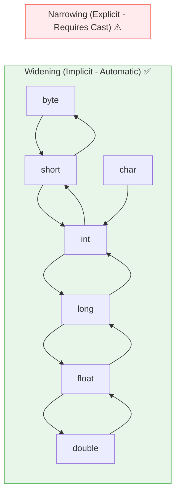
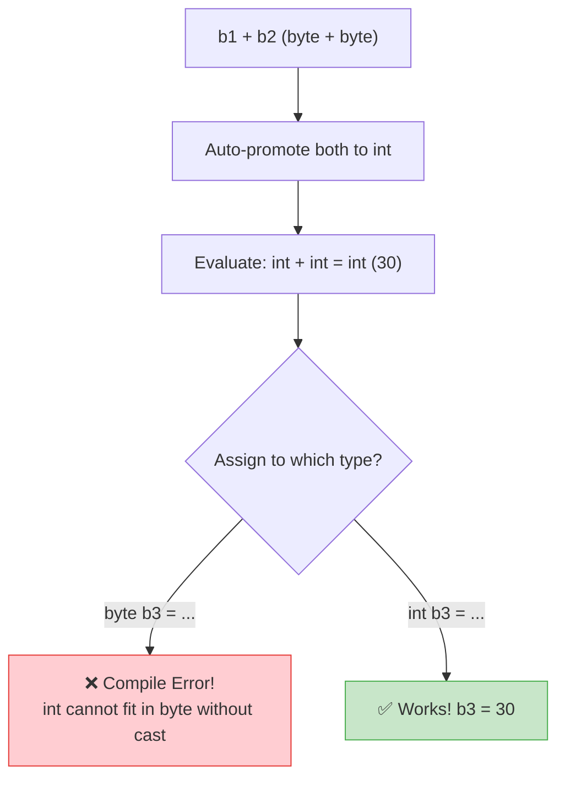

# 🔄 Module 04: Java Type Conversions & Casting

> **Mastering Type Conversions, Automatic Promotion & Casting in Java.** Understand how data moves between different sizes and shapes in memory — and what gets lost along the way.

> ⚡ **Fast Access**: [🏠 Course Master Readme](../../../Readme.Md) &nbsp;|&nbsp; [📂 Source Directory](../../README.md) &nbsp;|&nbsp; [⬅️ Previous: Variables](../variables/README.md) &nbsp;|&nbsp; [➡️ Next: Operators](../operators/README.md) &nbsp;|&nbsp; [📁 Folder Files](./)

---

## 📑 Table of Contents
1. [What You'll Learn](#1-what-youll-learn)
2. [Core Concept: Widening vs Narrowing](#2-core-concept-widening-vs-narrowing)
3. [Real-World Analogy](#3-real-world-analogy)
4. [Visual Conversion Hierarchy](#4-visual-conversion-hierarchy)
5. [Type Promotion Rules in Expressions](#5-type-promotion-rules-in-expressions)
6. [Integer Overflow & Byte Mechanics](#6-integer-overflow--byte-mechanics)
7. [Data Loss Visualization](#7-data-loss-visualization)
8. [Line-by-Line File Guides](#8-line-by-line-file-guides)
9. [Common Pitfalls & Traps](#9-common-pitfalls--traps)

---

## 1. What You'll Learn

After completing this module, you will be able to:

- [ ] Distinguish between widening (implicit) and narrowing (explicit) conversions
- [ ] Predict when Java automatically promotes types in expressions
- [ ] Use explicit cast syntax `(TargetType)` for narrowing conversions
- [ ] Understand byte overflow and two's complement wrap-around
- [ ] Identify data loss risks when casting between types

---

## 2. Core Concept: Widening vs Narrowing

In Java, assigning a value of one type to a variable of another type falls into two categories:

### A. Widening Conversion (Implicit / Automatic)
- **Direction**: Smaller memory footprint -> Larger memory footprint.
- **Safety**: Safe. No loss of magnitude or precision.
- **Syntax**: Happens automatically, no casting syntax required.
```java
int myInt = 100;
double myDouble = myInt; // Automatic widening: 100.0 ✅
```

### B. Narrowing Conversion (Explicit / Manual Casting)
- **Direction**: Larger memory footprint -> Smaller memory footprint.
- **Safety**: Potentially unsafe. May truncate decimals or cause overflow.
- **Syntax**: Requires explicit cast operator `(TargetType)`.
```java
double price = 99.99;
int rounded = (int) price; // Explicit cast: 99 (.99 truncated!) ⚠️
```

---

## 3. Real-World Analogy

Think of type conversions like **pouring water between containers**:

```
WIDENING (Small → Large):
🥛 Small Glass (byte)  ──pour──►  🪣 Large Bucket (int)
   All water fits! No spill!       Safe, no data loss ✅

NARROWING (Large → Small):
🪣 Large Bucket (double) ──pour──►  🥛 Small Glass (int)
   Water OVERFLOWS! Some lost!      Dangerous, data truncated! ⚠️
```

- **Widening** = Pouring from a small glass into a large bucket — everything fits.
- **Narrowing** = Pouring from a large bucket into a small glass — some water overflows (data loss!).

---

## 4. Visual Conversion Hierarchy



### Quick Reference:
| From → To | Direction | Automatic? | Risk |
| :--- | :--- | :--- | :--- |
| `byte` → `int` | Widening | ✅ Yes | None |
| `int` → `double` | Widening | ✅ Yes | None |
| `double` → `int` | Narrowing | ❌ Must cast | Decimal truncation |
| `int` → `byte` | Narrowing | ❌ Must cast | Overflow wrap-around |
| `float` → `int` | Narrowing | ❌ Must cast | Decimal truncation |

---

## 5. Type Promotion Rules in Expressions

When Java evaluates expressions with mixed types, it automatically promotes smaller types:

### The Rules:
1. **Byte / Short / Char Promotion**: Any `byte`, `short`, or `char` in an arithmetic expression is **immediately promoted to `int`**.
2. **Dominant Type Rule**:
   - If any operand is `double`, the entire expression is promoted to `double`.
   - Else if any operand is `float`, expression is promoted to `float`.
   - Else if any operand is `long`, expression is promoted to `long`.
   - Otherwise, all are evaluated as `int`.

```java
byte b1 = 10;
byte b2 = 20;
// byte b3 = b1 + b2; // ❌ Compile error: b1 + b2 produces int (30)!
int b3 = b1 + b2;     // ✅ Correct: result is int
```

### Why? Step-by-Step Trace:
```
Expression: b1 + b2
  ↓
Step 1: b1 (byte 10) promoted to int → 10
Step 2: b2 (byte 20) promoted to int → 20
Step 3: int + int = int → 30
Step 4: Can't fit int back into byte without explicit cast!
```

### Promotion Flow Diagram:


---

## 6. Integer Overflow & Byte Mechanics

A `byte` has 8 bits and ranges from `-128` to `+127`.

```mermaid
stateDiagram-v2
    [*] --> 126
    126 --> 127: +1
    127 --> -128: +1 (OVERFLOW!)
    -128 --> -127: +1
```

When you cast an `int` greater than 127 (e.g. 130) to `byte`, only the lower 8 bits are kept:
$$130 - 256 = -126$$

### Visual Byte Wrapping:
```
Value 130 in binary:  00000000 00000000 00000000 10000010  (32-bit int)
                                                 ^^^^^^^^
Cast to byte:                                    10000010  (8-bit byte)
                                                 ↓
Interpreted as signed (Two's Complement):        -126
```

### How Two's Complement Works:
| Byte Value (Binary) | Unsigned | Signed (Two's Complement) |
| :--- | :--- | :--- |
| `01111111` | 127 | **+127** (max positive) |
| `10000000` | 128 | **-128** (min negative — wraps!) |
| `10000001` | 129 | **-127** |
| `10000010` | 130 | **-126** |

---

## 7. Data Loss Visualization

Here's what happens to data at each narrowing conversion step:

| Original Value | Cast To | Result | What Was Lost |
| :--- | :--- | :--- | :--- |
| `9.99` (`double`) | `(int)` | `9` | Decimal `.99` truncated |
| `9.99` (`double`) | `(float)` | `9.99f` | Some precision (beyond ~7 digits) |
| `130` (`int`) | `(byte)` | `-126` | Overflow wrap-around |
| `100000` (`int`) | `(short)` | `-31072` | Overflow wrap-around |
| `3.14159265358979` (`double`) | `(float)` | `3.1415927` | Precision after 7th digit |

> [!IMPORTANT]
> **Truncation ≠ Rounding!** `(int) 9.99` gives `9`, NOT `10`. To round properly, use `Math.round(9.99)` which gives `10`.

---

## 8. Line-by-Line File Guides

| File | Concepts Covered | Expected Console Output | Command to Run |
| :--- | :--- | :--- | :--- |
| [`Typepromotions.java`](./Typepromotions.java) | Automatic expression promotion (`byte * byte -> int`) | Shows that `byte * byte` produces an `int` result | `java -cp out beginner.type_conversion.Typepromotions` |
| [`Floatconversion.java`](./Floatconversion.java) | Explicit casting `(int)` from float and decimal truncation | Shows decimal values being truncated to whole numbers | `java -cp out beginner.type_conversion.Floatconversion` |
| [`byteconversion.java`](./byteconversion.java) | Int to byte narrowing, bits truncation & overflow wrap-around | Demonstrates value wrap-around (e.g., 130 → -126) | `java -cp out beginner.type_conversion.byteconversion` |

### Dry-Run Trace: `Typepromotions.java`

```java
byte b1 = 10;
byte b2 = 20;
int result = b1 * b2;
```

| Step | Operation | Type During Evaluation | Value |
| :--- | :--- | :--- | :--- |
| 1 | Load `b1` | `byte` → promoted to `int` | `10` |
| 2 | Load `b2` | `byte` → promoted to `int` | `20` |
| 3 | Multiply `10 * 20` | `int * int` = `int` | `200` |
| 4 | Store in `result` | `int` | `200` ✅ |

### Dry-Run Trace: `Floatconversion.java`

```java
double price = 99.99;
int truncated = (int) price;
```

| Step | Value | Type | What Happens |
| :--- | :--- | :--- | :--- |
| 1 | `99.99` | `double` | Full decimal precision |
| 2 | `(int) 99.99` | `int` | `.99` is **chopped off** (not rounded!) |
| 3 | `99` | `int` | Final result: `99` |

### Dry-Run Trace: `byteconversion.java`

```java
int bigValue = 130;
byte wrapped = (byte) bigValue;
```

| Step | Value | Binary Representation | Result |
| :--- | :--- | :--- | :--- |
| 1 | `130` (int) | `00000000 00000000 00000000 10000010` | — |
| 2 | Cast to byte | Keep only last 8 bits: `10000010` | — |
| 3 | Two's complement interpretation | `10000010` = `-126` | `-126` |

---

## 9. Common Pitfalls & Traps

> [!CAUTION]
> ### 1. Truncation vs Rounding
> `(int) 9.99` evaluates to `9`, not `10`!
> ```java
> int bad = (int) 9.99;           // 9 (truncated, NOT rounded!)
> long good = Math.round(9.99);   // 10 (properly rounded)
> ```

> [!CAUTION]
> ### 2. Silent Overflow
> Casting large integers to small types produces silent numerical wrap-around — **no runtime error or warning**:
> ```java
> int big = 130;
> byte small = (byte) big;  // -126 (silently wrapped!)
> // Java does NOT throw an exception — this is by design!
> ```

> [!WARNING]
> ### 3. Expression Promotion Surprise
> Even if both operands are `byte`, the result is always `int`:
> ```java
> byte a = 10, b = 20;
> byte c = a + b;        // ❌ Compile error! (a + b) is int
> byte c = (byte)(a + b); // ✅ Explicit cast back to byte
> ```

> [!TIP]
> ### 4. When to Cast vs When to Widen
> - **Need precision?** Don't cast to a smaller type — keep it in `double` or `long`.
> - **Need a specific type for an API?** Cast explicitly and handle potential data loss.
> - **Arithmetic with mixed types?** Java will auto-widen, but be aware of integer division:
>   ```java
>   double result = 5 / 2;     // 2.0 (int / int = int FIRST, then widened!)
>   double correct = 5.0 / 2;  // 2.5 (double / int = double)
>   ```

---

## 📝 Full Code Walkthrough

### 📄 `src/beginner/type_conversion/Typepromotions.java`

**Purpose:** Teaches that when you do math with small types like `byte`, Java automatically upgrades them to `int` to prevent overflow.

**▶️ Run:** `java -cp out beginner.type_conversion.Typepromotions`

```java
package beginner.type_conversion;

public class Typepromotions {

    public static void main(String[] args) {
        byte a = 10;
        byte b = 30;

        int result = a * b;

        System.out.println("Result of byte multiplication promoted to int: " + result);
    }
}
```

**Line-by-line explanation:**

| Line | Code | What it does |
| :--- | :--- | :--- |
| 1 | `package beginner.type_conversion;` | This file belongs to the `type_conversion` folder. |
| 3 | `public class Typepromotions {` | Creates a class named `Typepromotions`. |
| 6 | `byte a = 10;` | **`byte`** is the smallest integer type in Java — it uses only 8 bits of memory and can hold values from -128 to 127. Here we store `10` in it. |
| 7 | `byte b = 30;` | Another byte variable holding `30`. |
| 9 | `int result = a * b;` | Here's the key lesson: even though `a` and `b` are both `byte`, when Java multiplies them (`a * b`), it **automatically promotes** (upgrades) both values to `int` (32-bit) before doing the math. This is called **type promotion**. The result of `10 * 30 = 300`, which is way bigger than byte's maximum of 127! That's exactly why Java promotes to int — to avoid overflow. We store the result in an `int` variable because the result IS an int. |
| 11 | `System.out.println("Result..." + result);` | Prints `300`. The `+` here concatenates the text string with the number. |

> 🔑 **Concept:** When Java does arithmetic (`+`, `-`, `*`, `/`) on small types like `byte`, `short`, or `char`, it automatically promotes them to `int` first. This prevents accidental overflow during calculations.

**⚠️ Common beginner mistakes:**
- Trying to store the result back in a `byte` like `byte c = a * b;` — this won't compile because `a * b` produces an `int`, and an `int` can't fit into a `byte` without explicit casting.

---

### 📄 `src/beginner/type_conversion/Floatconversion.java`

**Purpose:** Teaches how to manually convert a decimal number (`float`) to a whole number (`int`) using casting, and shows that the decimal part gets chopped off (not rounded).

**▶️ Run:** `java -cp out beginner.type_conversion.Floatconversion`

```java
package beginner.type_conversion;

public class Floatconversion {

    public static void main(String[] args) {
        float a = 5.6f;

        int b = (int) a;

        System.out.println("Original float: " + a);
        System.out.println("Truncated integer after (int) cast: " + b);
    }
}
```

**Line-by-line explanation:**

| Line | Code | What it does |
| :--- | :--- | :--- |
| 6 | `float a = 5.6f;` | **`float`** is a data type for decimal numbers using 32 bits of memory. The **`f`** suffix after `5.6` is required — without it, Java treats `5.6` as a `double` (64-bit), which is bigger than `float`, and you'd get a compile error. |
| 8 | `int b = (int) a;` | **`(int)`** is called a **type cast**. It's an explicit instruction telling Java: "I know this might lose data, but convert this float to an int anyway." When you cast `5.6` to int, Java **truncates** (chops off) everything after the decimal point. So `5.6` becomes `5` — NOT `6`. Java does NOT round, it just removes the decimal portion. This is called **narrowing conversion** because you're going from a bigger type to a smaller one. |
| 10-11 | `System.out.println(...)` | Prints the original value `5.6` and the truncated value `5`. |

> 🔑 **Concept:** **Narrowing conversion** (going from a bigger type to a smaller type, like `float` → `int`) must be done explicitly with a cast `(targetType)`. Java truncates — it does NOT round.

**⚠️ Common beginner mistakes:**
- Forgetting the `f` suffix on float literals: `float x = 5.6;` will fail because `5.6` defaults to `double`.
- Expecting `(int) 5.9` to give `6` — it gives `5` (truncation, not rounding).

---

### 📄 `src/beginner/type_conversion/byteconversion.java`

**Purpose:** Teaches what happens when you cast a large number into a `byte` — the value wraps around (overflow) because byte can only hold -128 to 127.

**▶️ Run:** `java -cp out beginner.type_conversion.byteconversion`

```java
package beginner.type_conversion;

public class byteconversion {

    public static void main(String[] args) {
        int a = 12;
        byte k = (byte) a;
        System.out.println("Casting int 12 to byte: " + k);

        int big = 130;
        byte wrapped = (byte) big;
        System.out.println("Casting int 130 to byte (overflow wrap-around): " + wrapped);
    }
}
```

**Line-by-line explanation:**

| Line | Code | What it does |
| :--- | :--- | :--- |
| 6 | `int a = 12;` | Stores the number 12 as a 32-bit integer. |
| 7 | `byte k = (byte) a;` | Casts `12` to a `byte`. Since 12 is within the byte range (-128 to 127), the value stays `12` with no data loss. |
| 8 | `System.out.println(...)` | Prints `12`. |
| 10 | `int big = 130;` | Stores `130` — this is BIGGER than byte's maximum of 127. |
| 11 | `byte wrapped = (byte) big;` | Casts `130` to a `byte`. Since 130 exceeds 127, Java takes only the lower 8 bits of the binary representation. The result **wraps around** to `-126`. This is called **overflow**. In binary: 130 = `10000010`, and when read as a signed 8-bit number using two's complement, that equals -126. |
| 12 | `System.out.println(...)` | Prints `-126` — a surprising result for beginners! |

> 🔑 **Concept:** When you cast a value that's too big for the target type, it **overflows** and wraps around. A `byte` can only hold -128 to 127, so casting 130 wraps to -126. Always check if your value fits before casting!

---

---

## 🧭 Fast Navigation

| 🏠 Course Master | 📂 Source Hub | ⬅️ Previous Module | ➡️ Next Module | 📁 Browse Folder |
| :---: | :---: | :---: | :---: | :---: |
| [Main Readme](../../../Readme.Md) | [src/ Overview](../../README.md) | [⬅️ Variables](../variables/README.md) | [Operators ➡️](../operators/README.md) | [📁 `type_conversion/`](./) |

