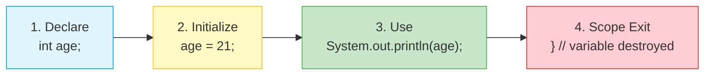
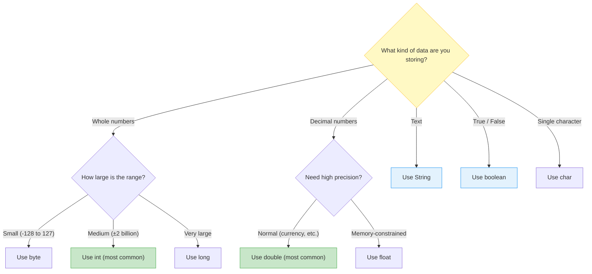
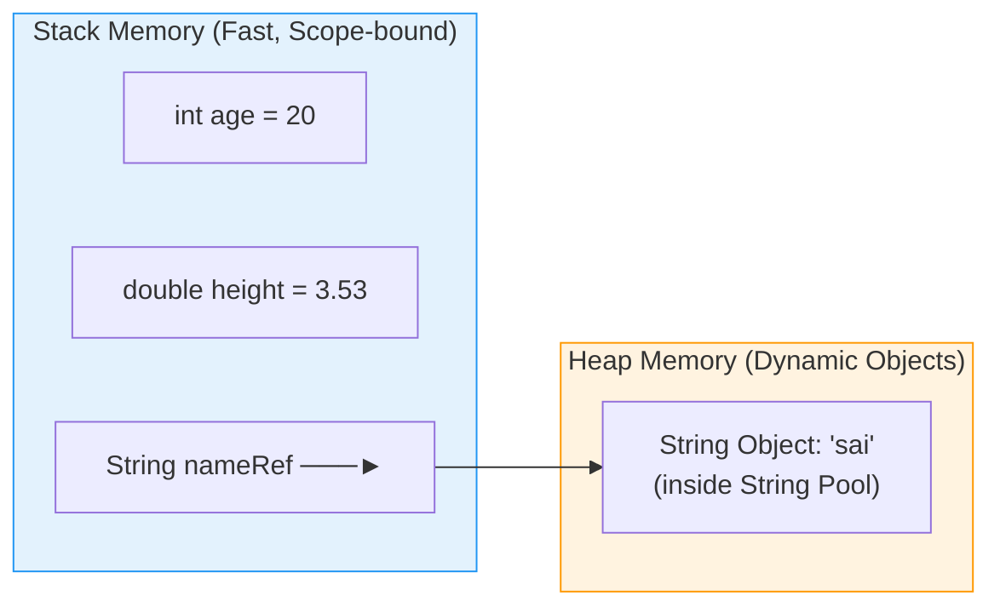

# 📦 Module 02: Java Variables & Data Types

> **Mastering Memory & Data Storage in Java.** Learn how Java allocates memory for numbers, characters, booleans, and text strings — the foundation of every program you'll ever write.

---

## 📑 Table of Contents
1. [What You'll Learn](#1-what-youll-learn)
2. [Core Concept: What is a Variable?](#2-core-concept-what-is-a-variable)
3. [Real-World Analogy](#3-real-world-analogy)
4. [Variable Declaration Lifecycle](#4-variable-declaration-lifecycle)
5. [Java 8 Primitive Data Types Cheatsheet](#5-java-8-primitive-data-types-cheatsheet)
6. [Type Selection Decision Tree](#6-type-selection-decision-tree)
7. [Primitives vs Reference Types (Stack vs Heap)](#7-primitives-vs-reference-types-stack-vs-heap)
8. [String Basics & Concatenation](#8-string-basics--concatenation)
9. [Naming Conventions & Best Practices](#9-naming-conventions--best-practices)
10. [Line-by-Line File Breakdown](#10-line-by-line-file-breakdown)
11. [Common Pitfalls & Best Practices](#11-common-pitfalls--best-practices)

---

## 1. What You'll Learn

After completing this module, you will be able to:

- [ ] Declare and initialize variables with proper data types
- [ ] Explain the 8 Java primitive types with their sizes and ranges
- [ ] Choose the correct data type for any given scenario
- [ ] Distinguish between primitives (Stack) and reference types (Heap)
- [ ] Use String concatenation with the `+` operator correctly
- [ ] Follow Java naming conventions for variables

---

## 2. Core Concept: What is a Variable?

Think of a variable as a **labeled storage container** in memory:
- **Type**: Defines the shape and size of the container (e.g. `int` vs `double`).
- **Name (Identifier)**: The label you use to reference it (e.g. `age`, `height`).
- **Value**: The actual content stored inside (e.g. `20`, `3.14`).

```java
// Syntax: <DataType> <variableName> = <initialValue>;
int studentAge = 21;
//  ↑ Type       ↑ Name     ↑ Value
```

---

## 3. Real-World Analogy

Think of variables like **labeled jars in a kitchen**:

```
🏷️ Label (Name):     "sugar"        "salt"         "flour"
📦 Jar Size (Type):   Small (byte)   Medium (int)   Large (long)
📦 Contents (Value):  25             1500           9000000000L

Rules:
• You can only put sugar in the sugar jar (type-safe)
• A small jar can't hold a large amount (overflow risk)
• You MUST label the jar before using it (declaration required)
```

---

## 4. Variable Declaration Lifecycle

Every variable in Java goes through a predictable lifecycle:



```java
{   // ← Scope begins
    int age;          // 1. DECLARE: Reserves memory on Stack for an int
    age = 21;         // 2. INITIALIZE: Stores the value 21 in that memory
    System.out.println(age); // 3. USE: Reads value and prints it
}   // ← Scope ends: 4. DESTROY — 'age' no longer exists!
```

> [!NOTE]
> **Declaration and initialization can be combined**: `int age = 21;`

---

## 5. Java 8 Primitive Data Types Cheatsheet

Java is **statically-typed**, meaning every variable's type must be declared at compile time and cannot change.

| Data Type | Category | Size (Bits / Bytes) | Min Value | Max Value | Default | Literal Example |
| :--- | :--- | :--- | :--- | :--- | :--- | :--- |
| `byte` | Integer | 8 bits (1 byte) | -128 | 127 | `0` | `(byte) 100` |
| `short` | Integer | 16 bits (2 bytes) | -32,768 | 32,767 | `0` | `(short) 5000` |
| `int` | Integer | 32 bits (4 bytes) | -2,147,483,648 | 2,147,483,647 | `0` | `42` |
| `long` | Integer | 64 bits (8 bytes) | -2^63 | 2^63 - 1 | `0L` | `9000000000L` |
| `float` | Floating Point | 32 bits (4 bytes) | ~1.4e-45 | ~3.4e+38 | `0.0f` | `3.1415f` |
| `double` | Floating Point | 64 bits (8 bytes) | ~4.9e-324 | ~1.7e+308 | `0.0d` | `3.1415926535` |
| `char` | Character | 16 bits (2 bytes) | `'\u0000'` (0) | `'\uffff'` (65,535) | `'\u0000'` | `'A'`, `'₹'` |
| `boolean`| Logical | 1 bit (JVM dependent)| `false` | `true` | `false` | `true`, `false` |

### Memory Size Comparison:
```
byte:    [████████]                          →  1 byte  (8 bits)
short:   [████████████████]                  →  2 bytes (16 bits)
int:     [████████████████████████████████]  →  4 bytes (32 bits)
long:    [████████████████████████████████████████████████████████████████]  →  8 bytes (64 bits)
```

---

## 6. Type Selection Decision Tree

Not sure which type to use? Follow this flowchart:



> [!TIP]
> **In practice, you'll use `int` for whole numbers and `double` for decimals 90% of the time.** Only use `byte`, `short`, `long`, or `float` when you have a specific reason (memory optimization, API requirement, etc.).

---

## 7. Primitives vs Reference Types (Stack vs Heap)



| Property | Primitives (`int`, `double`, `boolean`) | Reference Types (`String`, Objects, Arrays) |
| :--- | :--- | :--- |
| **Storage Location** | Stack (directly stores the value) | Stack stores a **pointer**; object lives on Heap |
| **Default Value** | `0`, `0.0`, `false` | `null` |
| **Comparison** | `==` compares **values** | `==` compares **addresses** (use `.equals()` for content!) |
| **Memory Cleanup** | Destroyed when scope exits | Garbage Collector handles cleanup |
| **Examples** | `int x = 5;` `boolean flag = true;` | `String s = "hello";` `int[] arr = {1,2,3};` |

---

## 8. String Basics & Concatenation

The `+` operator has dual behavior in Java:
1. **Mathematical Addition**: If both operands are numbers (`10 + 20` -> `30`).
2. **String Concatenation**: If either operand is a `String` (`"Age: " + 20` -> `"Age: 20"`).

```java
String first = "Hello ";
String second = "World";
String greeting = first + second; // "Hello World"

// ⚠️ Left-to-right evaluation matters:
System.out.println("Result: " + 10 + 20); // Prints: "Result: 1020" (concatenation!)
System.out.println("Result: " + (10 + 20)); // Prints: "Result: 30" (parentheses first)
System.out.println(10 + 20 + " is the result"); // Prints: "30 is the result" (addition first)
```

### Why does `"Result: " + 10 + 20` produce `"Result: 1020"`?

| Step | Left Operand | Operator | Right Operand | Result |
| :--- | :--- | :--- | :--- | :--- |
| 1 | `"Result: "` (String) | `+` | `10` (int) | `"Result: 10"` (concatenation) |
| 2 | `"Result: 10"` (String) | `+` | `20` (int) | `"Result: 1020"` (concatenation) |

Because once any operand is a String, `+` switches to concatenation mode!

---

## 9. Naming Conventions & Best Practices

| Category | Convention | ✅ Good Examples | ❌ Bad Examples |
| :--- | :--- | :--- | :--- |
| **Variables** | `camelCase` | `studentAge`, `totalPrice`, `isEnrolled` | `StudentAge`, `total_price`, `x` |
| **Constants** | `UPPER_SNAKE_CASE` | `MAX_SIZE`, `PI`, `TAX_RATE` | `maxSize`, `pi` |
| **Classes** | `PascalCase` | `StudentRecord`, `ShoppingCart` | `studentRecord`, `shopping_cart` |
| **Methods** | `camelCase` (verb) | `calculateTotal()`, `getName()` | `CalculateTotal()`, `name()` |

### Naming Rules:
```java
int age = 20;          // ✅ Starts with lowercase letter
int _count = 5;        // ✅ Can start with underscore
int $price = 100;      // ✅ Can start with dollar sign
int 2ndPlace = 2;      // ❌ Cannot start with a digit!
int my age = 20;       // ❌ Cannot contain spaces!
int class = 10;        // ❌ Cannot use reserved keywords!
```

---

## 10. Line-by-Line File Breakdown

| File | Key Concepts | Expected Console Output | Quick Run Command |
| :--- | :--- | :--- | :--- |
| [`variables.java`](file:///Users/honeyreddy/Documents/Java%20course/src/beginner/variables/variables.java) | `int`, `double`, `Boolean`, `String`, branching with boolean flags, string concatenation | Prints variable values with concatenated labels<br>(e.g., `"Age: 20"`, `"Height: 3.53"`, `"Name: sai"`) | `java -cp out beginner.variables.variables` |

### Dry-Run Trace: `variables.java`
Key operations from the source file:

| Step | Code | Variable State | Explanation |
| :--- | :--- | :--- | :--- |
| 1 | `int age = 20;` | `age = 20` (Stack) | 4-byte integer allocated |
| 2 | `double height = 3.53;` | `height = 3.53` (Stack) | 8-byte double allocated |
| 3 | `Boolean student = true;` | `student = true` (Heap wrapper) | Wrapper object (`Boolean`) instead of primitive |
| 4 | `String name = "sai";` | `name → "sai"` (String Pool) | Reference on Stack, String on Heap |
| 5 | `"Age: " + age` | — | Concatenation: `"Age: "` + `20` → `"Age: 20"` |

---

## 11. Common Pitfalls & Best Practices

> [!WARNING]
> ### 1. Primitive `boolean` vs Wrapper `Boolean`
> Prefer primitive `boolean` unless you explicitly require `null` representations in databases or collections:
> ```java
> boolean isActive = true;   // ✅ Primitive (faster, no null)
> Boolean isActive = true;   // ⚠️ Wrapper object (allows null, adds overhead)
> ```

> [!CAUTION]
> ### 2. Uninitialized Local Variables
> Local variables inside methods MUST be explicitly initialized before reading:
> ```java
> int count;
> System.out.println(count); // ❌ Compile error: variable might not have been initialized
>
> int count = 0;
> System.out.println(count); // ✅ Prints: 0
> ```

> [!TIP]
> ### 3. Use Meaningful Variable Names
> ```java
> int x = 20;              // ❌ What does 'x' mean?
> int studentAge = 20;     // ✅ Self-documenting and clear
>
> double a = 99.99;        // ❌ Cryptic
> double itemPrice = 99.99; // ✅ Readable
> ```

> [!NOTE]
> ### 4. String Concatenation Gotcha
> When mixing numbers and Strings with `+`, order matters:
> ```java
> System.out.println(1 + 2 + "3");  // "33" (1+2=3, then "3"+"3"="33")
> System.out.println("1" + 2 + 3);  // "123" (all concatenation)
> ```
