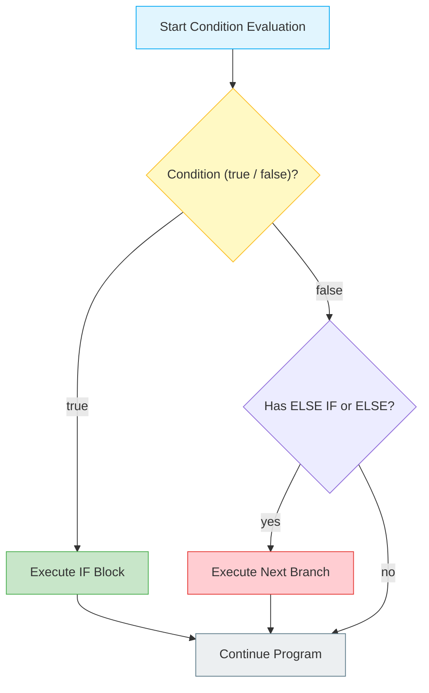
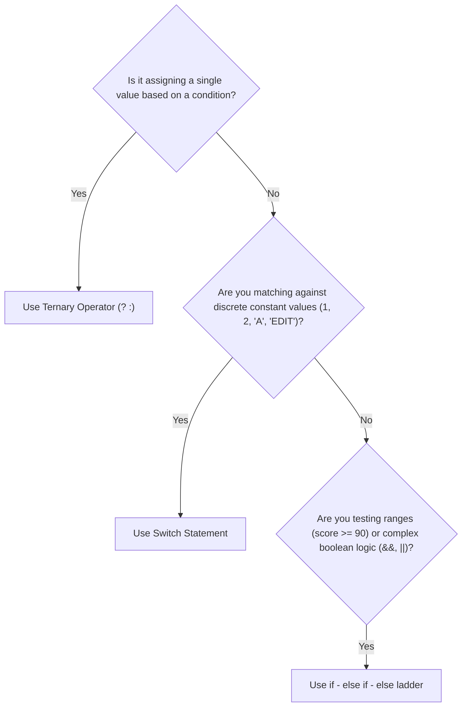

# 🔀 Module 06: Decision Making & Flow Control

> **Mastering Branching, Conditional Logic & Decision Trees in Java.** Learn how to steer program execution based on dynamic conditions.

---

## 📑 Table of Contents
1. [Decision Tree Architecture](#1-decision-tree-architecture)
2. [Comparing Branching Constructs](#2-comparing-branching-constructs)
3. [When to Use What? (Decision Matrix)](#3-when-to-use-what-decision-matrix)
4. [The Switch Statement: Traditional vs Modern Java 14+](#4-the-switch-statement-traditional-vs-modern-java-14)
5. [Line-by-Line File Guides](#5-line-by-line-file-guides)
6. [Common Pitfalls & Traps](#6-common-pitfalls--traps)

---

## 1. Decision Tree Architecture



---

## 2. Comparing Branching Constructs

| Construct | Syntax | Number of Branches | Best Used For |
| :--- | :--- | :--- | :--- |
| **Simple `if`** | `if (condition) { ... }` | 1 (Optional action) | Guard clauses, input validation |
| **`if - else`** | `if (cond) { ... } else { ... }` | 2 (Binary choice) | Either/or scenarios (even/odd, pass/fail) |
| **`if - else if`**| `if () ... else if () ... else` | N (Ladder) | Range-based checking (e.g. Grades: 90+, 80+, 70+) |
| **Ternary `? :`**| `(cond) ? val1 : val2` | 2 (Inline expression)| Value assignments based on boolean condition |
| **`switch`** | `switch (val) { case ... }` | N (Discrete match) | Fixed constants (Days of week, Menus, Commands) |

---

## 3. When to Use What? (Decision Matrix)



---

## 4. The Switch Statement: Traditional vs Modern Java 14+

### Traditional Switch (Requires `break`):
```java
switch (day) {
    case 1:
        System.out.println("Mon");
        break; // ⚠️ Missing break causes fall-through into case 2!
    case 2:
        System.out.println("Tue");
        break;
}
```

### Modern Arrow Switch (Java 14+ Standard):
```java
switch (day) {
    case 1 -> System.out.println("Mon"); // No break needed!
    case 2 -> System.out.println("Tue");
    default -> System.out.println("Other");
}
```

---

## 5. Line-by-Line File Guides

| File | Concepts Covered | Command to Run |
| :--- | :--- | :--- |
| [`ifstatement.java`](file:///Users/honeyreddy/Documents/Java%20course/src/conditional_statements/ifstatement.java) | Interactive input checks, `isEmpty()`, age ranges, booleans | `java -cp out conditional_statements.ifstatement` |
| [`ifelse_statement.java`](file:///Users/honeyreddy/Documents/Java%20course/src/conditional_statements/ifelse_statement.java) | Binary comparison between two numbers | `java -cp out conditional_statements.ifelse_statement` |
| [`if_else_if.java`](file:///Users/honeyreddy/Documents/Java%20course/src/conditional_statements/if_else_if.java) | Chained ladders vs separate independent ifs | `java -cp out conditional_statements.if_else_if` |
| [`Ternary_operator.java`](file:///Users/honeyreddy/Documents/Java%20course/src/conditional_statements/Ternary_operator.java) | Inline conditional expression & even/odd parity | `java -cp out conditional_statements.Ternary_operator` |
| [`switch_operator.java`](file:///Users/honeyreddy/Documents/Java%20course/src/conditional_statements/switch_operator.java) | Discrete value matching, break behavior & arrow switch | `java -cp out conditional_statements.switch_operator` |

---

## 6. Common Pitfalls & Traps

> [!WARNING]
> - **String Equality Traps**: Never compare Strings with `if (name == "admin")`! Use `if (name.equals("admin"))` or `if ("admin".equalsIgnoreCase(name))`.
> - **Accidental Fall-Through**: In traditional `switch`, forgetting a `break;` statement executes subsequent cases unintentionally.
