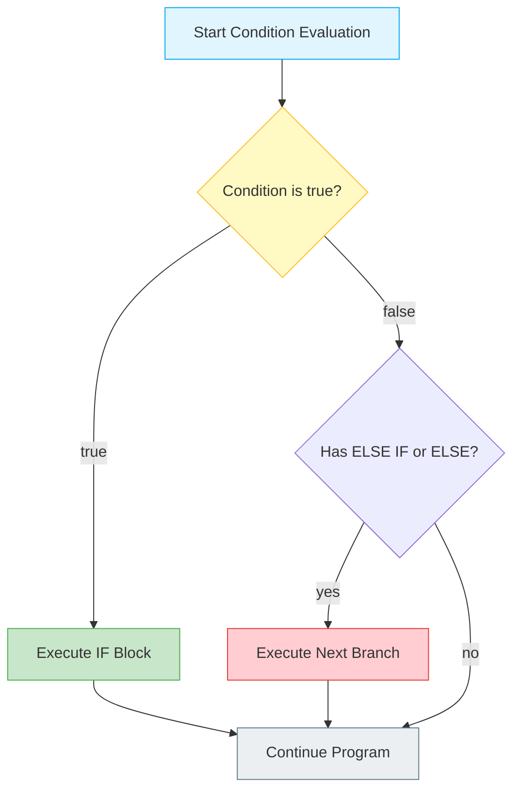
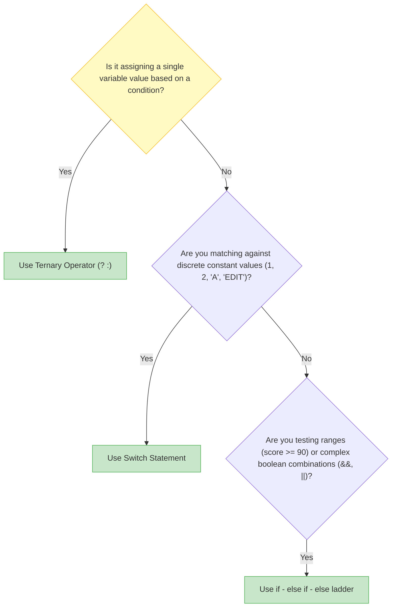
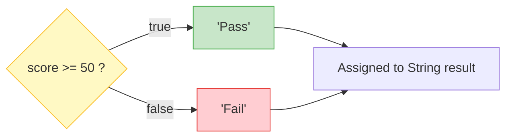

# 🔀 Module 06: Decision Making & Flow Control

> **Mastering Branching, Conditional Logic & Decision Trees in Java.** Learn how to make your code think, evaluate conditions, and branch into different paths using `if`, `if-else`, `if-else-if`, `switch`, and the ternary operator `? :`.

---

## 📑 Table of Contents
1. [What You'll Learn](#1-what-youll-learn)
2. [Keywords & Definitions Glossary](#2-keywords--definitions-glossary)
3. [How I Code & What is the Use (Mental Model)](#3-how-i-code--what-is-the-use-mental-model)
4. [Decision Tree Architecture](#4-decision-tree-architecture)
5. [Comparing Branching Constructs](#5-comparing-branching-constructs)
6. [When to Use What? (Decision Matrix)](#6-when-to-use-what-decision-matrix)
7. [The Switch Statement: Traditional vs Modern Java 14+](#7-the-switch-statement-traditional-vs-modern-java-14)
8. [Ternary Operator Deep Dive](#8-ternary-operator-deep-dive)
9. [Line-by-Line File Guides](#9-line-by-line-file-guides)
10. [Dry-Run & Tracing Exercises](#10-dry-run--tracing-exercises)
11. [Common Pitfalls & Traps](#11-common-pitfalls--traps)

---

## 1. What You'll Learn

After completing this module, you will be able to:

- [ ] Control code execution flow using `if`, `if-else`, and `else-if` ladders
- [ ] Write compact conditional assignments using the ternary operator `? :`
- [ ] Match discrete constants with `switch` statements, understanding `case`, `break`, and `default`
- [ ] Utilize modern Java 14+ arrow switch syntax (`case X -> ...`) without fall-through
- [ ] Avoid the String comparison trap (`==` vs `.equals()`)
- [ ] Build robust user validation guard clauses

---

## 2. Keywords & Definitions Glossary

| Keyword | Category | Definition & Meaning | Code Syntax Example |
| :--- | :--- | :--- | :--- |
| `if` | Keyword | Tests a boolean expression; executes enclosed `{}` block if `true`. | `if (age >= 18) { ... }` |
| `else` | Keyword | Fallback block executed if the preceding `if` condition evaluated to `false`. | `else { ... }` |
| `else if` | Construct | Secondary condition evaluated ONLY if previous `if` or `else if` was `false`. | `else if (age >= 13) { ... }` |
| `switch` | Keyword | Multi-way branch selecting an execution path based on a variable value. | `switch (day) { ... }` |
| `case` | Keyword | Defines a target match value inside a `switch` block. | `case 1:` or `case 1 ->` |
| `break` | Keyword | Immediately terminates a `switch` statement or loop block. | `break;` |
| `default` | Keyword | Fallback case inside `switch` when no other `case` matches. | `default: ... break;` |
| `? :` | Operator | Ternary operator; inline shortcut for `if-else` returning a value. | `(x > 0) ? "Pos" : "Neg"` |

---

## 3. How I Code & What is the Use (Mental Model)

### What is the Use?
Programs need to make decisions:
- "If the user entered the correct password, log them in; otherwise show an error."
- "If score is >= 90, grade is A; if >= 80, grade is B; else grade is F."
- "If the day is 1, print Monday; if 2, print Tuesday..."

### How I Think & Code Branching Logic:
1. **Identify the Condition**: What question are we asking? Is it a boolean (`true`/`false`), a range (`score >= 90`), or a specific constant (`day == 3`)?
2. **Select the Right Construct**:
   - Simple check? → `if`
   - Either/or? → `if-else`
   - Multi-tier range? → `if-else if-else`
   - Assigning a value based on flag? → `ternary (? :)`
   - Fixed discrete options (menus, days)? → `switch`
3. **Order Conditions Carefully**: In ladders, place more specific / higher conditions first!

---

## 4. Decision Tree Architecture



---

## 5. Comparing Branching Constructs

| Construct | Syntax | Number of Branches | Best Used For |
| :--- | :--- | :--- | :--- |
| **Simple `if`** | `if (condition) { ... }` | 1 (Optional action) | Guard clauses, input validation |
| **`if - else`** | `if (cond) { ... } else { ... }` | 2 (Binary choice) | Either/or scenarios (even/odd, pass/fail) |
| **`if - else if`**| `if () ... else if () ... else` | N (Ladder) | Range-based checking (e.g. Grades: 90+, 80+, 70+) |
| **Ternary `? :`**| `(cond) ? val1 : val2` | 2 (Inline expression)| Value assignments based on boolean condition |
| **`switch`** | `switch (val) { case ... }` | N (Discrete match) | Fixed constants (Days of week, Menus, Commands) |

---

## 6. When to Use What? (Decision Matrix)



---

## 7. The Switch Statement: Traditional vs Modern Java 14+

### Traditional Switch (Requires `break`):
```java
switch (day) {
    case 1:
        System.out.println("Monday");
        break; // ⚠️ Missing break causes fall-through into case 2!
    case 2:
        System.out.println("Tuesday");
        break;
    default:
        System.out.println("Invalid day");
        break;
}
```

### Modern Arrow Switch (Java 14+ Standard):
```java
switch (day) {
    case 1 -> System.out.println("Monday"); // ✅ No break needed!
    case 2 -> System.out.println("Tuesday");
    default -> System.out.println("Invalid day");
}
```

---

## 8. Ternary Operator Deep Dive

The **ternary operator** (`? :`) is the only operator in Java that takes 3 operands:

```java
// Syntax: variable = (condition) ? value_if_true : value_if_false;
int score = 75;
String result = (score >= 50) ? "Pass" : "Fail";
System.out.println(result); // "Pass"
```



---

## 9. Line-by-Line File Guides

| File | Concepts Covered | Expected Console Output | Command to Run |
| :--- | :--- | :--- | :--- |
| [`ifstatement.java`](file:///Users/honeyreddy/Documents/Java%20course/src/conditional_statements/ifstatement.java) | Interactive input checks, `isEmpty()`, age ranges, booleans | Evaluates user input: prints name greeting, age group, student status | `java -cp out conditional_statements.ifstatement` |
| [`ifelse_statement.java`](file:///Users/honeyreddy/Documents/Java%20course/src/conditional_statements/ifelse_statement.java) | Binary comparison between two numbers | Compares two variables, prints which is greater | `java -cp out conditional_statements.ifelse_statement` |
| [`if_else_if.java`](file:///Users/honeyreddy/Documents/Java%20course/src/conditional_statements/if_else_if.java) | Chained ladders vs separate independent ifs | Prints category based on tiered conditions | `java -cp out conditional_statements.if_else_if` |
| [`Ternary_operator.java`](file:///Users/honeyreddy/Documents/Java%20course/src/conditional_statements/Ternary_operator.java) | Inline conditional expression & even/odd parity | Evaluates parity or scores with `? :` inline | `java -cp out conditional_statements.Ternary_operator` |
| [`switch_operator.java`](file:///Users/honeyreddy/Documents/Java%20course/src/conditional_statements/switch_operator.java) | Discrete value matching, break behavior & arrow switch | `--- 1. Traditional Switch Statement ---`<br>`Wednesday`<br>`--- 2. Modern Enhanced Arrow Switch ---`<br>`Wednesday` | `java -cp out conditional_statements.switch_operator` |

---

## 10. Dry-Run & Tracing Exercises

### Trace `ifstatement.java` (Input: name="Honey", age=22, isStudent=true)

| Group | Condition Evaluated | Result | Branch Executed | Console Output |
| :--- | :--- | :--- | :--- | :--- |
| 1 | `name.isEmpty()` | `false` | `else` | `Hello Honey!` |
| 2 | `age >= 60` (22 >= 60) | `false` | Next check | — |
| 2 | `age >= 18` (22 >= 18) | `true` | `else if (age >= 18)` | `your adult` |
| 3 | `isStudent` | `true` | `if (isStudent)` | `Your are a student!` |

### Trace `switch_operator.java` (n = 3)

| Mode | Match Check | Action | Break / Fall-through? | Result |
| :--- | :--- | :--- | :--- | :--- |
| Traditional | `case 1:` (`3 == 1` -> false) | Skipped | — | — |
| Traditional | `case 2:` (`3 == 2` -> false) | Skipped | — | — |
| Traditional | `case 3:` (`3 == 3` -> true) | `println("Wednesday")` | `break;` → Exits switch | `"Wednesday"` |
| Modern Arrow | `case 3 ->` | `println("Wednesday")` | Auto-exits (no fall-through) | `"Wednesday"` |

---

## 11. Common Pitfalls & Traps

> [!CAUTION]
> ### 1. Comparing Strings with `==` instead of `.equals()`
> ```java
> String s1 = scanner.nextLine();
> if (s1 == "admin") { ... }       // ❌ WRONG! Compares memory addresses
> if (s1.equals("admin")) { ... }  // ✅ CORRECT! Compares string content
> ```

> [!WARNING]
> ### 2. Missing `break;` in Switch (Fall-Through Bug)
> Without `break;`, Java executes the next case regardless of condition:
> ```java
> switch(1) {
>     case 1: System.out.print("A"); // no break!
>     case 2: System.out.print("B"); // also runs!
> }
> // Output: "AB" (unexpected!)
> ```

> [!TIP]
> ### 3. Independent `if`s vs `else if` Ladder
> - **Separate `if` statements**: Every single condition is evaluated independently.
> - **`else if` ladder**: As soon as ONE condition matches, the rest are skipped!
