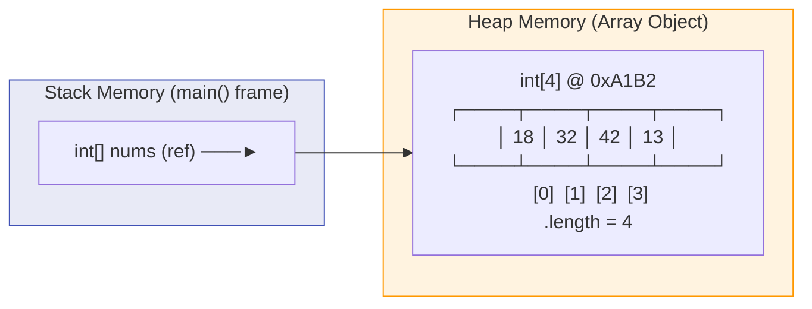
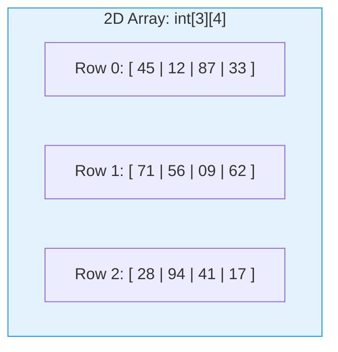
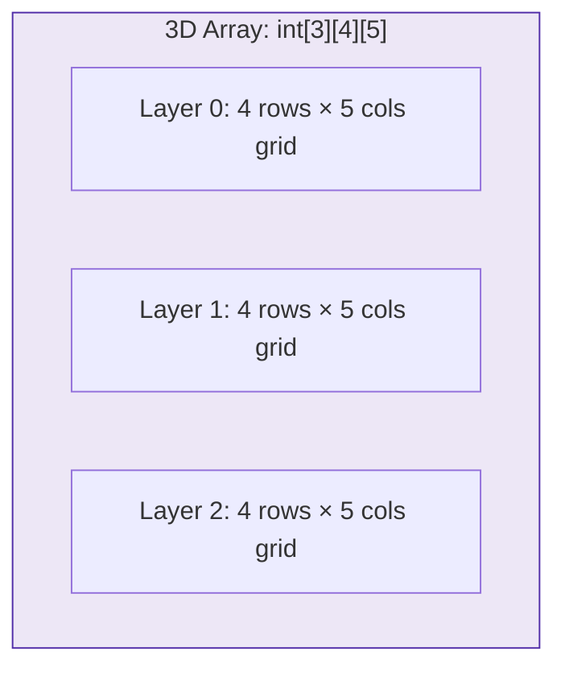
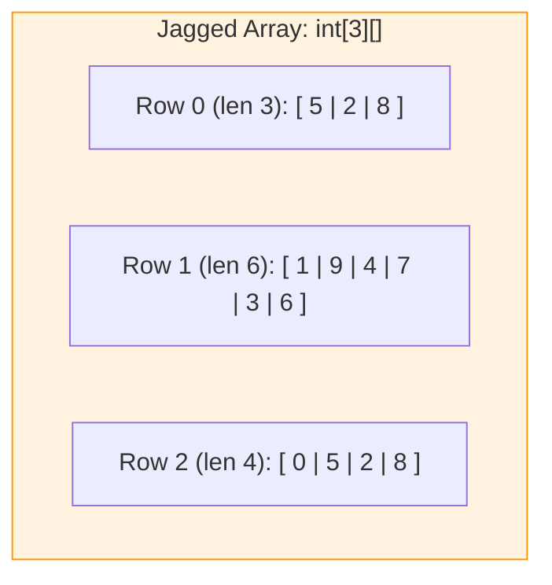
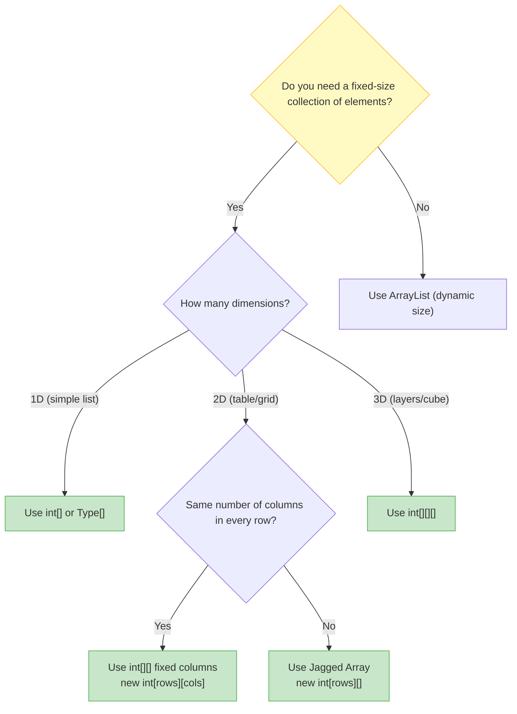

# 📊 Module 10: Arrays & Data Collections

> **Mastering Fixed-Size Data Structures in Java.** Learn how to store, access, and traverse collections of elements using single-dimensional (1D), two-dimensional (2D grids), three-dimensional (3D cubes), and jagged arrays.

> ⚡ **Fast Access**: [🏠 Course Master Readme](../../../Readme.Md) &nbsp;|&nbsp; [📂 Source Directory](../../README.md) &nbsp;|&nbsp; [⬅️ Previous: Mini-Projects](../practice_projects/README.md) &nbsp;|&nbsp; [➡️ Next: Methods](../methods/README.md) &nbsp;|&nbsp; [📁 Folder Files](./)

---

## 📑 Table of Contents
1. [What You'll Learn](#1-what-youll-learn)
2. [Keywords & Definitions Glossary](#2-keywords--definitions-glossary)
3. [How I Code & What is the Use (Mental Model)](#3-how-i-code--what-is-the-use-mental-model)
4. [Core Concept: What is an Array?](#4-core-concept-what-is-an-array)
5. [Real-World Analogy](#5-real-world-analogy)
6. [Array Declaration & Initialization](#6-array-declaration--initialization)
7. [Memory Layout: Arrays on the Heap](#7-memory-layout-arrays-on-the-heap)
8. [Traversing Arrays: Standard vs Enhanced For Loop](#8-traversing-arrays-standard-vs-enhanced-for-loop)
9. [Multi-Dimensional Arrays (2D Grids)](#9-multi-dimensional-arrays-2d-grids)
10. [Three-Dimensional Arrays (3D Cubes / Layers)](#10-three-dimensional-arrays-3d-cubes--layers)
11. [Jagged Arrays (Irregular Rows)](#11-jagged-arrays-irregular-rows)
12. [Array Selection Decision Tree](#12-array-selection-decision-tree)
13. [Line-by-Line File Guides](#13-line-by-line-file-guides)
14. [Dry-Run & Tracing Exercises](#14-dry-run--tracing-exercises)
15. [Common Pitfalls & Traps](#15-common-pitfalls--traps)

---

## 1. What You'll Learn

After completing this module, you will be able to:

- [ ] Declare and initialize arrays using both literal syntax and `new` keyword
- [ ] Access and modify elements using zero-based indexing (`nums[0]`)
- [ ] Traverse arrays with standard `for` loops and enhanced `for-each` loops
- [ ] Create and populate 2D (matrix) and 3D (multi-layered) arrays
- [ ] Build jagged arrays where each row has a different number of columns
- [ ] Safely navigate array boundaries using the `.length` property
- [ ] Avoid `ArrayIndexOutOfBoundsException` and other runtime array bugs

---

## 2. Keywords & Definitions Glossary

| Keyword / Property | Category | Definition & Meaning | Code Syntax Example |
| :--- | :--- | :--- | :--- |
| `[]` | Operator | Array index operator / type suffix declaring an array structure. | `int[] nums;` or `nums[0]` |
| `new` | Memory Operator | Allocates fixed block of memory on the **Heap** for array elements. | `new int[5];` |
| `.length` | Read-only Field | Returns the total capacity (number of slots) in the array. | `for (int i = 0; i < arr.length; i++)` |
| `for-each` | Loop Construct | Enhanced loop that iterates over every item in an array without manual indexing. | `for (int val : nums)` |
| `int[][]` | Type | 2-dimensional array; an array of 1D array references (grid/matrix). | `int[][] grid = new int[3][4];` |
| `int[][][]` | Type | 3-dimensional array; an array of 2D arrays (layers $\times$ rows $\times$ cols). | `int[][][] cube = new int[3][4][5];` |

---

## 3. How I Code & What is the Use (Mental Model)

### What is the Use?
When you have 100 student test scores, you don't want to create 100 individual variables (`score1`, `score2`, ..., `score100`). An **array** lets you store all 100 scores in a single indexed collection: `int[] scores = new int[100];`.

### How to Think & Code with Arrays:
1. **Choose Dimension**:
   - Simple list? $\rightarrow$ 1D Array (`int[]`)
   - Table / Grid / Coordinates ($x, y$)? $\rightarrow$ 2D Array (`int[][]`)
   - 3D Space / Video Frames / Layers? $\rightarrow$ 3D Array (`int[][][]`)
   - Irregular row lengths (e.g. months with different days)? $\rightarrow$ Jagged Array (`int[][]`)
2. **Allocate & Size**: Remember that Java arrays are **fixed-size**. Sizing happens at creation.
3. **Loop & Process**: Use `.length` for the upper limit, always stopping at `i < array.length` (since indices run from `0` to `length - 1`).

---

## 4. Core Concept: What is an Array?

An **array** is a fixed-size, ordered container that stores multiple values of the **same data type** under a single variable name. Each value is stored at a numbered position called an **index**, starting from `0`.

```java
// Syntax: <DataType>[] <name> = { element0, element1, element2, ... };
int[] scores = { 85, 92, 78, 95, 88 };
//   Index:       0    1    2    3    4

System.out.println(scores[0]); // 85 (first element)
System.out.println(scores[4]); // 88 (last element)
System.out.println(scores.length); // 5 (total number of elements)
```

---

## 5. Real-World Analogy

Think of an array like a **row of numbered lockers in a school**:

```
🔢 Locker Numbers (Index):  [0]     [1]     [2]     [3]     [4]
📦 Contents (Values):        85      92      78      95      88
```

- The **locker row** is the array itself.
- Each **locker number** is the index.
- The **contents inside** each locker is the stored value.
- You can **directly open any locker** by its number (instant $O(1)$ random access).
- The **total number of lockers** is fixed when the row is built (`scores.length`).

---

## 6. Array Declaration & Initialization

### Method 1: Inline Literal Initialization (when values are known upfront)
```java
int[] nums = { 1, 2, 3, 4, 5, 7 };
// Creates array with 6 elements, sized and filled immediately
```

### Method 2: `new` Keyword with Manual Assignment (when values come later)
```java
int[] nums = new int[4];  // Creates array of 4 zeros: [0, 0, 0, 0]
nums[0] = 18;             // [18, 0, 0, 0]
nums[1] = 32;             // [18, 32, 0, 0]
nums[2] = 42;             // [18, 32, 42, 0]
nums[3] = 13;             // [18, 32, 42, 13]
```

> [!NOTE]
> When you create an array with `new int[4]`, Java automatically initializes every slot to the type's **default value**: `0` for `int`, `0.0` for `double`, `false` for `boolean`, and `null` for objects.

---

## 7. Memory Layout: Arrays on the Heap

Arrays are **reference types** in Java. The variable on the Stack holds a pointer to the actual array object allocated on the Heap.



---

## 8. Traversing Arrays: Standard vs Enhanced For Loop

### Standard `for` Loop (gives you the index `i`):
```java
int[] nums = { 18, 32, 42, 13 };
for (int i = 0; i < nums.length; i++) {
    System.out.println("Index " + i + ": " + nums[i]);
}
```

### Enhanced `for-each` Loop (cleaner syntax, read-only traversal):
```java
for (int value : nums) {
    System.out.println(value);
}
```

### Enhanced `for-each` Loop on an Array of Objects
```java
Student[] students = new Student[3];
students[0] = s1;
students[1] = s2;
students[2] = s3;

for (Student stud : students) {
    System.out.println(stud.rollno + " " + stud.name + ":" + stud.marks);
}
```

This pattern is especially useful when each element is an object such as a `Student`, `Product`, or `Employee` record.

---

## 9. Multi-Dimensional Arrays (2D Grids)

A 2D array is an **array of arrays** — like a spreadsheet with rows and columns.

```java
int[][] matrix = new int[3][4]; // 3 rows, 4 columns

// Fill with random values using nested loops
for (int i = 0; i < 3; i++) {
    for (int j = 0; j < 4; j++) {
        matrix[i][j] = (int)(Math.random() * 100);
    }
}
```



---

## 10. Three-Dimensional Arrays (3D Cubes / Layers)

A 3D array adds a third dimension: **Layers $\times$ Rows $\times$ Columns**.

```java
int[][][] cube = new int[3][4][5]; // 3 layers, 4 rows per layer, 5 columns per row

// Nested loop traversal across all 3 dimensions:
for (int i = 0; i < cube.length; i++) {              // Layers (3)
    for (int j = 0; j < cube[i].length; j++) {       // Rows (4)
        for (int k = 0; k < cube[i][j].length; k++) { // Columns (5)
            cube[i][j][k] = (int)(Math.random() * 10);
        }
    }
}
```



---

## 11. Jagged Arrays (Irregular Rows)

A jagged array is a 2D array where **each row can have a different number of columns**:

```java
int[][] nums = new int[3][];     // 3 rows, columns NOT yet defined
nums[0] = new int[3];            // Row 0 has 3 columns
nums[1] = new int[6];            // Row 1 has 6 columns
nums[2] = new int[4];            // Row 2 has 4 columns
```



---

## 12. Array Selection Decision Tree



---

## 13. Line-by-Line File Guides

| File | Concepts Covered | Expected Console Output | Command to Run |
| :--- | :--- | :--- | :--- |
| [`demo_array.java`](./demo_array.java) | Inline array initialization, index-based access (`nums[3]`) | `4` | `java -cp out intermediate.arrays.demo_array` |
| [`array_of_elments.java`](./array_of_elments.java) | `new int[4]` allocation, manual element assignment, `for` loop traversal | `18`<br>`32`<br>`42`<br>`13` | `java -cp out intermediate.arrays.array_of_elments` |
| [`enchance_for_loop_for_array_string.java`](./enchance_for_loop_for_array_string.java) | Enhanced `for-each` traversal over `Student[]`, object attribute access in an array of objects | `21 Honey:76`<br>`22 Honvith:85`<br>`23 Gundu:95` | `java -cp out intermediate.arrays.enchance_for_loop_for_array_string` |
| [`multi_dimensional_array.java`](./multi_dimensional_array.java) | 2D `int[3][4]` grid, `Math.random()` fill, enhanced for-each & standard nested loops | 3×4 grid of random numbers (0–99) | `java -cp out intermediate.arrays.multi_dimensional_array` |
| [`three_dimensional_array.java`](./three_dimensional_array.java) | 3D `int[3][4][5]` layered array, 3-level nested loops, layer-by-layer matrix printing | 3 separate 4×5 grids of random digits | `java -cp out intermediate.arrays.three_dimensional_array` |
| [`jagged_array.java`](./jagged_array.java) | Jagged `int[3][]` with varying row sizes (3, 6, 4), `.length` for safe bounds | 3 rows of random digits with different column lengths | `java -cp out intermediate.arrays.jagged_array` |

---

## 14. Dry-Run & Tracing Exercises

### Dry-Run Trace: `demo_array.java`

```java
int nums[] = {1, 2, 3, 4, 5, 7};
System.out.println(nums[3]);
```

| Step | Action | Array State | Output |
| :--- | :--- | :--- | :--- |
| 1 | Create array with 6 elements | `[1, 2, 3, 4, 5, 7]` | — |
| 2 | Access index `3` | Element at `[3]` = `4` | `4` |

### Dry-Run Trace: `array_of_elments.java`

| Iteration `i` | Condition `i < 4` | `nums[i]` | Output |
| :--- | :--- | :--- | :--- |
| 0 | `true` | `18` | `18` |
| 1 | `true` | `32` | `32` |
| 2 | `true` | `42` | `42` |
| 3 | `true` | `13` | `13` |
| 4 | `false` | — | (Loop exits) |

---

## 15. Common Pitfalls & Traps

> [!CAUTION]
> ### 1. `ArrayIndexOutOfBoundsException`
> Accessing an index $\ge \text{length}$ or $< 0$ throws a runtime exception:
> ```java
> int[] nums = { 10, 20, 30 };
> System.out.println(nums[3]); // 💥 Exception! Valid indices are 0, 1, 2
> ```

> [!WARNING]
> ### 2. Array Length is `.length` (a field), NOT `.length()` (a method)
> ```java
> int[] nums = { 1, 2, 3 };
> nums.length    // ✅ Correct (field, no parentheses)
> nums.length()  // ❌ Compile error!
> ```

> [!WARNING]
> ### 3. Modifying Through a For-Each Variable Doesn't Affect the Array
> ```java
> int[] nums = { 1, 2, 3 };
> for (int val : nums) {
>     val = val * 10; // Only modifies the LOCAL copy, not the array!
> }
> // nums is still { 1, 2, 3 } — unchanged!
> ```

---

## 📝 Full Code Walkthrough

### 📄 `src/intermediate/arrays/demo_array.java`

**Purpose:** Teaches the simplest way to create an array with preset values and access a specific element by its index.

**▶️ Run:** `java -cp out intermediate.arrays.demo_array`

```java
package intermediate.arrays;
public class demo_array {
    public static void main(String[]args){
        int nums[] = {1, 2, 3, 4, 5,7};
        System.out.println(nums[3]);
    }
}
```

**Line-by-line explanation:**

| Line | Code | What it does |
| :--- | :--- | :--- |
| 4 | `int nums[] = {1, 2, 3, 4, 5, 7};` | Creates an **array** — a fixed-size container that holds multiple values of the same type. **`int nums[]`** declares an array of integers (you can also write `int[] nums`). The `{1, 2, 3, 4, 5, 7}` is an **array initializer** that creates the array and fills it with these 6 values in one step. |
| 5 | `System.out.println(nums[3]);` | **`nums[3]`** accesses the element at **index 3**. Arrays are **zero-indexed** in Java: the first element is `nums[0]`, the second is `nums[1]`, etc. So `nums[3]` is the FOURTH element, which is `4`. |

> 🔑 **Concept:** Arrays store multiple values of the same type. Indexing starts at **0** (not 1!). So in an array of 6 elements, valid indexes are 0 through 5.

**⚠️ Common beginner mistakes:**
- Trying to access `nums[6]` in a 6-element array — valid indexes are 0 to 5. Index 6 causes `ArrayIndexOutOfBoundsException`.
- Forgetting that arrays start at index 0, not 1.

---

### 📄 `src/intermediate/arrays/array_of_elments.java`

**Purpose:** Teaches how to create an empty array with `new`, fill it manually, and loop through it.

**▶️ Run:** `java -cp out intermediate.arrays.array_of_elments`

```java
package intermediate.arrays;
public class array_of_elments {
    public static void main(String[]args){
        int nums[] = new int[4];
        nums[0] = 18;
        nums[1] = 32;
        nums[2] = 42;
        nums[3] = 13;

        for(int i=0;i<4;i++){
            System.out.println(nums[i]);
        }
    }
}
```

**Line-by-line explanation:**

| Line | Code | What it does |
| :--- | :--- | :--- |
| 4 | `int nums[] = new int[4];` | **`new int[4]`** allocates memory for an array of 4 integers on the Heap. All values start as `0` (the default for `int`). The `[4]` specifies the size — once created, the size CANNOT change. |
| 5-8 | `nums[0] = 18;` etc. | Fills each position individually using the **index** in square brackets. `nums[0]` is the first slot, `nums[3]` is the last. |
| 10 | `for(int i=0; i<4; i++){` | Loops from `i=0` to `i=3` (4 iterations). Note: `i < 4` (not `<=`) because the last valid index is 3. |
| 11 | `System.out.println(nums[i]);` | Prints each element using `i` as the index. When `i=0`, prints `nums[0]` (18); when `i=1`, prints `nums[1]` (32); etc. |

> 🔑 **Concept:** `new int[size]` creates an empty array of a fixed size. You then fill it using indexes. Use a `for` loop with `i < array.length` to safely iterate through all elements.

---

### 📄 `src/intermediate/arrays/multi_dimensional_array.java`

**Purpose:** Teaches 2D arrays (like a table/grid), random number filling, and the enhanced for-each loop.

**▶️ Run:** `java -cp out intermediate.arrays.multi_dimensional_array`

```java
package intermediate.arrays;
public class multi_dimensional_array {
    public static void main(String[]args){
        int nums[][]= new int [3][4];
        for(int i=0;i<3;i++){
            for(int j=0;j<4;j++){
                nums [i][j] = (int) (Math.random() * 100);
            }
        }
        for(int n[] : nums ){
            for(int m:n){
                System.out.print(m + "");
            }
            System.out.println();
        }

        for(int i=0;i<3;i++) {
            for (int j = 0; j < 4; j++) {
                System.out.print(nums[i][j] + " ");
            }
            System.out.println();
        }
    }
}
```

**Line-by-line explanation:**

| Line | Code | What it does |
| :--- | :--- | :--- |
| 4 | `int nums[][] = new int[3][4];` | Creates a **2D array** — think of it as a table with 3 rows and 4 columns. `nums[0]` is the first row (an array of 4 ints), `nums[2][3]` is the element in row 2, column 3. |
| 5-9 | Nested `for` loops | The outer loop goes through rows (0 to 2), the inner loop goes through columns (0 to 3). Each cell is filled with a random number. |
| 8 | `(int) (Math.random() * 100)` | **`Math.random()`** returns a random `double` between 0.0 and 1.0. Multiplying by 100 gives 0.0 to 99.99..., and casting to `(int)` truncates to a whole number 0-99. |
| 10 | `for(int n[] : nums)` | This is the **enhanced for-each loop**. The syntax `for(type variable : array)` reads as "for each element in the array." Here, `n` takes the value of each ROW (which is itself an `int[]` array) one at a time. No index variable needed! |
| 11 | `for(int m : n)` | For each individual integer `m` in the current row `n`. |
| 12 | `System.out.print(m + "");` | **`print`** (without `ln`) prints without a newline — values appear on the same line. |
| 14 | `System.out.println();` | Prints an empty newline to start a new row in the output. |

> 🔑 **Concept:** 2D arrays are arrays of arrays — like a table with rows and columns. The enhanced for-each loop (`for(type var : array)`) is a simpler way to iterate without managing index variables.

---

### 📄 `src/intermediate/arrays/three_dimensional_array.java`

**Purpose:** Teaches 3D arrays — like multiple layers of 2D tables stacked together.

**▶️ Run:** `java -cp out intermediate.arrays.three_dimensional_array`

```java
package intermediate.arrays;
public class three_dimensional_array {
    public static void main(String[]args){
        int nums[][][] = new int[3][4][5];

        for (int i = 0; i < nums.length; i++) {
            for (int j = 0; j < nums[i].length; j++) {
                for (int k = 0; k < nums[i][j].length; k++) {
                    nums[i][j][k] = (int) (Math.random() * 10);
                }
            }
        }

        for (int[][] layer : nums) {
            for (int[] row : layer) {
                for (int val : row) System.out.print(val + " ");
                System.out.println();
            }
            System.out.println();
        }
    }
}
```

**Line-by-line explanation:**

| Line | Code | What it does |
| :--- | :--- | :--- |
| 4 | `int nums[][][] = new int[3][4][5];` | Creates a **3D array** — 3 layers, each containing a 4×5 grid. Think of it as 3 pages, each with a 4-row, 5-column table. Total cells: 3 × 4 × 5 = 60. |
| 6 | `nums.length` | **`.length`** is a property (not a method — no parentheses!) that returns the size of the array. For the outermost dimension, it's 3. |
| 7 | `nums[i].length` | Returns the length of the second dimension (4). |
| 8 | `nums[i][j].length` | Returns the length of the third dimension (5). |
| 14 | `for (int[][] layer : nums)` | Each `layer` is a 2D array (`int[][]`). |
| 15 | `for (int[] row : layer)` | Each `row` within a layer is a 1D array (`int[]`). |
| 16 | `for (int val : row)` | Each `val` is a single integer in the row. |

> 🔑 **Concept:** Multi-dimensional arrays can have as many dimensions as you need. Use `.length` to safely get the size of each dimension. The for-each loop handles nested arrays naturally.

---

### 📄 `src/intermediate/arrays/jagged_array.java`

**Purpose:** Teaches jagged arrays — 2D arrays where each row can have a different number of columns.

**▶️ Run:** `java -cp out intermediate.arrays.jagged_array`

```java
package intermediate.arrays;

public class jagged_array {
    public static void main(String[]args){
        int nums [][] = new int[3] [];
        nums[0] = new int [3];
        nums[1] = new int [6];
        nums[2] = new int [4];

        for(int i =0;i<nums.length;i++){
            for(int j =0;j<nums[i].length;j++){
                nums[i][j]=(int)(Math.random()*10);
            }
        }
        for(int n[]: nums){
            for(int m:n){
                System.out.print(m + " ");
            }
            System.out.println();
        }
    }
}
```

**Line-by-line explanation:**

| Line | Code | What it does |
| :--- | :--- | :--- |
| 5 | `int nums[][] = new int[3][];` | Creates a 2D array with 3 rows, but **leaves the columns undefined** (notice `[]` with no number). Each row will be assigned its own size separately. |
| 6 | `nums[0] = new int[3];` | Row 0 gets 3 columns. |
| 7 | `nums[1] = new int[6];` | Row 1 gets 6 columns — different from row 0! |
| 8 | `nums[2] = new int[4];` | Row 2 gets 4 columns. This creates a "jagged" shape (not a perfect rectangle). |
| 11 | `nums[i].length` | This is crucial for jagged arrays — each row has a DIFFERENT length, so you must use `nums[i].length` (not a hardcoded number) to avoid going out of bounds. |

> 🔑 **Concept:** Jagged arrays have rows of different lengths. Always use `.length` to check each row's size individually. This is useful when data naturally has uneven rows (like a tournament bracket).

---

### 📄 `src/intermediate/arrays/Student_array_demo.java`

**Purpose:** Teaches how to create an array of **objects** (not just numbers) — storing Student records in an array.

**▶️ Run:** `java -cp out intermediate.arrays.Student_array_demo`

```java
package intermediate.arrays;
class Student{
    int rollno;
    String name;
    int marks;
}
public class Student_array_demo {
    public static void main(String[]args){

        Student s1 = new Student();
        s1.rollno =1;
        s1.name = "honey";
        s1.marks = 90;

        Student s2 = new Student();
        s2.rollno =2;
        s2.name = "Honvith";
        s2.marks = 85;

        Student s3 = new Student();
        s3.rollno =3;
        s3.name = "gundu";
        s3.marks = 66;
        Student students[] = new Student[3];
        students[0] = s1;
        students[1] = s2;
        students[2] = s3;

        for(int i =0;i<students.length;i++){
            System.out.println(students[i].rollno +"."+ students[i].name +" :"+  students[i].marks);
        }
    }
}
```

**Line-by-line explanation:**

| Line | Code | What it does |
| :--- | :--- | :--- |
| 2-6 | `class Student { ... }` | Defines a **class** (blueprint) called `Student` with three fields: `rollno` (int), `name` (String), `marks` (int). Each field is called an **instance variable** — every Student object will have its own copy. |
| 10 | `Student s1 = new Student();` | Creates a new `Student` object on the Heap using **`new`**. The variable `s1` holds a **reference** (memory address) pointing to this object. |
| 11-13 | `s1.rollno = 1;` etc. | The **dot operator `.`** accesses the fields of the object. `s1.rollno = 1` sets the rollno field of the s1 object to 1. |
| 24 | `Student students[] = new Student[3];` | Creates an array that holds 3 **Student references** (not actual Student data — just pointers to Student objects). |
| 25-27 | `students[0] = s1;` etc. | Puts references to the Student objects into the array slots. |
| 30 | `students[i].rollno` | First `students[i]` gets the Student reference at index `i`, then `.rollno` accesses that student's roll number. |

> 🔑 **Concept:** Arrays can hold objects, not just primitive numbers. An array of objects stores **references** (pointers) to objects on the Heap. Access object fields through the array using `array[index].field`.

---

### 📄 `src/intermediate/arrays/enchance_for_loop_for_array_string.java`

**Purpose:** Teaches the enhanced for-each loop with an array of Student objects — a cleaner way to iterate.

**▶️ Run:** `java -cp out intermediate.arrays.enchance_for_loop_for_array_string`

```java
package intermediate.arrays;

public class enchance_for_loop_for_array_string {
    public static void main(String[]args){
        Student s1 = new Student();
        s1.name = "Honey";
        s1.rollno = 21;
        s1.marks = 76;

        Student s2 = new Student();
        s2.rollno = 22;
        s2.name = "Honvith";
        s2.marks = 85;

        Student s3 = new Student();
        s3.rollno = 23;
        s3.name = "Gundu";
        s3.marks = 95;

        Student students[] = new Student[3];
        students[0] = s1;
        students[1] = s2;
        students[2] = s3;

       System.out.println("no"+" "+"name"+" "+"marks");
       System.out.println("￬"+ "    "+"￬"+"    "+"￬");
        for(Student stud : students){
            System.out.println(stud.rollno + " " + stud.name + ":" + stud.marks);
        }
    }
}
```

**Line-by-line explanation:**

| Line | Code | What it does |
| :--- | :--- | :--- |
| 5-23 | Creating students and array | Same pattern as `Student_array_demo.java` — creates 3 Student objects and puts them in an array. |
| 25-26 | Header printing | Prints a table header with column names and arrow symbols. |
| 27 | `for(Student stud : students){` | **Enhanced for-each loop**: `stud` takes the value of each Student object in the array, one at a time. No need for an index variable `i` — this is cleaner when you just need to go through every element. The loop reads as: "for each Student `stud` in the `students` array." |
| 28 | `stud.rollno + " " + stud.name + ":" + stud.marks` | Accesses each student's fields directly through the `stud` variable. |

> 🔑 **Concept:** The enhanced for-each loop (`for(Type var : array)`) is the simplest way to iterate through every element in an array. It's cleaner than a traditional `for` loop when you don't need the index number.

---

---

## 🧭 Fast Navigation

| 🏠 Course Master | 📂 Source Hub | ⬅️ Previous Module | ➡️ Next Module | 📁 Browse Folder |
| :---: | :---: | :---: | :---: | :---: |
| [Main Readme](../../../Readme.Md) | [src/ Overview](../../README.md) | [⬅️ Mini-Projects](../practice_projects/README.md) | [Methods ➡️](../methods/README.md) | [📁 `arrays/`](./) |

