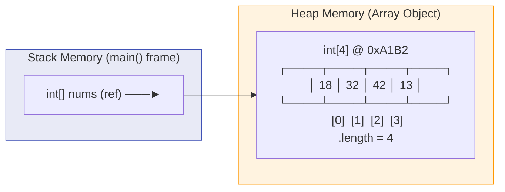
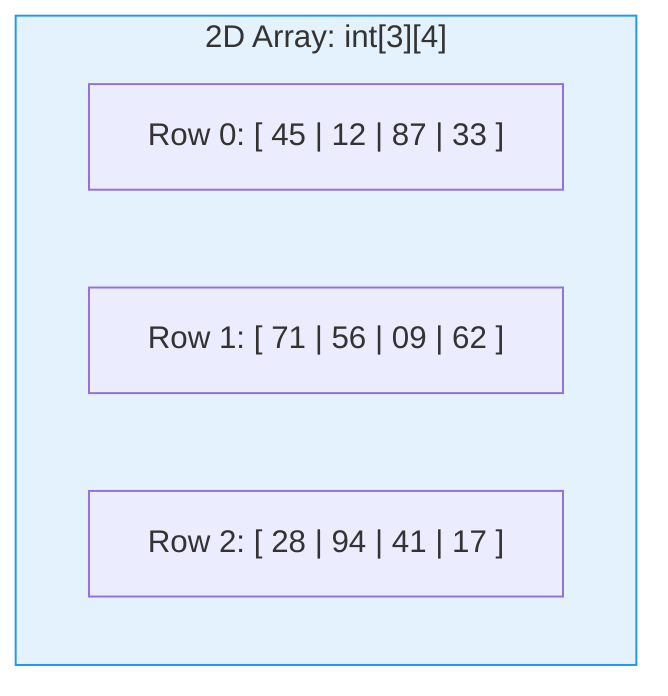
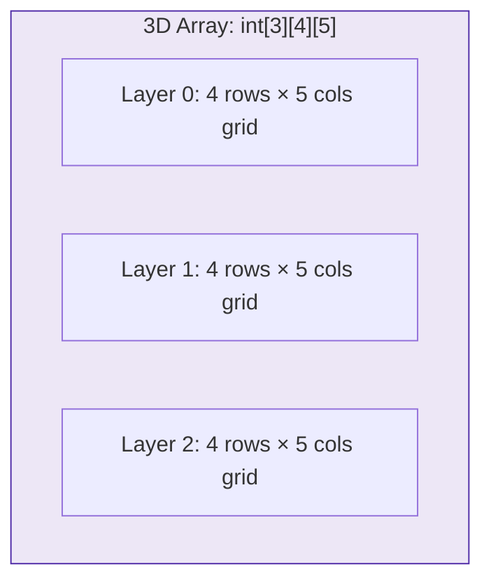
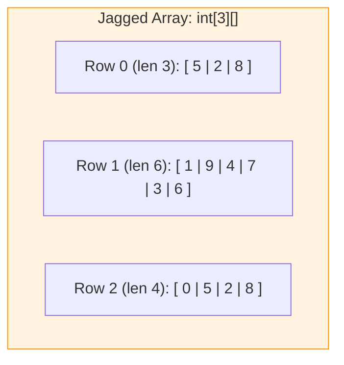
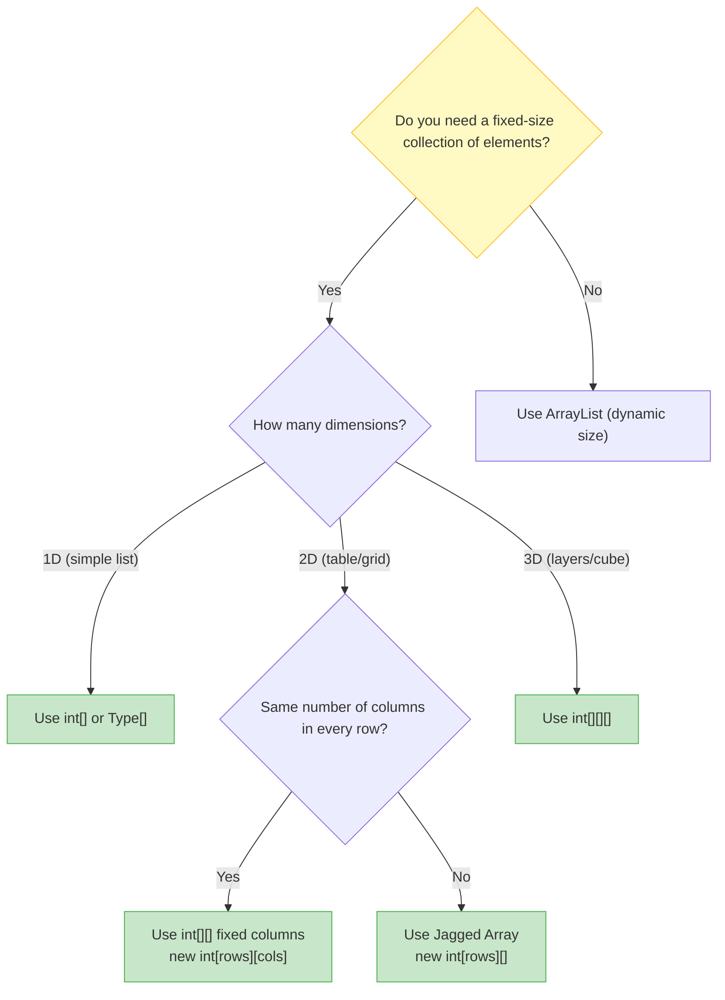

# 📊 Module 10: Arrays & Data Collections

> **Mastering Fixed-Size Data Structures in Java.** Learn how to store, access, and traverse collections of elements using single-dimensional (1D), two-dimensional (2D grids), three-dimensional (3D cubes), and jagged arrays.

> ⚡ **Fast Access**: [🏠 Course Master Readme](../../../Readme.Md) &nbsp;|&nbsp; [📂 Source Directory](../../README.md) &nbsp;|&nbsp; [⬅️ Previous: Mini-Projects](../practice_projects/README.md) &nbsp;|&nbsp; [➡️ Next: Methods](../methods/README.md) &nbsp;|&nbsp; [📁 Folder Files](./)

---

## 📑 Table of Contents
1. [What You'll Learn](#1-what-youll-learn)
2. [Keywords & Definitions Glossary](#2-keywords--definitions-glossary)
3. [How I Code & What is the Use (Mental Model)](#3-how-i-code--what-is-the-use-mental-model)
4. [Core Concept: What is an Array?](#4-core-concept-what-is-an-array)
5. [Real-World Analogy](#5-real-world-analogy)
6. [Array Declaration & Initialization](#6-array-declaration--initialization)
7. [Memory Layout: Arrays on the Heap](#7-memory-layout-arrays-on-the-heap)
8. [Traversing Arrays: Standard vs Enhanced For Loop](#8-traversing-arrays-standard-vs-enhanced-for-loop)
9. [Multi-Dimensional Arrays (2D Grids)](#9-multi-dimensional-arrays-2d-grids)
10. [Three-Dimensional Arrays (3D Cubes / Layers)](#10-three-dimensional-arrays-3d-cubes--layers)
11. [Jagged Arrays (Irregular Rows)](#11-jagged-arrays-irregular-rows)
12. [Array Selection Decision Tree](#12-array-selection-decision-tree)
13. [Line-by-Line File Guides](#13-line-by-line-file-guides)
14. [Dry-Run & Tracing Exercises](#14-dry-run--tracing-exercises)
15. [Common Pitfalls & Traps](#15-common-pitfalls--traps)

---

## 1. What You'll Learn

After completing this module, you will be able to:

- [ ] Declare and initialize arrays using both literal syntax and `new` keyword
- [ ] Access and modify elements using zero-based indexing (`nums[0]`)
- [ ] Traverse arrays with standard `for` loops and enhanced `for-each` loops
- [ ] Create and populate 2D (matrix) and 3D (multi-layered) arrays
- [ ] Build jagged arrays where each row has a different number of columns
- [ ] Safely navigate array boundaries using the `.length` property
- [ ] Avoid `ArrayIndexOutOfBoundsException` and other runtime array bugs

---

## 2. Keywords & Definitions Glossary

| Keyword / Property | Category | Definition & Meaning | Code Syntax Example |
| :--- | :--- | :--- | :--- |
| `[]` | Operator | Array index operator / type suffix declaring an array structure. | `int[] nums;` or `nums[0]` |
| `new` | Memory Operator | Allocates fixed block of memory on the **Heap** for array elements. | `new int[5];` |
| `.length` | Read-only Field | Returns the total capacity (number of slots) in the array. | `for (int i = 0; i < arr.length; i++)` |
| `for-each` | Loop Construct | Enhanced loop that iterates over every item in an array without manual indexing. | `for (int val : nums)` |
| `int[][]` | Type | 2-dimensional array; an array of 1D array references (grid/matrix). | `int[][] grid = new int[3][4];` |
| `int[][][]` | Type | 3-dimensional array; an array of 2D arrays (layers $\times$ rows $\times$ cols). | `int[][][] cube = new int[3][4][5];` |

---

## 3. How I Code & What is the Use (Mental Model)

### What is the Use?
When you have 100 student test scores, you don't want to create 100 individual variables (`score1`, `score2`, ..., `score100`). An **array** lets you store all 100 scores in a single indexed collection: `int[] scores = new int[100];`.

### How to Think & Code with Arrays:
1. **Choose Dimension**:
   - Simple list? $\rightarrow$ 1D Array (`int[]`)
   - Table / Grid / Coordinates ($x, y$)? $\rightarrow$ 2D Array (`int[][]`)
   - 3D Space / Video Frames / Layers? $\rightarrow$ 3D Array (`int[][][]`)
   - Irregular row lengths (e.g. months with different days)? $\rightarrow$ Jagged Array (`int[][]`)
2. **Allocate & Size**: Remember that Java arrays are **fixed-size**. Sizing happens at creation.
3. **Loop & Process**: Use `.length` for the upper limit, always stopping at `i < array.length` (since indices run from `0` to `length - 1`).

---

## 4. Core Concept: What is an Array?

An **array** is a fixed-size, ordered container that stores multiple values of the **same data type** under a single variable name. Each value is stored at a numbered position called an **index**, starting from `0`.

```java
// Syntax: <DataType>[] <name> = { element0, element1, element2, ... };
int[] scores = { 85, 92, 78, 95, 88 };
//   Index:       0    1    2    3    4

System.out.println(scores[0]); // 85 (first element)
System.out.println(scores[4]); // 88 (last element)
System.out.println(scores.length); // 5 (total number of elements)
```

---

## 5. Real-World Analogy

Think of an array like a **row of numbered lockers in a school**:

```
🔢 Locker Numbers (Index):  [0]     [1]     [2]     [3]     [4]
📦 Contents (Values):        85      92      78      95      88
```

- The **locker row** is the array itself.
- Each **locker number** is the index.
- The **contents inside** each locker is the stored value.
- You can **directly open any locker** by its number (instant $O(1)$ random access).
- The **total number of lockers** is fixed when the row is built (`scores.length`).

---

## 6. Array Declaration & Initialization

### Method 1: Inline Literal Initialization (when values are known upfront)
```java
int[] nums = { 1, 2, 3, 4, 5, 7 };
// Creates array with 6 elements, sized and filled immediately
```

### Method 2: `new` Keyword with Manual Assignment (when values come later)
```java
int[] nums = new int[4];  // Creates array of 4 zeros: [0, 0, 0, 0]
nums[0] = 18;             // [18, 0, 0, 0]
nums[1] = 32;             // [18, 32, 0, 0]
nums[2] = 42;             // [18, 32, 42, 0]
nums[3] = 13;             // [18, 32, 42, 13]
```

> [!NOTE]
> When you create an array with `new int[4]`, Java automatically initializes every slot to the type's **default value**: `0` for `int`, `0.0` for `double`, `false` for `boolean`, and `null` for objects.

---

## 7. Memory Layout: Arrays on the Heap

Arrays are **reference types** in Java. The variable on the Stack holds a pointer to the actual array object allocated on the Heap.



---

## 8. Traversing Arrays: Standard vs Enhanced For Loop

### Standard `for` Loop (gives you the index `i`):
```java
int[] nums = { 18, 32, 42, 13 };
for (int i = 0; i < nums.length; i++) {
    System.out.println("Index " + i + ": " + nums[i]);
}
```

### Enhanced `for-each` Loop (cleaner syntax, read-only traversal):
```java
for (int value : nums) {
    System.out.println(value);
}
```

---

## 9. Multi-Dimensional Arrays (2D Grids)

A 2D array is an **array of arrays** — like a spreadsheet with rows and columns.

```java
int[][] matrix = new int[3][4]; // 3 rows, 4 columns

// Fill with random values using nested loops
for (int i = 0; i < 3; i++) {
    for (int j = 0; j < 4; j++) {
        matrix[i][j] = (int)(Math.random() * 100);
    }
}
```



---

## 10. Three-Dimensional Arrays (3D Cubes / Layers)

A 3D array adds a third dimension: **Layers $\times$ Rows $\times$ Columns**.

```java
int[][][] cube = new int[3][4][5]; // 3 layers, 4 rows per layer, 5 columns per row

// Nested loop traversal across all 3 dimensions:
for (int i = 0; i < cube.length; i++) {              // Layers (3)
    for (int j = 0; j < cube[i].length; j++) {       // Rows (4)
        for (int k = 0; k < cube[i][j].length; k++) { // Columns (5)
            cube[i][j][k] = (int)(Math.random() * 10);
        }
    }
}
```



---

## 11. Jagged Arrays (Irregular Rows)

A jagged array is a 2D array where **each row can have a different number of columns**:

```java
int[][] nums = new int[3][];     // 3 rows, columns NOT yet defined
nums[0] = new int[3];            // Row 0 has 3 columns
nums[1] = new int[6];            // Row 1 has 6 columns
nums[2] = new int[4];            // Row 2 has 4 columns
```



---

## 12. Array Selection Decision Tree



---

## 13. Line-by-Line File Guides

| File | Concepts Covered | Expected Console Output | Command to Run |
| :--- | :--- | :--- | :--- |
| [`demo_array.java`](./demo_array.java) | Inline array initialization, index-based access (`nums[3]`) | `4` | `java -cp out intermediate.arrays.demo_array` |
| [`array_of_elments.java`](./array_of_elments.java) | `new int[4]` allocation, manual element assignment, `for` loop traversal | `18`<br>`32`<br>`42`<br>`13` | `java -cp out intermediate.arrays.array_of_elments` |
| [`multi_dimensional_array.java`](./multi_dimensional_array.java) | 2D `int[3][4]` grid, `Math.random()` fill, enhanced for-each & standard nested loops | 3×4 grid of random numbers (0–99) | `java -cp out intermediate.arrays.multi_dimensional_array` |
| [`three_dimensional_array.java`](./three_dimensional_array.java) | 3D `int[3][4][5]` layered array, 3-level nested loops, layer-by-layer matrix printing | 3 separate 4×5 grids of random digits | `java -cp out intermediate.arrays.three_dimensional_array` |
| [`jagged_array.java`](./jagged_array.java) | Jagged `int[3][]` with varying row sizes (3, 6, 4), `.length` for safe bounds | 3 rows of random digits with different column lengths | `java -cp out intermediate.arrays.jagged_array` |

---

## 14. Dry-Run & Tracing Exercises

### Dry-Run Trace: `demo_array.java`

```java
int nums[] = {1, 2, 3, 4, 5, 7};
System.out.println(nums[3]);
```

| Step | Action | Array State | Output |
| :--- | :--- | :--- | :--- |
| 1 | Create array with 6 elements | `[1, 2, 3, 4, 5, 7]` | — |
| 2 | Access index `3` | Element at `[3]` = `4` | `4` |

### Dry-Run Trace: `array_of_elments.java`

| Iteration `i` | Condition `i < 4` | `nums[i]` | Output |
| :--- | :--- | :--- | :--- |
| 0 | `true` | `18` | `18` |
| 1 | `true` | `32` | `32` |
| 2 | `true` | `42` | `42` |
| 3 | `true` | `13` | `13` |
| 4 | `false` | — | (Loop exits) |

---

## 15. Common Pitfalls & Traps

> [!CAUTION]
> ### 1. `ArrayIndexOutOfBoundsException`
> Accessing an index $\ge \text{length}$ or $< 0$ throws a runtime exception:
> ```java
> int[] nums = { 10, 20, 30 };
> System.out.println(nums[3]); // 💥 Exception! Valid indices are 0, 1, 2
> ```

> [!WARNING]
> ### 2. Array Length is `.length` (a field), NOT `.length()` (a method)
> ```java
> int[] nums = { 1, 2, 3 };
> nums.length    // ✅ Correct (field, no parentheses)
> nums.length()  // ❌ Compile error!
> ```

> [!WARNING]
> ### 3. Modifying Through a For-Each Variable Doesn't Affect the Array
> ```java
> int[] nums = { 1, 2, 3 };
> for (int val : nums) {
>     val = val * 10; // Only modifies the LOCAL copy, not the array!
> }
> // nums is still { 1, 2, 3 } — unchanged!
> ```

---

## 🧭 Fast Navigation

| 🏠 Course Master | 📂 Source Hub | ⬅️ Previous Module | ➡️ Next Module | 📁 Browse Folder |
| :---: | :---: | :---: | :---: | :---: |
| [Main Readme](../../../Readme.Md) | [src/ Overview](../../README.md) | [⬅️ Mini-Projects](../practice_projects/README.md) | [Methods ➡️](../methods/README.md) | [📁 `arrays/`](./) |

