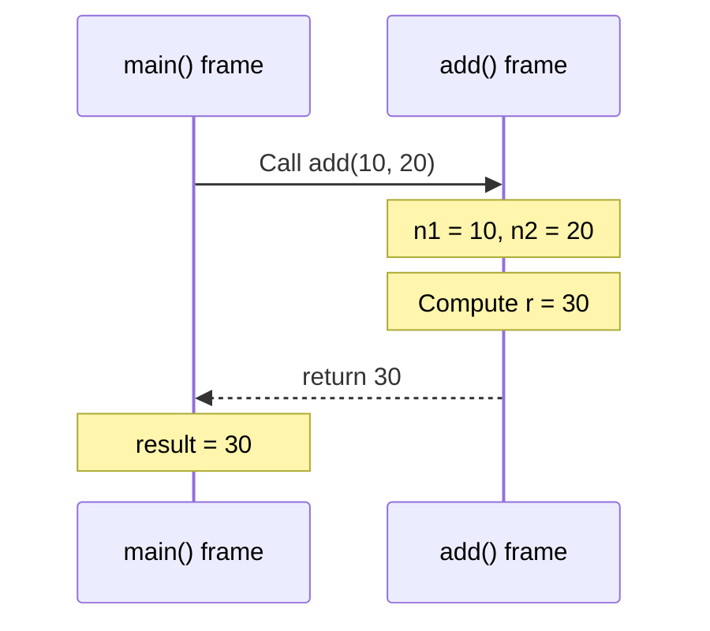
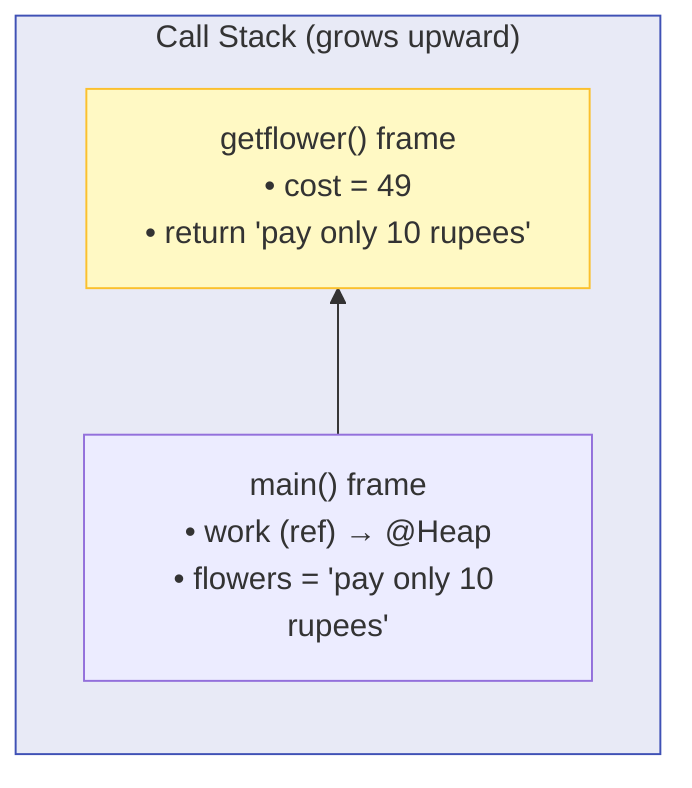
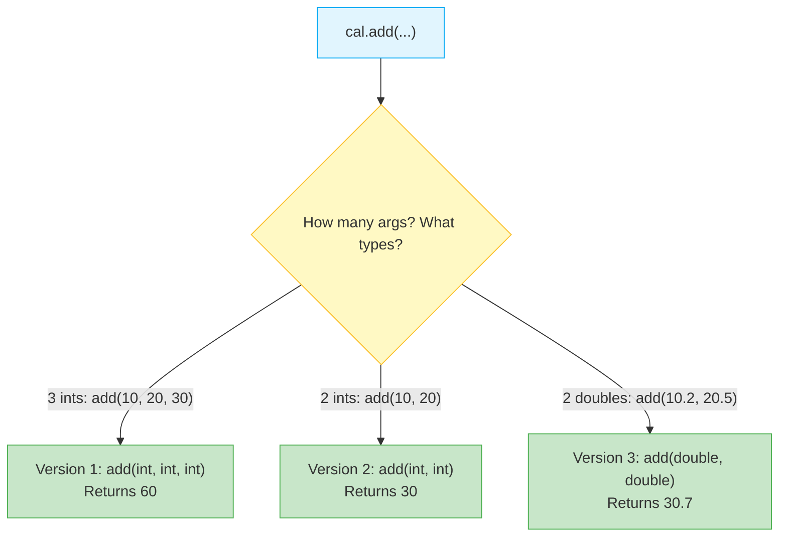

# 🔧 Module 11: Methods & Method Overloading

> **Mastering Reusable Code Blocks in Java.** Learn how to define, invoke, and overload methods to write modular, maintainable, and DRY (Don't Repeat Yourself) code.

> ⚡ **Fast Access**: [🏠 Course Master Readme](../../../Readme.Md) &nbsp;|&nbsp; [📂 Source Directory](../../README.md) &nbsp;|&nbsp; [⬅️ Previous: Arrays](../arrays/README.md) &nbsp;|&nbsp; [➡️ Next: Strings](../strings/README.md) &nbsp;|&nbsp; [📁 Folder Files](./)

---

## 📑 Table of Contents
1. [What You'll Learn](#1-what-youll-learn)
2. [Core Concept: What is a Method?](#2-core-concept-what-is-a-method)
3. [Real-World Analogy](#3-real-world-analogy)
4. [Method Anatomy & Syntax Breakdown](#4-method-anatomy--syntax-breakdown)
5. [Void Methods vs Return Methods](#5-void-methods-vs-return-methods)
6. [Method Invocation & Call Stack Flow](#6-method-invocation--call-stack-flow)
7. [Method Overloading (Compile-Time Polymorphism)](#7-method-overloading-compile-time-polymorphism)
8. [Overloading Resolution Rules](#8-overloading-resolution-rules)
9. [Line-by-Line File Guides](#9-line-by-line-file-guides)
10. [Common Pitfalls & Traps](#10-common-pitfalls--traps)

---

## 1. What You'll Learn

After completing this module, you will be able to:

- [ ] Define methods with proper return types, parameters, and access modifiers
- [ ] Distinguish between `void` methods and value-returning methods
- [ ] Understand the method call stack and how control flow jumps between methods
- [ ] Use method overloading to create multiple methods with the same name but different parameter lists
- [ ] Avoid common method design mistakes

---

## 2. Core Concept: What is a Method?

A **method** is a named, reusable block of code that performs a specific task. Methods let you:
- **Avoid repetition**: Write the logic once, call it many times.
- **Organize code**: Break complex programs into smaller, manageable pieces.
- **Improve readability**: Method names describe what the code does.

```java
// Defining a method:
public int add(int n1, int n2) {
    return n1 + n2;
}

// Calling (invoking) the method:
int result = add(10, 20);  // result = 30
```

---

## 3. Real-World Analogy

Think of a method like a **vending machine**:

```
   ┌─────────────────────────────────┐
   │       VENDING MACHINE           │
   │       (Method Name: add)        │
   │                                 │
   │  INSERT: Coin 1 (n1 = 10)  ──► │
   │  INSERT: Coin 2 (n2 = 20)  ──► │  ← Parameters (Input)
   │                                 │
   │  ⚙️ Internal Process:           │  ← Method Body (Hidden)
   │     n1 + n2 = 30               │
   │                                 │
   │  DISPENSE: 30              ◄── │  ← Return Value (Output)
   └─────────────────────────────────┘
```

- **Parameters** = what you insert (inputs)
- **Method Body** = the internal mechanism (logic)
- **Return Value** = what comes out (output)
- A `void` method is like pressing a button that plays music — it does something but doesn't hand anything back to you.

---

## 4. Method Anatomy & Syntax Breakdown

```java
// AccessModifier  ReturnType  MethodName  (ParameterList)
   public          String      getflower   (double cost)   {
       // Method Body: executable statements
       if (cost == 10)
           return "flowers";       // Returns a String value to the caller
       else
           return "pay only 10 rupees";
   }
```

| Component | Purpose | Examples |
| :--- | :--- | :--- |
| **Access Modifier** | Controls who can call this method | `public`, `private`, `protected` |
| **Return Type** | Data type of the value sent back to the caller | `int`, `double`, `String`, `void` (nothing) |
| **Method Name** | Identifier used to invoke/call the method | `add`, `getflower`, `musicplaying` |
| **Parameters** | Input variables received from the caller | `(int n1, int n2)`, `(double cost)` |
| **Method Body** | The actual logic enclosed in `{ }` | Statements, expressions, `return` |
| **Return Statement** | Sends a value back and exits the method | `return n1 + n2;` |

---

## 5. Void Methods vs Return Methods

### `void` Methods — Perform an action, return nothing:
```java
public void musicplaying() {
    System.out.println("Music playing!!!");
    // No return statement needed (implicitly returns nothing)
}

// Calling it:
work.musicplaying();  // Prints to console, no value captured
```

### Value-Returning Methods — Perform an action AND send back a result:
```java
public String getflower(double cost) {
    if (cost == 10) return "flowers";
    else return "pay only 10 rupees";
}

// Calling it:
String result = work.getflower(49);  // result = "pay only 10 rupees"
```

### Comparison Table:

| Feature | `void` Method | Return Method |
| :--- | :--- | :--- |
| **Return Type** | `void` | `int`, `double`, `String`, etc. |
| **Has `return` statement?** | Optional (no value) | **Required** (must return matching type) |
| **Can be used in expressions?** | ❌ No | ✅ Yes (`int x = add(1,2)`) |
| **Best for** | Actions (printing, logging, modifying state) | Computations (calculations, lookups) |

---

## 6. Method Invocation & Call Stack Flow

When a method is called, the JVM pushes a new **stack frame** onto the call stack. When the method returns, its frame is popped off.



### Stack Frame Visualization:



> When `getflower()` finishes, its frame is **destroyed** and control returns to `main()`.

---

## 7. Method Overloading (Compile-Time Polymorphism)

**Method overloading** means defining multiple methods with the **same name** but **different parameter lists**. The compiler decides which version to call based on the arguments you pass.

```java
class Computer {
    // Version 1: Three int parameters
    public int add(int n1, int n2, int n3) {
        return n1 + n2 + n3;
    }

    // Version 2: Two int parameters
    public int add(int n1, int n2) {
        return n1 + n2;
    }

    // Version 3: Two double parameters
    public double add(double n1, double n2) {
        return n1 + n2;
    }
}
```



---

## 8. Overloading Resolution Rules

The compiler matches the method call to the correct overloaded version by checking:

| Rule # | Criteria | ✅ Valid Overload | ❌ NOT Valid |
| :--- | :--- | :--- | :--- |
| 1 | **Different number of parameters** | `add(int, int)` vs `add(int, int, int)` | — |
| 2 | **Different parameter types** | `add(int, int)` vs `add(double, double)` | — |
| 3 | **Different parameter order** | `process(int, String)` vs `process(String, int)` | — |
| 4 | **Return type alone** | — | `int add(int a)` vs `double add(int a)` ❌ |

> [!IMPORTANT]
> **Return type alone does NOT distinguish overloaded methods.** The compiler only looks at the method name + parameter list (called the **method signature**) to resolve which method to call.

---

## 9. Line-by-Line File Guides

| File | Concepts Covered | Expected Output | Command to Run |
| :--- | :--- | :--- | :--- |
| [`Demo_class.java`](./Demo_class.java) | `void` method (`musicplaying`), value-returning method (`getflower`), conditional returns, object creation | `Music playing!!!`<br>`pay only 10 rupees` | `java -cp out intermediate.methods.Demo_class` |
| [`MethodOverloading.java`](./MethodOverloading.java) | Three overloaded `add()` methods with different parameter counts and types | `Addition of three numbers is: 60`<br>`Addition of two numbers is: 30`<br>`Addition of two decimal numbers is: 30.7` | `java -cp out intermediate.methods.MethodOverloading` |

### Dry-Run Trace: `Demo_class.java`

```java
computer work = new computer();
work.musicplaying();
String flowers = work.getflower(49);
System.out.println(flowers);
```

| Step | Action | Stack State | Output |
| :--- | :--- | :--- | :--- |
| 1 | `new computer()` → allocate on Heap | `work → @HeapObj` | — |
| 2 | Call `musicplaying()` → void method | Push `musicplaying()` frame | `Music playing!!!` |
| 3 | `musicplaying()` returns → pop frame | Back in `main()` | — |
| 4 | Call `getflower(49)` → cost = 49 | Push `getflower()` frame | — |
| 5 | `cost == 10`? → `false` | — | — |
| 6 | `cost < 10`? → `false` | — | — |
| 7 | `else` → return `"pay only 10 rupees"` | Pop `getflower()` frame | — |
| 8 | `flowers = "pay only 10 rupees"` | `flowers → "pay only 10 rupees"` | — |
| 9 | `println(flowers)` | — | `pay only 10 rupees` |

### Dry-Run Trace: `MethodOverloading.java`

| Step | Method Called | Arguments | Resolved Version | Return Value | Output |
| :--- | :--- | :--- | :--- | :--- | :--- |
| 1 | `cal.add(10, 20, 30)` | 3 ints | `add(int, int, int)` | `60` | `Addition of three numbers is: 60` |
| 2 | `cal.add(10, 20)` | 2 ints | `add(int, int)` | `30` | `Addition of two numbers is: 30` |
| 3 | `cal.add(10.2, 20.5)` | 2 doubles | `add(double, double)` | `30.7` | `Addition of two decimal numbers is: 30.7` |

---

## 10. Common Pitfalls & Traps

> [!CAUTION]
> ### 1. Forgetting to `return` in All Code Paths
> If a method has a return type, **every possible execution path** must end with a `return`:
> ```java
> public String getGrade(int score) {
>     if (score >= 90) return "A";
>     else if (score >= 80) return "B";
>     // ❌ Compile error! What if score < 80? No return statement!
> }
> ```

> [!WARNING]
> ### 2. Confusing Overloading with Overriding
> - **Overloading** = Same class, same method name, **different parameters** (compile-time)
> - **Overriding** = Subclass redefines a parent method with the **same signature** (runtime)
> These are completely different OOP concepts!

> [!WARNING]
> ### 3. Ignoring the Return Value
> If a method returns a value, you should capture it:
> ```java
> cal.add(10, 20);  // ⚠️ The result 30 is computed but thrown away!
> int result = cal.add(10, 20);  // ✅ Capture and use the result
> ```

---

## 📝 Full Code Walkthrough

### 📄 `src/intermediate/methods/Demo_class.java`

**Purpose:** Teaches void methods (that perform an action but don't return a value) and methods that return different values based on conditions.

**▶️ Run:** `java -cp out intermediate.methods.Demo_class`

```java
package intermediate.methods;
class computer{
    public void musicplaying(){
        System.out.println("Music playing!!!");
    }
    public String getflower(double cost){
      if(cost ==10)
        return "flowers";
      else if (cost <10 ) {
          return "Flower were 10 rupees";
      }
      else
          return "pay only 10 rupees";
    }
}
public class Demo_class {

    public static void main(String[]args){
        computer work = new computer();

        work.musicplaying();
        String flowers = work.getflower(49);
        System.out.println(flowers);
    }
}
```

**Line-by-line explanation:**

| Line | Code | What it does |
| :--- | :--- | :--- |
| 2 | `class computer {` | Defines a class called `computer` — a blueprint with methods. |
| 3 | `public void musicplaying(){` | **`void`** means this method does NOT return any value — it just performs an action (printing). When called, it prints the message and that's it. |
| 6 | `public String getflower(double cost){` | This method **returns** a `String`. **`double cost`** is a **parameter** — a variable that receives a value when the method is called. The return type `String` means this method MUST send back a String value using `return`. |
| 7-13 | `if/else if/else` with `return` | **`return`** exits the method immediately and sends back a value. Each branch returns a different string based on the cost. When `cost == 10`, returns "flowers". When `cost < 10`, returns a different message. Otherwise, returns "pay only 10 rupees". |
| 19 | `computer work = new computer();` | Creates an object from the `computer` class. |
| 21 | `work.musicplaying();` | Calls the void method — it prints "Music playing!!!" but doesn't return anything. |
| 22 | `String flowers = work.getflower(49);` | Calls `getflower` with `49` as the argument. Since `49 != 10` and `49 is not < 10`, the `else` branch runs, returning `"pay only 10 rupees"`. This returned string is stored in `flowers`. |

> 🔑 **Concept:** Methods are reusable blocks of code. **`void`** methods perform actions without returning values. Methods with a return type (like `String`, `int`, `double`) MUST use `return` to send a value back to the caller. **Parameters** let you pass data into methods.

---

### 📄 `src/intermediate/methods/MethodOverloading.java`

**Purpose:** Teaches method overloading — having multiple methods with the SAME name but different parameters.

**▶️ Run:** `java -cp out intermediate.methods.MethodOverloading`

```java
package intermediate.methods;

class OverloadCalculator {
    public int add(int n1,int n2,int n3)
    {
        return n1 + n2 + n3;
    }
    public int add(int n1,int n2)
    {
        return n1 + n2;
    }
    public double add(double n1,double n2)
    {
        return n1 + n2;
    }
}
public class MethodOverloading {
    public static void main(String[] args){

        OverloadCalculator cal = new OverloadCalculator();
        int r1 = cal.add(10, 20, 30);
        System.out.println("Addition of three numbers is: " + r1);
        int r2 = cal.add(10, 20);
        System.out.println("Addition of two numbers is: " + r2);
        double r3 = cal.add(10.2, 20.5);
        System.out.println("Addition of two decimal numbers is: " + r3);
    }
}
```

**Line-by-line explanation:**

| Line | Code | What it does |
| :--- | :--- | :--- |
| 3 | `class OverloadCalculator {` | A class with THREE methods all named `add` — this is **method overloading**. |
| 4 | `public int add(int n1, int n2, int n3)` | Version 1: takes **3 int** parameters, returns their sum as an `int`. |
| 8 | `public int add(int n1, int n2)` | Version 2: takes **2 int** parameters. Same name `add`, but a different **method signature** (different number of parameters). |
| 12 | `public double add(double n1, double n2)` | Version 3: takes **2 double** parameters and returns a `double`. Different parameter types = different signature. |
| 21 | `cal.add(10, 20, 30)` | Java sees 3 `int` arguments and automatically picks Version 1. |
| 23 | `cal.add(10, 20)` | Java sees 2 `int` arguments and picks Version 2. |
| 25 | `cal.add(10.2, 20.5)` | Java sees 2 `double` arguments and picks Version 3. |

> 🔑 **Concept:** **Method overloading** means defining multiple methods with the same name but different parameter lists (different number of parameters, or different parameter types). Java automatically picks the right version based on the arguments you pass. This is a form of **compile-time polymorphism**.

---

---

## 🧭 Fast Navigation

| 🏠 Course Master | 📂 Source Hub | ⬅️ Previous Module | ➡️ Next Module | 📁 Browse Folder |
| :---: | :---: | :---: | :---: | :---: |
| [Main Readme](../../../Readme.Md) | [src/ Overview](../../README.md) | [⬅️ Arrays](../arrays/README.md) | [Strings ➡️](../strings/README.md) | [📁 `methods/`](./) |
