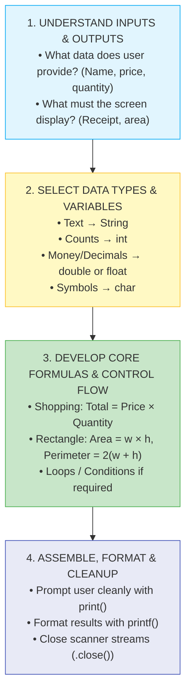

# 🛠️ Module 09: Practice Mini-Projects & Real-World Logic

> **Putting It All Together: Hands-on Problem Solving in Java.** Learn how to combine inputs, variables, formulas, loops, and conditions to build working command-line applications and solve real problems from scratch.

> ⚡ **Fast Access**: [🏠 Course Master Readme](../../../Readme.Md) &nbsp;|&nbsp; [📂 Source Directory](../../README.md) &nbsp;|&nbsp; [⬅️ Previous: Math & Random](../../beginner/math_and_random/README.md) &nbsp;|&nbsp; [➡️ Next: Arrays](../arrays/README.md) &nbsp;|&nbsp; [📁 Folder Files](./)

---

## 📑 Table of Contents
1. [What You'll Learn](#1-what-youll-learn)
2. [Keywords & Definitions Glossary](#2-keywords--definitions-glossary)
3. [How I Code & What is the Use (The 4-Step Framework)](#3-how-i-code--what-is-the-use-the-4-step-framework)
4. [Mini-Project 1: Interactive Shopping Cart](#4-mini-project-1-interactive-shopping-cart)
5. [Mini-Project 2: Rectangle Geometry Engine](#5-mini-project-2-rectangle-geometry-engine)
6. [Mini-Project 3: Dynamic Multiplication Table Generator](#6-mini-project-3-dynamic-multiplication-table-generator)
7. [Concepts Applied Matrix](#7-concepts-applied-matrix)
8. [Practice Challenges & Exercises (With Difficulty Ratings)](#8-practice-challenges--exercises)

---

## 1. What You'll Learn

After completing this module, you will be able to:

- [ ] Take a raw problem statement and design a step-by-step algorithm
- [ ] Choose appropriate data types and prevent arithmetic/scanner bugs
- [ ] Format numerical and financial output with custom currency symbols
- [ ] Implement loops for mathematical sequence and table generation
- [ ] Build standalone, interactive CLI tools from start to finish

---

## 2. Keywords & Definitions Glossary

| Keyword / Class | Category | Definition & Meaning | Code Syntax Example |
| :--- | :--- | :--- | :--- |
| `Scanner` | Class | Tokenizer that reads primitive types and strings from `System.in`. | `Scanner sc = new Scanner(System.in);` |
| `printf` | Method | Formats and prints text to console using placeholders like `%.2f`, `%d`. | `System.out.printf("Total: %.2f", total);` |
| `char` | Primitive | 16-bit single character, used here for custom currency symbols like `'₹'`. | `char currency = '₹';` |
| `float` | Primitive | 32-bit floating point number for monetary or decimal values. | `float price = sc.nextFloat();` |
| `for` | Keyword | Counting loop structure used to iterate through multiplication steps. | `for (int i = 1; i <= 10; i++)` |

---

## 3. How I Code & What is the Use (The 4-Step Framework)

Whenever you face a programming problem or interview question, use this systematic thinking framework before writing code:



---

## 4. Mini-Project 1: Interactive Shopping Cart

- **File**: [`shoppingcart.java`](./shoppingcart.java)
- **Goal**: Read item name, price per unit, and quantity; compute bill; display a formatted invoice with currency symbol `₹`.
- **How to Run**:
  ```bash
  java -cp out intermediate.practice_projects.shoppingcart
  ```
- **Sample Interactive Session**:
  ```text
  What do you want to buy: Wireless Mouse
  What is the price per item: 499.50
  How many Wireless Mouse do you want: 2

  --- Order Summary ---
  Item: Wireless Mouse
  Quantity: 2
  Total Payable: ₹999.00
  ```

---

## 5. Mini-Project 2: Rectangle Geometry Engine

- **File**: [`calculaterectangle.java`](./calculaterectangle.java)
- **Goal**: Read rectangle dimensions ($w, h$) as double-precision values, compute Area ($w \times h$) and Perimeter ($2 \times (w + h)$), format to 2 decimal places.
- **How to Run**:
  ```bash
  java -cp out intermediate.practice_projects.calculaterectangle
  ```
- **Sample Interactive Session**:
  ```text
  Enter the width of the rectangle (in cm): 12.5
  Enter the height of the rectangle (in cm): 4.0

  --- Rectangle Metrics ---
  Area: 50.00 sq.cm
  Perimeter: 33.00 cm
  ```

---

## 6. Mini-Project 3: Dynamic Multiplication Table Generator

- **File**: [`for_loop.java`](./for_loop.java)
- **Goal**: Generate and display the mathematical multiplication table for the number 17 from $17 \times 1$ to $17 \times 10$ with column alignment.
- **How to Run**:
  ```bash
  java -cp out intermediate.practice_projects.for_loop
  ```
- **Sample Console Output**:
  ```text
  --- Multiplication Table for 17 ---
  17 x  1 =  17
  17 x  2 =  34
  17 x  3 =  51
  17 x  4 =  68
  17 x  5 =  85
  17 x  6 = 102
  17 x  7 = 119
  17 x  8 = 136
  17 x  9 = 153
  17 x 10 = 170
  ```

---

## 7. Concepts Applied Matrix

| Project | Scanner I/O | Arithmetic Formulas | `printf` Formatting | Loops | Decision Logic |
| :--- | :---: | :---: | :---: | :---: | :---: |
| **Shopping Cart** | ✅ | ✅ | ✅ | ❌ | ❌ |
| **Rectangle Engine** | ✅ | ✅ | ✅ | ❌ | ❌ |
| **Table Generator** | ❌ | ✅ | ✅ | ✅ | ❌ |

---

## 8. Practice Challenges & Exercises

Test your skills by building these additional mini-projects from scratch:

| Challenge | Description | Concepts Needed | Difficulty |
| :--- | :--- | :--- | :---: |
| **1. Temperature Converter** | Convert Celsius to Fahrenheit ($F = C \times \frac{9}{5} + 32$) and vice-versa based on user choice. | `Scanner`, `switch`, `double` | ⭐ Easy |
| **2. Simple Interest Calculator** | Compute $\text{SI} = \frac{P \times R \times T}{100}$ from user principal, rate, and time. | `Scanner`, arithmetic, `printf` | ⭐ Easy |
| **3. BMI Health Classifier** | Read weight (kg) and height (m), compute $\text{BMI} = \frac{\text{weight}}{\text{height}^2}$, and classify as Underweight/Normal/Overweight. | `if-else if`, `Math.pow()`, formulas | ⭐⭐ Medium |
| **4. ATM PIN & Balance Simulator** | Prompt for 4-digit PIN (max 3 attempts with loop), show balance menu, allow deposit/withdrawal. | `while` loop, `switch`, `if-else` | ⭐⭐ Medium |
| **5. Student Grade Report Generator** | Read 5 subject marks into an array, calculate total, average percentage, assign letter grade, and print report card. | Arrays, `for` loop, `if-else`, formatting | ⭐⭐⭐ Hard |

---

## 📝 Full Code Walkthrough

### 📄 `src/intermediate/practice_projects/shoppingcart.java`

**Purpose:** A complete interactive shopping cart that reads an item name, price, and quantity from the user, then prints a formatted receipt with the total cost.

**▶️ Run:** `java -cp out intermediate.practice_projects.shoppingcart`

```java
package intermediate.practice_projects;
import java.util.Scanner;

public class shoppingcart {

    public static void main(String[] args) {
        Scanner scanner = new Scanner(System.in);

        String item;
        float price;
        char currency = '₹';
        double total;

        System.out.print("What do you want to buy: ");
        item = scanner.nextLine();

        System.out.print("What is the price per item: ");
        price = scanner.nextFloat();

        System.out.print("How many " + item + " do you want: ");
        int quantity = scanner.nextInt();

        total = price * quantity;

        System.out.println("\n--- Order Summary ---");
        System.out.println("Item: " + item);
        System.out.println("Quantity: " + quantity);
        System.out.printf("Total Payable: %c%.2f%n", currency, total);

        scanner.close();
    }
}
```

**Line-by-line explanation:**

| Line | Code | What it does |
| :--- | :--- | :--- |
| 9 | `String item;` | Declares a String variable without assigning a value yet — it will be filled later from user input. |
| 10 | `float price;` | **`float`** is a 32-bit decimal type. Used here for the unit price. |
| 11 | `char currency = '₹';` | **`char`** is a data type that holds a **single character** (16-bit Unicode). Notice single quotes `'...'` for chars vs double quotes `"..."` for strings. `₹` is the Indian Rupee symbol. |
| 12 | `double total;` | Will hold the calculated total cost. |
| 15 | `item = scanner.nextLine();` | Reads the item name from the user. |
| 18 | `price = scanner.nextFloat();` | **`nextFloat()`** reads a 32-bit floating-point number from keyboard input. |
| 21 | `int quantity = scanner.nextInt();` | Reads the quantity as an integer. |
| 23 | `total = price * quantity;` | Calculates total. `float * int` → Java promotes `quantity` to float for the multiplication, then widens the result to `double` for assignment. |
| 28 | `System.out.printf("Total Payable: %c%.2f%n", currency, total);` | **`printf`** uses format specifiers: **`%c`** = character (prints the ₹ symbol), **`%.2f`** = decimal number with 2 decimal places, **`%n`** = new line. The values after the format string fill in the `%` placeholders in order. |

> 🔑 **Concept:** This program combines Scanner input, multiple data types (`String`, `float`, `char`, `int`, `double`), arithmetic, and formatted output (`printf`) into a real-world mini-application. `printf` with format specifiers gives you precise control over output formatting.

---

### 📄 `src/intermediate/practice_projects/calculaterectangle.java`

**Purpose:** A geometry calculator that reads width and height from the user and computes the area and perimeter of a rectangle.

**▶️ Run:** `java -cp out intermediate.practice_projects.calculaterectangle`

```java
package intermediate.practice_projects;
import java.util.Scanner;

public class calculaterectangle {

    public static void main(String[] args) {
        Scanner scanner = new Scanner(System.in);

        System.out.print("Enter the width of the rectangle (in cm): ");
        double width = scanner.nextDouble();

        System.out.print("Enter the height of the rectangle (in cm): ");
        double height = scanner.nextDouble();

        double area = width * height;
        double perimeter = 2 * (width + height);

        System.out.println("\n--- Rectangle Metrics ---");
        System.out.printf("Area: %.2f sq.cm%n", area);
        System.out.printf("Perimeter: %.2f cm%n", perimeter);

        scanner.close();
    }
}
```

**Line-by-line explanation:**

| Line | Code | What it does |
| :--- | :--- | :--- |
| 10 | `double width = scanner.nextDouble();` | Reads width as a double (allows decimal values like 12.5). |
| 13 | `double height = scanner.nextDouble();` | Reads height as a double. |
| 15 | `double area = width * height;` | Area formula: width × height. For width=12.5 and height=4.0, area = 50.0. |
| 16 | `double perimeter = 2 * (width + height);` | Perimeter formula: 2 × (width + height). Parentheses ensure addition happens before multiplication. |
| 19 | `System.out.printf("Area: %.2f sq.cm%n", area);` | **`%.2f`** formats the double to show exactly 2 decimal places (e.g., `50.00`). |

> 🔑 **Concept:** Real programs combine input, formulas, and formatted output. `printf` with `%.2f` lets you control how many decimal places to show — perfect for measurements and money.

---

### 📄 `src/intermediate/practice_projects/for_loop.java`

**Purpose:** Generates a multiplication table for the number 17 using a `for` loop with formatted output.

**▶️ Run:** `java -cp out intermediate.practice_projects.for_loop`

```java
package intermediate.practice_projects;

public class for_loop {

    public static void main(String[] args) {
        int number = 17;

        System.out.println("--- Multiplication Table for " + number + " ---");

        for (int i = 1; i <= 10; i++) {
            int result = number * i;
            System.out.printf("%2d x %2d = %3d%n", number, i, result);
        }
    }
}
```

**Line-by-line explanation:**

| Line | Code | What it does |
| :--- | :--- | :--- |
| 6 | `int number = 17;` | The base number for the multiplication table. |
| 10 | `for (int i = 1; i <= 10; i++) {` | Loops from 1 to 10 (the multipliers). |
| 11 | `int result = number * i;` | Calculates `17 × i` for each iteration. |
| 12 | `System.out.printf("%2d x %2d = %3d%n", ...);` | **`%2d`** means "print an integer using at least 2 character spaces" (right-aligned). **`%3d`** uses 3 spaces. This creates neatly aligned columns in the output. |

> 🔑 **Concept:** `printf` format specifiers like `%2d` and `%3d` control column width, making output neatly aligned. This is useful for tables, receipts, and reports.

---

---

## 🧭 Fast Navigation

| 🏠 Course Master | 📂 Source Hub | ⬅️ Previous Module | ➡️ Next Module | 📁 Browse Folder |
| :---: | :---: | :---: | :---: | :---: |
| [Main Readme](../../../Readme.Md) | [src/ Overview](../../README.md) | [⬅️ Math & Random](../../beginner/math_and_random/README.md) | [Arrays ➡️](../arrays/README.md) | [📁 `practice_projects/`](./) |

