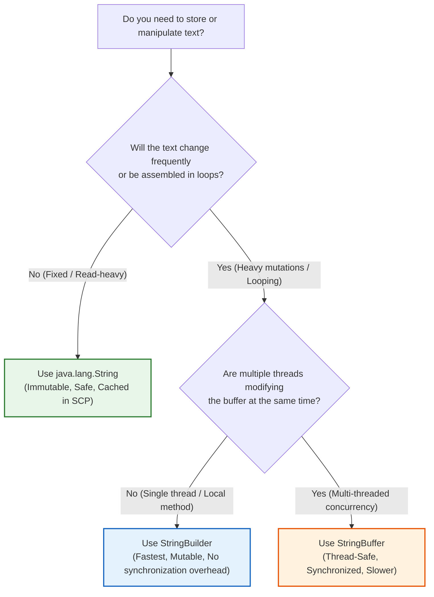
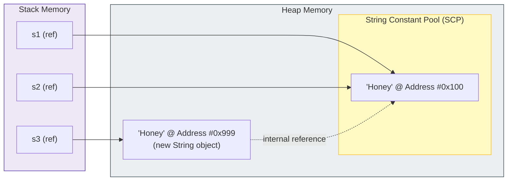

# 🧶 Module 12: Java Strings, StringBuilder & StringBuffer

> **Mastering Text Manipulation, Immutability & High-Performance Buffers.** Learn how Java handles textual data under the hood, why Strings are immutable, how the String Constant Pool optimizes memory, and when to use mutable buffers (`StringBuilder` and `StringBuffer`).

> ⚡ **Fast Access**: [🏠 Course Master Readme](../../../Readme.Md) &nbsp;|&nbsp; [📂 Source Directory](../../README.md) &nbsp;|&nbsp; [📘 Master Java Notes](../../../JAVA_MASTER_NOTES_AND_EXPLANATIONS.md) &nbsp;|&nbsp; [⬅️ Previous: Methods](../methods/README.md) &nbsp;|&nbsp; [➡️ Next: Exception Handling](../exception_handling/README.md) &nbsp;|&nbsp; [📁 Folder Files](./)

> 💡 **Master Reference**: Looking for comprehensive architectural explanations across the entire language? Read the course-wide [📘 Java Master Notes & Explanations](../../../JAVA_MASTER_NOTES_AND_EXPLANATIONS.md).

---

## 📑 Table of Contents
1. [What You'll Learn](#1-what-youll-learn)
2. [Keywords & Definitions Glossary](#2-keywords--definitions-glossary)
3. [How I Code & What is the Use (Mental Model)](#3-how-i-code--what-is-the-use-mental-model)
4. [Core Concept 1: String Immutability](#4-core-concept-1-string-immutability)
5. [Core Concept 2: The String Constant Pool (SCP)](#5-core-concept-2-the-string-constant-pool-scp)
6. [Core Concept 3: Mutable Buffers (`StringBuilder` vs `StringBuffer`)](#6-core-concept-3-mutable-buffers-stringbuilder-vs-stringbuffer)
7. [Essential Method Reference & Where to Use](#7-essential-method-reference--where-to-use)
8. [Common Pitfalls, Bugs & Runtime Errors](#8-common-pitfalls-bugs--runtime-errors)
9. [📝 Full Code Walkthroughs](#9--full-code-walkthroughs)
   - [Demo_string.java](#-srcintermediatestringsdemo_stringjava)
   - [String_builder.java](#-srcintermediatestringsstring_builderjava)
   - [Stringbuffer.java](#-srcintermediatestringsstringbufferjava)
10. [🧪 Dry-Run & Tracing Exercises](#10--dry-run--tracing-exercises)
11. [💡 Best Practices & Coding Standards](#11--best-practices--coding-standards)
12. [🧭 Fast Navigation](#12--fast-navigation)

---

## 1. What You'll Learn

After completing this module, you will be able to:

- [ ] Explain why `String` is a reference type (Class) rather than a primitive data type.
- [ ] Understand the mechanics of **String Immutability** and how JVM handles string modifications.
- [ ] Diagram the difference between the **Java Heap** and the **String Constant Pool (SCP)**.
- [ ] Compare strings correctly using `.equals()` and `.equalsIgnoreCase()` instead of `==`.
- [ ] Master core String operations: `length()`, `charAt()`, `indexOf()`, `concat()`, and method chaining.
- [ ] Choose between `String`, `StringBuilder`, and `StringBuffer` based on performance, mutability, and thread-safety requirements.
- [ ] Manipulate mutable character sequences using `append()`, `insert()`, `delete()`, and `reverse()`.
- [ ] Prevent common runtime exceptions like `NullPointerException` and `StringIndexOutOfBoundsException`.

---

## 2. Keywords & Definitions Glossary

| Term / Keyword | Category | Definition & Meaning | Code Syntax Example |
| :--- | :--- | :--- | :--- |
| `String` | Reference Type (Class) | An immutable sequence of characters encapsulated within `java.lang.String`. | `String title = "Java";` |
| **Immutability** | Concept | A design property where the internal state of an object **cannot be modified** after creation. | `s.concat(" World"); // returns new String` |
| **String Constant Pool (SCP)** | JVM Memory Area | A dedicated region in Heap memory used to cache and reuse identical string literals to save memory. | Literal `"Hello"` shares SCP address |
| `==` | Comparison Operator | Compares **memory references** (addresses), checking if two variables point to the exact same object. | `a == b // true only if same memory address` |
| `.equals()` | Method | Compares the **actual character content** inside two String objects regardless of memory address. | `a.equals(b) // true if characters match` |
| `StringBuilder` | Utility Class | A **mutable**, non-thread-safe sequence of characters designed for fast string manipulation in a single thread. | `StringBuilder sb = new StringBuilder("Hi");` |
| `StringBuffer` | Utility Class | A **mutable**, **thread-safe** (synchronized) sequence of characters for concurrent multi-threaded environments. | `StringBuffer sbf = new StringBuffer("Hi");` |
| `capacity()` | Buffer Method | The total number of characters the internal buffer can store before automatically resizing. | `buffer.capacity(); // default: 16 + length` |
| `method chaining` | Design Pattern | Calling multiple methods in a single statement sequentially from left to right. | `str.concat("!").toUpperCase();` |

---

## 3. How I Code & What is the Use (Mental Model)

### What is the Use?
Text is the most common form of data in computer programming — user names, passwords, email addresses, database queries, file paths, and web pages are all strings. Java provides specialized tools to handle text safely and efficiently depending on the task:
- **`String`**: Used for fixed, read-mostly text (e.g., config keys, usernames, URLs, log formats).
- **`StringBuilder`**: Used when building or modifying text repeatedly inside a single thread (e.g., building SQL queries, formatting CSV reports, parsing text inside loops).
- **`StringBuffer`**: Used when multiple threads simultaneously read, append, or modify the same string buffer (e.g., multi-threaded logging queues).

### Real-World Analogies

```
+-------------------------------------------------------------+
| 🪨 String = Engraved Stone Tablet                           |
| Once written, the words can NEVER be erased or changed.    |
| If you want to change a word, you must chisel a brand new   |
| tablet from scratch.                                        |
+-------------------------------------------------------------+

+-------------------------------------------------------------+
| 📝 StringBuilder / StringBuffer = Dry-Erase Whiteboard      |
| You can write on it, erase a word, insert text in the middle|
| or flip the text around without buying a new board!        |
+-------------------------------------------------------------+
```

### Decision Guide: Which One Should I Use?



---

## 4. Core Concept 1: String Immutability

### What Does Immutability Mean?
In Java, String objects are **immutable**. Once created, their internal `char[]` (or `byte[]` in modern Java 9+) array cannot be changed.

```java
String fruit = "Apple";
fruit.concat(" Pie");

System.out.println(fruit); // Output is still "Apple"!
```

What happened to `" Pie"`?
1. `fruit.concat(" Pie")` created an entirely **new** String object in memory containing `"Apple Pie"`.
2. Because we did not assign the returned reference back to a variable, the new object was discarded and will be cleaned up by the Garbage Collector.
3. The original variable `fruit` still points to `"Apple"`.

To keep the change, you must reassign the variable:
```java
fruit = fruit.concat(" Pie"); // Now fruit points to "Apple Pie"
```

### Why Did Java's Designers Make Strings Immutable?
1. **Security**: Strings carry sensitive data (passwords, network sockets, DB URLs, file paths). If strings were mutable, another malicious method could alter the file path after security checks have passed.
2. **String Constant Pool Caching**: Because strings cannot change, millions of references can safely share a single literal without fear of one caller corrupting another.
3. **Thread Safety**: Immutable objects are automatically thread-safe. Multiple threads can read the same string simultaneously without synchronization locks.
4. **Fast Hashing (`hashCode` caching)**: The hash code of a String is computed once upon first request and cached. This makes Strings the ideal key for `HashMap` and `HashSet`.

---

## 5. Core Concept 2: The String Constant Pool (SCP)

The **String Constant Pool (SCP)** is a specialized cache inside Java Heap memory managed by the JVM.

### Literals vs `new` Keyword

```java
// Method 1: String Literal (Stored in SCP)
String s1 = "Honey";
String s2 = "Honey"; // Reuses existing object from SCP!

// Method 2: new Keyword (Allocates new Heap Object)
String s3 = new String("Honey"); // Forces a new object outside the SCP
```

### Visual Memory Layout



### The Reference Equality Trap (`==` vs `.equals()`)

```java
System.out.println(s1 == s2);      // true  (both point to #0x100 in SCP)
System.out.println(s1 == s3);      // false (s1 points to #0x100, s3 points to #0x999)
System.out.println(s1.equals(s3)); // true  (both hold characters 'H','o','n','e','y')
```

> [!IMPORTANT]
> **Golden Rule of Java Strings**: Always use `.equals()` or `.equalsIgnoreCase()` to compare text. Never use `==` unless you intentionally want to check if two variables point to the exact same memory address!

---

## 6. Core Concept 3: Mutable Buffers (`StringBuilder` vs `StringBuffer`)

When you perform many string modifications (such as in a loop), using `String` causes massive memory waste because every step allocates a new object.

### The Problem: Loop Concatenation Memory Blast
```java
// ❌ BAD: Creates 1,000 throwaway String objects on the Heap!
String result = "";
for (int i = 0; i < 1000; i++) {
    result += i; // O(N^2) time complexity & garbage collector overload!
}

// ✅ GOOD: A single buffer expands in-place!
StringBuilder sb = new StringBuilder();
for (int i = 0; i < 1000; i++) {
    sb.append(i); // O(N) time complexity!
}
String result = sb.toString();
```

### Buffer Capacity vs Length
A `StringBuilder` or `StringBuffer` maintains an internal character array with a **capacity**:
- **`length()`**: The number of characters currently placed in the buffer.
- **`capacity()`**: The total memory slots currently allocated.

```java
StringBuffer sb = new StringBuffer("MokshagnaTej");
System.out.println(sb.length());   // 12 (number of characters)
System.out.println(sb.capacity()); // 28 (initial 16 default slots + 12 string length)
```

> [!NOTE]
> If the text exceeds the current capacity, Java automatically expands the buffer using the formula:
> $$\text{New Capacity} = (\text{Old Capacity} \times 2) + 2$$

### Comparison Matrix: `String` vs `StringBuilder` vs `StringBuffer`

| Feature | `java.lang.String` | `java.lang.StringBuilder` | `java.lang.StringBuffer` |
| :--- | :--- | :--- | :--- |
| **Storage / Mutability** | **Immutable** (Read-only) | **Mutable** (In-place modification) | **Mutable** (In-place modification) |
| **Thread Safety** | ✅ Yes (Inherently safe) | ❌ No (Not thread-safe) | ✅ Yes (Synchronized methods) |
| **Speed & Performance** | Slow for modifications | ⚡ **Fastest** (No sync locks) | 🐢 Medium (Sync lock overhead) |
| **Memory Efficiency** | Low during mutations | High | High |
| **Introduced In** | JDK 1.0 | JDK 1.5 | JDK 1.0 |
| **Best Used For** | Fixed text, constants, keys | Local method text building, loops | Shared multi-threaded text builders |

---

## 7. Essential Method Reference & Where to Use

### 1. `java.lang.String` Core Methods

| Method Signature | Return Type | What It Does | Where to Use / Best Practice | Example (`String s = "Hello";`) | Result |
| :--- | :--- | :--- | :--- | :--- | :--- |
| `length()` | `int` | Returns total character count | Sizing checks, loop bounds | `s.length()` | `5` |
| `charAt(int index)` | `char` | Returns character at zero-based index | Character validation, palindrome checks | `s.charAt(1)` | `'e'` |
| `indexOf(char c)` | `int` | Finds index of first occurrence (-1 if absent) | Searching substrings, delimiter parsing | `s.indexOf('l')` | `2` |
| `lastIndexOf(char c)` | `int` | Finds index of last occurrence (-1 if absent) | Finding file extensions (`.lastIndexOf('.')`) | `s.lastIndexOf('l')` | `3` |
| `concat(String str)` | `String` | Appends argument string to the end | Joining two strings | `s.concat(" World")` | `"Hello World"` |
| `toUpperCase()` | `String` | Converts all characters to uppercase | Case-insensitive normalization | `s.toUpperCase()` | `"HELLO"` |
| `toLowerCase()` | `String` | Converts all characters to lowercase | Case-insensitive input comparison | `s.toLowerCase()` | `"hello"` |
| `equals(Object anObject)` | `boolean` | Checks exact character content equality | Login password & username verification | `s.equals("hello")` | `false` |
| `equalsIgnoreCase(String str)` | `boolean` | Content equality ignoring case differences | Case-insensitive commands (`"yes"`, `"YES"`) | `s.equalsIgnoreCase("hello")` | `true` |
| `substring(int begin, int end)` | `String` | Extracts slice from `begin` to `end - 1` | Extracting file names, tokens, prefixes | `s.substring(1, 4)` | `"ell"` |
| `trim()` / `strip()` | `String` | Removes leading and trailing whitespace | Sanitizing user form input | `"  hi  ".trim()` | `"hi"` |
| `contains(CharSequence s)` | `boolean` | Checks if substring exists | Keyword matching, search filters | `s.contains("ell")` | `true` |
| `replace(char old, char new)` | `String` | Replaces all occurrences | Formatting phone numbers, dates, paths | `s.replace('l', 'p')` | `"Heppo"` |

---

### 2. `StringBuilder` & `StringBuffer` Core Methods

Both classes share the exact same method signatures:

| Method Signature | Return Type | What It Does | Example (`sb = new StringBuilder("Java");`) | Output State |
| :--- | :--- | :--- | :--- | :--- |
| `append(String str)` | `Self` | Appends text to the end in-place | `sb.append(" 21")` | `"Java 21"` |
| `insert(int offset, String str)` | `Self` | Inserts text at the specified index | `sb.insert(0, "Modern ")` | `"Modern Java"` |
| `delete(int start, int end)` | `Self` | Deletes characters from `start` to `end - 1` | `sb.delete(1, 3)` | `"Ja"` |
| `deleteCharAt(int index)` | `Self` | Deletes a single character at `index` | `sb.deleteCharAt(0)` | `"ava"` |
| `reverse()` | `Self` | Reverses the characters in-place | `sb.reverse()` | `"avaJ"` |
| `capacity()` | `int` | Returns current allocated buffer size | `sb.capacity()` | `20` (16 + 4) |
| `toString()` | `String` | Converts mutable buffer to immutable `String` | `sb.toString()` | `"Java"` |

---

## 8. Common Pitfalls, Bugs & Runtime Errors

### 💥 Error 1: `StringIndexOutOfBoundsException`
**Root Cause**: Attempting to access an index that is negative, or greater than or equal to `length()`.

```java
String msg = "Java"; // Valid indices: 0, 1, 2, 3 (length = 4)
char c = msg.charAt(4); // 💥 StringIndexOutOfBoundsException: Index 4 out of bounds for length 4
```

**Where It Occurs**:
- Off-by-one errors in `for` loops using `<= str.length()` instead of `< str.length()`.
- Invalid substring calls where `beginIndex > endIndex`.

**How to Fix**:
```java
// Always check bounds or use strict < comparison
if (index >= 0 && index < msg.length()) {
    char validChar = msg.charAt(index);
}
```

---

### 💥 Error 2: `NullPointerException` (Operating on `null`)
**Root Cause**: Attempting to call `.length()`, `.toUpperCase()`, or `.equals()` on a String reference that points to `null`.

```java
String input = null;
if (input.equals("ADMIN")) { // 💥 NullPointerException!
    System.out.println("Access granted");
}
```

**How to Fix — Use "Yoda Conditions" or `Objects.equals()`**:
```java
// Safe: Call .equals() on the literal constant, which is guaranteed non-null
if ("ADMIN".equals(input)) { 
    System.out.println("Access granted");
}

// Or use java.util.Objects:
if (java.util.Objects.equals(input, "ADMIN")) { ... }
```

---

### 💥 Error 3: The Reference Equality Bug (`==` vs `.equals()`)
**Root Cause**: Using `==` on strings created via `new String()` or input streams (e.g. `Scanner`), which compares heap addresses rather than string text.

```java
Scanner sc = new Scanner(System.in);
String userInput = sc.next(); // User types "exit"

if (userInput == "exit") { // ❌ BUG: Evaluates to false even if user typed "exit"!
    System.out.println("Quitting...");
}

// ✅ Correct:
if ("exit".equals(userInput)) {
    System.out.println("Quitting...");
}
```

---

### 💥 Error 4: The "Forgotten Assignment" Immutability Trap
**Root Cause**: Expecting String manipulation methods to alter the variable in-place.

```java
String name = "honey";
name.toUpperCase(); // ❌ Result is ignored!

System.out.println(name); // Prints "honey" (unchanged!)

// ✅ Correct: Capture the returned string
name = name.toUpperCase();
System.out.println(name); // Prints "HONEY"
```

---

### 💥 Error 5: `.length` (Array field) vs `.length()` (String method)
**Root Cause**: Syntax confusion between arrays and strings.

```java
int[] numbers = { 1, 2, 3 };
String text = "hello";

int a = numbers.length;   // ✅ Field (no parentheses)
int b = numbers.length(); // ❌ Compile error: cannot find symbol method length()

int c = text.length();    // ✅ Method (parentheses required)
int d = text.length;      // ❌ Compile error: cannot find symbol variable length
```

---

### 💥 Error 6: Concurrent Race Conditions with `StringBuilder`
**Root Cause**: Sharing a `StringBuilder` instance across multiple threads without synchronization.
- Because `StringBuilder` is not thread-safe, simultaneous appends from two threads can overwrite internal buffer pointers, causing lost data or `ArrayIndexOutOfBoundsException`.
- **Fix**: Use `StringBuffer` or synchronize access manually with `synchronized(sb) { ... }`.

---

## 9. 📝 Full Code Walkthroughs

### 📄 `src/intermediate/strings/Demo_string.java`

**Purpose**: Demonstrates core immutable String methods: `concat()`, `toUpperCase()`, method chaining, `length()`, `charAt()`, and `indexOf()`.

**▶️ Run Command**:
```bash
java -cp out intermediate.strings.Demo_string
```

**Source Code**:
```java
package intermediate.strings;

public class Demo_string {
    public static void main(String[]args){
        String name = "Honey";
        System.out.println( name.concat("Reddy"));
        System.out.println( name.concat("Reddy").toUpperCase());
        System.out.println(name.length());
        System.out.println(name.charAt(0));
        System.out.println(name.indexOf('e'));
    }
}
```

**Line-by-Line Breakdown**:

| Line | Code | Deep Explanation |
| :---: | :--- | :--- |
| 1 | `package intermediate.strings;` | Groups this class into the `intermediate.strings` package namespace. |
| 3 | `public class Demo_string {` | Declares the public class `Demo_string`. |
| 4 | `public static void main(String[]args){` | Main entry point executed by JVM. |
| 5 | `String name = "Honey";` | Creates string literal `"Honey"` in the String Constant Pool (SCP). Variable `name` holds the reference. |
| 6 | `System.out.println( name.concat("Reddy"));` | Calls `.concat("Reddy")`. Produces a **new** String `"HoneyReddy"`. Prints `"HoneyReddy"`. The original `name` remains `"Honey"`. |
| 7 | `System.out.println( name.concat("Reddy").toUpperCase());` | **Method Chaining**: First `.concat("Reddy")` returns `"HoneyReddy"`, then `.toUpperCase()` is immediately invoked on that result, producing `"HONEYREDDY"`. |
| 8 | `System.out.println(name.length());` | Calls `.length()`. Counts characters in `"Honey"` (5 characters: H, o, n, e, y). Returns `5`. |
| 9 | `System.out.println(name.charAt(0));` | Calls `.charAt(0)`. Retrieves character at index 0 (zero-based). Returns character `'H'`. |
| 10 | `System.out.println(name.indexOf('e'));` | Calls `.indexOf('e')`. Searches `"Honey"` from left to right: H=0, o=1, n=2, e=3. Returns index `3`. |

**Console Output**:
```text
HoneyReddy
HONEYREDDY
5
H
3
```

---

### 📄 `src/intermediate/strings/String_builder.java`

**Purpose**: Demonstrates mutable string operations using `StringBuilder` (`insert`, `append`, `delete`, `reverse`) without creating throwaway objects.

**▶️ Run Command**:
```bash
java -cp out intermediate.strings.String_builder
```

**Source Code**:
```java
package intermediate.strings;

public class String_builder {
    public static void main(String[] args) {
        StringBuilder builder = new StringBuilder("MokshagnaTej");
        //builder.append(" Reddy");
        //builder.deleteCharAt(4);
        builder.insert(0, "Kalepalli ");
        //builder.delete(0,8);
        //builder.reverse();
        System.out.println(builder);
    }
}
```

**Line-by-Line Breakdown**:

| Line | Code | Deep Explanation |
| :---: | :--- | :--- |
| 5 | `StringBuilder builder = new StringBuilder("MokshagnaTej");` | Allocates a mutable `StringBuilder` on the Heap initialized with `"MokshagnaTej"`. Capacity is `16 + 12 = 28`. |
| 6 | `//builder.append(" Reddy");` | *(Commented out)* If uncommented: Appends `" Reddy"` to the end in-place $\rightarrow$ `"MokshagnaTej Reddy"`. |
| 7 | `//builder.deleteCharAt(4);` | *(Commented out)* If uncommented: Removes character at index 4 (`'h'`) $\rightarrow$ `"MoksagnaTej"`. |
| 8 | `builder.insert(0, "Kalepalli ");` | **Active Operation**: Inserts `"Kalepalli "` at index 0 (the front). Shifts existing characters right. Buffer content becomes `"Kalepalli MokshagnaTej"`. |
| 9 | `//builder.delete(0,8);` | *(Commented out)* If uncommented: Deletes indices 0 through 7 (exclusive 8, removes `"Kalepall"`). |
| 10 | `//builder.reverse();` | *(Commented out)* If uncommented: Inverts all characters in the buffer backwards in-place! |
| 11 | `System.out.println(builder);` | Prints the modified buffer. `System.out.println` automatically calls `builder.toString()`. |

**Console Output**:
```text
Kalepalli MokshagnaTej
```

---

### 📄 `src/intermediate/strings/Stringbuffer.java`

**Purpose**: Demonstrates thread-safe mutable string operations using `StringBuffer` with synchronized internals.

**▶️ Run Command**:
```bash
java -cp out intermediate.strings.Stringbuffer
```

**Source Code**:
```java
package intermediate.strings;

public class Stringbuffer {
    public static void main(String[]args){
        StringBuffer buffer = new StringBuffer("MokshagnaTej");
       // System.out.println(buffer.capacity());
        //System.out.println(buffer.length());
        //buffer.append(" Reddy");
       //buffer.deleteCharAt(4);
        buffer.insert(0,"Kalepalli ");
        //buffer.delete(0,8);
        //buffer.reverse();
        System.out.println(buffer);
    }
}
```

**Line-by-Line Breakdown & Exploration**:

| Line | Code | Deep Explanation |
| :---: | :--- | :--- |
| 5 | `StringBuffer buffer = new StringBuffer("MokshagnaTej");` | Creates a synchronized `StringBuffer`. Thread-safe. |
| 6 | `// System.out.println(buffer.capacity());` | *(Uncomment to explore)* Returns allocated buffer capacity. For `"MokshagnaTej"` (12 chars), initial capacity is $16 + 12 = \mathbf{28}$. |
| 7 | `//System.out.println(buffer.length());` | *(Uncomment to explore)* Returns character count $\mathbf{12}$. |
| 8 | `//buffer.append(" Reddy");` | Appends text at the end safely across threads. |
| 9 | `//buffer.deleteCharAt(4);` | Deletes single character at index 4. |
| 10 | `buffer.insert(0,"Kalepalli ");` | **Active Operation**: Inserts prefix at offset 0. Mutates buffer in-place to `"Kalepalli MokshagnaTej"`. |
| 11 | `//buffer.delete(0,8);` | Range deletion from start index 0 up to end index 8 (exclusive). |
| 12 | `//buffer.reverse();` | Reverses string in place. |
| 13 | `System.out.println(buffer);` | Prints the resulting buffer $\rightarrow$ `"Kalepalli MokshagnaTej"`. |

**Console Output**:
```text
Kalepalli MokshagnaTej
```

---

## 10. 🧪 Dry-Run & Tracing Exercises

Test your understanding of String mechanics before moving to the next module!

### 🔍 Exercise 1: String Immutability Tracing
Predict the output of the following snippet:
```java
String s1 = "Hello";
String s2 = s1;
s1 = s1.concat(" World");
System.out.println("s1: " + s1);
System.out.println("s2: " + s2);
```

<details>
<summary>👉 Click to reveal Answer & Explanation</summary>

**Output**:
```text
s1: Hello World
s2: Hello
```
**Explanation**:
1. `s1` initially points to `"Hello"`.
2. `s2` is assigned the same reference as `s1`, pointing to `"Hello"`.
3. `s1.concat(" World")` creates a NEW object `"Hello World"`, and `s1` is updated to point to it.
4. `s2` remains unchanged, still pointing to `"Hello"`.
</details>

---

### 🔍 Exercise 2: String Pool & Reference Identity
What will each line print?
```java
String a = "Java";
String b = "Java";
String c = new String("Java");
String d = c.intern();

System.out.println(a == b);      // [?]
System.out.println(a == c);      // [?]
System.out.println(a.equals(c)); // [?]
System.out.println(a == d);      // [?]
```

<details>
<summary>👉 Click to reveal Answer & Explanation</summary>

**Output**:
```text
true
false
true
true
```
**Explanation**:
- `a == b` is `true`: Both are string literals referencing the same SCP slot.
- `a == c` is `false`: `c` is created with `new`, so it resides in Heap memory outside the SCP.
- `a.equals(c)` is `true`: `.equals()` checks the character sequence `"Java"`, which matches.
- `a == d` is `true`: `.intern()` returns the canonical instance from the String Constant Pool, which is `a`.
</details>

---

### 🔍 Exercise 3: StringBuilder Mutation Chain
Predict the final state of `sb`:
```java
StringBuilder sb = new StringBuilder("Rocket");
sb.append("123");
sb.delete(2, 4);
sb.reverse();
System.out.println(sb);
```

<details>
<summary>👉 Click to reveal Answer & Explanation</summary>

**Step-by-Step Trace**:
1. Initial: `"Rocket"` (Indices: R=0, o=1, c=2, k=3, e=4, t=5)
2. `append("123")` $\rightarrow$ `"Rocket123"`
3. `delete(2, 4)` $\rightarrow$ deletes index 2 ('c') and index 3 ('k') $\rightarrow$ `"Roet123"`
4. `reverse()` $\rightarrow$ reverses `"Roet123"` $\rightarrow$ `"321teoR"`

**Final Output**:
```text
321teoR
```
</details>

---

## 11. 💡 Best Practices & Coding Standards

1. **Always Use `.equals()` for Equality**:
   ```java
   // ❌ Unreliable
   if (input == "yes") { ... }
   
   // ✅ Reliable & Null-Safe
   if ("yes".equalsIgnoreCase(input)) { ... }
   ```

2. **Use `StringBuilder` for Dynamic Concatenation**:
   - For single-line concatenations (`String msg = "Hello " + name + "!";`), the Java compiler automatically optimizes this using `StringBuilder` under the hood.
   - For **loops or multi-statement text building**, you must explicitly instantiate `StringBuilder`.

3. **Avoid Unnecessary `new String(...)`**:
   ```java
   // ❌ Inefficient: Creates an unnecessary heap object wrapping the literal
   String s = new String("example");
   
   // ✅ Clean & Memory-efficient: Leverages the String Constant Pool directly
   String s = "example";
   ```

4. **Preset Initial Capacity for Large Buffers**:
   - If you know you will append 5,000 characters, pre-allocate the capacity to prevent internal resizing overhead:
   ```java
   StringBuilder sb = new StringBuilder(5000); // No dynamic array doubling needed!
   ```

5. **Choose `StringBuffer` Only When Required**:
   - `StringBuffer` synchronizes every method call, which introduces lock overhead. Unless multiple threads are writing to the buffer, prefer `StringBuilder`.

---

## 12. 🧭 Fast Navigation

| 🏠 Course Master | 📂 Source Hub | 📘 Master Notes | ⬅️ Previous Module | ➡️ Next Module | 📁 Browse Folder |
| :---: | :---: | :---: | :---: | :---: | :---: |
| [Main Readme](../../../Readme.Md) | [src/ Overview](../../README.md) | [📘 Master Java Notes](../../../JAVA_MASTER_NOTES_AND_EXPLANATIONS.md) | [⬅️ Methods](../methods/README.md) | [Exception Handling ➡️](../exception_handling/README.md) | [📁 `strings/`](./) |
