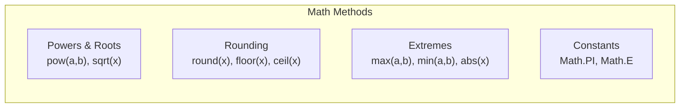

# 🎲 Module 08: Math & Random Number Utilities

> **Mastering the Math API & Randomization in Java.** Learn how to perform complex mathematical formulas, trigonometry, rounding, and random number generation.

---

## 📑 Table of Contents
1. [Core Concept: Built-in Utilities in Java](#1-core-concept-built-in-utilities-in-java)
2. [The Complete `Math` Class Reference](#2-the-complete-math-class-reference)
3. [Pseudo-Random Generation with `java.util.Random`](#3-pseudo-random-generation-with-javautilrandom)
4. [Formulas & Real-World Examples](#4-formulas--real-world-examples)
5. [Line-by-Line File Guides](#5-line-by-line-file-guides)

---

## 1. Core Concept: Built-in Utilities in Java

Java ships with high-performance mathematical and statistical tools:
- **`java.lang.Math`**: Pure static functions operating on IEEE-754 floating point and standard integer types.
- **`java.util.Random`**: Thread-safe pseudo-random number generator for ranges, distributions, and flags.

---

## 2. The Complete `Math` Class Reference



### Essential Method Summary:
- `Math.sqrt(d)`: Computes $\sqrt{d}$.
- `Math.pow(base, exp)`: Computes $\text{base}^{\text{exp}}$.
- `Math.max(a, b)` / `Math.min(a, b)`: Efficient branchless extremes.
- `Math.abs(n)`: Magnitude without negative sign.

---

## 3. Pseudo-Random Generation with `java.util.Random`

```java
Random rand = new Random();

// Generate within range [min, max] inclusive:
int min = 1, max = 100;
int randomNum = rand.nextInt(min, max + 1); // Java 17+
```

---

## 4. Formulas & Real-World Examples

### 1. Distance Formula: $d = \sqrt{(x_2 - x_1)^2 + (y_2 - y_1)^2}$
```java
double distance = Math.sqrt(Math.pow(x2 - x1, 2) + Math.pow(y2 - y1, 2));
```

### 2. Circle Area: $Area = \pi r^2$
```java
double radius = 5.0;
double area = Math.PI * Math.pow(radius, 2);
```

---

## 5. Line-by-Line File Guides

| File | Concepts Covered | Command to Run |
| :--- | :--- | :--- |
| [`math.java`](file:///Users/honeyreddy/Documents/Java%20course/src/math_and_random/math.java) | `Math.PI`, `Math.E`, `sqrt`, `pow`, `abs`, `round`, `floor`, `ceil` | `java -cp out math_and_random.math` |
| [`randomnumbers.java`](file:///Users/honeyreddy/Documents/Java%20course/src/math_and_random/randomnumbers.java) | `Random.nextInt(origin, bound)`, dice rolls, booleans | `java -cp out math_and_random.randomnumbers` |
