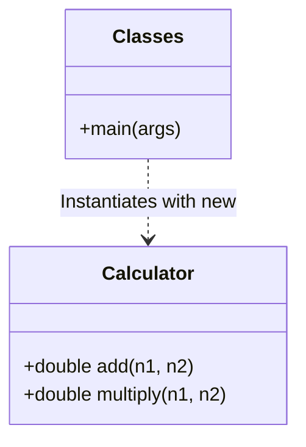
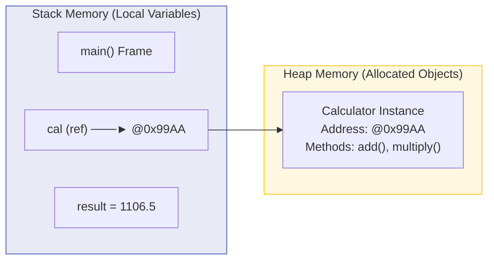

# 🏛️ Module 09: Object-Oriented Programming (OOP) Kickstart

> **Mastering Classes, Objects & Methods in Java.** Learn how Java models real-world entities into modular, reusable blueprints.

---

## 📑 Table of Contents
1. [Core Concept: The Blueprint Analogy](#1-core-concept-the-blueprint-analogy)
2. [Stack Memory vs Heap Memory](#2-stack-memory-vs-heap-memory)
3. [Anatomy of a Class & Method](#3-anatomy-of-a-class--method)
4. [The 4 Pillars of OOP Overview](#4-the-4-pillars-of-oop-overview)
5. [Line-by-Line File Guides](#5-line-by-line-file-guides)

---

## 1. Core Concept: The Blueprint Analogy



- **Class**: The design blueprint specifying attributes (state) and methods (behavior).
- **Object**: A living instance of the class in RAM.
- **Reference Variable**: A pointer in Stack memory holding the address of the Heap object.

---

## 2. Stack Memory vs Heap Memory



---

## 3. Anatomy of a Class & Method

```java
// AccessModifier  ReturnType  MethodName(Parameters)
   public          double      add       (double n1, double n2) {
       // Method Body
       return n1 + n2; // Return statement sending value back
   }
```

---

## 4. The 4 Pillars of OOP Overview

1. **Encapsulation**: Bundling data (variables) and methods that operate on the data into a single unit, restricting direct access using `private`.
2. **Inheritance**: Mechanism where a child class acquires all properties and behaviors of a parent class (`extends`).
3. **Polymorphism**: Ability for a message/method call to take on multiple forms (Method Overloading & Overriding).
4. **Abstraction**: Hiding complex implementation details and showing only the essential interface (`abstract class`, `interface`).

---

## 5. Line-by-Line File Guides

| File | Concepts Covered | Command to Run |
| :--- | :--- | :--- |
| [`Classes.java`](file:///Users/honeyreddy/Documents/Java%20course/src/oop/Classes.java) | Class definition, object creation `new`, method execution & return types | `java -cp out oop.Classes` |
| [`classes.java`](file:///Users/honeyreddy/Documents/Java%20course/src/classes.java) | Root-level OOP demonstration | `java -cp out classes` |
