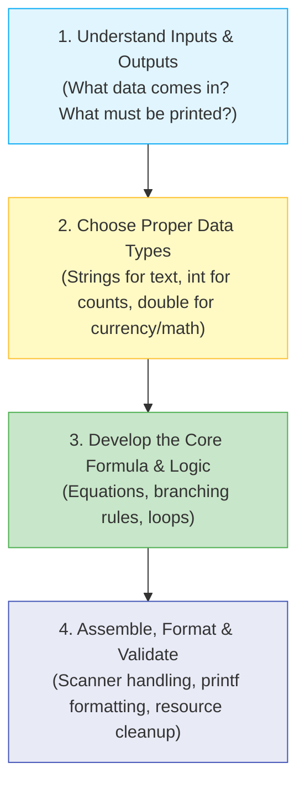

# 🛠️ Module 10: Practice Mini-Projects & Real-World Logic

> **Putting It All Together: Hands-on Problem Solving in Java.** Learn how to combine inputs, variables, formulas, loops, and conditions to build working command-line applications.

---

## 📑 Table of Contents
1. [The 4-Step Problem Solving Blueprint](#1-the-4-step-problem-solving-blueprint)
2. [Mini-Project 1: Interactive Shopping Cart](#2-mini-project-1-interactive-shopping-cart)
3. [Mini-Project 2: Rectangle Geometry Engine](#3-mini-project-2-rectangle-geometry-engine)
4. [Mini-Project 3: Dynamic Multiplication Table Generator](#4-mini-project-3-dynamic-multiplication-table-generator)
5. [Practice Challenges & Exercises](#5-practice-challenges--exercises)

---

## 1. The 4-Step Problem Solving Blueprint

Whenever you face a new programming problem, follow this 4-step framework before writing a single line of code:



---

## 2. Mini-Project 1: Interactive Shopping Cart

- **File**: [`shoppingcart.java`](file:///Users/honeyreddy/Documents/Java%20course/src/practice_programs/shoppingcart.java)
- **Concepts**: `Scanner`, `float`, `char` (`₹`), String concatenation, formatted receipt printing.
- **How to Run**:
  ```bash
  java -cp out practice_programs.shoppingcart
  ```

---

## 3. Mini-Project 2: Rectangle Geometry Engine

- **File**: [`calculaterectangle.java`](file:///Users/honeyreddy/Documents/Java%20course/src/practice_programs/calculaterectangle.java)
- **Concepts**: `double` precision arithmetic, applying formulas ($Area = w \times h$, $Perimeter = 2(w + h)$).
- **How to Run**:
  ```bash
  java -cp out practice_programs.calculaterectangle
  ```

---

## 4. Mini-Project 3: Dynamic Multiplication Table Generator

- **File**: [`for_loop.java`](file:///Users/honeyreddy/Documents/Java%20course/src/practice_programs/for_loop.java)
- **Concepts**: Counting `for` loop, arithmetic accumulation, `System.out.printf` column alignment.
- **How to Run**:
  ```bash
  java -cp out practice_programs.for_loop
  ```

---

## 5. Practice Challenges & Exercises

Try building these on your own:
1. **Temperature Converter**: Convert Celsius to Fahrenheit ($F = C \times \frac{9}{5} + 32$) and vice versa using a switch menu.
2. **Simple Interest Calculator**: Compute $\text{SI} = \frac{P \times R \times T}{100}$ given user inputs.
3. **BMI (Body Mass Index) Calculator**: Prompt for weight (kg) and height (m), compute $\text{BMI} = \frac{\text{weight}}{\text{height}^2}$, and print category (Underweight, Normal, Overweight).
