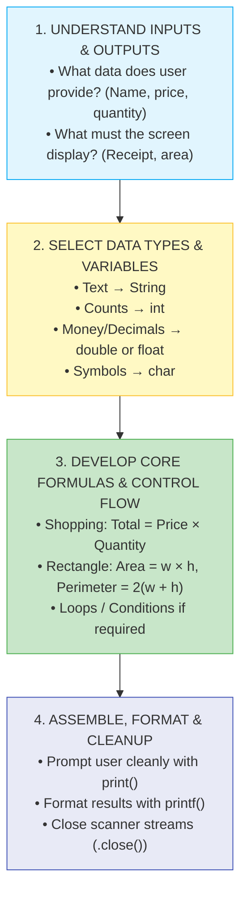

# 🛠️ Module 10: Practice Mini-Projects & Real-World Logic

> **Putting It All Together: Hands-on Problem Solving in Java.** Learn how to combine inputs, variables, formulas, loops, and conditions to build working command-line applications and solve real problems from scratch.

---

## 📑 Table of Contents
1. [What You'll Learn](#1-what-youll-learn)
2. [Keywords & Definitions Glossary](#2-keywords--definitions-glossary)
3. [How I Code & What is the Use (The 4-Step Framework)](#3-how-i-code--what-is-the-use-the-4-step-framework)
4. [Mini-Project 1: Interactive Shopping Cart](#4-mini-project-1-interactive-shopping-cart)
5. [Mini-Project 2: Rectangle Geometry Engine](#5-mini-project-2-rectangle-geometry-engine)
6. [Mini-Project 3: Dynamic Multiplication Table Generator](#6-mini-project-3-dynamic-multiplication-table-generator)
7. [Concepts Applied Matrix](#7-concepts-applied-matrix)
8. [Practice Challenges & Exercises (With Difficulty Ratings)](#8-practice-challenges--exercises)

---

## 1. What You'll Learn

After completing this module, you will be able to:

- [ ] Take a raw problem statement and design a step-by-step algorithm
- [ ] Choose appropriate data types and prevent arithmetic/scanner bugs
- [ ] Format numerical and financial output with custom currency symbols
- [ ] Implement loops for mathematical sequence and table generation
- [ ] Build standalone, interactive CLI tools from start to finish

---

## 2. Keywords & Definitions Glossary

| Keyword / Class | Category | Definition & Meaning | Code Syntax Example |
| :--- | :--- | :--- | :--- |
| `Scanner` | Class | Tokenizer that reads primitive types and strings from `System.in`. | `Scanner sc = new Scanner(System.in);` |
| `printf` | Method | Formats and prints text to console using placeholders like `%.2f`, `%d`. | `System.out.printf("Total: %.2f", total);` |
| `char` | Primitive | 16-bit single character, used here for custom currency symbols like `'₹'`. | `char currency = '₹';` |
| `float` | Primitive | 32-bit floating point number for monetary or decimal values. | `float price = sc.nextFloat();` |
| `for` | Keyword | Counting loop structure used to iterate through multiplication steps. | `for (int i = 1; i <= 10; i++)` |

---

## 3. How I Code & What is the Use (The 4-Step Framework)

Whenever you face a programming problem or interview question, use this systematic thinking framework before writing code:



---

## 4. Mini-Project 1: Interactive Shopping Cart

- **File**: [`shoppingcart.java`](file:///Users/honeyreddy/Documents/Java%20course/src/practice_programs/shoppingcart.java)
- **Goal**: Read item name, price per unit, and quantity; compute bill; display a formatted invoice with currency symbol `₹`.
- **How to Run**:
  ```bash
  java -cp out practice_programs.shoppingcart
  ```
- **Sample Interactive Session**:
  ```text
  What do you want to buy: Wireless Mouse
  What is the price per item: 499.50
  How many Wireless Mouse do you want: 2

  --- Order Summary ---
  Item: Wireless Mouse
  Quantity: 2
  Total Payable: ₹999.00
  ```

---

## 5. Mini-Project 2: Rectangle Geometry Engine

- **File**: [`calculaterectangle.java`](file:///Users/honeyreddy/Documents/Java%20course/src/practice_programs/calculaterectangle.java)
- **Goal**: Read rectangle dimensions ($w, h$) as double-precision values, compute Area ($w \times h$) and Perimeter ($2 \times (w + h)$), format to 2 decimal places.
- **How to Run**:
  ```bash
  java -cp out practice_programs.calculaterectangle
  ```
- **Sample Interactive Session**:
  ```text
  Enter the width of the rectangle (in cm): 12.5
  Enter the height of the rectangle (in cm): 4.0

  --- Rectangle Metrics ---
  Area: 50.00 sq.cm
  Perimeter: 33.00 cm
  ```

---

## 6. Mini-Project 3: Dynamic Multiplication Table Generator

- **File**: [`for_loop.java`](file:///Users/honeyreddy/Documents/Java%20course/src/practice_programs/for_loop.java)
- **Goal**: Generate and display the mathematical multiplication table for the number 17 from $17 \times 1$ to $17 \times 10$ with column alignment.
- **How to Run**:
  ```bash
  java -cp out practice_programs.for_loop
  ```
- **Sample Console Output**:
  ```text
  --- Multiplication Table for 17 ---
  17 x  1 =  17
  17 x  2 =  34
  17 x  3 =  51
  17 x  4 =  68
  17 x  5 =  85
  17 x  6 = 102
  17 x  7 = 119
  17 x  8 = 136
  17 x  9 = 153
  17 x 10 = 170
  ```

---

## 7. Concepts Applied Matrix

| Project | Scanner I/O | Arithmetic Formulas | `printf` Formatting | Loops | Decision Logic |
| :--- | :---: | :---: | :---: | :---: | :---: |
| **Shopping Cart** | ✅ | ✅ | ✅ | ❌ | ❌ |
| **Rectangle Engine** | ✅ | ✅ | ✅ | ❌ | ❌ |
| **Table Generator** | ❌ | ✅ | ✅ | ✅ | ❌ |

---

## 8. Practice Challenges & Exercises

Test your skills by building these additional mini-projects from scratch:

| Challenge | Description | Concepts Needed | Difficulty |
| :--- | :--- | :--- | :---: |
| **1. Temperature Converter** | Convert Celsius to Fahrenheit ($F = C \times \frac{9}{5} + 32$) and vice-versa based on user choice. | `Scanner`, `switch`, `double` | ⭐ Easy |
| **2. Simple Interest Calculator** | Compute $\text{SI} = \frac{P \times R \times T}{100}$ from user principal, rate, and time. | `Scanner`, arithmetic, `printf` | ⭐ Easy |
| **3. BMI Health Classifier** | Read weight (kg) and height (m), compute $\text{BMI} = \frac{\text{weight}}{\text{height}^2}$, and classify as Underweight/Normal/Overweight. | `if-else if`, `Math.pow()`, formulas | ⭐⭐ Medium |
| **4. ATM PIN & Balance Simulator** | Prompt for 4-digit PIN (max 3 attempts with loop), show balance menu, allow deposit/withdrawal. | `while` loop, `switch`, `if-else` | ⭐⭐ Medium |
| **5. Student Grade Report Generator** | Read 5 subject marks into an array, calculate total, average percentage, assign letter grade, and print report card. | Arrays, `for` loop, `if-else`, formatting | ⭐⭐⭐ Hard |
