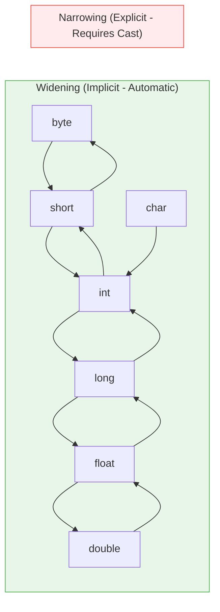

# 🔄 Module 03: Java Type Conversions & Casting

> **Mastering Type Conversions, Automatic Promotion & Casting in Java.** Understand how data moves between different sizes and shapes in memory.

---

## 📑 Table of Contents
1. [Core Concept: Widening vs Narrowing](#1-core-concept-widening-vs-narrowing)
2. [Visual Conversion Hierarchy](#2-visual-conversion-hierarchy)
3. [Type Promotion Rules in Expressions](#3-type-promotion-rules-in-expressions)
4. [Integer Overflow & Byte Mechanics](#4-integer-overflow--byte-mechanics)
5. [Line-by-Line File Guides](#5-line-by-line-file-guides)
6. [Common Pitfalls & Traps](#6-common-pitfalls--traps)

---

## 1. Core Concept: Widening vs Narrowing

In Java, assigning a value of one type to a variable of another type falls into two categories:

### A. Widening Conversion (Implicit / Automatic)
- **Direction**: Smaller memory footprint -> Larger memory footprint.
- **Safety**: Safe. No loss of magnitude or precision.
- **Syntax**: Happens automatically, no casting syntax required.
```java
int myInt = 100;
double myDouble = myInt; // Automatic widening: 100.0
```

### B. Narrowing Conversion (Explicit / Manual Casting)
- **Direction**: Larger memory footprint -> Smaller memory footprint.
- **Safety**: Potentially unsafe. May truncate decimals or cause overflow.
- **Syntax**: Requires explicit cast operator `(TargetType)`.
```java
double price = 99.99;
int rounded = (int) price; // Explicit cast: 99 (.99 truncated!)
```

---

## 2. Visual Conversion Hierarchy



---

## 3. Type Promotion Rules in Expressions

When Java evaluates expressions with mixed types, it automatically promotes smaller types:

1. **Byte / Short / Char Promotion**: Any `byte`, `short`, or `char` in an arithmetic expression is immediately promoted to `int`.
2. **Dominant Type Rule**:
   - If any operand is `double`, the entire expression is promoted to `double`.
   - Else if any operand is `float`, expression is promoted to `float`.
   - Else if any operand is `long`, expression is promoted to `long`.
   - Otherwise, all are evaluated as `int`.

```java
byte b1 = 10;
byte b2 = 20;
// byte b3 = b1 + b2; // ❌ Compile error: b1 + b2 produces int (30)!
int b3 = b1 + b2;     // ✅ Correct
```

---

## 4. Integer Overflow & Byte Mechanics

A `byte` has 8 bits and ranges from `-128` to `+127`.

```mermaid
stateDiagram-v2
    [*] --> 126
    126 --> 127: +1
    127 --> -128: +1 (OVERFLOW!)
    -128 --> -127: +1
```

When you cast an `int` greater than 127 (e.g. 130) to `byte`, only the lower 8 bits are kept:
$$130 - 256 = -126$$

---

## 5. Line-by-Line File Guides

| File | Concepts Covered | Command to Run |
| :--- | :--- | :--- |
| [`Typepromotions.java`](file:///Users/honeyreddy/Documents/Java%20course/src/type_conversions/Typepromotions.java) | Automatic expression promotion (`byte * byte -> int`) | `java -cp out type_conversions.Typepromotions` |
| [`Floatconversion.java`](file:///Users/honeyreddy/Documents/Java%20course/src/type_conversions/Floatconversion.java) | Explicit casting `(int)` from float and decimal truncation | `java -cp out type_conversions.Floatconversion` |
| [`byteconversion.java`](file:///Users/honeyreddy/Documents/Java%20course/src/type_conversions/byteconversion.java) | Int to byte narrowing, bits truncation & overflow wrap-around | `java -cp out type_conversions.byteconversion` |

---

## 6. Common Pitfalls & Traps

> [!CAUTION]
> - **Truncation vs Rounding**: `(int) 9.99` evaluates to `9`, not `10`. To round to the nearest whole integer, use `Math.round(9.99)`.
> - **Silent Overflow**: Casting large integers to small types produces silent numerical wrap-around without runtime errors.
