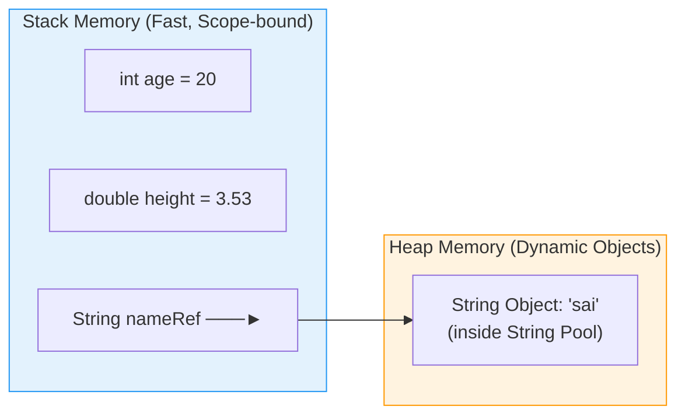

# 📦 Module 02: Java Variables & Data Types

> **Mastering Memory & Data Storage in Java.** Learn how Java allocates memory for numbers, characters, booleans, and text strings.

---

## 📑 Table of Contents
1. [Core Concept: What is a Variable?](#1-core-concept-what-is-a-variable)
2. [Java 8 Primitive Data Types Cheatsheet](#2-java-8-primitive-data-types-cheatsheet)
3. [Primitives vs Reference Types (Stack vs Heap)](#3-primitives-vs-reference-types-stack-vs-heap)
4. [String Basics & Concatenation](#4-string-basics--concatenation)
5. [Line-by-Line File Breakdown](#5-line-by-line-file-breakdown)
6. [Common Pitfalls & Best Practices](#6-common-pitfalls--best-practices)

---

## 1. Core Concept: What is a Variable?

Think of a variable as a **labeled storage container** in memory:
- **Type**: Defines the shape and size of the container (e.g. `int` vs `double`).
- **Name (Identifier)**: The label you use to reference it (e.g. `age`, `height`).
- **Value**: The actual content stored inside (e.g. `20`, `3.14`).

```java
// Syntax: <DataType> <variableName> = <initialValue>;
int studentAge = 21;
```

---

## 2. Java 8 Primitive Data Types Cheatsheet

Java is **statically-typed**, meaning every variable's type must be declared at compile time and cannot change.

| Data Type | Category | Size (Bits / Bytes) | Min Value | Max Value | Default | Literal Example |
| :--- | :--- | :--- | :--- | :--- | :--- | :--- |
| `byte` | Integer | 8 bits (1 byte) | -128 | 127 | `0` | `(byte) 100` |
| `short` | Integer | 16 bits (2 bytes) | -32,768 | 32,767 | `0` | `(short) 5000` |
| `int` | Integer | 32 bits (4 bytes) | -2,147,483,648 | 2,147,483,647 | `0` | `42` |
| `long` | Integer | 64 bits (8 bytes) | -2^63 | 2^63 - 1 | `0L` | `9000000000L` |
| `float` | Floating Point | 32 bits (4 bytes) | ~1.4e-45 | ~3.4e+38 | `0.0f` | `3.1415f` |
| `double` | Floating Point | 64 bits (8 bytes) | ~4.9e-324 | ~1.7e+308 | `0.0d` | `3.1415926535` |
| `char` | Character | 16 bits (2 bytes) | `'\u0000'` (0) | `'\uffff'` (65,535) | `'\u0000'` | `'A'`, `'₹'` |
| `boolean`| Logical | 1 bit (JVM dependent)| `false` | `true` | `false` | `true`, `false` |

---

## 3. Primitives vs Reference Types (Stack vs Heap)



- **Primitives** (`int`, `double`, `boolean`, etc.): The actual raw value is stored directly in the Stack frame.
- **Reference Types** (`String`, Objects, Arrays): The variable on the Stack stores a memory address pointer (reference) pointing to the object located on the Heap.

---

## 4. String Basics & Concatenation

The `+` operator has dual behavior in Java:
1. **Mathematical Addition**: If both operands are numbers (`10 + 20` -> `30`).
2. **String Concatenation**: If either operand is a `String` (`"Age: " + 20` -> `"Age: 20"`).

```java
String first = "Hello ";
String second = "World";
String greeting = first + second; // "Hello World"

// Left-to-right evaluation matters:
System.out.println("Result: " + 10 + 20); // Prints: "Result: 1020" (concatenation)
System.out.println("Result: " + (10 + 20)); // Prints: "Result: 30" (parentheses evaluated first)
```

---

## 5. Line-by-Line File Breakdown

| File | Key Concepts | Quick Run Command |
| :--- | :--- | :--- |
| [`variables.java`](file:///Users/honeyreddy/Documents/Java%20course/src/variables/variables.java) | `int`, `double`, `Boolean`, `String`, branching with boolean flags, string concatenation | `java -cp out variables.variables` |

---

## 6. Common Pitfalls & Best Practices

> [!TIP]
> 1. **Primitive `boolean` vs Wrapper `Boolean`**: Prefer primitive `boolean` unless you explicitly require `null` representations in databases or collections.
> 2. **Naming Conventions**: Use `camelCase` for variable names (`studentAge`, `totalPrice`, `isEnrolled`).
> 3. **Avoid Uninitialized Variables**: Local variables inside methods MUST be explicitly initialized before reading them, or the compiler will throw an error.
